# tldw_Server_API Data Flow Atlas

This atlas maps how data moves through `tldw_Server_API`. It is written for new contributors and maintainers who need to trace requests across FastAPI endpoints, dependencies, core modules, storage, providers, and background workers.

File path: `Docs/Code_Documentation/Data_Flow_Atlas.md`

## Table Of Contents

- [How To Read This Atlas](#how-to-read-this-atlas)
- [System Context](#system-context)
- [Request Lifecycle](#request-lifecycle)
- [Router Group Map](#router-group-map)
- [Data Store Map](#data-store-map)
- [Core Flow Diagrams](#core-flow-diagrams)
- [Extended Domain Maps](#extended-domain-maps)
- [Router Coverage Matrix](#router-coverage-matrix)
- [How To Update This Atlas](#how-to-update-this-atlas)

## How To Read This Atlas

Use this atlas as a flow map, not as an OpenAPI replacement. Route names, module names, and storage paths should be verified against the code before edits.

| Shape or Group | Meaning |
| --- | --- |
| Clients | WebUI, admin UI, extension, HTTP clients, MCP clients, or other callers |
| FastAPI app | `app/main.py`, middleware, lifecycle, router registration |
| Endpoint groups | Routers under `app/api/v1/endpoints/`, grouped by `router_groups/*.py` |
| API dependencies | Auth, user context, DB handles, rate limits, resource governance, request validation |
| Core modules | Domain logic under `app/core/` |
| Storage | SQLite/PostgreSQL DBs, ChromaDB/pgvector, file storage, Redis/job backends |
| Providers | LLM, STT, TTS, OCR, web/media, and other external or local providers |
| Workers | Jobs, Scheduler, APScheduler bridges, background services, lifecycle workers |
| Optional routes | Feature-gated, lazy-imported, or optional dependency routes |

## System Context

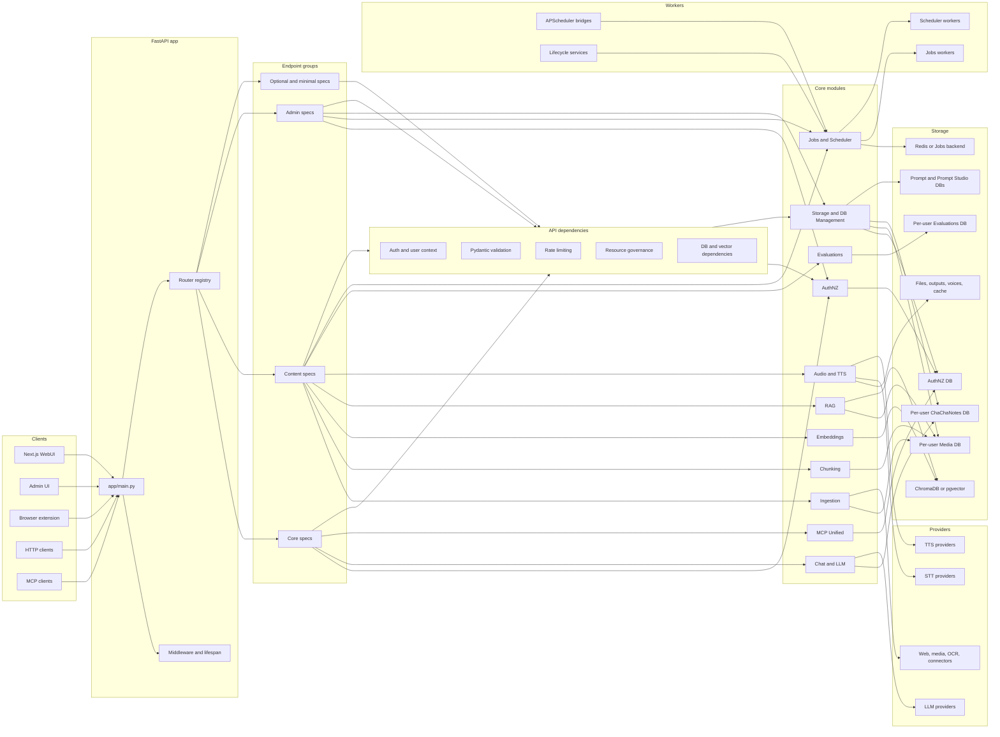

## Request Lifecycle

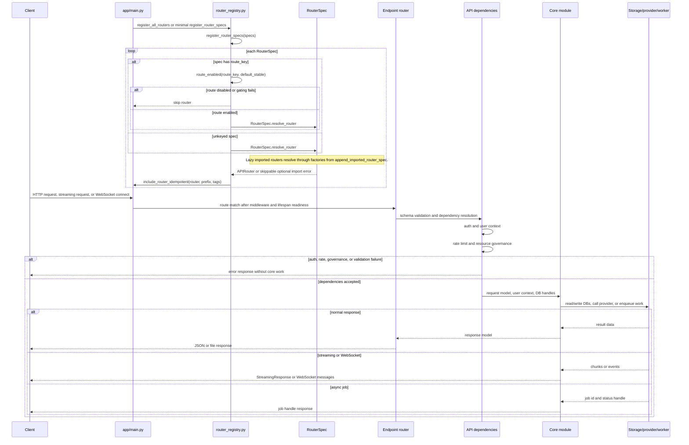

## Router Group Map

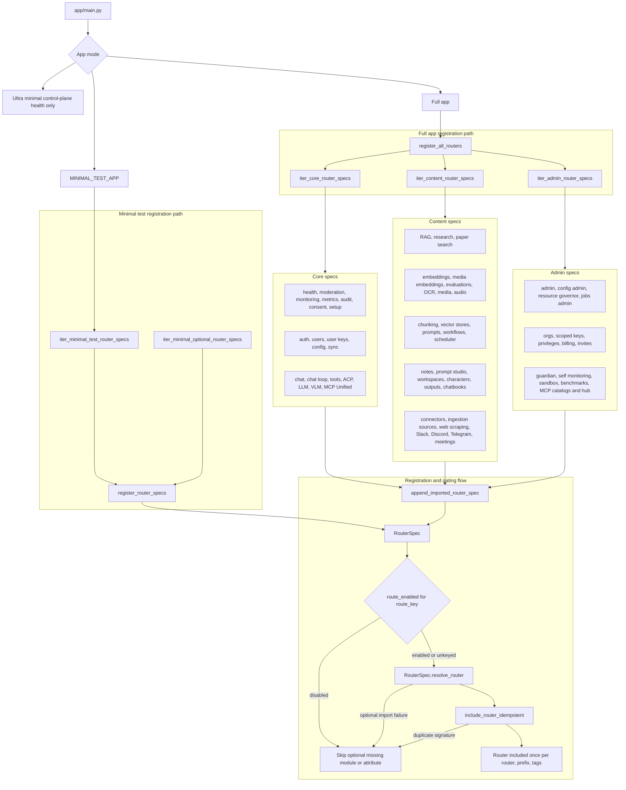

## Data Store Map

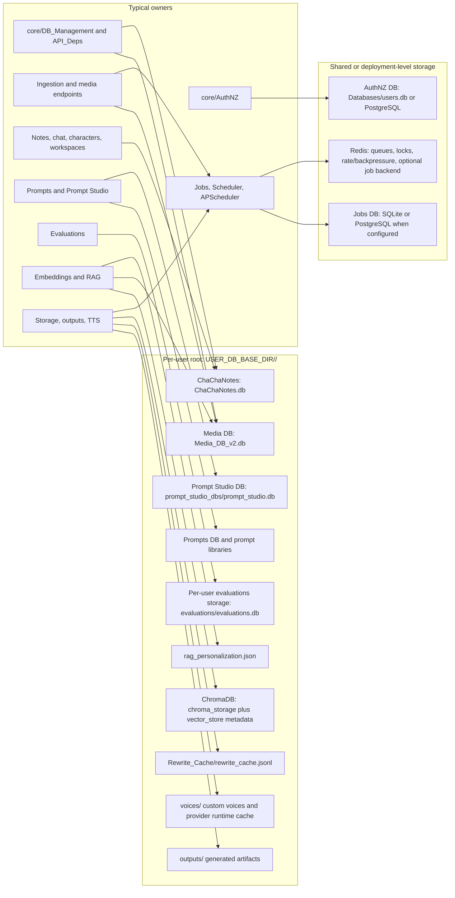

## Core Flow Diagrams

These flows trace the backend paths most likely to matter when a newcomer asks where data goes after an API call. They are intentionally grouped by process rather than by every route handler.

### Auth And User Context

**Purpose:** Resolve the caller, enforce auth policy, and turn identity into the user-scoped paths used by content modules.

**Primary entrypoints:** Most protected endpoints through `get_current_user`, `get_request_user`, `AuthPrincipal`, `TokenScopeGuard`, `RequireRole`, and related dependencies in `app/api/v1/API_Deps/auth_deps.py`.

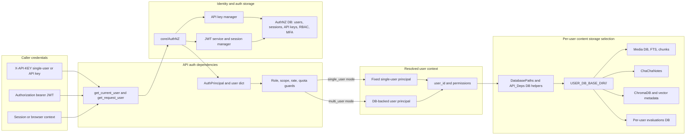

**Key storage/provider touchpoints:** AuthNZ DB stores identity, sessions, API keys, RBAC, quotas, and MFA state. Per-user content storage is selected only after user context resolves; it lives under `USER_DB_BASE_DIR/<user_id>/` and includes Media DB, ChaChaNotes, ChromaDB/vector metadata, prompts, outputs, and per-user evaluations storage.

**Where to look in code:** `app/api/v1/API_Deps/auth_deps.py`, `app/core/AuthNZ/`, `app/core/DB_Management/db_path_utils.py`, `app/core/DB_Management/Users_DB.py`, and the per-domain DB dependency modules under `app/api/v1/API_Deps/`.

### Media Ingestion

**Purpose:** Convert files, documents, URLs, web pages, audio, and video into normalized records, chunks, search indexes, and optional embeddings so content is searchable and RAG-ready.

**Primary entrypoints:** `POST /api/v1/media/add`, `POST /api/v1/media/process-documents`, `POST /api/v1/media/process-videos`, `POST /api/v1/media/process-audios`, `POST /api/v1/media/process-pdfs`, `POST /api/v1/media/process-ebooks`, web scraping and ingestion-source routes.

```mermaid
flowchart LR
    subgraph Inputs
        Files[Uploaded files and documents]
        URLs[URL, video, audio, feed inputs]
        Web[Web scraping and article extraction]
    end

    subgraph EndpointLayer["Media endpoints"]
        Add["/media/add persistent ingest"]
        Process["process-* no-persistence helpers"]
        JobsPath[Optional Jobs or background path]
    end

    subgraph Processing["core/Ingestion_Media_Processing"]
        Dispatch[Media type dispatch]
        Download[Download with yt-dlp or URL fetch]
        Transcode[ffmpeg transcode or audio extraction]
        OCR[PDF or image OCR branch]
        STT[Audio/video STT branch]
        Parse[Document, ebook, HTML, XML parsing]
        Normalize[Normalize text, metadata, transcript segments]
        Chunk[Chunking strategies and templates]
    end

    subgraph Searchable["Search and RAG readiness"]
        Persist[Persist primary item and metadata]
        MediaDB[Per-user Media DB]
        FTS[FTS5 media and keyword indexes]
        EmbedOpt{generate_embeddings?}
        Embed[Embedding provider/model]
        Vector[Per-user ChromaDB or vector backend]
    end

    Files --> Add
    URLs --> Add
    Web --> Add
    Files --> Process
    URLs --> Process
    Add --> Dispatch
    Process --> Dispatch
    Add --> JobsPath
    JobsPath --> Dispatch
    Dispatch --> Download
    Dispatch --> Parse
    Download --> Transcode
    Transcode --> STT
    Parse --> OCR
    OCR --> Normalize
    STT --> Normalize
    Parse --> Normalize
    Normalize --> Chunk
    Chunk --> Persist
    Persist --> MediaDB
    MediaDB --> FTS
    Persist --> EmbedOpt
    EmbedOpt -->|yes| Embed
    Embed --> Vector
    EmbedOpt -->|no| FTS
```

**Key storage/provider touchpoints:** Media DB stores content, transcripts, metadata, chunks, keywords, and FTS state. Embedding generation writes per-user vector records and vector metadata. Providers include yt-dlp, ffmpeg, OCR backends, STT backends, web extractors, embedding providers, and optional Jobs workers.

**Where to look in code:** `app/api/v1/endpoints/media/`, `app/core/Ingestion_Media_Processing/`, `app/core/DB_Management/Media_DB_v2.py`, `app/core/DB_Management/media_db/`, `app/core/Embeddings/`, `Docs/Code_Documentation/Pieces.md`, and `Docs/Code_Documentation/Ingestion_Pipeline_Video.md`.

### Audio STT/TTS

**Purpose:** Handle file transcription, real-time streaming transcription, and speech synthesis while keeping the file, WebSocket, and TTS paths distinct.

**Primary entrypoints:** `POST /api/v1/audio/transcriptions`, `WS /api/v1/audio/stream/transcribe`, `POST /api/v1/audio/speech`, `GET /api/v1/audio/voices/catalog`, audio history and audio job/status endpoints.

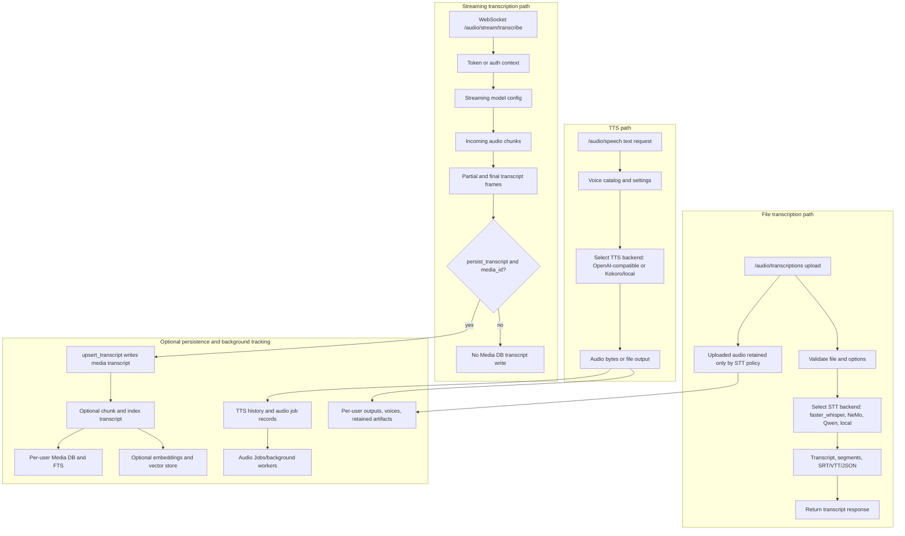

**Key storage/provider touchpoints:** STT and TTS providers may be local runtimes or external OpenAI-compatible services. File STT usually returns transcript responses; uploaded audio may be retained according to STT policy. Streaming transcript persistence is opt-in and requires `persist_transcript` plus `media_id` before `upsert_transcript` writes to the Media DB. TTS has history/audio jobs, and generated or uploaded artifacts may be retained by policy. Media transcript persistence is optional and conditional; only persisted transcripts can later be chunked, indexed with FTS, and embedded for RAG.

**Where to look in code:** `app/api/v1/endpoints/audio/`, especially `audio.py`, `audio_transcriptions.py`, `audio_streaming.py`, `audio_tts.py`, `audio_history.py`, and `audio_jobs.py`; also `app/core/Ingestion_Media_Processing/Audio/`, `app/core/TTS/`, `Docs/STT-TTS/`, and media persistence helpers when transcription is saved as content.

### Chunking And Embeddings

**Purpose:** Produce stable text pieces from raw content and attach embedding vectors so chunks can be retrieved by FTS, BM25, vector search, or hybrid RAG.

**Primary entrypoints:** `POST /api/v1/chunking/chunk_text`, chunk template routes, ingestion-triggered chunking in media/process endpoints, embedding endpoints, media embedding jobs, and vector-store admin routes.

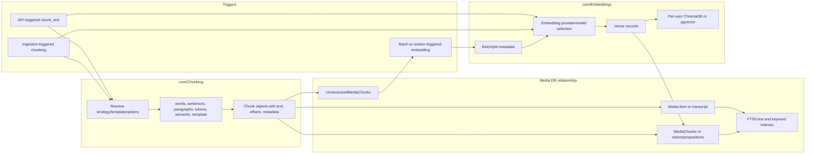

**Key storage/provider touchpoints:** Chunk metadata and FTS state live in the per-user Media DB. Vector payloads and embedding job/batch metadata live under the per-user vector store path. Embedding providers and models are resolved from request/config, and chunking can be invoked directly by API callers or indirectly by ingestion.

**Where to look in code:** `app/api/v1/endpoints/chunking.py`, embedding endpoints, `app/core/Chunking/`, `app/core/Ingestion_Media_Processing/chunking_options.py`, `app/core/Embeddings/ChromaDB_Library.py`, vector metadata/job DB modules, `Docs/Code_Documentation/Pieces.md`, and `Docs/Code_Documentation/Database.md`.

### RAG/Search

**Purpose:** Normalize search/RAG requests, retrieve candidate chunks from lexical and vector paths, rerank and post-process them, then assemble results or generation context.

**Primary entrypoints:** `POST /api/v1/rag/search`, `POST /api/v1/rag/search/stream`, RAG settings/backends endpoints, media search endpoints, and chat flows that request RAG context before generation.

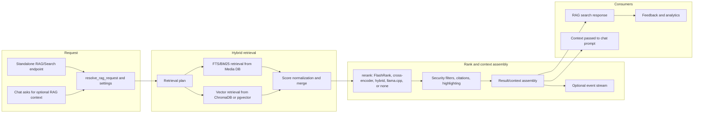

**Key storage/provider touchpoints:** FTS/BM25 reads from the per-user Media DB and its FTS tables. Vector retrieval reads per-user ChromaDB or pgvector collections populated by embeddings. Rerankers may use local models or provider-backed adapters. Feedback and analytics attach to the RAG service path.

**Where to look in code:** `app/api/v1/endpoints/rag_unified.py`, `app/core/RAG/rag_service/request_resolution.py`, `retrieval_plan.py`, `database_retrievers.py`, `unified_pipeline.py`, `response_mapping.py`, `streaming_executor.py`, and embedding/vector-store modules.

### Chat And LLM Provider Calls

**Purpose:** Accept OpenAI-compatible chat requests, optionally enrich them with retrieval context, resolve a provider/model, call the adapter, and persist conversation state separately from retrieval.

**Primary entrypoints:** `POST /api/v1/chat/completions`, chat session/conversation routes, chat document/workflow routes, `/api/v1/llm/providers`, and provider metadata/model routing routes.

```mermaid
flowchart LR
    subgraph ChatRequest["Chat generation"]
        Endpoint["/chat/completions"]
        Validate[OpenAI-compatible request validation]
        Session[Optional conversation or session state]
        PersistIn[Persist user message when configured]
    end

    subgraph RetrievalContext["Optional retrieval"]
        NeedRAG{RAG requested?}
        RAGFlow["RAG/Search flow"]
        PromptContext[Prompt context and citations]
    end

    subgraph ProviderCall["LLM provider call"]
        Resolve[Provider/model resolution and BYOK/config lookup]
        Adapter[LLM adapter registry]
        External[Commercial or local provider]
    end

    subgraph ResponsePaths["Response paths"]
        NonStream[Non-streaming JSON response]
        Stream[Streaming SSE chunks]
        PersistOut[Persist assistant message and metadata]
        NotesDB[Per-user ChaChaNotes chat/session DB]
    end

    Endpoint --> Validate --> Session --> PersistIn
    PersistIn --> NeedRAG
    NeedRAG -->|yes| RAGFlow --> PromptContext --> Resolve
    NeedRAG -->|no| Resolve
    Resolve --> Adapter --> External
    External -->|complete response| NonStream
    External -->|delta events| Stream
    NonStream --> PersistOut
    Stream --> PersistOut
    PersistOut --> NotesDB
```

**Key storage/provider touchpoints:** Chat/session state persists in the per-user ChaChaNotes database when configured. RAG context is assembled from Media DB and vector-store reads but remains separable from generation. Provider resolution can use config, BYOK/user provider secrets, model routing, and adapter registry entries for OpenAI-compatible, commercial, and local providers.

**Where to look in code:** chat endpoints under `app/api/v1/endpoints/`, `app/core/Chat/`, `app/core/LLM_Calls/adapter_registry.py`, `app/core/LLM_Calls/providers/`, `app/core/LLM_Calls/routing/`, `app/core/AuthNZ/byok_helpers.py`, and `app/core/DB_Management/ChaChaNotes_DB.py`.

### Jobs And Scheduler

**Purpose:** Distinguish user-visible Jobs from internal Scheduler orchestration and show how recurring APScheduler services bridge into the chosen backend.

**Primary entrypoints:** Jobs admin/status endpoints, domain workers that enqueue Jobs, Scheduler workflow endpoints, `@task`-registered scheduler handlers, APScheduler-backed workflow and digest services.

```mermaid
flowchart LR
    subgraph Producers
        UserAction[User-visible long work]
        InternalFlow[Internal orchestration]
        Recurring[Recurring APScheduler trigger]
    end

    subgraph JobsPath["Jobs backend"]
        JobCreate[Create Job with owner, domain, quota]
        JobDB[Jobs DB or Redis-backed state]
        Admin[Admin status, pause, resume, drain, retry]
        WorkerSDK[Jobs WorkerSDK or domain worker]
        JobResult[Result, failure, retry, audit]
    end

    subgraph SchedulerPath["Core Scheduler backend"]
        TaskReg[@task handler registration]
        TaskCreate[Create task with dependency and idempotency key]
        SchedulerDB[Scheduler persistence]
        Dependency[Dependency resolution]
        SchedulerWorker[Scheduler worker pool]
        TaskResult[Task result and workflow state]
    end

    subgraph Bridge["APScheduler bridges"]
        APS[APScheduler service]
        Choose{Chosen backend}
    end

    UserAction --> JobCreate --> JobDB --> Admin
    JobDB --> WorkerSDK --> JobResult --> Admin
    InternalFlow --> TaskReg --> TaskCreate --> SchedulerDB --> Dependency --> SchedulerWorker --> TaskResult
    Recurring --> APS --> Choose
    Choose -->|user-visible or ops-controlled| JobCreate
    Choose -->|dependency orchestration| TaskCreate
```

**Key storage/provider touchpoints:** Jobs use a Jobs backend for owner/domain state, retries, admin controls, quotas, worker leases, and status summaries. Scheduler uses its own persistence for task registration, dependencies, idempotency, and workflow execution. APScheduler services should enqueue into Jobs or Scheduler according to the workflow they support.

**Where to look in code:** `app/api/v1/endpoints/jobs_admin.py`, `app/core/Jobs/`, `app/services/*jobs_worker*.py`, `app/api/v1/endpoints/scheduler_workflows.py`, `app/core/Scheduler/`, workflow/watchlist scheduler services, and APScheduler startup/lifecycle services.

**Decision note:** Use Jobs for new user-visible features or work needing admin/ops status, pause/resume/drain, retries, quotas, or RLS. Use Scheduler for internal orchestration where registered handlers, task dependencies, and idempotency keys are central. Recurring schedules should use APScheduler to enqueue into whichever backend the feature needs.

## Extended Domain Maps

These maps cover the remaining router domains at group level. They avoid endpoint inventory detail, but each section names the route families, core services, storage, providers, and handoff points needed to trace a domain end to end.

### Evaluations

**Purpose:** Manage evaluation recipes, datasets, runs, model-graded checks, RAG evaluations, metrics, and result persistence without mixing evaluation state into chat or media storage.

**Primary entrypoints:** `/api/v1/evaluations`, `/api/v1/evaluations/datasets`, `/api/v1/evaluations/{eval_id}/runs`, recipes, synthetic datasets, RAG pipeline evaluation, embeddings A/B tests, benchmarks, webhooks, and evaluation history/status routes.

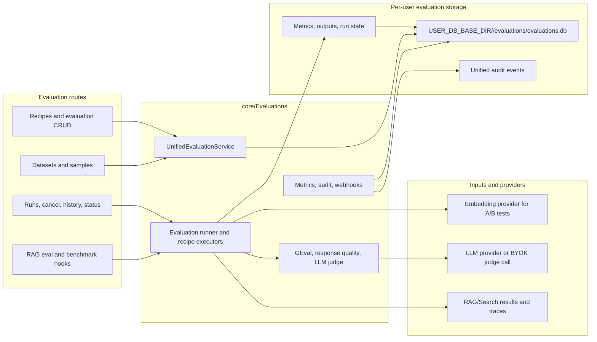

**Key storage/provider touchpoints:** Evaluations use per-user evaluation storage where user context is available, including recipes, datasets, runs, idempotency keys, metrics, and results. LLM judge calls go through configured provider/BYOK resolution; RAG evaluation reads RAG outputs and persists evaluation metrics rather than changing RAG storage directly.

**Where to look in code:** `app/api/v1/endpoints/evaluations/`, `app/core/Evaluations/`, `app/core/DB_Management/Evaluations_DB.py`, `app/core/DB_Management/db_path_utils.py`, `Docs/Code_Documentation/Evaluations_Developer_Guide.md`, and RAG evaluation helpers under `app/core/RAG/`.

### MCP Unified

**Purpose:** Expose MCP over HTTP and WebSocket with AuthNZ/RBAC, module/tool discovery, domain dispatch, health, metrics, and tool execution responses.

**Primary entrypoints:** `/api/v1/mcp`, `/api/v1/mcp/request/batch`, `/api/v1/mcp/ws`, `/api/v1/mcp/status`, `/api/v1/mcp/metrics`, `/api/v1/mcp/tools`, `/api/v1/mcp/tools/execute`, `/api/v1/mcp/modules`, `/api/v1/mcp/resources`, `/api/v1/mcp/prompts`, MCP token routes, hub routes, and scoped tool catalog routes.

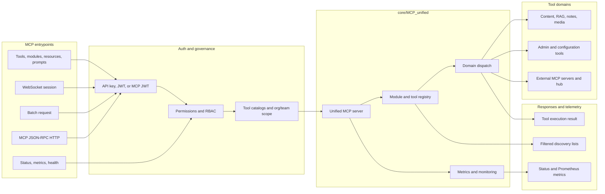

**Key storage/provider touchpoints:** AuthNZ stores identities, permissions, org/team membership, provider secrets, and tool catalog metadata. MCP runtime state, metrics, external server settings, and tool/module health live in MCP unified services. Tool execution then touches the target domain storage or provider through the dispatched module.

**Where to look in code:** `app/api/v1/endpoints/mcp_unified_endpoint.py`, `app/api/v1/endpoints/mcp_hub_management.py`, `app/api/v1/endpoints/mcp_catalogs_manage.py`, `app/core/MCP_unified/`, `app/services/admin_tool_catalog_service.py`, `Docs/MCP/`, and `Docs/MCP/Unified/`.

### Prompt Studio

**Purpose:** Manage prompt projects, prompt versions, test cases, evaluations, optimization jobs, live status, and WebSocket progress around provider-backed prompt execution.

**Primary entrypoints:** Prompt Studio project, prompt, test case, evaluation, optimization, status, and WebSocket routers under `/api/v1/prompt-studio`.

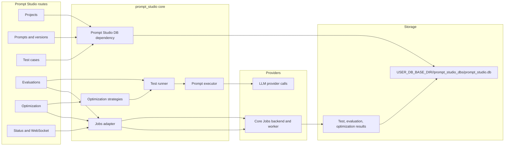

**Key storage/provider touchpoints:** Prompt Studio persists projects, signatures, prompts, versions, test cases, evaluation runs, optimization runs, and job metadata in the per-user Prompt Studio DB. Prompt execution and optimization call LLM providers through the existing provider layer. Longer evaluation, generation, and optimization work can run through the core Jobs backend and prompt-studio worker.

**Where to look in code:** `app/api/v1/endpoints/prompt_studio/`, `app/api/v1/API_Deps/prompt_studio_deps.py`, `app/core/Prompt_Management/prompt_studio/`, `app/core/Prompt_Management/prompt_studio/services/jobs_worker.py`, and `Docs/Code_Documentation/Database.md`.

### Notes And Chatbooks

**Purpose:** Store notes and graph links, support web clipper style captures, and export/import portable Chatbooks that can include notes, conversations, characters, and related artifacts.

**Primary entrypoints:** `/api/v1/notes`, `/api/v1/notes/graph`, web clipper/capture paths where enabled, `/api/v1/chatbooks/export`, `/api/v1/chatbooks/import`, preview, continuation, download, and export/import job status routes.

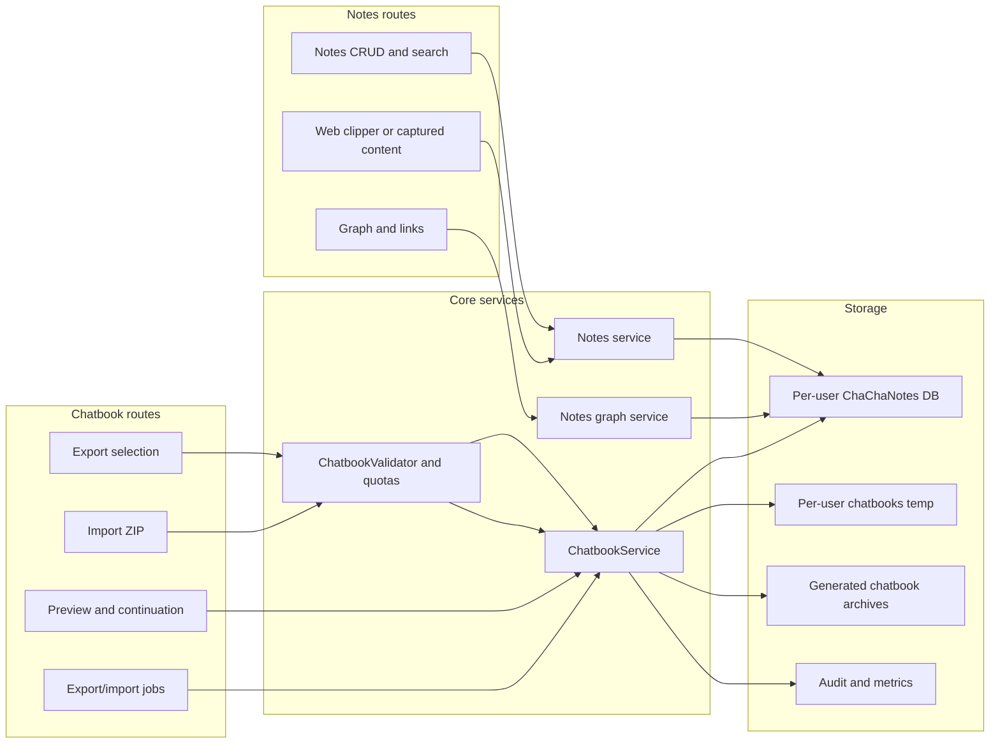

**Key storage/provider touchpoints:** Notes, graph edges, chats, and characters are stored in the per-user ChaChaNotes DB. Chatbook import/export uses per-user chatbook temp/export directories, validates archive content, tracks quotas/jobs, and writes audit/metrics events. Generated archives are returned through job-backed download metadata.

**Where to look in code:** `app/api/v1/endpoints/notes.py`, `app/api/v1/endpoints/notes_graph.py`, `app/api/v1/endpoints/chatbooks.py`, `app/core/Notes/`, `app/core/Notes_Graph/`, `app/core/WebClipper/`, `app/core/Chatbooks/`, and `app/core/DB_Management/ChaChaNotes_DB.py`.

### Research And Web Scraping

**Purpose:** Search papers, perform multi-provider web search, scrape web content, run deeper research sessions, and hand useful results to ingestion, Media DB, or RAG-ready storage.

**Primary entrypoints:** `/api/v1/research/websearch`, preferred `/api/v1/paper-search/*` routes, deprecated research shims, `/api/v1/research/runs`, web scraping service/job/progress routes, media web scraping process routes, and optional ingestion handoff routes.

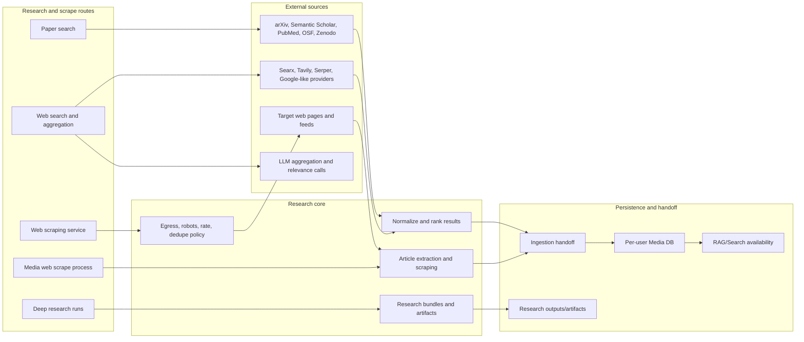

**Key storage/provider touchpoints:** Paper and web providers are external and may require API keys or configured endpoints. Scraping applies outbound/robots/rate/dedupe policy before extraction. Ingestion handoff writes normalized content to the per-user Media DB and can make content available for FTS, embeddings, and RAG; deep research can also produce allowlisted output artifacts.

**Where to look in code:** `app/api/v1/endpoints/research.py`, `app/api/v1/endpoints/research_runs.py`, `app/api/v1/endpoints/paper_search.py`, `app/api/v1/endpoints/web_scraping.py`, `app/api/v1/endpoints/media/process_web_scraping.py`, `app/core/Search_and_Research/README.md`, `app/core/Web_Scraping/`, `app/core/WebSearch/`, and `app/core/Research/`.

### Storage, Files, And Outputs

**Purpose:** Track generated files, user folders, trash, downloads, quotas, output templates, and generated artifacts consistently across features.

**Primary entrypoints:** `/api/v1/storage/files`, storage usage, folders, trash, download routes, admin storage quota routes, `/api/v1/outputs`, output template routes, and feature-specific generated file registration helpers.

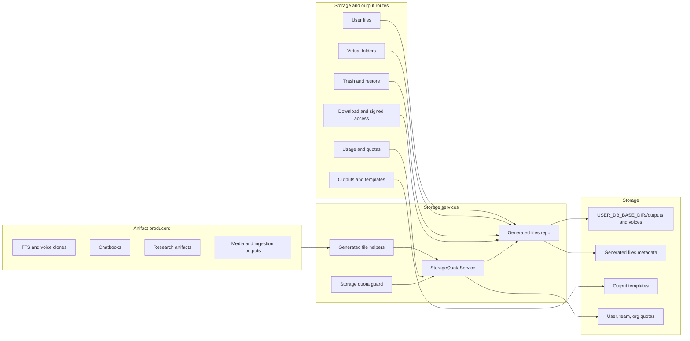

**Key storage/provider touchpoints:** Generated file metadata, access times, soft delete state, folders, and quota accounting are stored through AuthNZ/generated-file repositories and storage services, while bytes live under per-user outputs/voices or feature-specific directories. Download routes verify ownership and path containment; signed download behavior is documented for job-backed/generated artifacts where the feature exposes expiring download URLs.

**Where to look in code:** `app/api/v1/endpoints/storage.py`, `storage_user_files.py`, `storage_user_folders.py`, `storage_trash.py`, `storage_usage.py`, `storage_download.py`, `storage_admin_quotas.py`, `outputs.py`, `outputs_templates.py`, `app/services/storage_quota_service.py`, `app/api/v1/API_Deps/storage_quota_guard.py`, and `app/core/Storage/`.

### Admin, Ops, And Governance

**Purpose:** Centralize operator controls for users, RBAC, monitoring, audit, orgs, billing, config, jobs, resource limits, usage, and operational safety surfaces.

**Primary entrypoints:** Admin route group under `/api/v1/admin/*`, jobs admin routes, config admin routes, monitoring/metrics/audit routes, org/team/billing/privilege routes, resource governor and quota routes, MCP catalog/hub admin routes, and startup/system diagnostics.

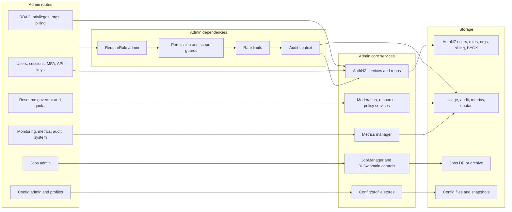

**Key storage/provider touchpoints:** Admin surfaces primarily touch shared AuthNZ/usage/audit storage, org/team/billing/privilege tables, config snapshots/files, resource governor quota state, and Jobs persistence/archive state. Domain-scoped admin controls may apply RBAC and RLS context before listing, mutating, or sweeping operational records.

**Where to look in code:** `app/api/v1/endpoints/admin/`, `app/api/v1/endpoints/jobs_admin.py`, `app/api/v1/endpoints/config_admin.py`, `app/core/AuthNZ/`, `app/core/Jobs/`, `app/core/Metrics/`, `app/core/Moderation/`, `app/services/*admin*`, and `Docs/API-related/User_Registration_API_Documentation.md`.

### Characters And Workspaces

**Purpose:** Manage character cards, character chat sessions/messages/memory, workspace sources/artifacts/notes, workspace migrations, and their handoff into chat and LLM generation.

**Primary entrypoints:** Character endpoints, character session/message/memory routes, workspace CRUD, workspace sources/artifacts/notes/capabilities/status routes, workspace migration session/chunk/finalize/client-delete-ack routes, and prototype workspace/session routes.

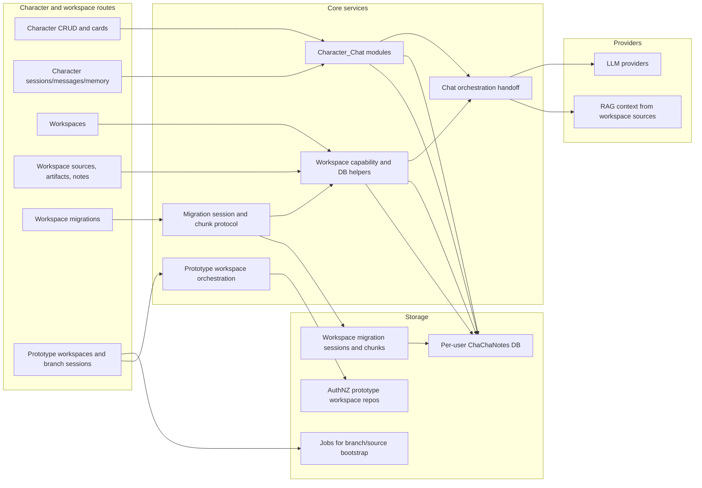

**Key storage/provider touchpoints:** Characters, sessions, messages, memories, workspaces, workspace sources, artifacts, notes, and workspace migration records live primarily in the per-user ChaChaNotes DB. Workspace migrations create or reuse a target workspace, record migration sessions and declared chunks, accept idempotent chunk receipts, finalize only after all chunks are present, and track client legacy-delete acknowledgement state. Prototype workspace collaboration uses AuthNZ repository storage and Jobs for branch/session bootstrap. Character and workspace context can be passed to chat orchestration, which then calls RAG and LLM providers.

**Where to look in code:** `app/api/v1/endpoints/characters_endpoint.py`, `app/api/v1/endpoints/workspaces.py`, `app/api/v1/endpoints/workspace_migrations.py`, `app/api/v1/endpoints/prototype_workspaces.py`, `app/core/Character_Chat/`, `app/core/Workspaces/`, `app/core/Prototype_Workspaces/`, workspace migration schema/methods in `app/core/DB_Management/ChaChaNotes_DB.py`, and chat orchestration modules.

### Integrations And Connectors

**Purpose:** Connect external systems, ingestion sources, and chat/meeting integrations to the same ingestion, research, Jobs, AuthNZ, and provider-secret paths used by internal workflows.

**Primary entrypoints:** `/api/v1/connectors`, `/api/v1/ingestion-sources`, Slack events/commands/OAuth/admin routes, Discord routes/OAuth/admin helpers, Telegram admin/webhook routes, meetings routes, and optional connector or integration routers gated by configuration/dependencies.

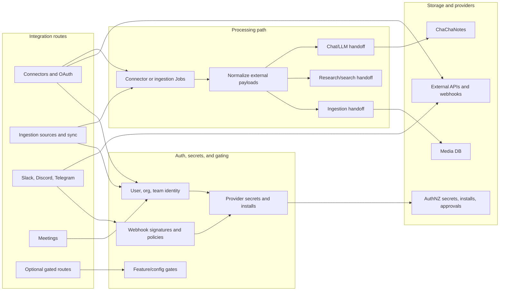

**Key storage/provider touchpoints:** AuthNZ stores user/org/team identities, provider secrets, OAuth installs, linked actors, approvals, and connector metadata. Ingestion-source syncs and connector jobs enqueue work, normalize external payloads, and hand content to ingestion/Media DB, notes, research, or chat/LLM providers. Optional routes may be gated by config, dependency availability, or explicit feature flags.

**Where to look in code:** `app/api/v1/endpoints/connectors.py`, `app/api/v1/endpoints/ingestion_sources.py`, Slack/Discord/Telegram endpoint and support files, `app/api/v1/endpoints/meetings.py`, `app/core/Ingestion_Sources/`, connector services under `app/core/External_Sources/` where present, provider-secret repos under `app/core/AuthNZ/`, and media/research ingestion handoff modules.

## Router Coverage Matrix

This table groups routers by the way they are registered and maintained, not by every concrete endpoint path. Use it to audit whether new router domains have a corresponding atlas entry and whether related diagrams were updated together.

| Router group or domain | Representative routes/modules | Atlas section | Coverage note |
| --- | --- | --- | --- |
| Core/infrastructure | `main.py`, `router_registry.py`, `router_groups/core.py`, `router_groups/minimal.py`, setup, health, metrics, OpenAPI helpers | [System Context](#system-context), [Request Lifecycle](#request-lifecycle), [Router Group Map](#router-group-map) | Covers app startup, router registration, middleware/dependencies, and operational surfaces. Individual health/setup variants are grouped under infrastructure rather than listed one by one. |
| Identity/config/sync | `auth.py`, `users.py`, `config_info.py`, `config_admin.py`, `sync.py`, AuthNZ dependencies, provider-secret helpers | [Auth And User Context](#auth-and-user-context), [Admin, Ops, And Governance](#admin-ops-and-governance) | Groups identity, user context, configuration, sync, and provider-secret flows because they share AuthNZ/user-scope ownership. |
| Chat/LLM | `chat.py`, OpenAI-compatible chat routes, `core/Chat/`, `core/LLM_Calls/`, provider routing | [Chat And LLM Provider Calls](#chat-and-llm-provider-calls) | Covers request shaping, optional RAG context, conversation persistence, provider selection, and streaming responses. Character-specific chat is cross-linked through the characters/workspaces row. |
| ACP/MCP | `mcp_unified_endpoint.py`, ACP endpoints where enabled, `core/MCP_unified/` | [MCP Unified](#mcp-unified), [Router Group Map](#router-group-map) | Groups MCP and ACP-style tool/client protocols as external tool-control surfaces with shared auth, RBAC, and execution concerns. |
| Content/RAG/media/audio/embeddings/evaluations/OCR | `media/` endpoint package, `media_embeddings.py`, `rag_unified.py`, `rag_health.py`, `audio/` endpoint package, `embeddings_*`, `evaluations_unified.py`, `ocr.py`, ingestion/chunking/embedding/RAG/evaluation core modules | [Media Ingestion](#media-ingestion), [Audio STT/TTS](#audio-stttts), [Chunking And Embeddings](#chunking-and-embeddings), [RAG/Search](#ragsearch), [Evaluations](#evaluations) | Groups high-volume content processing domains that move data between uploads/providers, Media DB, vector stores, per-user evaluations storage, and response-first audio paths. |
| Workflows/scheduler/jobs | `workflows.py`, jobs endpoints, Scheduler handlers, APScheduler bridges, WorkerSDK/background services | [Jobs And Scheduler](#jobs-and-scheduler), [Admin, Ops, And Governance](#admin-ops-and-governance) | Separates user-visible Jobs from internal Scheduler orchestration while showing where recurring schedules enqueue into each backend. |
| Notes/prompts/prompt studio/workspaces/characters | notes/chatbook endpoints, prompt endpoints, `prompt_studio/` endpoint package, workspace routes including migrations, character endpoints and card/session helpers | [Prompt Studio](#prompt-studio), [Notes And Chatbooks](#notes-and-chatbooks), [Characters And Workspaces](#characters-and-workspaces) | Groups user-authored knowledge, conversation artifacts, prompt assets, workspace migration state, and character/session data because they primarily persist through ChaChaNotes and related per-user stores. |
| Collections/reading and learning tools | `collections_feeds.py`, `collections_websub.py`, `reading.py`, `reading_highlights.py`, `translate.py`, `slides.py`, `flashcards.py`, `quizzes.py`, `study_suggestions.py`, writing/manuscript routes | [Media Ingestion](#media-ingestion), [Notes And Chatbooks](#notes-and-chatbooks), [Characters And Workspaces](#characters-and-workspaces) | Explicitly groups registered lightweight content and learning routers that organize, annotate, transform, or study content. The atlas covers their storage/provider handoffs at the domain level, not every route. |
| Application content tools | Kanban modules, `data_tables.py`, `items.py`, `reminders.py`, `notifications.py`, `watchlists.py`, scheduled tasks control plane, VN assets/play routes | [Storage, Files, And Outputs](#storage-files-and-outputs), [Jobs And Scheduler](#jobs-and-scheduler), [Admin, Ops, And Governance](#admin-ops-and-governance) | Covers app-level boards, data tables, items, tasks/reminders, notifications, watchlists, scheduled tasks, and VN routes as registered content/application surfaces with storage, scheduling, and governance touchpoints. |
| Persona/companion personalization | `persona.py`, `personalization.py`, `companion.py`, `archetype_endpoints.py`, voice assistant routes | [Chat And LLM Provider Calls](#chat-and-llm-provider-calls), [Characters And Workspaces](#characters-and-workspaces), [Audio STT/TTS](#audio-stttts) | Groups persona, companion, archetype, personalization, and voice assistant routes because they bridge user profile state, character/workspace context, chat/LLM calls, and audio streams. |
| Storage/files/outputs/sharing | file upload/download routes, outputs/artifacts, local storage helpers, sharing/export/import handlers, chatbooks | [Storage, Files, And Outputs](#storage-files-and-outputs), [Notes And Chatbooks](#notes-and-chatbooks), [Data Store Map](#data-store-map) | Covers storage ownership and file/output lifecycles at the domain level; concrete file routes are intentionally summarized by storage responsibility. |
| Research/web scraping/connectors/integrations | `research.py`, `paper_search.py`, `web_scraping.py`, connectors, ingestion sources, Slack/Discord/Telegram/meeting routes where enabled | [Research And Web Scraping](#research-and-web-scraping), [Integrations And Connectors](#integrations-and-connectors) | Groups external-source ingestion and integration callbacks because both normalize provider/web payloads before handing off to media, notes, research, chat, or jobs. |
| Admin/orgs/billing/resource governance/monitoring | admin routers, org/team routes, billing/subscription routes, resource governance, rate limits, metrics, audit/ops endpoints | [Admin, Ops, And Governance](#admin-ops-and-governance), [Request Lifecycle](#request-lifecycle) | Covers governance, quotas, RBAC, observability, and administrative controls as cross-cutting policy layers rather than feature-specific endpoint lists. |

## How To Update This Atlas

- Check `router_groups/*.py` and `router_registry.py` for router additions, removals, lazy imports, optional routes, or registration changes.
- Check changed endpoint and core modules for new storage ownership, provider calls, background workers, queue paths, or persistence gates.
- Update the relevant Mermaid diagram and the [Router Coverage Matrix](#router-coverage-matrix) together so coverage remains auditable.
- Re-run Markdown/Mermaid text checks for changed headings, diagram syntax anchors, and required terms.
- Record verification commands and results in the relevant Backlog task.
