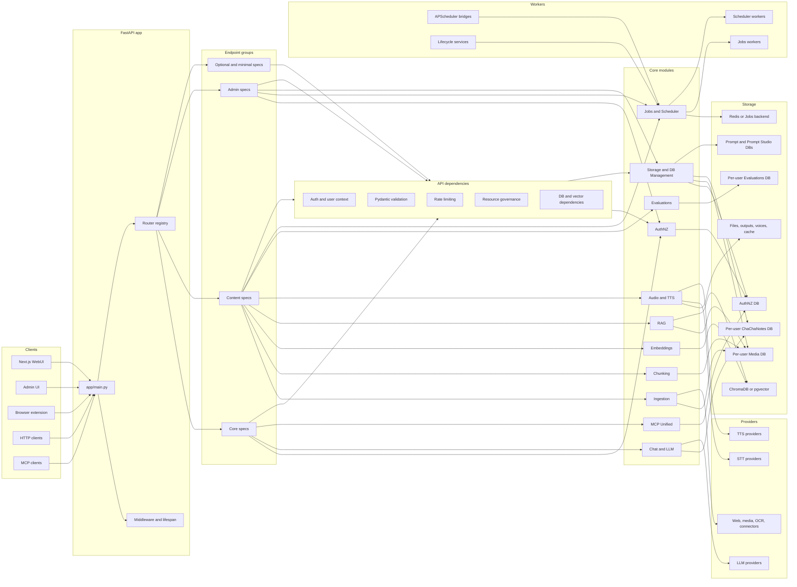
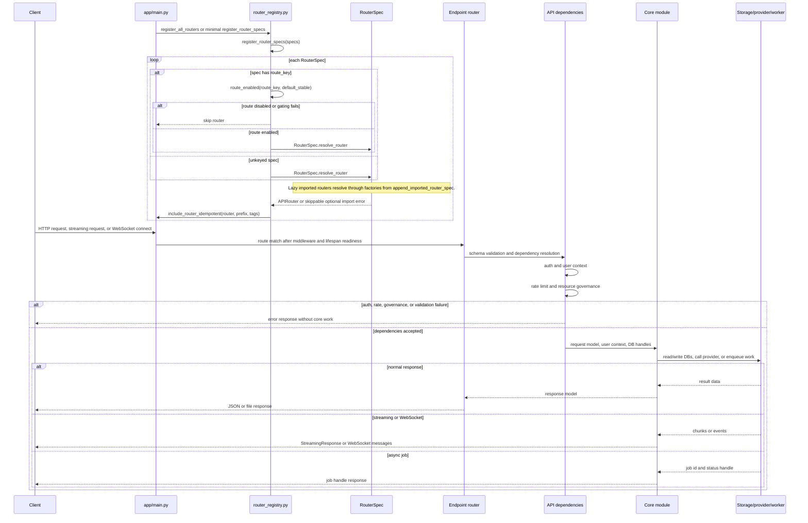
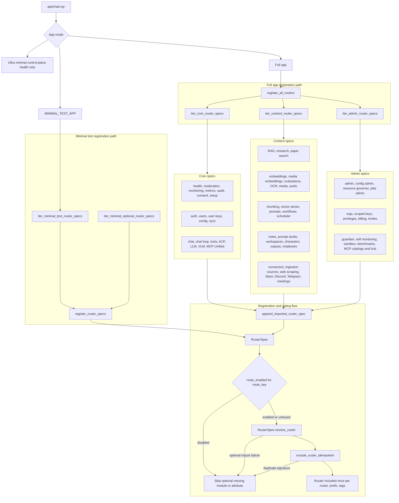
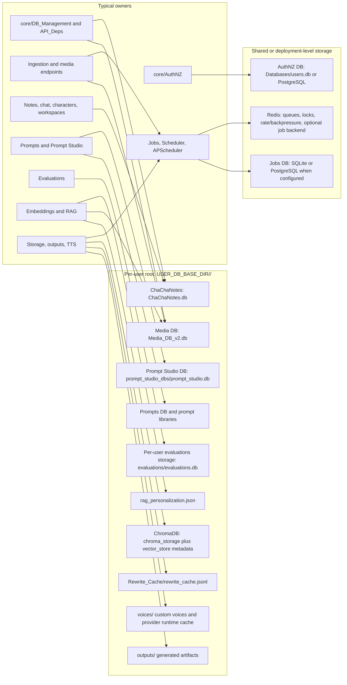
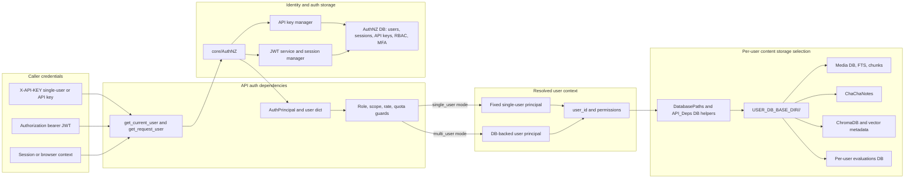
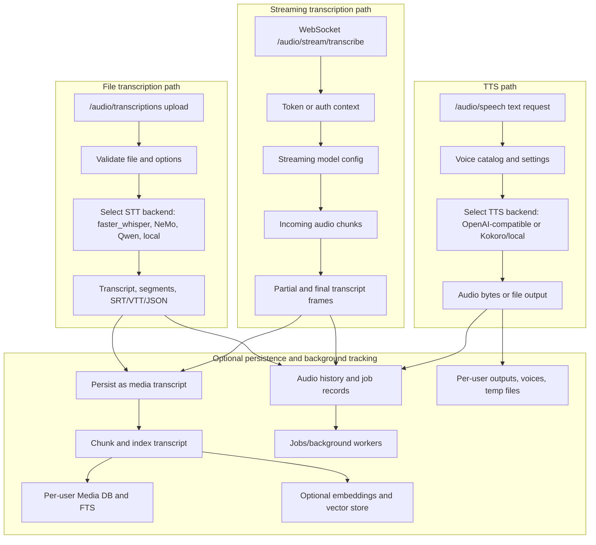
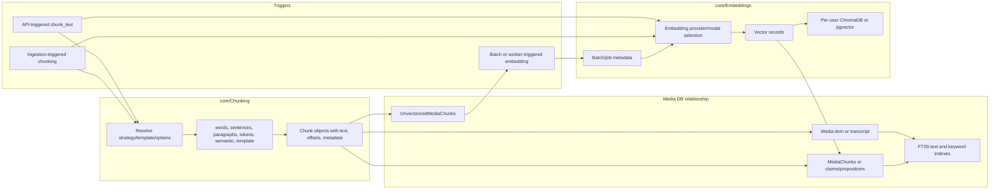
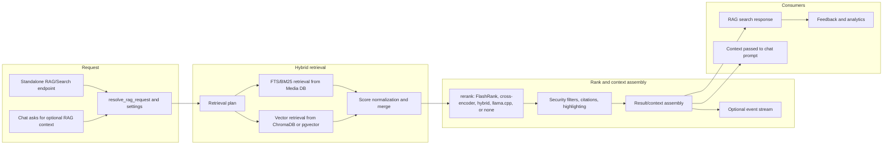

# tldw_Server_API Data Flow Atlas

This atlas maps how data moves through `tldw_Server_API`. It is written for new contributors and maintainers who need to trace requests across FastAPI endpoints, dependencies, core modules, storage, providers, and background workers.

## Table Of Contents

- [How To Read This Atlas](#how-to-read-this-atlas)
- [System Context](#system-context)
- [Request Lifecycle](#request-lifecycle)
- [Router Group Map](#router-group-map)
- [Data Store Map](#data-store-map)
- [Core Flow Diagrams](#core-flow-diagrams)
- [Extended Domain Maps](#extended-domain-maps)
- [Router Coverage Matrix](#router-coverage-matrix)
- [How To Update This Atlas](#how-to-update-this-atlas)

## How To Read This Atlas

Use this atlas as a flow map, not as an OpenAPI replacement. Route names, module names, and storage paths should be verified against the code before edits.

| Shape or Group | Meaning |
| --- | --- |
| Clients | WebUI, admin UI, extension, HTTP clients, MCP clients, or other callers |
| FastAPI app | `app/main.py`, middleware, lifecycle, router registration |
| Endpoint groups | Routers under `app/api/v1/endpoints/`, grouped by `router_groups/*.py` |
| API dependencies | Auth, user context, DB handles, rate limits, resource governance, request validation |
| Core modules | Domain logic under `app/core/` |
| Storage | SQLite/PostgreSQL DBs, ChromaDB/pgvector, file storage, Redis/job backends |
| Providers | LLM, STT, TTS, OCR, web/media, and other external or local providers |
| Workers | Jobs, Scheduler, APScheduler bridges, background services, lifecycle workers |
| Optional routes | Feature-gated, lazy-imported, or optional dependency routes |

## System Context



## Request Lifecycle



## Router Group Map



## Data Store Map



## Core Flow Diagrams

These flows trace the backend paths most likely to matter when a newcomer asks where data goes after an API call. They are intentionally grouped by process rather than by every route handler.

### Auth And User Context

**Purpose:** Resolve the caller, enforce auth policy, and turn identity into the user-scoped paths used by content modules.

**Primary entrypoints:** Most protected endpoints through `get_current_user`, `get_request_user`, `AuthPrincipal`, `TokenScopeGuard`, `RequireRole`, and related dependencies in `app/api/v1/API_Deps/auth_deps.py`.



**Key storage/provider touchpoints:** AuthNZ DB stores identity, sessions, API keys, RBAC, quotas, and MFA state. Per-user content storage is selected only after user context resolves; it lives under `USER_DB_BASE_DIR/<user_id>/` and includes Media DB, ChaChaNotes, ChromaDB/vector metadata, prompts, outputs, and per-user evaluations storage.

**Where to look in code:** `app/api/v1/API_Deps/auth_deps.py`, `app/core/AuthNZ/`, `app/core/DB_Management/db_path_utils.py`, `app/core/DB_Management/Users_DB.py`, and the per-domain DB dependency modules under `app/api/v1/API_Deps/`.

### Media Ingestion

**Purpose:** Convert files, documents, URLs, web pages, audio, and video into normalized records, chunks, search indexes, and optional embeddings so content is searchable and RAG-ready.

**Primary entrypoints:** `POST /api/v1/media/add`, `POST /api/v1/media/process-documents`, `POST /api/v1/media/process-videos`, `POST /api/v1/media/process-audios`, `POST /api/v1/media/process-pdfs`, `POST /api/v1/media/process-ebooks`, web scraping and ingestion-source routes.

```mermaid
flowchart LR
    subgraph Inputs
        Files[Uploaded files and documents]
        URLs[URL, video, audio, feed inputs]
        Web[Web scraping and article extraction]
    end

    subgraph EndpointLayer["Media endpoints"]
        Add["/media/add persistent ingest"]
        Process["process-* no-persistence helpers"]
        JobsPath[Optional Jobs or background path]
    end

    subgraph Processing["core/Ingestion_Media_Processing"]
        Dispatch[Media type dispatch]
        Download[Download with yt-dlp or URL fetch]
        Transcode[ffmpeg transcode or audio extraction]
        OCR[PDF or image OCR branch]
        STT[Audio/video STT branch]
        Parse[Document, ebook, HTML, XML parsing]
        Normalize[Normalize text, metadata, transcript segments]
        Chunk[Chunking strategies and templates]
    end

    subgraph Searchable["Search and RAG readiness"]
        Persist[Persist primary item and metadata]
        MediaDB[Per-user Media DB]
        FTS[FTS5 media and keyword indexes]
        EmbedOpt{generate_embeddings?}
        Embed[Embedding provider/model]
        Vector[Per-user ChromaDB or vector backend]
    end

    Files --> Add
    URLs --> Add
    Web --> Add
    Files --> Process
    URLs --> Process
    Add --> Dispatch
    Process --> Dispatch
    Add --> JobsPath
    JobsPath --> Dispatch
    Dispatch --> Download
    Dispatch --> Parse
    Download --> Transcode
    Transcode --> STT
    Parse --> OCR
    OCR --> Normalize
    STT --> Normalize
    Parse --> Normalize
    Normalize --> Chunk
    Chunk --> Persist
    Persist --> MediaDB
    MediaDB --> FTS
    Persist --> EmbedOpt
    EmbedOpt -->|yes| Embed
    Embed --> Vector
    EmbedOpt -->|no| FTS
```



**Key storage/provider touchpoints:** Media DB stores content, transcripts, metadata, chunks, keywords, and FTS state. Embedding generation writes per-user vector records and vector metadata. Providers include yt-dlp, ffmpeg, OCR backends, STT backends, web extractors, embedding providers, and optional Jobs workers.

**Where to look in code:** `app/api/v1/endpoints/media/`, `app/core/Ingestion_Media_Processing/`, `app/core/DB_Management/Media_DB_v2.py`, `app/core/DB_Management/media_db/`, `app/core/Embeddings/`, `Docs/Code_Documentation/Pieces.md`, and `Docs/Code_Documentation/Ingestion_Pipeline_Video.md`.

### Audio STT/TTS

**Purpose:** Handle file transcription, real-time streaming transcription, and speech synthesis while keeping the file, WebSocket, and TTS paths distinct.

**Primary entrypoints:** `POST /api/v1/audio/transcriptions`, `WS /api/v1/audio/stream/transcribe`, `POST /api/v1/audio/speech`, `GET /api/v1/audio/voices/catalog`, audio history and audio job/status endpoints.



**Key storage/provider touchpoints:** STT and TTS providers may be local runtimes or external OpenAI-compatible services. File outputs and voices live under the per-user root. Transcripts can remain as responses/history or be persisted as media, then chunked, indexed with FTS, and embedded for RAG.

**Where to look in code:** `app/api/v1/endpoints/audio.py`, `app/core/Ingestion_Media_Processing/Audio/`, `app/core/TTS/`, `Docs/STT-TTS/`, and media persistence helpers when transcription is saved as content.

### Chunking And Embeddings

**Purpose:** Produce stable text pieces from raw content and attach embedding vectors so chunks can be retrieved by FTS, BM25, vector search, or hybrid RAG.

**Primary entrypoints:** `POST /api/v1/chunking/chunk_text`, chunk template routes, ingestion-triggered chunking in media/process endpoints, embedding endpoints, media embedding jobs, and vector-store admin routes.



**Key storage/provider touchpoints:** Chunk metadata and FTS state live in the per-user Media DB. Vector payloads and embedding job/batch metadata live under the per-user vector store path. Embedding providers and models are resolved from request/config, and chunking can be invoked directly by API callers or indirectly by ingestion.

**Where to look in code:** `app/api/v1/endpoints/chunking.py`, embedding endpoints, `app/core/Chunking/`, `app/core/Ingestion_Media_Processing/chunking_options.py`, `app/core/Embeddings/ChromaDB_Library.py`, vector metadata/job DB modules, `Docs/Code_Documentation/Pieces.md`, and `Docs/Code_Documentation/Database.md`.

### RAG/Search

**Purpose:** Normalize search/RAG requests, retrieve candidate chunks from lexical and vector paths, rerank and post-process them, then assemble results or generation context.

**Primary entrypoints:** `POST /api/v1/rag/search`, `GET /api/v1/rag/search/stream`, RAG settings/backends endpoints, media search endpoints, and chat flows that request RAG context before generation.



**Key storage/provider touchpoints:** FTS/BM25 reads from the per-user Media DB and its FTS tables. Vector retrieval reads per-user ChromaDB or pgvector collections populated by embeddings. Rerankers may use local models or provider-backed adapters. Feedback and analytics attach to the RAG service path.

**Where to look in code:** `app/api/v1/endpoints/rag_unified.py`, `app/core/RAG/rag_service/request_resolution.py`, `retrieval_plan.py`, `database_retrievers.py`, `unified_pipeline.py`, `response_mapping.py`, `streaming_executor.py`, and embedding/vector-store modules.

### Chat And LLM Provider Calls

**Purpose:** Accept OpenAI-compatible chat requests, optionally enrich them with retrieval context, resolve a provider/model, call the adapter, and persist conversation state separately from retrieval.

**Primary entrypoints:** `POST /api/v1/chat/completions`, chat session/conversation routes, chat document/workflow routes, `/api/v1/llm/providers`, and provider metadata/model routing routes.

```mermaid
flowchart LR
    subgraph ChatRequest["Chat generation"]
        Endpoint["/chat/completions"]
        Validate[OpenAI-compatible request validation]
        Session[Optional conversation or session state]
        PersistIn[Persist user message when configured]
    end

    subgraph RetrievalContext["Optional retrieval"]
        NeedRAG{RAG requested?}
        RAGFlow["RAG/Search flow"]
        PromptContext[Prompt context and citations]
    end

    subgraph ProviderCall["LLM provider call"]
        Resolve[Provider/model resolution and BYOK/config lookup]
        Adapter[LLM adapter registry]
        External[Commercial or local provider]
    end

    subgraph ResponsePaths["Response paths"]
        NonStream[Non-streaming JSON response]
        Stream[Streaming SSE chunks]
        PersistOut[Persist assistant message and metadata]
        NotesDB[Per-user ChaChaNotes chat/session DB]
    end

    Endpoint --> Validate --> Session --> PersistIn
    PersistIn --> NeedRAG
    NeedRAG -->|yes| RAGFlow --> PromptContext --> Resolve
    NeedRAG -->|no| Resolve
    Resolve --> Adapter --> External
    External -->|complete response| NonStream
    External -->|delta events| Stream
    NonStream --> PersistOut
    Stream --> PersistOut
    PersistOut --> NotesDB
```



**Key storage/provider touchpoints:** Chat/session state persists in the per-user ChaChaNotes database when configured. RAG context is assembled from Media DB and vector-store reads but remains separable from generation. Provider resolution can use config, BYOK/user provider secrets, model routing, and adapter registry entries for OpenAI-compatible, commercial, and local providers.

**Where to look in code:** chat endpoints under `app/api/v1/endpoints/`, `app/core/Chat/`, `app/core/LLM_Calls/adapter_registry.py`, `app/core/LLM_Calls/providers/`, `app/core/LLM_Calls/routing/`, `app/core/AuthNZ/byok_helpers.py`, and `app/core/DB_Management/ChaChaNotes_DB.py`.

### Jobs And Scheduler

**Purpose:** Distinguish user-visible Jobs from internal Scheduler orchestration and show how recurring APScheduler services bridge into the chosen backend.

**Primary entrypoints:** Jobs admin/status endpoints, domain workers that enqueue Jobs, Scheduler workflow endpoints, `@task`-registered scheduler handlers, APScheduler-backed workflow and digest services.

```mermaid
flowchart LR
    subgraph Producers
        UserAction[User-visible long work]
        InternalFlow[Internal orchestration]
        Recurring[Recurring APScheduler trigger]
    end

    subgraph JobsPath["Jobs backend"]
        JobCreate[Create Job with owner, domain, quota]
        JobDB[Jobs DB or Redis-backed state]
        Admin[Admin status, pause, resume, drain, retry]
        WorkerSDK[Jobs WorkerSDK or domain worker]
        JobResult[Result, failure, retry, audit]
    end

    subgraph SchedulerPath["Core Scheduler backend"]
        TaskReg[@task handler registration]
        TaskCreate[Create task with dependency and idempotency key]
        SchedulerDB[Scheduler persistence]
        Dependency[Dependency resolution]
        SchedulerWorker[Scheduler worker pool]
        TaskResult[Task result and workflow state]
    end

    subgraph Bridge["APScheduler bridges"]
        APS[APScheduler service]
        Choose{Chosen backend}
    end

    UserAction --> JobCreate --> JobDB --> Admin
    JobDB --> WorkerSDK --> JobResult --> Admin
    InternalFlow --> TaskReg --> TaskCreate --> SchedulerDB --> Dependency --> SchedulerWorker --> TaskResult
    Recurring --> APS --> Choose
    Choose -->|user-visible or ops-controlled| JobCreate
    Choose -->|dependency orchestration| TaskCreate
```

**Key storage/provider touchpoints:** Jobs use a Jobs backend for owner/domain state, retries, admin controls, quotas, worker leases, and status summaries. Scheduler uses its own persistence for task registration, dependencies, idempotency, and workflow execution. APScheduler services should enqueue into Jobs or Scheduler according to the workflow they support.

**Where to look in code:** `app/api/v1/endpoints/jobs_admin.py`, `app/core/Jobs/`, `app/services/*jobs_worker*.py`, `app/api/v1/endpoints/scheduler_workflows.py`, `app/core/Scheduler/`, workflow/watchlist scheduler services, and APScheduler startup/lifecycle services.

**Decision note:** Use Jobs for new user-visible features or work needing admin/ops status, pause/resume/drain, retries, quotas, or RLS. Use Scheduler for internal orchestration where registered handlers, task dependencies, and idempotency keys are central. Recurring schedules should use APScheduler to enqueue into whichever backend the feature needs.

## Extended Domain Maps

Placeholder: this section will collect additional domain maps once the foundation and core flows are in place.

### Evaluations

Placeholder: this flow will trace evaluation runs, recipes, metrics, audit records, and batch execution.

### MCP Unified

Placeholder: this flow will trace MCP status, tool execution, WebSocket handling, auth context, and core MCP services.

### Prompt Studio

Placeholder: this flow will trace prompt project, prompt version, test, optimization, and persistence paths.

### Notes And Chatbooks

Placeholder: this flow will trace notes, chats, character sessions, chatbook export/import, and background job handling.

### Research And Web Scraping

Placeholder: this flow will trace research and scraping requests through provider selection, extraction, aggregation, and storage.

### Storage, Files, And Outputs

Placeholder: this flow will trace upload handling, generated outputs, per-user file storage, temporary files, and cleanup responsibilities.

### Admin, Ops, And Governance

Placeholder: this flow will trace admin routes, monitoring, metrics, resource governance, rate limits, and operational controls.

### Characters And Workspaces

Placeholder: this flow will trace character card data, workspace state, chat/session links, and related per-user storage.

### Integrations And Connectors

Placeholder: this flow will trace connector routes, external integrations, optional dependency behavior, and provider handoffs.

## Router Coverage Matrix

Placeholder: this section will track every major router group or domain, representative modules, the atlas section that covers it, and any known coverage limits.

## How To Update This Atlas

Placeholder: this section will define the maintenance checklist for keeping diagrams, route groups, storage paths, and verification commands current.
