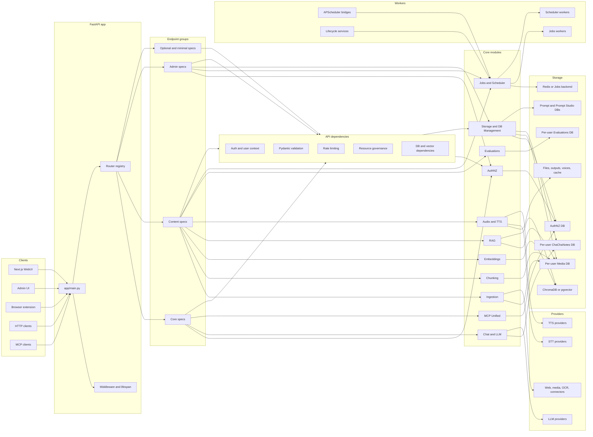
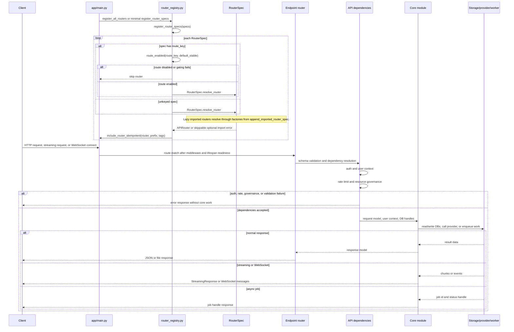
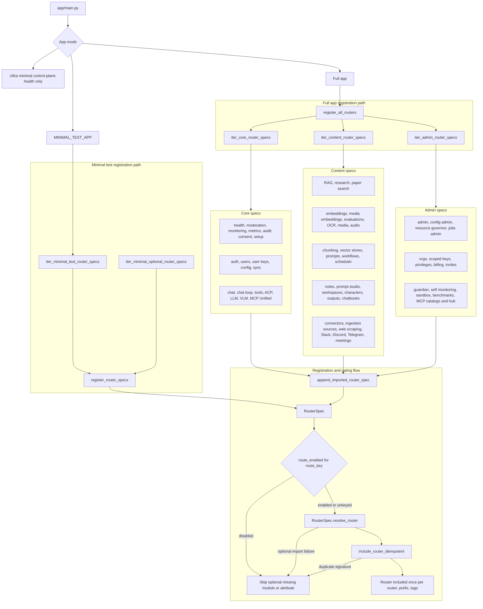
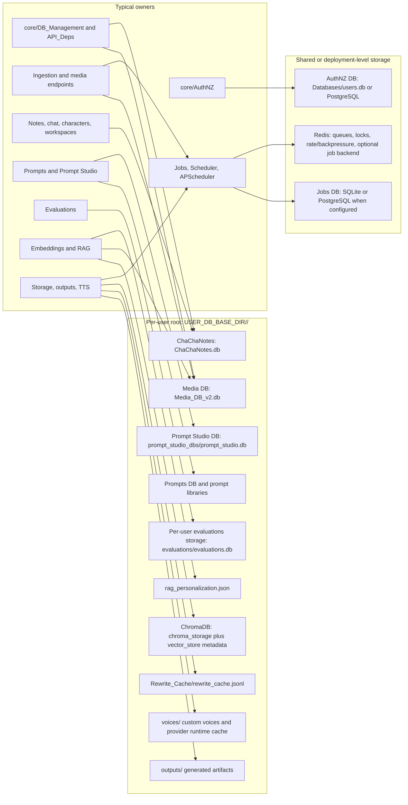

# tldw_Server_API Data Flow Atlas

This atlas maps how data moves through `tldw_Server_API`. It is written for new contributors and maintainers who need to trace requests across FastAPI endpoints, dependencies, core modules, storage, providers, and background workers.

## Table Of Contents

- [How To Read This Atlas](#how-to-read-this-atlas)
- [System Context](#system-context)
- [Request Lifecycle](#request-lifecycle)
- [Router Group Map](#router-group-map)
- [Data Store Map](#data-store-map)
- [Core Flow Diagrams](#core-flow-diagrams)
- [Extended Domain Maps](#extended-domain-maps)
- [Router Coverage Matrix](#router-coverage-matrix)
- [How To Update This Atlas](#how-to-update-this-atlas)

## How To Read This Atlas

Use this atlas as a flow map, not as an OpenAPI replacement. Route names, module names, and storage paths should be verified against the code before edits.

| Shape or Group | Meaning |
| --- | --- |
| Clients | WebUI, admin UI, extension, HTTP clients, MCP clients, or other callers |
| FastAPI app | `app/main.py`, middleware, lifecycle, router registration |
| Endpoint groups | Routers under `app/api/v1/endpoints/`, grouped by `router_groups/*.py` |
| API dependencies | Auth, user context, DB handles, rate limits, resource governance, request validation |
| Core modules | Domain logic under `app/core/` |
| Storage | SQLite/PostgreSQL DBs, ChromaDB/pgvector, file storage, Redis/job backends |
| Providers | LLM, STT, TTS, OCR, web/media, and other external or local providers |
| Workers | Jobs, Scheduler, APScheduler bridges, background services, lifecycle workers |
| Optional routes | Feature-gated, lazy-imported, or optional dependency routes |

## System Context

## Request Lifecycle

## Router Group Map

## Data Store Map

## Core Flow Diagrams

Placeholder: this section will collect the primary backend flow diagrams for core contributor workflows.

### Auth And User Context

Placeholder: this flow will trace single-user API key and multi-user JWT context resolution through API dependencies and AuthNZ storage.

### Media Ingestion

Placeholder: this flow will trace media requests through ingestion, metadata extraction, transcript handling, chunk persistence, and optional embedding.

### Audio STT/TTS

Placeholder: this flow will trace file and streaming transcription plus speech synthesis through audio endpoints, local providers, external providers, and output handling.

### Chunking And Embeddings

Placeholder: this flow will trace chunking templates, chunk creation, embedding generation, vector-store writes, and related metadata.

### RAG/Search

Placeholder: this flow will trace search inputs through FTS/vector retrieval, reranking, context assembly, and response construction.

### Chat And LLM Provider Calls

Placeholder: this flow will trace chat requests through conversation state, optional retrieval, provider routing, streaming, and persistence.

### Jobs And Scheduler

Placeholder: this flow will show how user-visible Jobs and internal Scheduler tasks differ, including worker and APScheduler handoffs.

## Extended Domain Maps

Placeholder: this section will collect additional domain maps once the foundation and core flows are in place.

### Evaluations

Placeholder: this flow will trace evaluation runs, recipes, metrics, audit records, and batch execution.

### MCP Unified

Placeholder: this flow will trace MCP status, tool execution, WebSocket handling, auth context, and core MCP services.

### Prompt Studio

Placeholder: this flow will trace prompt project, prompt version, test, optimization, and persistence paths.

### Notes And Chatbooks

Placeholder: this flow will trace notes, chats, character sessions, chatbook export/import, and background job handling.

### Research And Web Scraping

Placeholder: this flow will trace research and scraping requests through provider selection, extraction, aggregation, and storage.

### Storage, Files, And Outputs

Placeholder: this flow will trace upload handling, generated outputs, per-user file storage, temporary files, and cleanup responsibilities.

### Admin, Ops, And Governance

Placeholder: this flow will trace admin routes, monitoring, metrics, resource governance, rate limits, and operational controls.

### Characters And Workspaces

Placeholder: this flow will trace character card data, workspace state, chat/session links, and related per-user storage.

### Integrations And Connectors

Placeholder: this flow will trace connector routes, external integrations, optional dependency behavior, and provider handoffs.

## Router Coverage Matrix

Placeholder: this section will track every major router group or domain, representative modules, the atlas section that covers it, and any known coverage limits.

## How To Update This Atlas

Placeholder: this section will define the maintenance checklist for keeping diagrams, route groups, storage paths, and verification commands current.
