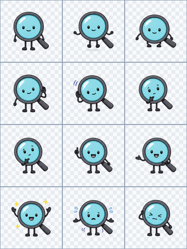
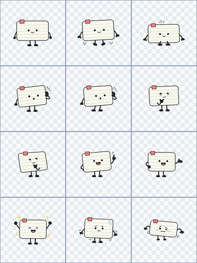
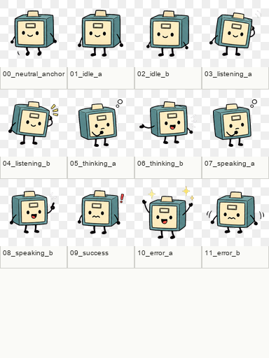
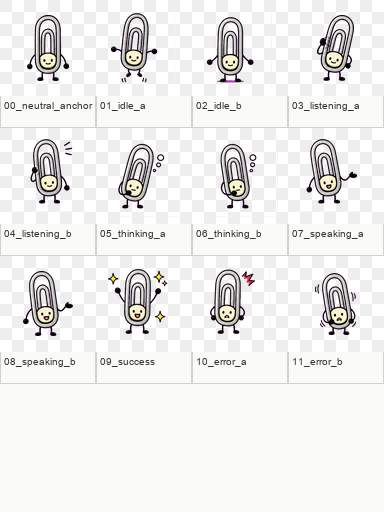
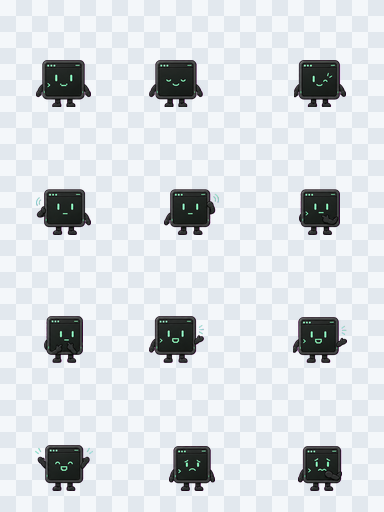
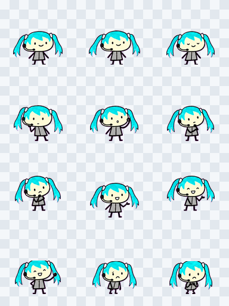

# Persona Visual Packs

Persona Visual Packs are the user-owned 2D asset packs used by Persona Buddy and
Persona Live. They are authored and reviewed from Persona Garden, then rendered
by the floating Buddy shell when a pack is explicitly activated.

This document describes the current ownership, activation, import/export, and
review semantics. It is intentionally scoped to Persona/Buddy visual packs, not
VN or CYOA asset-pack/runtime behavior.

## Ownership Model

Persona Visual Pack assets are user-owned. A pack is attached to one persona by
default, and the asset rows, generated-file references, manifest, and pack
metadata stay scoped to that persona unless a future workflow explicitly
duplicates or shares them.

This default attachment keeps the user's visual assistant identity tied to the
Persona profile rather than creating a separate avatar identity. The current
system does not publish packs to a shared library and does not automatically
reuse assets across personas.

## Active Versus Available Packs

A persona can have multiple available visual packs. Draft packs, imported packs,
and reviewed generated candidates can all remain available for editing and
review without changing the live assistant.

The active pack is the one Persona Buddy renders now. Activation is explicit and
pack-level: a user must activate a valid pack before Persona Buddy switches to
it. Generated or imported assets do not become live just because a job finished.

Deactivation clears the active visual pack for that persona while leaving
available packs in place for later editing or activation.

## Generated Candidate Provenance

Generated candidates are review artifacts. Their persisted
`generation_provenance` metadata is intentionally bounded and trace-safe so a
review surface can explain why a candidate exists without echoing raw prompts,
provider secrets, local paths, or arbitrary job payloads.

The V1 provenance shape stores `schema_version`, `generation_mode`,
`request_id`, `job_id`, `backend`, and `target_state` when present. Recipe-backed
jobs may also include a `recipe` summary with `starter_pack_id`,
`recipe_output`, `correlation_id`, `identity_brief`, `neutral_anchor`,
`static_sheet`, bounded `review_checks`, and a boolean
`user_prompt_included`. The raw effective prompt remains outside provenance, and
unknown provenance keys are dropped during candidate row normalization.

## Manifest-Backed Pack Format

Packs are stored as manifests with referenced assets. The V1 renderer uses
sprite/frame data, state mappings, fallbacks, authored triggers, and animation
timing in the manifest while storing raster files through generated-file storage.

The manifest-backed format is the compatibility boundary for future portability
work. It keeps today's pack attached to one persona while leaving room for later
duplicate-to-persona, import/export, and shared-library workflows without
changing the core pack format.

V1 validation and Buddy runtime support are intentionally limited to
`sprite_frames`. PR #1608 added the renderer capability contract and authenticated
`GET /api/v1/persona/visual-renderers` endpoint, with `sprite_frames` as the only
enabled V1 activatable and Buddy-runtime renderer. Reserved renderer labels in
API/UI types are still not support claims until backend manifest validation,
import preview, Buddy runtime rendering, and capability reporting all agree on
that renderer.

Future renderer/provider adapter work is evaluated in
`Docs/Design/2026-05-10-persona-visual-renderer-provider-adapter-evaluation.md`.
That evaluation keeps Live2D, Rive, Lottie, Spine, and external MCP-compatible
pack providers separate from the current V1 activation path. The renderer
capability contract is now in place; sprite-sheet frame regions are supported
inside `sprite_frames`, and any future non-sprite adapter should reuse the
registry instead of adding another hardcoded renderer path.

The renderer capability response is additive. Clients should continue to read
the original fields (`renderer_type`, `manifest_versions`, `can_validate`,
`can_activate`, `buddy_runtime_supported`, `import_supported`,
`export_supported`, and `disabled_reason`) and may also read Manifest V2 planning
metadata such as `renderer_contract_versions`, `supported_asset_roles`,
`required_role_categories`, `role_category_map`, MIME/extension limits, texture
limits, `setup_status`, `setup_blockers`, `requires_static_fallback`, and
`requires_license_ack`. `sprite_frames` remains the only activatable
Buddy-runtime renderer. A non-sprite renderer such as `live2d` can appear in the
capability list with `can_validate: false`, `can_activate: false`,
`buddy_runtime_supported: false`, and a blocker such as
`runtime_adapter_not_implemented`; that is an explicit future/disabled state,
not a runtime support claim.

Renderer import-preview diagnostics are also split from archive parsing. The
fixture-level validator in
`tldw_Server_API/app/core/Persona/visual_import_preview_validators.py` accepts
already-normalized manifest and asset metadata, resolves the renderer capability
registry, and returns structured blockers, warnings, normalized role categories,
commit eligibility, and activation eligibility. It does not parse archives,
create asset rows, activate packs, or load renderer runtimes; the current V1
archive preview and commit flow remains unchanged.

Archive import preview now routes Manifest V2 renderer metadata through that
validator and places the result in `proposed_plan.renderer_import_preview`.
Known disabled renderers such as `live2d`, and unknown renderers, can therefore
return review diagnostics without being treated as malformed V1 sprite-frame
manifests. If the renderer preview is not commit-eligible, the preview row is
stored with `status: "blocked"` and includes `commit_eligible: false`,
`activation_eligible: false`, and `commit_blockers` in the proposed plan. This
is still a review-only path: no asset rows or pack rows are committed, no pack is
activated, no runtime renderer is loaded, and no MCP provider behavior is added.

For V1 `sprite_frames` archives, import preview also exposes lightweight packet
diagnostics in `bundle_summary`. `manifest_asset_references` lists source asset
IDs referenced by timed manifest animations, and each `bundle_summary.assets[]`
entry includes `manifest_referenced`. When an archive asset declares a known
Buddy pipeline `asset_group`, such as `neutral_anchor`, `static_talking_sheet`,
`static_reaction_sheet`, `animation_strips`, or `animation_atlas`, preview
returns that group for review. Unknown groups are returned as null, so arbitrary
archive metadata does not become a support claim. This lets review surfaces
distinguish source sheets and neutral anchors from runtime strip or atlas outputs
without committing or activating the archive.

### Codex Pet Imports

Persona Visual import preview also accepts Petdex/Codex pet `.zip` packages as
an adapter format. A Codex pet package must include `pet.json` or `petjson.json`
and one declared PNG or WebP spritesheet. The supported atlas layout is the
current Codex pet sheet contract: 1536x1872 pixels, 8 columns by 9 rows, with
192x208 pixel frames.

The adapter does not create a parallel asset store. Preview translates the
Codex package into a normal `sprite_frames` Persona Visual draft plan with one
`sprite_sheet` asset in the `animation_atlas` group. Commit imports that atlas
through the existing Persona Visual storage service, remaps manifest asset
references to the newly created asset id, and leaves the resulting pack in
`draft` status until the user explicitly activates it.

Codex atlas rows map into tldw states as follows:

1. `idle` -> `idle`
2. `running-right` -> custom `moving_right`
3. `running-left` -> custom `moving_left`
4. `waving` -> `speaking`, `wake_armed`, and custom `codex.waving`
5. `jumping` -> custom `codex.jumping`
6. `failed` -> `error` and custom `codex.failed`
7. `waiting` -> `listening` and custom `codex.waiting`
8. `running` -> `tool_running` and custom `codex.running`
9. `review` -> `thinking`, `approval_needed`, and custom `codex.review`

`moving_right` and `moving_left` are tldw movement states for Buddy drag or
screen-position movement, not generic tool activity. They are declared in the
pack `state_catalog`, so runtimes that do not know those states can still fall
back through normal state resolution.

### Simple Buddy Creator Reference

tldw's user-facing Buddy creation flow should use the hatch-pet workflow as a
reference model, retuned around the Persona Visual functionality available in
tldw. Hatch-pet supplies the practical creation loop: canonical base, row-based
poses, deterministic atlas assembly, contact-sheet review, motion-preview
review, packaging, and cleanup. tldw supplies the product surface: Persona
Garden review, Persona Visual pack storage, import-preview diagnostics,
inactive draft creation, optional library reuse, MCP-triggerable custom states,
and explicit activation.

The goal is not to require users to understand Codex pet internals before they
can make a Buddy. The simple path should guide users through the smallest useful
asset workflow and then store the result as a normal Persona Visual draft pack.
The full Codex-compatible path should remain available when users want import,
export, or reuse with Codex pets.

The tldw-retuned creation modes are:

1. **Simple Buddy mode**: user provides a name, description, optional reference
   image, and style notes. tldw helps create one neutral anchor and the minimum
   runtime states needed for a usable Buddy: `idle`, `listening`, `thinking`,
   `speaking`, and `error`. If the Buddy can move around the screen, it can also
   add `moving_right` and `moving_left`. The output is a Persona Visual draft
   pack with review evidence.
2. **Codex-compatible mode**: user creates the full nine-row Codex atlas:
   `idle`, `running-right`, `running-left`, `waving`, `jumping`, `failed`,
   `waiting`, `running`, and `review`. tldw imports the result as a Persona
   Visual draft and can also preserve `pet.json` plus `spritesheet.webp`
   compatibility.

Both modes should use the same user-facing checkpoints:

1. Confirm the Buddy name, description, style notes, optional references, and
   desired complexity.
2. Create or upload the canonical neutral anchor that becomes the identity lock
   for every generated pose.
3. Generate or import state rows/frames from that anchor.
4. Assemble deterministic runtime assets rather than trusting generated images
   to have exact geometry.
5. Show a review sheet and, when animation exists, motion previews.
6. Import the accepted result into a normal Persona Visual draft pack.
7. Keep the imported pack inactive until explicit activation.

For a full Codex-compatible Buddy animation pack, the expected production shape
is:

1. Define the Buddy name, description, style notes, references, and neutral
   identity anchor.
2. Generate or author one canonical base image that becomes the identity lock
   for every animation row.
3. Produce the nine Codex rows: `idle`, `running-right`, `running-left`,
   `waving`, `jumping`, `failed`, `waiting`, `running`, and `review`.
4. Derive `running-left` from `running-right` only when mirroring preserves the
   Buddy identity, prop side, markings, lighting, and movement meaning.
5. Assemble the final atlas deterministically as 1536x1872 pixels with 8
   columns, 9 rows, and 192x208 pixel cells.
6. Validate atlas geometry, transparent unused pixels, non-empty used cells,
   and frame-region manifest references.
7. Review a contact sheet and per-row motion previews before accepting the
   pack.
8. Package `pet.json` plus `spritesheet.webp` for Codex-pet compatibility, or
   import the atlas directly into a Persona Visual draft pack.
9. Keep the imported pack inactive until explicit activation.

The visual QA rules from the hatch process are also the right bar for
user-created and bundled Buddy defaults. Reject rows with identity drift,
clipped body parts, slot overlap, copied guide marks, white or nontransparent
cell backgrounds, unexpected size popping, wrong facing direction, inert idle
loops, or effects that detach from the sprite. State motion should be expressed
through pose, silhouette, expression, and attached props rather than shadows,
glows, motion trails, speed lines, floor marks, loose punctuation, or detached
icons.

The state semantics should stay aligned with Codex while using tldw labels where
they are clearer:

1. `idle` is calm micro-motion and must not become waving, walking, talking, or
   tool work.
2. `running-right` and `running-left` are tldw `moving_right` and `moving_left`
   movement states for user-driven Buddy movement.
3. `waving` maps to greeting or speaking-like visible acknowledgement.
4. `jumping` is vertical movement through body position only.
5. `failed` maps to the `error` state.
6. `waiting` maps to `listening` or approval/input waiting.
7. `running` maps to active tool work or processing, not literal foot-running.
8. `review` maps to focused thinking or approval review.

Basic defaults and simple user-created Buddies can stay visually simple, but
their final production packets should still pass the same identity,
transparency, state semantics, and review process. The earlier 3x4 source sheets
are acceptable as concept review evidence; they should be converted into either
the simple tldw draft-pack contract or the full Codex-compatible atlas contract
before the pack is treated as a final bundled default.

## Sprite Atlas Packs

Sprite atlas support is part of the existing `sprite_frames` renderer. In this
slice, `sprite_sheet` is an asset role, not a renderer type; manifests with
`renderer_type: "sprite_sheet"` are still rejected by the V1 renderer capability
contract.

Atlas-backed animations reference one bounded raster asset from each frame and
crop individual frames with a pixel `frames[].region` rectangle. The same atlas
asset can be reused across multiple frames. Use `preview_frame` when the preview
should use a specific atlas crop; it is a zero-based frame index and must satisfy
`0 <= preview_frame < len(frames)`. `preview_asset_id` is better for
separate-frame animations with distinct asset IDs.

```json
{
  "manifest_version": 1,
  "renderer_type": "sprite_frames",
  "states": {
    "idle": { "animation_id": "idle_loop" },
    "listening": { "animation_id": "idle_loop" },
    "thinking": { "animation_id": "idle_loop" },
    "speaking": { "animation_id": "speak_loop" },
    "error": { "animation_id": "idle_loop" }
  },
  "animations": {
    "idle_loop": {
      "frame_rate": 8,
      "preview_frame": 1,
      "frames": [
        {
          "asset_id": "atlas-main",
          "region": { "x": 0, "y": 0, "width": 128, "height": 128 },
          "duration_ms": 120
        },
        {
          "asset_id": "atlas-main",
          "region": { "x": 128, "y": 0, "width": 128, "height": 128 },
          "duration_ms": 120
        }
      ]
    },
    "speak_loop": {
      "frame_rate": 12,
      "frames": [
        {
          "asset_id": "atlas-main",
          "region": { "x": 0, "y": 128, "width": 128, "height": 128 }
        }
      ]
    }
  }
}
```

The referenced asset row should use `asset_role: "sprite_sheet"` and must still
be a bounded raster image accepted by the normal visual upload/import path.
Backend validation rejects non-integer coordinates or dimensions, negative x/y
coordinates, or non-positive width/height dimensions. It also rejects
out-of-bounds regions when source dimensions are known. When dimensions are not
yet available, draft validation can accept integer regions with non-negative x/y
coordinates and positive width/height dimensions, and the Buddy renderer remains
fail-soft at runtime if a region cannot be rendered safely.

## Personal Library

The personal library is a user-scoped metadata layer over existing Persona
Visual packs. A library item references a source persona and source pack owned by
the same user and stores only editable library metadata plus the source pack
version observed at save time. V1 intentionally does not store source display
snapshots.

Saving a source pack to the library is idempotent for the same user, source
persona, and source pack. It updates the library metadata without copying assets,
changing the source pack, or changing active-pack state.

Listing derives source state from the live source rows:

1. `source_available` is false when the referenced source persona or pack is no
   longer present.
2. `source_changed` is true when the saved source pack version differs from the
   current source pack version.
3. live source display names come only from source rows that still resolve; if a
   referenced persona or pack is unavailable, its corresponding display field is
   null because V1 stores references only.

Using a library item duplicates the referenced source pack to a target persona as
a draft through the existing duplicate-to-persona service path. It does not
activate the target persona. Unavailable source entries cannot be used but can be
removed.

Current personal-library API routes:

1. `GET /api/v1/persona/visual-library`
2. `POST /api/v1/persona/profiles/{persona_id}/visual-packs/{pack_id}/library`
3. `PATCH /api/v1/persona/visual-library/{item_id}`
4. `DELETE /api/v1/persona/visual-library/{item_id}`
5. `POST /api/v1/persona/visual-library/{item_id}/use`

Current personal-library MCP tools:

1. `persona_visuals.library_items` lists the current user's non-deleted
   reference-backed library entries. It is read-only and derives live source
   persona/pack names from the source rows when those rows still resolve.
2. `persona_visuals.use_library_item` duplicates an available library source
   pack to a target persona as an inactive draft through the same service path
   as the REST API. It returns `review_required: true` and never activates the
   target persona pack.

The MCP library tools stay separate from `persona_visuals.trigger_state`.
Runtime state triggers are transient session behavior; library reuse is a
durable draft-creation action that must preserve review and explicit activation
semantics.

`persona_visuals.trigger_state` accepts built-in visual states and safe custom
state IDs declared by the persona's active pack. Custom runtime IDs must use the
same bounded `state_catalog` ID grammar as manifests and must have a matching
entry in the active pack's `states` map before the backend emits a
`visual_state_override` event. The WebUI stores safe custom override candidates,
but Persona Buddy only resolves them when the currently loaded active pack
declares the state; otherwise it falls back to normal live/tool state resolution.
This keeps direct MCP triggers compatible with large custom state catalogs
without allowing arbitrary runtime state strings to become renderable states.

## Bundled Starter Catalog

Bundled starter catalog entries are immutable server fixtures for first-run or
recovery flows. They are not global Persona Visual pack rows or shared library
entries. Listing the catalog returns safe fixture metadata only, and copying a
starter always creates a normal user-owned draft pack before activation.

The current bundled catalog exposes twelve starter IDs in stable order while the
basic tier is being rebuilt into the six approved defaults:

1. `search-lens-basic`
2. `index-card-basic`
3. `archive-cube-basic`
4. `paperclip-basic`
5. `terminal-tile-basic`
6. `migu-marker-basic`
7. `study-desk-intermediate`
8. `tool-helper-intermediate`
9. `object-creature-intermediate`
10. `lofi-study-intricate`
11. `action-guide-intricate`
12. `elaborate-persona-intricate`

These map to the approved basic, intermediate, and intricate tiers from the
Persona Buddy default catalog design. The bundled basic tier is Search Lens,
Index Card, Archive Cube, Paperclip, Terminal Tile, and Migu. The approved 3x4
basic sheets are retained as review evidence and Simple Buddy production
packets. Full Codex-pet-compatible atlas packets can be produced from the same
neutral-anchor process when a bundled default or user-created Buddy needs the
Codex import/export pathway.

Each final basic starter should include a neutral anchor, preview asset, and
required state coverage for `idle`, `listening`, `thinking`, `speaking`, and
`error`. When the starter targets the full Codex-compatible path, it should also
include atlas-backed movement coverage for `moving_right` and `moving_left`. The
existing 96x96 frame packets remain useful review artifacts and bundled Simple
Buddy assets. New full-compatibility packets should use the Codex atlas
interchange path.

The Search Lens source-sheet checkpoint is stored with its processed frame
review packet:



The Index Card source-sheet checkpoint is stored with its processed frame
review packet:



The Archive Cube source-sheet checkpoint is stored with its processed frame
review packet:



The Paperclip source-sheet checkpoint is stored with its processed frame review
packet:



The Terminal Tile source-sheet checkpoint is stored with its processed frame
review packet:



The Migu source-sheet checkpoint is stored with its processed frame review
packet:



### Basic Buddy recreation walkthrough

The basic tier intentionally models the simplest user-facing creation process:
start with one neutral anchor, preserve that silhouette, and author only the
smallest state deltas needed for expressive runtime feedback. The bundled basic
packs do not require a separate static talking sheet, reaction sheet, or
tool-specific variants. For production import parity with Codex pets, a full
compatibility packet can be a single 8x9 atlas derived from that same neutral
anchor and reviewed with the hatch-style contact-sheet and motion-preview bar.

#### `search-lens-basic`

1. Create the neutral anchor as a friendly magnifying-glass assistant: round
   teal-blue lens face, charcoal rim, short handle body, tiny arms, two short
   legs, rounded feet, and a calm readable smile.
2. Keep the round lens, handle, and two-leg construction fixed across the
   two-frame loops so the Buddy reads as the same character even at small sizes.
3. Derive state frames from that neutral pose:
   - `idle`: tiny vertical bounce with the neutral smile.
   - `listening`: slight lens tilt plus hand-to-rim attention gesture.
   - `thinking`: small head tilt with a hand near the rim.
   - `speaking`: alternating open mouth and shifted arm gesture.
   - `error`: worried mouth plus wobble or alert posture.
   - `reaction.success`: single celebratory pose from the same source sheet.

#### `index-card-basic`

1. Create the neutral anchor as a friendly tabbed index-card assistant: cream
   ruled-card body, visible tab, dot eyes, small smile, tiny arms, and two short
   legs.
2. Keep the rectangular card body, tab, ruled lines, and two-leg construction
   fixed across the two-frame loops so the Buddy reads as the same paper
   character at small sizes.
3. Derive state frames from that neutral pose:
   - `idle`: tiny vertical bounce with the neutral smile.
   - `listening`: slight page tilt plus attention marks.
   - `thinking`: tilted card with a small thought cue.
   - `speaking`: alternating open mouth with small speech marks.
   - `error`: worried mouth plus red correction marks.
   - `reaction.success`: single celebratory pose from the same source sheet.

#### `archive-cube-basic`

1. Create the neutral anchor as a friendly archive cube assistant: muted
   teal-blue cube sides, cream drawer panel, small tab slot, dot eyes, simple
   mouth, tiny arms, and two short legs.
2. Keep the cube body, drawer panel, label slot, and two-leg construction fixed
   across the two-frame loops so the Buddy reads as the same storage character
   at small sizes.
3. Derive state frames from that neutral pose:
   - `idle`: tiny bounce with the neutral smile.
   - `listening`: slight cube tilt plus attention marks.
   - `thinking`: cube tilt with a small thought cue.
   - `speaking`: alternating open mouth and arm gesture.
   - `error`: worried mouth plus a red alert corner.
   - `reaction.success`: single celebratory pose from the same source sheet.

#### `paperclip-basic`

1. Create the neutral anchor as a friendly paperclip assistant: looped wire
   body, pale metal linework, small face, tiny arms, and two short legs.
2. Keep the looped clip silhouette, wire thickness, and two-leg construction
   fixed across the two-frame loops so the Buddy reads as the same object
   character at small sizes.
3. Derive state frames from that neutral pose:
   - `idle`: tiny bounce with the neutral smile.
   - `listening`: slight clip tilt plus attention marks.
   - `thinking`: loop squash or bend with a small thought cue.
   - `speaking`: alternating open mouth and arm gesture.
   - `error`: worried mouth plus red alert marks.
   - `reaction.success`: single celebratory pose from the same source sheet.

#### `terminal-tile-basic`

1. Create the neutral anchor as a friendly terminal-window tile assistant:
   charcoal rounded-square body, subtle top title bar, mint cursor-face accents,
   tiny arms, and two short legs.
2. Keep the terminal tile body, top-bar hint, mint face language, and two-leg
   construction fixed across the two-frame loops so the Buddy reads as the same
   CLI-flavored object character at small sizes.
3. Derive state frames from that neutral pose:
   - `idle`: tiny bounce with the calm cursor face.
   - `listening`: attentive face plus subtle side signal marks.
   - `thinking`: cursor-face expression shifts with one hand near the tile.
   - `speaking`: alternating open cursor mouth and small arm gesture.
   - `error`: worried cursor face plus slumped posture.
   - `reaction.success`: single celebratory pose from the same source sheet.

#### `migu-marker-basic`

1. Create the neutral anchor from the supplied Migu direction as a rough
   marker-line chibi: cream oval face, tiny gray body, black sketch limbs, cyan
   twin tails, magenta hair ties, a simple earpiece headset with mic, and a
   black center line splitting the shirt.
2. Preserve the handmade asymmetry and cyan twin-tail silhouette. The roughness
   is part of the design, so cleanup should improve readability without turning
   it into a polished mascot. Keep the headset, mic, and shirt split readable
   without letting them dominate the marker-sketch identity.
3. Derive state frames from that neutral pose:
   - `idle`: small bounce with the simple happy face.
   - `listening`: hair and headset attention posture lift outward.
   - `thinking`: mouth flattens while the head and twin tails shift subtly.
   - `speaking`: mouth opens while the mic-side pose carries the beat.
   - `reaction.success`: single celebratory pose from the same source sheet.
   - `error`: worried mouth plus a red alert mark.

The six intermediate and intricate starters remain catalog scaffolds until their
own asset-production issues produce reviewed final art. Their included PNGs are
small deterministic fixtures and their manifest animations are metadata examples
that validate state/asset copying, custom-state examples, and atlas-backed
support. Real intermediate and intricate default Buddy assets still need to be
created through the approved neutral-pose-to-animation pipeline and can replace
those fixture assets without changing the catalog copy contract.

The bundled starter catalog preserves the same explicit activation rule as
user-created packs. The legacy `research-buddy-starter` id remains accepted as a
compatibility alias for the research buddy default, but it is not listed as a
separate catalog item.

Starter catalog responses include production-readiness metadata so clients,
review surfaces, and future generation workers can distinguish current
scaffolds from final authored default assets:

1. `complexity_tier` is one of `basic`, `intermediate`, or `intricate`.
2. `production_status` is `art_ready` for the current basic bundled defaults and
   `scaffold` for the six intermediate/intricate starters until their final
   assets pass review.
3. `neutral_anchor_required` is true when the final authored pack should begin
   from a neutral identity anchor.
4. `expected_asset_groups` lists the authored inputs and outputs expected
   before a scaffold becomes production artwork, such as `identity_brief`,
   `neutral_anchor`, `static_talking_sheet`, `static_reaction_sheet`,
   `required_state_loops`, `animation_strips`, or `animation_atlas`.
5. `animation_coverage_notes` are bounded notes for reviewers and future
   generation jobs. They describe the missing neutral-anchor-derived animation
   work and do not grant runtime support by themselves.
6. `production_recipe` is structured handoff metadata for authored assets. It
   includes an `identity_brief`, `neutral_anchor` guidance, `static_sheet`
   guidance, timed runtime `animation_outputs`, and `review_checks`.

The neutral-anchor pipeline remains: identity brief, neutral anchor, optional
static talking and reaction sheets, animation strips or atlas regions, review,
then copy/import into an inactive draft with separate activation. The production
metadata is catalog guidance for that pipeline. It does not run image
generation, activate a pack, or change renderer support.

Production recipes make the scaffold-to-art handoff explicit. Basic starters
usually expect only required-state loops derived from a single neutral anchor.
Intermediate starters add separate static talking and reaction sheets and custom-state
variants. Intricate starters add animation strips or atlas regions on top of the
same neutral anchor. These recipes are not prompts that the server executes and
are bounded metadata for reviewers, future generation jobs, and custom provider
handoffs. For `art_ready` bundled defaults, the recipe describes the production
path used to create the included runtime assets; for `scaffold` starters, it
describes the remaining handoff.

Static talking sheets and static reaction sheets are source material, not timed animation outputs.
They may appear in `expected_asset_groups` and in the recipe `static_sheet`
guidance, but they must not appear in `production_recipe.animation_outputs`.
Those outputs name runtime artifacts that can be mapped into manifest
`animations`, such as `required_state_loops`, `animation_strips`,
`animation_atlas`, or `custom_state_variants`. A static sheet becomes animation
only after its cells are explicitly mapped as timed manifest frames.

Copying a bundled starter pack creates a normal user-owned draft pack attached
to the selected target persona. The copy path validates the fixture manifest and
assets, writes new asset files through the existing Persona Visual storage
service, remaps fixture asset keys to newly created asset ids, and stores the
resulting manifest on the new draft pack.

Starter-pack copies do not activate automatically. If the target persona already
has an active pack, that active pack stays active until the user explicitly
activates the copied draft through the existing activation endpoint. This keeps
bundled defaults aligned with the same review-before-activation rule used by
imports, library reuse, and generated candidates.

The current default packs are bundled with the server by default. More/additional
packs should be optional add-ons or user imports; they are not required baseline
content for the Persona/Buddy system.

Current starter-pack API routes:

1. `GET /api/v1/persona/visual-starter-packs`
2. `GET /api/v1/persona/visual-starter-packs/{starter_pack_id}`
3. `POST /api/v1/persona/visual-starter-packs/{starter_pack_id}/copy`

Core implementation points:

1. `persona_visual_library_items` in the ChaChaNotes persona store.
2. `PersonaStateStore` library helpers for upsert/list/get/update/soft-delete.
3. `PersonaVisualLibraryService` for ownership checks, metadata normalization,
   stale-source rejection on use, and duplicate-to-persona draft creation.
4. `VisualPackEditor` for save/list/edit/remove/use controls in Persona Garden.
5. `PersonaVisualsModule` for MCP discovery and draft reuse on top of the same
   reference-backed service semantics.
6. `PersonaVisualStarterCatalogService` for bundled fixture listing and
   copy-to-draft creation on top of the existing asset storage and manifest
   validation path.

## External MCP-Compatible Pack Providers

External MCP-compatible Persona Visual pack providers are review-input sources,
not Persona Visual storage owners or runtime plugins. The contract is documented
in
`Docs/Design/2026-05-13-persona-visual-external-mcp-provider-contract.md`.

Provider output can describe one of four durable review inputs:

1. a `.tldw-persona-vpack` portable archive for import preview.
2. a generated-candidate payload for an existing draft pack.
3. a proposed manifest patch for an existing draft pack.
4. a request to create a new inactive draft pack.

Every provider result must be treated as untrusted until the tldw server
validates it. Provider output must not activate a pack, mutate an active pack,
write assets directly, bypass import preview, submit runtime renderer code, or
grant renderer support by assertion. Renderer support still comes from the
server renderer capability registry, and non-sprite proposals still need the
Manifest V2 static fallback and renderer diagnostics described above.

Portable archive provider results enter the same staged import flow as user
uploads: preview first, explicit conflict choices where needed, commit to a
reviewed draft only, and separate user activation later. Generated-candidate
and manifest-patch provider results should use the same review semantics as
local generation: provider asset handles are intake placeholders until the
server validates metadata, copies bytes through approved storage paths, and
assigns real asset ids.

The provider archive handoff helper,
`build_provider_archive_import_preview_handoff()`, validates a normalized
portable archive envelope into an MCP resource retrieval descriptor. The
retrieval materializer,
`materialize_provider_archive_import_preview_handoff()`, accepts that ready
descriptor plus an injected resource reader, writes bounded bytes to the local
import-preview staging area, verifies the provider SHA-256 checksum, and returns
the existing local-archive-path import-preview job payload. Both helpers remain
pre-commit and non-activating: they do not create preview rows, enqueue Jobs,
commit imports, activate packs, change renderer support, or expose raw provider
payloads in diagnostics.

Provider provenance is metadata only. It must not override user ownership,
persona scope, activation state, or personal-library source references. The
server must sanitize provenance before storage and reject secrets, API keys,
tokens, host-local identifiers, or local filesystem paths in provider-supplied
metadata. The personal library remains reference-backed and must not gain source
display snapshots from provider metadata.

## Import Preview And Commit

Import is staged:

1. The import preview validates a portable pack archive before it changes this
   persona.
2. The preview reports bundle metadata, warnings, conflicts, and the proposed
   commit plan.
3. Commit import creates or replaces a reviewed draft pack for the persona
   after the preview succeeds and the user has selected any required conflict
   choice.

Committed imports remain reviewable and do not automatically activate. Users
still choose when a valid pack should become the active pack.

V1 conflict detection is intentionally conservative. When the target persona
already has a pack with the incoming title, preview records
`target_pack_title_match` conflicts. Active conflicts only allow
`create_new`; draft-like conflicts (`draft`, `review`, or `failed`) also allow
`replace_draft`. Replace-draft commits are preview-backed: the request must
name a reviewed replaceable pack id, the selected target pack must still belong
to the same user and target persona, and the imported replacement is created as
a fresh draft before the selected old draft is soft-deleted with its assets.
Active packs are never replaced or activated by import commit.

## Generated Candidates And Review

Image generation runs through background Jobs and produces generated candidates.
Those generated candidates stay in review until accepted or rejected.

Accepting a candidate updates the selected pack's manifest/assets according to
the review action. It does not make the pack active by itself. Rejection leaves
the active pack untouched.

Generation readiness diagnostics in the editor explain whether the worker,
queue, image provider, selected backend, and default backend are ready before a
user queues a generation job.

## Export Archives And Future Portability

Export downloads a portable archive for the selected pack. Export does not
publish to a shared library and does not detach ownership from the source user or
persona.

The archive is meant to preserve enough manifest and asset information for
backup and later import. Future duplicate-to-persona or shared-library flows can
reuse this shape, but those behaviors should stay explicit user actions.

## Scope: Persona/Buddy, Not VN/CYOA

Persona Visual Packs are for Persona Buddy and Persona Live. The VN asset-pack
portability work provided a useful background-job and review precedent, but this
feature is not VN gameplay, not VN Play rendering, and not CYOA scene state.

Do not route Persona Visual Packs through VN runtime assumptions. Persona Buddy
renders the active pack from the selected persona context; VN and CYOA modules
have separate asset models, review surfaces, and runtime semantics.
