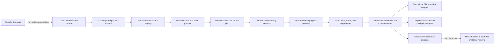

# Research Source Coverage and Shared Discovery Design

Date: 2026-07-13

Status: Approved architecture; the 235-row inventory contract and TASK-12971 secure-hop prerequisite are delivered

Program: TASK-12968

Design task: TASK-12968.1

Related work: TASK-12964, TASK-2336, TASK-2338, TASK-12968.5, TASK-12968.6, TASK-12968.7, TASK-12970, TASK-12971

Security follow-up: TASK-12969

Coverage seed: https://www.sourclip.com/resources/research-sources

## Executive Summary

tldw should offer a broad, product-owned catalog of research sources and use one discovery execution path for standalone Search and new Deep Research runs. The current implementation does neither: the discovery catalog is limited to eight entries, execution is capped at eight selected sources, and Deep Research still uses a separate arXiv, PubMed, and Crossref academic path.

This design replaces provider-by-provider expansion with a catalog-first model:

- A frozen, non-runtime inventory records every resource captured from the Sourclip research-sources page.
- A project-owned runtime registry models user-facing sources separately from access routes and physical backends.
- A pure planner compiles explicit, preset, category, automatic, or legacy selection into a versioned effective plan.
- A shared, policy-enforcing egress gateway, durable attempt journal, and side-effecting executor perform physical requests, coalesce compatible aggregator calls, and report truthful budgets and partial outcomes.
- Standalone Search and new Deep Research runs share planning, execution, normalization, attribution, and status contracts while retaining separate persistence lifecycles.
- Initial public-source support is metadata and snippet discovery only. Returned URLs are inert. Page retrieval, credentialed APIs, and authenticated browser sessions are later and separately gated work.

Sourclip is an input to a dated coverage audit. It is not a dependency, catalog service, synchronization target, or site to mirror.

## Relationship to Existing Designs

This document supersedes the catalog-expansion, source-selection, execution, and Deep Research integration assumptions in `Docs/superpowers/specs/2026-06-20-research-source-discovery-chokepoint-design.md`.

It does not supersede TASK-12964 or the existing Media handoff boundary. TASK-12964 continues to own reviewed HTML full-text handoff into Media. Research Discovery does not create Media rows, chunks, embeddings, or permanent library content.

TASK-12969 independently owns remediation of the current global plaintext web-scraping cookie mechanism. Credentialless structured discovery may proceed only after proving that it cannot reach that mechanism. Credentialed or browser-based retrieval is blocked on TASK-12969.

## Problem Statement

The existing work narrowed the intended goal in several ways:

- `ResearchSourceCatalog` exposes only eight sources and enforces an eight-source selection cap.
- The standalone API schema permits more source IDs than the executor can actually run.
- Deep Research bypasses the discovery catalog and uses a separate academic provider set.
- Existing provider helpers are scattered and do not constitute certified product support.
- The current source model conflates a requested product source with the adapter or aggregator that performs a request.
- The router launches work per selected source, so multiple source labels can duplicate one aggregator request.
- Results can be force-labeled with the requested source even when the aggregator query was not source-constrained.
- Current Deep Research accounting increments a logical search counter without representing physical provider requests.
- Public scraping paths can reuse global cookies and browser behavior that are inappropriate for credentialless discovery.

The target is not merely a larger `/sources` response. A source counts as supported only when a user can select it on its declared surface, execution uses a certified route, provenance is truthful, and failures are visible.

## Goals

- Account for every resource in a frozen capture of the referenced research-sources page.
- Make every feasible credentialless source available through direct, validated aggregator, or metadata/link-only search.
- Support substantially more than eight catalog targets and prove end-to-end execution across at least twelve routable targets.
- Include bioRxiv and medRxiv in the first post-foundation source family.
- Share discovery planning and execution between standalone Search and new Deep Research runs.
- Keep source identity, access route, physical backend, and observed content origin separate.
- Preserve legacy standalone behavior, durable Deep Research evidence IDs, and active legacy run behavior.
- Return deterministic effective plans, truthful physical budgets, typed partial outcomes, and explainable selection decisions.
- Keep user queries, results, snapshots, and run artifacts owner-scoped.
- Expand in small, independently certifiable route-family batches.

## Non-Goals

- Mirroring Sourclip content or scraping it at runtime.
- Blindly sending every query to every catalog entry.
- Treating a provider helper, catalog row, fixture, or empty live response as shipped support.
- Building a general crawler in the initial public-source phase.
- Dereferencing result URLs during phase-one discovery.
- Automatically ingesting discovery results into Media.
- Replacing Deep Research local-corpus or generic-web lanes in the first bridge.
- Migrating every provider-specific by-ID, raw-response, or ingestion endpoint.
- Implementing credentialed APIs, persistent authenticated browser sessions, automated CAPTCHA handling, or anti-bot evasion in this program.

## Architectural Overview

The planner, normalizer, attribution logic, identity logic, and budget state transitions are pure. Network execution is not pure and is isolated in the injected executor. Persistence and HTTP response mapping remain consumer-owned wrappers.

## Identity and Origin Model

The word `source` currently has incompatible meanings. This design uses explicit identities:

| Identity | Meaning | Stability rule |
| --- | --- | --- |
| `inventory_id` | One row in the frozen external seed manifest | Stable within the captured manifest |
| `catalog_source_id` | Canonical user-facing research target | Stable; aliases and tombstones preserve old names |
| `route_id` | One configured way to search a source | Versioned with its route policy |
| `backend_id` | Physical external service receiving a request | Stable across sources sharing that backend |
| `attempt_id` | One planned logical route attempt | Deterministic from the frozen plan, focus/query, and route |
| `dispatch_id` | One physical request dispatch, including an allowed retry | Unique within the durable attempt journal; never reused after an indeterminate dispatch |
| `discovery_result_id` | One normalized discovery candidate | Independent of route ordering and primary provider choice |
| canonical document fingerprint | Cross-provider identity based on stable identifiers and normalized content identity | Never includes route, backend, or selected source |
| legacy evidence `source_id` | Existing Deep Research evidence-record ID | Preserved byte-for-byte for compatibility |

A candidate can carry multiple `catalog_source_ids` and multiple provenance records. Coalesced results use `primary_provenance` plus `merged_provenance[]`. An aggregator result is attributed to a requested source only when its route-specific predicate matches. Ambiguous results are never force-stamped as that source.

The V2 canonical document/result fingerprint is additive. The current standalone `DiscoveryResult.result_id` and durable Deep Research evidence IDs remain opaque compatibility projections and are not silently recomputed; cutover code may expose both identities until downstream consumers migrate.

Origins are distinct provenance fields:

- `transport_origin` is the scheme, host, port, redirect chain, and validated peer observed by the gateway for the provider response.
- `reported_document_origin` is an untrusted, normalized origin reported by the provider for a candidate document. It is not evidence that tldw fetched that document.
- `retrieval_observed_origin` is populated only by a future approved retrieval path after an actual fetch. It is absent during phase-one discovery.

## Frozen Seed Manifest and Coverage Ledger

The program creates a checked-in, machine-readable JSON seed manifest from a dated capture of the referenced page. It stores only the factual inventory needed for reconciliation: captured label, URL, stable row ID, first-seen position, source category placements, capture date, and content digests. It does not copy descriptions, editorial prose, or page structure.

The frozen contract is checked in under `Docs/Design/research_source_inventory/`:

- `sourclip-research-sources-2026-07-13.json`: 235 ordered source rows and 418 placements across 12 captured category labels
- `research-source-coverage-ledger-2026-07-13.json`: exactly one orthogonal coverage row per manifest row
- `research-source-inventory.schema.json`: exercised Draft 2020-12 shape and conditional contract
- `research-source-inventory-freeze-report-2026-07-13.json`: deterministic semantic-validation report

The source page was captured at `2026-07-14T05:18:04Z`, which is 2026-07-13 in the project timezone. Its raw page SHA-256 is `170f16c7bbb34a41d3a1f5ed33e3e411d38288dbc9b9cd636b31d005c1fb0221`; the canonical ordered-row digest is `cef8c83a2f6cf0640d88e6300f54205363654d800927263c2d918060e6a28339`. Raw external page content is intentionally not checked in.

Each manifest row has an orthogonal ledger record. The reviewed snapshot contains 191 mapped credentialless rows, 35 credentialed exclusions, seven policy blocks, one not-applicable row, and one technically infeasible row. These are planned classifications, not shipped support:

| Dimension | Required values or behavior |
| --- | --- |
| Canonical resolution | `unreviewed`, `mapped`, `duplicate`, `not_applicable`, `credentialed_out_of_scope`, `policy_blocked`, or `technically_infeasible` |
| Resolution code | One resolution-specific machine code; generic free-form exclusion codes are invalid |
| Route kinds | Zero or more of `direct`, `aggregator`, `site_search` |
| Route query semantics | `general_free_text`, `structured_query`, `identifier_lookup`, `recent_feed`, `date_interval`, or `category_browse`, recorded per route |
| Source constraint and attribution | Native corpus, provider source filter, or provider domain filter plus its attribution basis; every aggregator route includes a typed provider field/operator/value predicate |
| Capabilities | Search, detail, metadata, snippet, future retrieval, future ingestion |
| Declared surfaces | Standalone Search, Deep Research, or both |
| Delivery state | `planned` or `implemented` |
| Fixture state | `not_run`, `passed`, or `failed` |
| Live state | `not_run`, `current`, `expired`, or `failed` |
| Canonical targets | Exactly one stable `catalog_source_id` for a mapped row; zero or one for a reviewed exclusion |
| Evidence | Route documentation, policy evidence, duplicate target, or blocker evidence |
| Ownership | Reviewer, follow-up task, review date, and revisit trigger where applicable |
| Credentialless review | Credentialed exclusions record reviewed outcomes for direct, aggregator, and site-search alternatives |
| Closure approval | Separate, digest-bound owner approval required before an exclusion can count toward inventory delivery |

Route kind, credential requirement, query mode, source constraint, capability, delivery, certification, and disposition are not one enum. Each route candidate binds its globally unique ID, route kind, planned backend, credential requirement, query modes, source constraint, optional typed source predicate, attribution basis, coverage notes, and official HTTPS evidence. Native routes require a null predicate; aggregator routes require the exact provider field, operator, and values used to constrain and audit attribution. Canonical targets are declared in a project-owned table and cross-checked against every referencing row. A source may be search-only through both direct and aggregator routes.

`mapped` means that the row resolves to a canonical product target and has a reviewed, credible credentialless route candidate. It does not mean implemented, ready, fixture-certified, or live-certified. Generic `deferred` is deliberately not a valid disposition because it would make the closure denominator gameable.

Contract freeze is an explicitly attestational design checkpoint: the validator can prove document shape, digests, route semantics, reconciliation, and the identity of the reviewer that the operator chose to trust, but it cannot mechanically prove an Internet claim is true. The CLI therefore requires one or more explicit `--trusted-reviewer` inputs, records them in the report, and leaves the contract gate false for merely self-named reviewers. Route truth is subsequently tested by typed fixture, live, and policy certification and by human review; the contract-freeze result is never presented as live support.

Validation exposes three independent results:

1. `structurally_valid`: schema, digests, exact 235-row reconciliation, typed fields, and cross-document references pass.
2. `contract_freeze_ready`: every row is substantively reviewed as mapped or as a typed, evidenced exclusion; planned mapped routes are allowed.
3. `inventory_delivery_ready`: every mapped credentialless route is implemented and currently fixture/live certified on every declared surface, while each exclusion has a digest-bound closure approval.

`inventory_delivery_ready` is deliberately not called program closure. Final TASK-12968 closure additionally consumes runtime-registry reconciliation, child and dependency state, gateway and security verification, cross-surface UAT, and the twelve-target execution proof. The inventory validator cannot establish those facts by itself.

The authoritative CLI composes Draft 2020-12 validation with format checking and semantic validation. Its report records the schema digest, schema-validator digest, semantic-validator digest, explicit `as_of` date, trusted reviewer IDs, trusted approval references, manifest digest, ledger digest, and row digest. A missing schema runtime, unexpected subprocess exit, or unparseable certification artifact is a hard structural failure, not a skipped check.

The runtime registry is not generated from the live Sourclip page. The checked-in ledger and runtime registry are reconciled by tests, but project-native sources not present in the seed remain valid.

### Closure Query

The frozen program denominator never moves. Later changes to the external page become separate delta tasks.

A mapped credentialless row is terminal for row-level inventory delivery only when:

1. Its declared user surfaces are implemented.
2. Fixture certification passes.
3. Current, non-empty live certification evidence exists for every ready route/source mapping.
4. User-visible readiness and provenance are correct.

`unreviewed`, `planned`, catalog-only, fixture-only, and manually listed rows do not count as supported. Duplicate, not-applicable, credentialed-out-of-scope, policy-blocked, and technically-infeasible outcomes require a resolution-specific code, typed HTTPS evidence, a trusted named reviewer, and an explicit revisit rule where circumstances can change. A reviewed exclusion can freeze the design contract, but it counts toward inventory delivery only after separate owner approval binds the exact decision digest, post-dates the row review, references that row's follow-up task, and the caller explicitly supplies that already-verified reference through `--trusted-approval`. Credentialed-out-of-scope also records direct, aggregator, and site-search review outcomes; it remains eligible for a separately approved future credentialed program.

## Runtime Source Registry

The product-owned registry contains static source and route declarations. Per-user and per-deployment readiness is computed as an overlay and is not hard-coded into the registry.

### Source Entry

A source entry defines:

- stable ID, display name, aliases, tombstones, and categories
- supported content types and product surfaces
- capability matrix for search, detail, metadata, future retrieval, and future ingestion
- ordered route IDs
- product trust notes and attribution requirements
- catalog version

Legacy `site_hosts` metadata is descriptive and is not an outbound route allowlist. API, feed, and aggregator origins are declared on exact route policies because the physical provider host frequently differs from the user-facing source host.

### Access Route

An access route defines:

- route ID, route kind, backend ID, adapter, and fallback order
- route-level query modes, exact coverage scope, source constraint, and attribution basis
- exact normalized host, scheme, port, method, path template, and permitted query shape
- result attribution predicate and confidence basis
- supported outputs and representation-level retention ceiling
- rate, concurrency, retry, timeout, and response-size limits
- robots behavior for site routes only
- provider terms and project policy review metadata
- credential requirement and rollout state
- immutable policy content digest

Source entries do not store credentials. A source may have multiple routes, and one aggregator route may serve multiple sources.

### Runtime Readiness Overlay

Readiness is computed separately from catalog maturity:

- `ready`
- `disabled`
- `policy_blocked`
- `uncertified`
- `certification_expired`
- `unhealthy`

Credential requirement and credential status are separate fields. Phase-one enabled routes use `credential_requirement=none` and `credential_status=not_required`. Credentialed future entries remain `credentialed_out_of_scope` for this program even if an administrator has configured a matching key. Ordinary users must not learn whether such a secret exists.

## Selection Contract

Legacy and canonical selection are separate contracts.

### Legacy Requests

If the new canonical `selection` object is absent, standalone Search preserves the characterized legacy behavior, including the union of top-level `source_ids` and `categories` and the immutable `legacy_default_v1` fallback. Existing empty and omitted inputs must not silently become automatic selection.

The compatibility contract for the current request schema is:

| Legacy input when canonical `selection` is absent | Required behavior |
| --- | --- |
| both fields omitted | Resolve `legacy_default_v1`, currently category `open_research_graph` in registry priority order: OpenAlex, Semantic Scholar, then Crossref |
| `source_ids=[]` and `categories=[]` | Same immutable legacy default |
| either list contains only whitespace or empty strings | Strip empty values; if both normalized lists are empty, use the legacy default |
| non-empty `source_ids` only | Normalize IDs, deduplicate them, and resolve the explicit set |
| non-empty `categories` only | Normalize categories and expand them in registry priority order |
| both lists non-empty | Resolve their union, deduplicate by catalog source ID, and preserve registry priority order |
| duplicate IDs or categories | Deduplicate without creating duplicate route attempts |
| explicit `null` for either list at the HTTP boundary | Fail request-schema validation; do not reinterpret it as omitted or empty |
| unknown source ID or category | Return the existing typed bad-request selection error |
| either raw list contains more than 20 entries | Fail request-schema validation before resolution |
| resolved union contains more than 8 sources | Return the existing `source_selection_over_cap` error |

`Docs/Design/research_source_inventory/research-discovery-legacy-selection-v1.json` freezes the request-validation, normalization, defaulting, union, ordering, cap, exception, and HTTP-status cases in this table. Its focused characterization test must pass before TASK-12968.1 completes. Canonical selection does not alter it.

### Canonical Requests

New clients send one typed `selection` object:

- `explicit`: non-empty source IDs
- `preset`: one versioned preset ID
- `category`: one or more categories forming a bounded candidate pool
- `auto`: deterministic query-relevant preset selection

The object is mutually exclusive by mode. Presence with `null` is invalid. Presence alongside any legacy selector field is a conflict based on field presence, even when the legacy list is empty. Unknown fields fail validation.

Automatic selection is rule-based and versioned. It considers query taxonomy, content type, recency, route readiness, source trust, and the execution budget. It never fans out over the entire catalog. Selected and skipped reasons are ordered and persisted.

### Effective Plan Preview

The API exposes a storage-neutral dry run that reports:

- selected catalog targets and selection reasons
- resolved routes and fallbacks
- actual external backends that would receive query text
- coalesced physical request count
- unavailable, irrelevant, policy-blocked, and budget-skipped targets
- catalog, preset, planner, route, and policy versions
- aggregate ceilings and estimated external disclosure

The executed plan is immutable. Current kill switches and policy revocation may still stop a planned attempt before dispatch or persistence.

## Planner, Executor, and Budget Contract

### Pure Planner

The planner:

- resolves selection against a versioned registry and readiness overlay
- compiles parameterized route attempts with fixed source constraints
- groups identical backend, query, parameter, and credential-scope requests
- reserves deterministic budget before concurrent work
- emits stable attempt IDs and ordered fallback relationships
- records skipped reasons without treating them as failures

### Shared Executor

The executor:

- receives only a frozen plan and injected adapters
- performs all outbound I/O through the shared egress gateway
- executes bounded waves with backend and per-user fairness limits
- emits route-attempt outcomes and physical usage
- never persists standalone snapshots or Deep Research artifacts directly
- never invokes API endpoints from other API endpoints

### Attempt Journal and Crash Semantics

The executor receives an `AttemptJournal` interface. Standalone Search may use an owner-scoped in-memory implementation because its request is not resumable. Deep Research uses a durable implementation tied to the run checkpoint.

For every physical dispatch, the Deep Research coordinator:

1. Transactionally persists the logical attempt, a unique `dispatch_id`, and the physical-request budget debit in `reserved` state.
2. Persists `dispatching` before handing control to the gateway.
3. Persists a terminal outcome and measured usage after the gateway returns.

A `reserved` dispatch that never reached `dispatching` may be resumed using its existing reservation. A `dispatching` record without a terminal outcome after recovery becomes `indeterminate_after_dispatch`: it remains charged because the provider may have received the request, its result content is unavailable, and it is not retried automatically. A retry is permitted only when the route declares provider-supported idempotency or the frozen policy explicitly accepts possible duplicate external work. Every such retry receives a new `dispatch_id` and a new physical-request debit.

The system promises durable accounting and no automatic replay of terminal or indeterminate dispatches. It does not promise exactly-once external calls for providers without idempotency support.

### Budget Units

Budgets distinguish:

- logical queries
- route attempts
- physical backend requests
- retries and redirects
- returned candidates
- future fetched documents
- wire and decompressed bytes
- wall time
- provider quota or monetary quota where applicable

Retries, failures, and redirects consume the same aggregate ceiling. Existing Deep Research `max_searches`, which counts focus-area work, is not reinterpreted as a provider-request budget. New counters are versioned and additive.

`no_results` is a successful route outcome. A total timeout returns completed outcomes and typed unfinished statuses rather than discarding partial work.

## Status and Provenance

Three status layers remain distinct:

1. Catalog disposition and implementation maturity.
2. Runtime readiness for the current deployment and user.
3. Execution outcome for an attempt.

Attempt lifecycle states include planned, reserved, dispatching, terminal, and indeterminate-after-dispatch. User-visible execution outcomes include planned, policy-skipped, budget-skipped, irrelevant-skipped, started, no-results, succeeded, partial, rate-limited, timed-out, provider-error, internal-error, cancelled, `indeterminate_after_dispatch`, and fallback-used.

Every result records requested catalog targets, route ID, backend ID, gateway-observed `transport_origin`, untrusted `reported_document_origin`, optional future `retrieval_observed_origin`, attribution basis, catalog and adapter versions, policy digest, request time, cached state, and normalized identity. External provider fields cannot override identity, policy, route, credential, trust, or retention fields.

## Standalone Search Integration

Standalone Search wraps the shared outcome in the existing owner-scoped TTL snapshot lifecycle. The wrapper owns API error mapping and snapshot persistence.

Cutover occurs only after golden characterization of:

- omitted and empty selectors
- explicit sources and categories
- result ordering and primary attribution
- source status and warning shapes
- error handling and physical provider-call counts
- serialized snapshot compatibility

The new selection contract remains opt-in until API, UI, and cross-surface tests pass. The existing default is not silently changed.

## Deep Research Integration

Deep Research keeps `lane_policy` separate from `discovery_selection`. The initial bridge replaces only external academic collection. Existing local-corpus and generic-web lanes retain their characterized behavior.

### Canonical Run Envelope

New shared-discovery runs validate and persist a canonical envelope before enqueueing. It contains:

- schema and engine version
- lane policy
- canonical discovery selection or translated legacy origin
- catalog, preset, planner, adapter, route-policy, and budget-policy versions
- effective source IDs and immutable plan hash

Canonical selection presence disables legacy translation. A `null` canonical object fails validation. Canonical and legacy selector fields conflict by presence. The stricter rules apply to the new object without retroactively breaking unrelated legacy override behavior.

Already-active sessions remain on the legacy engine until terminal. New sessions use explicit engine-version dispatch. Resume never retranslates an old run against a newer catalog.

### Checkpoint and Resume

The coordinator persists the effective plan before collection, writes each pre-dispatch reservation and physical debit durably, and persists terminal outcomes as each bounded wave progresses. Resume excludes terminal attempts and does not charge them again. A recovered `reserved` dispatch may continue under its existing debit; a recovered `dispatching` record becomes charged `indeterminate_after_dispatch` and is not replayed automatically. Current route revocation is checked before every request and immediately before result persistence.

Revocation may suppress candidate content, but it never removes accounting truth. The coordinator always persists a sanitized attempt tombstone, policy decision, dispatch state, and physical usage debit. Resume cannot turn a revoked or suppressed call into free retry work.

Standalone and Deep Research parity means that the same frozen execution request and fixtures produce the same normalized identity, attribution, route trace, and status projection. It does not require their endpoint envelopes or persistence IDs to match.

### Cancellation Dependency

TASK-12968.4 is blocked on TASK-12970, which owns cooperative Jobs cancellation and partial-result finalization. Cancellation is cooperative rather than preemptive: a thread-backed provider call may finish after cancellation is requested, but bounded gateway work must stop at its timeout, late candidate content must not be committed, and the sanitized attempt tombstone plus physical usage remain durable. This program makes no cancellation-correctness claim until TASK-12970 is complete and its integration tests pass.

## Security and Trust Boundaries

### Phase-One Metadata Boundary

Structured and aggregator routes return normalized metadata and bounded snippets only. Result URLs are inert display data.

Phase-one request schemas do not accept arbitrary retrieval URLs, full-text fetch flags, cookies, custom headers, proxies, credentials, browser options, or Playwright controls. Unknown fields are rejected. Provider timeout, denial, rate limit, malformed data, and empty results produce typed statuses and never invoke generic fetch, Media ingestion, article extraction, browser automation, or fallback scraping.

Deep Research synthesis receives normalized metadata and snippets only. No returned result URL is dereferenced.

### Shared Egress Gateway

Every structured API, feed, aggregator, robots request, redirect, and future site request uses one injected gateway. Adapters may not create sockets, independent HTTP clients, or default SDK transports. SDKs are usable only when their transport can be replaced.

One gateway call represents one physical HTTP hop. The planner/executor reserves each initial request, allowed redirect hop, and allowed retry separately and assigns a fresh `dispatch_id` before dispatch; the gateway never hides automatic retry or redirect loops. This is required so the durable attempt journal can distinguish known-unused reservations from indeterminate post-dispatch work.

The gateway:

- normalizes and validates scheme, host, IDNA form, port, method, path template, and query shape
- rejects userinfo, ambiguous IP forms, mixed public/private answers, private and reserved address space, metadata endpoints, and undeclared redirect destinations
- resolves each hop, connects only to a validated address while preserving Host and SNI, and verifies the connected peer
- disables automatic redirects and reapplies policy before each hop
- sets `trust_env=false` and ignores environment proxies, `.netrc`, ambient cookies, client certificates, and injected authorization
- streams into aggregate wire and decompressed byte ceilings
- bounds headers, redirects, retries, time, concurrency, response depth, decoded characters, and parser work
- emits sanitized, bounded errors and redacted telemetry

The existing `afetch_json` helper is not accepted as this gateway merely by wrapping it: it currently lacks connected-peer verification/connect-to-validated-address behavior and applies its body limit after materializing response content. TASK-12971 owns the reusable secure one-hop primitive that closes those gaps. TASK-12968.2 consumes it when building the discovery gateway and executor; it does not reimplement the primitive.

TASK-12971 delivers that boundary as `tldw_Server_API.app.core.Security.http_hop.request_http_hop`, accepting one `NormalizedHTTPHopRequest` with explicit `HTTPHopLimits` and returning one bounded `HTTPHopResponse` or a sanitized `HTTPHopError`. Its focused contract is checked by `tldw_Server_API/tests/Security/test_http_hop_contract.py`, `tldw_Server_API/tests/Security/test_http_hop_transport.py`, and `tldw_Server_API/tests/Security/test_http_hop_streaming.py`. TASK-12968.2 must import this public boundary rather than the private deterministic test seams or any legacy client.

Static dependency-boundary enforcement rejects direct networking imports, socket use, client construction, and SDK default transports anywhere in adapters enabled by the V2 route registry. Legacy production adapters remain an explicitly characterized compatibility path until TASK-12968.3 cuts standalone Search over; they are not falsely claimed as gateway-backed by TASK-12968.2. The gateway implementation and any exceptional compatibility shim are the only V2 allowlisted locations. Each exception requires a named security reviewer, a narrow documented reason, and a test proving the same gateway policy is still applied. Runtime recording tests complement this static gate by exercising every V2-enabled adapter and denying ambient networking.

### Route Policy and Revocation

Catalog policy is admin-controlled, schema-validated, versioned, audited, and atomically published. User requests and provider responses may narrow behavior but cannot broaden hosts, limits, trust, retention, or credentials.

Robots behavior, provider terms, rate limits, license assertions, and retention are separate decisions. Robots rules are not treated as access authorization. Provider-reported license or open-access values are assertions and cannot upgrade storage policy.

Every status, snapshot, and artifact records the immutable policy digest used for execution. Current global, source, route, and access-mode revocation overrides a frozen plan before dispatch and before candidate-content persistence. A revoked result is replaced by a sanitized audit tombstone while its attempt state and physical usage debit remain durable. A malformed or partially published policy update fails closed.

### Query Privacy

The effective plan tells the user which physical backends receive query text. Remote routes receive only the minimum search representation, never local evidence, unrelated conversation context, user IDs, run IDs, JWTs, cookies, trace IDs, or secret material from surrounding state.

Queries and provider response bodies are excluded from metrics and bounded operational errors. Owner-scoped snapshots and result IDs cannot be resolved by another user. Shadow rollout uses synthetic or explicitly opted-in queries only.

### Untrusted External Data

All provider and page data is untrusted. External fields populate schema-validated data fields only and cannot control route selection, limits, trust, policy, filenames, storage, tools, or prompts outside delimited evidence blocks.

Synthesis receives no tools, browser state, secrets, or network-capable callbacks. Rendered Markdown, HTML, URLs, and log fields are sanitized. Citation validation distinguishes deterministic referential integrity from probabilistic semantic support; an existing citation ID is not presented as proof that a claim is true.

### Retention

Storage policy is applied per representation and provenance record:

- `metadata_only`: schema-approved provider metadata and bounded provider snippets only; no raw response body, fetched full text, or unapproved derived artifact
- `derived_text`: future bounded transient raw bytes are discarded after extraction; excerpt rules remain route-specific
- `snapshot_allowed`: future explicit policy basis, attribution, TTL, and deletion behavior are required

Merging never upgrades retention. Combined artifacts inherit the most restrictive applicable policy. Phase one uses `metadata_only`.

### Credentialed and Browser Retrieval

Credentialed APIs are a later program. Authenticated browser retrieval is later still. It requires encrypted per-user opaque secret references, explicit source origin sets, isolated user-scoped browser contexts and artifacts, revocation and TTL, manual MFA/CAPTCHA handoff, and no bypass or stealth behavior.

The current global plaintext cookie mechanism is prohibited and tracked by TASK-12969.

## User Experience

The coverage ledger and the runtime picker are different surfaces. The picker defaults to ready, selectable sources. Unreviewed, planned, credentialed-out-of-scope, or unavailable catalog entries may be inspected with a reason but are never presented as supported.

The source-control experience must remain usable across the complete 235-row frozen inventory while clearly distinguishing the 191 currently mapped credentialless targets from credentialed or blocked entries:

- searchable and filterable source list
- grouped categories and versioned presets
- explicit mode and selected-count summary
- keyboard-operable selection and non-color-only state labels
- inline effective-plan preview rather than a blocking modal
- direct, indirect, and search-only capability labels
- actual external backend disclosure
- clear selected, attempted, skipped, failed, and successful-with-no-results states
- retained partial results and recovery guidance when one source fails
- responsive behavior without hiding provider, policy, cost, or readiness state

The UI explicitly sends canonical automatic selection. It does not depend on changing the API's absent-field legacy default.

## Certification and Testing

### Static and Unit Tests

- Frozen manifest digest, stable row IDs, and exact ledger reconciliation
- Exact 235-row and 418-placement lock, recursive sorted-key canonical digests, and deterministic validation-report reproduction
- Separate structural, contract-freeze, and inventory-delivery gates; an all-unreviewed ledger fails the contract gate
- Adversarial fixtures prove that blanket exclusions, arbitrary evidence strings, fake routes, malformed dates, missing certification files, and digest drift cannot pass a readiness gate
- Registry aliases, tombstones, referential integrity, policy digests, and closure query
- Legacy selection truth table and canonical conflict validation
- Pure planner determinism and property tests for budget reservation
- Attempt-journal state transitions, durable pre-dispatch debits, and indeterminate recovery
- Canonical fingerprint stability across route reordering and provenance merging
- Aggregator filter, attribution, ambiguity, and physical-call coalescing
- Status, partial-failure, and all-failure matrices

### Provider Contract Fixtures

Every route family includes sanitized fixtures for:

- success with known records
- valid empty results
- pagination
- rate limiting and retry metadata
- timeout and cancellation
- authentication denial where relevant to a credentialed-out-of-scope route
- malformed data and schema drift
- missing, ambiguous, and nonmatching attribution
- provider errors that echo unsafe request or response content

Fixtures build normalized records through canonical constructors so impossible states cannot be encoded.

### Security Tests

- Tripwire result URLs receive zero requests from both consumers
- Provider failures make zero calls to fetch, Media, Playwright, cookies, secrets, and legacy scraping
- Every enabled adapter appears in the recording gateway and no independent network call occurs
- Static dependency-boundary checks reject adapter networking imports, client construction, sockets, and unreviewed exceptions
- Public-to-private redirects, mixed addresses, DNS rebinding, alternate ports, redirectors, and URL-proxy parameters cannot expand the route set
- Environment proxies, `.netrc`, configured provider keys, client jars, and legacy cookies are not transmitted
- Capture providers receive the allowed query marker but no user, run, local-note, token, cookie, or tracing markers
- External prompt-injection fixtures cannot invoke tools or fabricate resolvable citation IDs
- Policy changes invalidate relevant cache entries and old results cannot authorize new network activity

### Cross-Consumer Tests

- Real standalone and Deep Research entry points receive the same frozen execution request and produce equivalent normalized execution projections
- A process interruption after a terminal persisted route proves no repeat call, duplicate charge, or catalog reinterpretation on resume
- A process interruption after durable `dispatching` but before terminal persistence produces one charged `indeterminate_after_dispatch` record and no free or automatic retry
- Existing active Deep Research fixtures remain on the legacy engine
- A controlled request selects at least twelve routable catalog targets and proves physical-request coalescing beyond the old cap

### User-Facing E2E Tests

Controlled-backend journeys prove that a user can:

- search and filter the large catalog
- preview selection and budget before running
- understand readiness and direct versus indirect coverage
- retain partial results when one source fails
- inspect merged provenance without confusing the aggregator with the requested source
- configure and resume the same source intent in Deep Research
- see unavailable sources disabled with actionable reasons

### Live Certification

Live checks are opt-in and never required for ordinary PR CI or startup. They are mandatory before a source-route mapping is labeled ready.

Certification uses an approved endpoint, synthetic known query or record, one bounded non-empty result, the production egress gateway, no credentials for phase one, no result-link dereference, and no fallback access mode. Checked-in, sanitized fixture, live, and policy artifacts use the exercised `research-source-certification-artifact.v1` schema and bind route, canonical source, surface, route snapshot digest, route-policy content digest, catalog and policy versions, observation time, result, and type-specific evidence. The policy artifact records exact allowed methods, URL prefixes, and transport origins plus credential, gateway, and dereference invariants; the live artifact must match that policy, attest gateway use, and report zero result-link dereferences. Final program closure also reconciles the certified policy digest to the production runtime registry because an inventory artifact cannot independently prove deployment state. Their repository-relative paths must resolve to regular non-symlink files inside the certification directory, their raw-byte digests must match, and all three artifact paths must be distinct. Certifications expire within at most 90 days; empty JSON, zero-result live checks, unrelated endpoints or origins, arbitrary version strings, reused evidence, and unbounded validity windows fail inventory delivery.

Each route declares its certification validity window. Expired or missing evidence produces `uncertified`, not ready. Skipped, failed, and executed live checks are reported separately.

## Rollout and Cutover

1. **Design and frozen inventory contract**
   - Complete this specification.
   - Check in the dated machine-readable seed manifest with exact row count and content digest.
   - Check in the ledger schema, initial reconciled ledger, and executable validator contract.
   - Substantively triage every row; all-unreviewed or generic-deferred ledgers fail the contract gate.
   - Freeze the exact legacy truth table and golden compatibility fixtures.
   - TASK-12968.1 is complete; runtime work remains gated on downstream task prerequisites.

2. **Gateway and execution foundation for the existing catalog**
   - Characterize current behavior before changes.
   - TASK-12971 is delivered; consume its public `request_http_hop` boundary.
   - Add the shared egress gateway and injected adapter boundary.
   - Introduce source, route, backend, attempt, budget, and provenance contracts.
   - Exercise the V2 executor against frozen fixtures and synthetic or explicitly opted-in queries only; do not production-double-fetch legacy queries before consumer cutover.

3. **First credentialless route-family foundation**
   - Complete TASK-12968.5 for bioRxiv and medRxiv after the shared gateway foundation.
   - Complete TASK-12968.6 for ClinicalTrials.gov and PubMed Central in parallel.
   - Implement and fixture-certify adapters in shadow mode without claiming consumer-surface readiness.
   - Keep general-query routes distinct from recent, date, category, OAI, and identifier-only routes.

4. **Standalone Search cutover and large-catalog controls**
   - Preserve absent-field legacy behavior.
   - Expose canonical selection and effective-plan preview.
   - Certify the first twelve targets on Standalone Search and prove usable controls across the 235-row frozen inventory and its ready subset.

5. **New-session Deep Research bridge**
   - Complete TASK-12970's cooperative Jobs cancellation and partial-finalization primitive first.
   - Freeze the canonical run envelope before enqueue.
   - Replace external academic collection only.
   - Add durable attempt-journal checkpoint/resume, indeterminate recovery, and cross-consumer parity.

6. **Credentialless route-family waves**
   - Add direct and aggregator mappings in independently reviewable batches.
   - Add later source-batch tasks from the frozen ledger after the first two route families.
   - Each route-family batch owns adapter code, route fixtures, and ledger updates. Consumer cutover tasks own surface integration and surface-specific live certification; later batch tasks may bundle both only when their scope explicitly says so.

7. **Metadata and link-only fallback**
   - Structured web-index mappings may return site-scoped metadata.
   - Direct site listing/search routes use the gateway and route policy.
   - Discovered links remain inert.

8. **Optional HTML retrieval canary**
   - Requires the approved retrieval decision and all Design 5 security gates.
   - Starts with one default-off text/HTML route.
   - Does not satisfy or replace TASK-12964's Media handoff.

9. **Future credentialed and browser programs**
   - Credentialed APIs require a separate design and task family.
   - Browser work depends on TASK-12969 and a separate security review.

No task or pull request both adds a provider family and migrates a consumer contract.

## Backlog Structure

- **TASK-12968**: parent program and final closure audit
- **TASK-12968.1**: approved design and frozen inventory contract
- **TASK-12968.2**: gateway and execution foundation for the existing catalog
- **TASK-12968.3**: standalone Search cutover and large-catalog source controls
- **TASK-12968.4**: new-session Deep Research bridge
- **TASK-12968.5**: bioRxiv/medRxiv route-family foundation after the shared gateway
- **TASK-12968.6**: ClinicalTrials.gov/PubMed Central route-family foundation after the shared gateway
- **TASK-12968.7**: verify and harden the already API-key-gated OpenAlex inventory evidence before TASK-12968.2
- Future child tasks: vertical route-family batches created from the frozen ledger
- **TASK-12969**: independent global plaintext cookie remediation
- **TASK-12970**: blocking cooperative Jobs cancellation and partial-result finalization for TASK-12968.4
- **TASK-12971**: delivered reusable connected-peer-verified streaming one-hop HTTP prerequisite for TASK-12968.2
- **TASK-12964**: unchanged HTML Media handoff design outside this program's completion denominator

The parent owns cross-surface UAT and closure. Implementation, tests, documentation, and certification for a route family stay in one child rather than being split into paperwork-only tasks.

## Alternatives Rejected

### Mirror or synchronize Sourclip

Rejected because the external page is an example and coverage seed, not a product dependency. Runtime synchronization would make source availability depend on an unrelated site's markup and editorial decisions.

### Add one adapter per displayed source

Rejected because many sources share aggregators or require different routes for search, detail, and future retrieval. It would duplicate calls and create false provenance.

### Use generic web scraping first

Rejected because it creates a large security, policy, reliability, and parsing surface before structured coverage is exhausted.

### Reuse the standalone discovery service directly from Deep Research

Rejected because the current service always owns TTL snapshot persistence. The consumers should share the storage-neutral engine, not persistence or HTTP lifecycle.

### Change empty selection to automatic fanout

Rejected because it changes cost, latency, coverage, and reproducibility for existing clients. Automatic selection is explicit and versioned.

### Reuse global cookies or browser state

Rejected because the current mechanism is plaintext, global, and unsafe in multi-user deployments. Credentialless discovery is stateless and independently certified.

## Program Definition of Done

TASK-12968 may close only when:

- the frozen manifest and ledger have no missing, duplicate, or unreviewed rows
- every feasible credentialless row is shipped on its declared surfaces
- no catalog-only, unreviewed, planned, manual-only, or fixture-only row is counted as supported
- every ready route/source mapping has current live certification evidence
- the shared gateway, executor, physical budgets, attribution, provenance, and security boundaries are verified
- legacy standalone behavior, evidence IDs, and active Deep Research sessions remain compatible
- standalone and Deep Research E2E journeys pass for direct, aggregator-coalesced, partial-failure, and resume cases
- a controlled execution across at least twelve routable targets proves removal of the old eight-source execution cap
- all blocking children and dependencies are complete
- skipped live checks and intentionally blocked rows are explicitly reported rather than hidden in a generic passing result

## Immediate Next Steps

1. Complete TASK-12968.7's OpenAlex evidence verification.
2. Execute TASK-12968.2 only after TASK-12971 and TASK-12968.7 are Done, importing the public `request_http_hop` boundary.
3. Keep V2 offline until the dedicated consumer cutovers.

No TASK-12968.2 runtime implementation begins until all of its declared prerequisites are complete.
