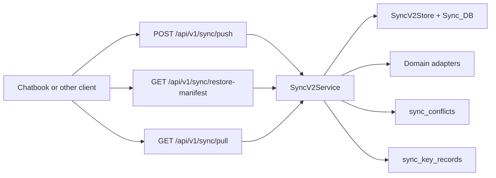

# Sync Engine Design

Date: 2026-05-10
Status: Sync v2 implementation baseline

## Purpose

Sync v2 turns the existing `/api/v1/sync` route family into the generic sync
surface for Chatbook and future clients. Chatbook remains a standalone
local-first application, but it can also register with a tldw server, push
encrypted domain envelopes, restore selected datasets on a new device, or act as
a server-front-end with no local synced dataset.

The previous media-only sync remains a compatibility route. New domains should
use Sync v2 envelopes and adapters.

## Product Modes

| Mode | Behavior |
| --- | --- |
| Standalone local | Chatbook keeps all data local. No server registration or remote writes are required. |
| Local-first sync | Chatbook stores data locally, pushes encrypted envelopes when online, pulls remote envelopes, and resolves conflicts locally. |
| Server-front-end | Chatbook is a UI to server APIs and does not maintain a local synced dataset. |

## Architecture

Core responsibilities:

- API schemas and endpoint routing live in `app/api/v1`.
- Sync service owns protocol invariants, cursor behavior, idempotency,
  metadata-only manifests, conflict lifecycle, and key-record storage.
- Store and DB helpers own durable sync tables.
- Domain adapters own entity-specific accept/reject/conflict behavior.

## Domains

V1 domains are:

- `notes`
- `chat`
- `workspaces`
- `source_cache`
- `media`

Media starts as a compatibility adapter so the old media sync semantics can be
subsumed without removing `/send` and `/get` during rollout.

## Privacy Model

Personal local-first datasets use `client_private_v1` by default. In that mode:

- private payloads are encrypted by the client before upload
- the server stores ciphertext and routing-safe metadata only
- restore manifests omit ciphertext and private dataset metadata
- key-recovery bundles are opaque wrapped key records
- logs and error details redact ciphertext, wrapped keys, KDF metadata, and
  known private payload fields

The server never needs a user's plaintext private content to support restore
preview, cursor accounting, conflict visibility, or selective pull.

## Restore Model

Restore is intentionally two phase:

1. Metadata preview with `GET /restore-manifest`.
2. Selected hydration with `GET /pull`.

The manifest includes dataset/domain counts, byte estimates, persisted
attachment availability, attachment size classes, registered device metadata,
unresolved conflict counts, encryption policy, and key-recovery readiness. A new
device can use that manifest to choose all or part of a dataset before
downloading encrypted envelopes and small encrypted attachment payloads.

## Conflict Model

Adapters classify each pushed envelope:

- accepted
- rejected with a client-visible error
- conflict, with a durable conflict record

Conflict records remain queryable until resolved or dismissed. Resolution can
store a validated resolution envelope before marking the conflict resolved.

## Rollout Notes

- Keep `/send` and `/get` working until the media compatibility path has enough
  client coverage to migrate safely.
- Do not expose UI controls that imply full sync support until the client can
  run the corresponding device, dataset, push, pull, and restore flow.
- Keep large binary replication outside V1; the first storage tranche is limited
  to small `client_private_v1` attachment ciphertext uploaded through Sync v2.

## References

- PRD: `Docs/superpowers/specs/2026-05-10-chatbook-sync-engine-prd-design.md`
- Implementation plan:
  `Docs/superpowers/plans/2026-05-10-chatbook-sync-engine-implementation-plan.md`
- API guide: `Docs/API/sync-v2.md`
- Local-first reference:
  https://marcobambini.substack.com/p/the-secret-life-of-a-local-first
- SQLite sync reference: https://github.com/sqliteai/sqlite-sync
