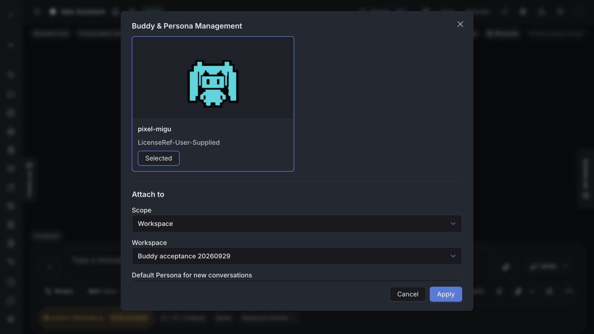
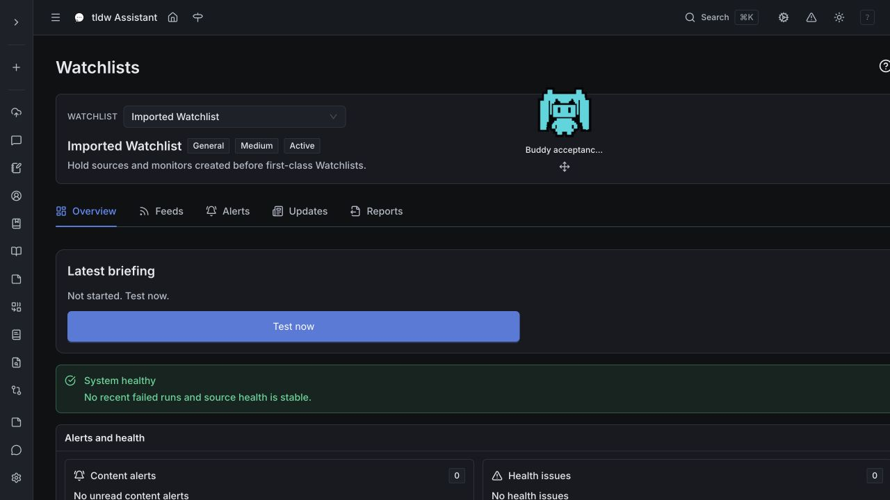

# Buddy current-dev qualification and workspace picker repair

Server base: `0da68530e80c713ed3a323a741998e1fed37e3e9`. Tasks: TASK-13395
(route repair), TASK-13227 (ongoing qualification). Existing
[ADR-005](../../backlog/decisions/005-independent-buddy-bindings-and-work-ownership.md)
applies; this routine route correction needs no new ADR.

## Reproduced blocker

The shared `listWorkspaces` method requested `/api/v1/workspaces`, while the
server collection route requires `/api/v1/workspaces/`. Real authenticated HTTP
returned 307 and 200 respectively. The transport deliberately rejects redirects,
so Buddy management's collection load failed and hid the available choices.
Correcting the shared path repairs its four callers without changing response
handling or weakening `redirect: "error"` on initial requests and retries.
Both existing contract assertions failed before the one-line production repair.

## Verification

- Workspace domain contracts: **37 passed**. Redirect security: **13 passed**.
- Buddy management and independent host components: **37 passed**. Existing
  real-route 250 ms lifecycle fixture: **1 passed**; this does not reproduce the
  historical browser incident's initiating trigger.
- Three real-loopback redirect tests initially hit sandbox `EPERM`; the complete
  redirect file passed outside the sandbox. One management test timed out twice
  during cold Next compilation, then passed in 2.2 seconds with the owned runtime
  stopped; the complete component pair also passed. No timeout was increased.
- `git diff --check` passed. Scoped ESLint diagnostics match the exact HEAD
  baseline (one existing error, 52 warnings). All three files have existing
  Prettier debt; their formatted before/after outputs differ only by the slash.
  Bandit is not applicable to this TypeScript-only repair. No full suite ran.
- Independent code review found no actionable issues.

## Real WebUI result

An isolated SQLite backend and the supported quickstart proxy ran on loopback
with mock-only generation and disposable configuration. The browser retained
pre-existing settings; this is not a fresh browser-profile qualification. An
API-seeded workspace provided the fixture; selection and attachment used the UI.

All seven starter previews loaded. Console Buddy & Persona management selected
Pixel Migu independently, kept Persona at None, and attached the workspace.
Static mode persisted through navigation from Chat to Watchlists. The Buddy
remained visible and its scoped dialog opened there. Switching back to Dynamic
persisted by HTTP; the final Buddy still has no optional Persona and the workspace
has no assistant default. Owned frontend/backend processes were stopped.

[Browser receipt](artifacts/buddy-current-dev-20260929/browser-receipt.json) and
[verification receipt](artifacts/buddy-current-dev-20260929/verification.json)
retain source hashes, screenshots and sanitized scoped results. Raw test logs
remain in the local disposable artifacts; they are not published.

## Remaining acceptance

TASK-13227 stays In Progress: installed-extension, upgraded-profile WebUI,
native Chatbook terminal and physical voice acceptance remain open. This run
does not qualify a live reply or active-run navigation; earlier evidence remains
tied to its original source. Advanced cross-origin browser connection failures
were not established; the supported quickstart transport was used successfully.
TASK-13211's original visual-load trigger remains unproven. No provider account,
microphone, audible queue playback or native drag qualification is claimed.

## PR #3056 review follow-up

Qodo found nested note/summary markers introduced by the installed JavaScript
Backlog editor. The repository parser reproduced a missing canonical notes
section and marker text parsed as the summary. Both touched tasks now have one
canonical notes/summary pair; every historical content line is preserved. Real
append-note and replace-summary edits on disposable task copies retained one
section and their original history. Further edits use the repository Python CLI.

The production Chrome extension build on `5cbca66a586b75dce43c28a39fcfaa0550a2208a`
also passed in 117 seconds. Its exported MV3 manifest and background, options,
and side-panel entrypoints were verified; build hashes are recorded on the PR.
This qualifies packaging, not installed-extension interaction. Raw logs stay local.

Rebased onto dev `6110d2ae436c805c3beeda8f84427b4890534ddf` after its database
corrections. All three reviewed commits are preserved by range-diff, and apps
sources have no base changes. Fresh checks passed 37 workspace contracts and
25 independent-Buddy backend cases; one PostgreSQL case was skipped. The
[separate rebase receipt](artifacts/buddy-current-dev-20260929/rebase-verification.json)
records these results without reattributing the earlier WebUI screenshots or
claiming fresh PostgreSQL, native or physical voice qualification.
