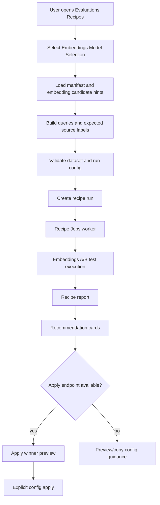

# Embeddings RAG Recipe WebUI Design

## Summary

This design upgrades the existing `embeddings_model_selection` evaluation recipe into a guided RAG-focused WebUI flow.

The goal is to make it easy for a user to answer:

- which embedding model should I use for my current RAG setup?
- how confident is that recommendation?
- can I safely apply the winning model to RAG configuration?

The first slice should improve the existing `/evaluations?tab=recipes` recipe flow. It should not create a separate embeddings A/B testing product surface, and it should not merge this task into the broader `rag_retrieval_tuning` recipe.

The extension benefits through the shared UI package because the WebUI and extension already consume the same `apps/packages/ui` Evaluations components.

## Approved Direction

Use approach 1: guided recipe upgrade.

The existing recipe framework and embeddings A/B execution path are the right foundation:

- `embeddings_model_selection` already exists as a built-in recipe.
- Recipe runs already use Jobs and produce parent recipe reports.
- The embeddings recipe worker already converts the recipe run into an embeddings A/B test.
- The shared Evaluations UI already has recipe hooks and report rendering.
- The WebUI and extension share the `apps/packages/ui` route/component layer.

The work should productize those pieces instead of introducing a parallel flow.

## Goals

- Make the embeddings recipe usable without editing JSON first.
- Default the workflow to the user's current media-backed RAG corpus where that corpus can be resolved into the current embeddings A/B contract.
- Support light labels as the default reliability path.
- Let users label expected sources through search-and-select, with manual IDs in advanced mode.
- Prefill candidate models with the current embedding model plus recommended or configured alternatives.
- Lead results with recommendation cards, not raw metrics.
- Add an explicit post-run action to apply the winning model to RAG configuration.
- Preserve API parity and advanced JSON editing for power users.
- Keep the design compatible with the existing recipe run and embeddings A/B test infrastructure.

## Non-Goals

- No new standalone embeddings A/B testing page for this slice.
- No extension-only workflow.
- No full `rag_retrieval_tuning` merger.
- No chunking, reranking, search-mode, or prompt hyperparameter sweep in the default flow.
- No automatic config mutation during recipe execution.
- No chunk-level or note-level source labels in the first guided recipe implementation unless the backend recipe schema and execution path are intentionally extended beyond media IDs.
- No live RAG config mutation in the first guided-run PR if a focused apply endpoint cannot be implemented safely; a server-normalized preview/copy-config fallback is acceptable for that slice.
- No support for clustering, deduplication, or classification embedding evals in this slice.
- No replacement of the existing generic Evaluations tabs.

## Current Repo Foundation

### Backend

The repo already has the main primitives this flow needs:

- Recipe manifests and registry under `tldw_Server_API/app/core/Evaluations/recipes/`.
- Parent recipe APIs in `tldw_Server_API/app/api/v1/endpoints/evaluations/evaluations_recipes.py`.
- Recipe run persistence and report assembly through `RecipeRunsService`.
- Existing `EmbeddingsRetrievalRecipe` with `recipe_id="embeddings_model_selection"`.
- Embeddings A/B execution in `embeddings_abtest_service.py`.
- Recipe worker support in `recipe_runs_jobs_worker.py`, including conversion from embeddings recipe config to `EmbeddingsABTestConfig`.

The existing embeddings A/B feature already supports candidate arms, media IDs, chunking config, vector or hybrid retrieval, retrieval metrics, per-arm statistics, governance checks, and exportable diagnostics. The guided recipe should use this path rather than bypassing it.

### Frontend

The shared UI already has:

- `apps/packages/ui/src/components/Option/Evaluations/EvaluationsPage.tsx`.
- `RecipesTab` as the first Evaluations tab.
- `useRecipes` hooks for manifest loading, dataset validation, run creation, and report polling.
- Recipe-specific config components for RAG retrieval and answer-quality recipes.
- Current embeddings recipe UI embedded directly in `RecipesTab`, with JSON as the advanced escape hatch.

The new guided embeddings recipe should become a dedicated recipe config component, similar in spirit to `RagRetrievalTuningConfig`.

## Product Flow

The happy path is:

1. User opens `/evaluations?tab=recipes`.
2. User selects **Embeddings Model Selection**.
3. The UI opens a guided wizard for RAG embedding selection.
4. Corpus defaults to the current media-backed RAG corpus when the server can resolve it.
5. User optionally narrows the corpus to selected media/items.
6. User adds a few realistic queries.
7. For each query, the UI can run a quick source search and let the user select expected results.
8. Manual expected media IDs remain available in advanced mode.
9. Candidate models are prefilled with the current embedding model and suggested configured alternatives.
10. User edits the candidate list if needed.
11. UI validates the recipe dataset and run config through the existing recipe validation endpoint.
12. User launches the recipe run.
13. Recipe worker runs the embeddings A/B test under the recipe-run parent.
14. Report leads with recommendation cards.
15. User can click **Use this model for RAG** when server-side apply eligibility is available.
16. Confirmation shows current value, proposed value, affected config key, and rollback guidance.
17. Apply writes the RAG embedding config only after explicit confirmation. If the focused apply endpoint is not in the first PR, the UI should show a preview/copy-config action instead of pretending the change can be applied.

## UX Contract

### Layout

Keep the current Evaluations recipe page structure:

- left: recipe selection list
- right: selected recipe configuration and results

For `embeddings_model_selection`, the right panel becomes a compact guided flow:

- **Corpus**
- **Queries**
- **Expected sources**
- **Models**
- **Run and review**

This can be implemented as a stepper, segmented workflow, or stacked sections. The important constraint is that JSON is no longer the first thing the user sees.

### Corpus

Default to the current RAG setup only where that setup maps to a runnable media-backed corpus. The UI should make this feel like:

> Evaluate embedding models using the same corpus/settings my RAG currently uses.

The first implementation must avoid over-promising here. If the server cannot resolve the current RAG corpus into `media_ids`, the UI should say that the recipe is running against a selected media corpus and prompt the user to choose media items.

Optional corpus narrowing can be added where existing APIs support it:

- selected media IDs
- notes/source filters only after the underlying recipe path supports those identities

The first implementation can keep the actual recipe execution media-scoped if that is what the current embeddings A/B bridge supports, but the UI and spec should name that limitation clearly.

### Queries and Light Labels

The default mode is light labeled evaluation.

Users provide a small number of realistic queries. For each query:

- query text is required
- expected source selection is recommended
- manual IDs are available in advanced mode

The guided UI maps query rows into the existing recipe dataset shape:

```json
{
  "query_id": "q-1",
  "input": "What does the document say about chunk overlap?",
  "expected_ids": ["101", "203"]
}
```

Search-and-select should be the normal labeling path:

1. User writes a query.
2. UI runs a quick media/source search.
3. UI shows result rows with enough title/source context to identify them.
4. User selects expected source rows.
5. UI stores selected IDs in `expected_ids`.

For V1, selected rows should be media rows with integer media IDs. If a RAG search endpoint returns chunk IDs, note IDs, spans, or provider-specific document IDs, those results should not be stored directly in `expected_ids`. Supporting those richer labels should be a deliberate follow-up that extends both the dataset schema and the recipe worker.

### Candidate Models

Candidate selection is hybrid:

- prefill the current configured embedding model
- add 2-3 recommended alternatives from configured/available embedding providers
- allow user add/remove/edit before launch

Each candidate row should show:

- provider
- model
- local/remote hint
- runnable status
- optional cost hint
- optional dimension/revision hint where available

Runnable status should come from the server, not UI heuristics. Suggested values:

- `ready`
- `missing_key`
- `disallowed_provider`
- `disallowed_model`
- `quota_risk`
- `unknown`

The UI maps rows into the current run config:

```json
{
  "comparison_mode": "embedding_only",
  "candidates": [
    {
      "provider": "openai",
      "model": "text-embedding-3-small",
      "is_local": false
    },
    {
      "provider": "local",
      "model": "bge-small",
      "is_local": true
    }
  ],
  "media_ids": [101, 203],
  "top_k": 10
}
```

Advanced mode keeps the raw run config editor for exact API parity.

### Results

The report should lead with recommendations:

- best overall
- best local
- best cheap

Each card should include:

- winning candidate model
- why it won
- key retrieval metrics such as recall, MRR, and nDCG
- latency and cost notes when available
- confidence and close-call warnings
- link or expansion for failure examples and per-query diagnostics

Raw candidate tables and JSON report details remain secondary.

Recommendation cards should consume server-provided eligibility metadata where possible:

- `candidate_run_id`
- `apply_eligible`
- `apply_warnings`
- confidence summary
- close-call or low-sample warnings

The UI can render stronger warnings, but it should not invent the core apply/block decision independently from the backend.

## Apply Winner Flow

Applying a winner must be a separate explicit operation after the recipe run completes.

The UI should show **Use this model for RAG** only when:

- the run is completed
- the recommendation slot has a concrete `candidate_run_id`
- the selected candidate maps to provider/model config values
- the server says the recommendation is apply eligible

Low confidence and close-call recommendations should be handled as server-produced warnings or blocks. The first implementation can show warnings without blocking apply, but only if the server returns that as the normalized decision. Avoid duplicating confidence thresholds in frontend-only logic.

Clicking the action opens a confirmation with:

- current embedding provider/model
- proposed embedding provider/model
- affected config key or config area
- source recipe run ID
- warning that existing indexes may need rebuild/reindex
- rollback hint

The backend apply operation should be auditable:

- user/principal
- recipe run ID
- previous config value
- new config value
- timestamp

The eval run itself must never mutate live config.

Implementation should split apply into two capabilities:

1. **Preview**: server resolves the candidate, current config, proposed config, affected keys, reindex warnings, and eligibility.
2. **Apply**: server performs the exact previewed mutation after explicit confirmation.

If the config mutation boundary is not safe or narrow enough for the first guided recipe PR, ship preview/copy-config only and keep apply as the next stage.

## Backend Design

### Recipe Manifest

Extend the `embeddings_model_selection` manifest/default config with UI-friendly capability metadata. Possible fields:

- supported comparison modes
- default comparison mode
- source-labeling support
- candidate discovery support
- apply-target metadata
- warnings about media-scoped execution if current A/B execution is media-only
- source ID contract, with V1 explicitly reporting `media_id`

The exact schema should stay additive and compatible with `RecipeManifest.capabilities`.

### Dataset Validation

Server-side recipe validation remains authoritative.

The current dataset fields can remain:

- `query_id`
- `input`
- `expected_ids`

Potential validation improvements:

- reject blank query text
- warn when no expected sources are selected
- preserve labeled/unlabeled mode detection
- reject non-integer `expected_ids` for the media-scoped recipe path
- keep media ID validation aligned with the current embeddings A/B bridge

### Candidate Discovery

If existing model metadata endpoints can provide embedding model candidates, reuse them. If not, add a small evaluations or embeddings helper endpoint that returns configured embedding candidates suitable for the recipe UI.

The response should be UI-oriented but not hard-coded to one screen:

- current configured embedding model
- available configured alternatives
- local/remote flag
- provider/model identifiers
- runnable status and reason
- optional dimensions, revision, cost hints, and allowlist status

The endpoint should filter or annotate candidates using the same policy inputs that the A/B execution path enforces. This avoids a flow where the UI recommends a candidate that fails only after the recipe job starts.

### Source Search

The UI needs a low-friction way to label expected sources. Prefer reusing existing media/RAG search APIs rather than adding a new evaluation-specific search endpoint.

The source result rows need stable IDs compatible with `expected_ids` for this recipe. If current RAG search returns richer document/chunk identifiers that do not map cleanly to media IDs, V1 should explicitly use a media-search labeling path or define a normalization adapter.

Recommended V1 contract:

- source search returns media rows only
- each selected row contributes one integer media ID
- the UI may show snippets or matched text for recognition, but it stores only the media ID in `expected_ids`
- chunk, note, and span labels are not accepted by this recipe until the worker can score those identities

### Apply Endpoint

If no safe config mutation API already exists for embedding provider/model settings, add one focused endpoint for applying an embeddings recipe recommendation to RAG config.

The endpoint should:

- accept recipe run ID and recommendation slot/candidate ID
- verify the run belongs to the current user
- verify the run is completed
- verify the candidate exists in the run report
- verify policy/permissions
- preview or apply the exact config mutation
- record audit metadata

Consider a dry-run or preview mode so the UI can render confirmation from server-normalized data.

The endpoint should return normalized apply metadata, including:

- `apply_eligible`
- `apply_warnings`
- `blocked_reason`
- current provider/model
- proposed provider/model
- affected config section/key
- whether existing indexes should be rebuilt

## Frontend Design

### New Dedicated Config Component

Create a dedicated embeddings recipe config component under:

`apps/packages/ui/src/components/Option/Evaluations/tabs/recipe-configs/`

Possible name:

- `EmbeddingsModelSelectionConfig.tsx`

Responsibilities:

- render guided corpus/query/source/model controls
- serialize the existing dataset and run config payloads
- preserve raw JSON advanced editor compatibility through parent `RecipesTab`
- surface validation and readiness issues before run
- provide source search interactions

`RecipesTab` should delegate embeddings-specific UI to this component instead of keeping the embeddings editor inline.

### Shared Hooks and Services

Keep all API calls in shared `apps/packages/ui/src/services` and recipe hooks so WebUI and extension remain aligned.

Likely service additions:

- embedding candidate discovery
- source search helper if an existing search service does not already fit
- recipe recommendation apply preview/apply
- typed normalization for recommendation eligibility and warnings

### Error States

The UI should make recovery obvious:

- no server connection
- recipe worker disabled
- no configured embedding providers
- no current RAG embedding model
- no corpus/media available
- query has no expected sources
- candidate model disallowed by server policy
- recipe run completed but cannot apply recommendation

## Data Flow



## Safety Rules

- Recipe execution is read-only against live configuration.
- Apply winner is explicit and post-run only.
- Low-confidence or close-margin recommendations should not be auto-applied.
- Server remains the source of truth for validation, permissions, allowlists, and quotas.
- Server remains the source of truth for apply eligibility and block/warning reasons.
- Heavy eval/admin gating remains in force.
- Config apply must be auditable.
- The UI must not hide worker-disabled state behind a generic error.

## Testing Strategy

### Backend

Add or update focused tests for:

- `embeddings_model_selection` manifest capabilities/default config
- dataset validation for light labeled query/source payloads
- rejection of non-media/non-integer expected source IDs in the V1 media-scoped recipe path
- candidate normalization and deterministic reuse hash behavior
- report metadata required by the apply flow
- candidate discovery endpoint if added
- apply preview/apply endpoint if added
- policy failures for disallowed providers/models
- apply eligibility and warning/block responses

Bandit should run on touched backend source before implementation closeout. For this design-only spec, Bandit is not applicable because no Python code is changed.

### Frontend

Add Vitest coverage for:

- guided embeddings component renders from manifest defaults
- query/source labels serialize to `expected_ids`
- non-media source labels are not accepted in the guided V1 path
- manual ID advanced path still works
- candidate prefill and add/remove/edit behavior
- candidate readiness statuses are rendered and block launch where appropriate
- validation button sends the expected recipe payload
- run button sends the expected recipe payload
- recommendation cards render winner/confidence details
- apply confirmation renders current and proposed config
- apply action is hidden or disabled when recommendation is not eligible
- preview/copy-config fallback renders when apply is unavailable

### Contract and Integration

Use focused contract checks where endpoints are added or changed:

- OpenAPI path/schema checks for backend additions
- shared API client guard updates if new paths are consumed by frontend
- existing recipe launch/report tests should keep passing

### Suggested Implementation Stages

Keep the follow-up implementation split so review remains tractable:

1. **Guided media-scoped recipe UI**: dedicated embeddings config component, query rows, manual/media source labels, JSON parity, existing recipe run path, no live config mutation.
2. **Server hints and source helpers**: manifest capability metadata, candidate discovery with runnable statuses, media source search normalization, clearer validation.
3. **Recommendation polish and apply preview**: recommendation-first result cards, apply eligibility metadata, server preview or copy-config fallback.
4. **Focused apply endpoint**: explicit config mutation, audit metadata, permissions, and reindex warning once the mutation boundary is verified.

## Implementation Risks

- The current embeddings recipe bridge is media-ID centric; current RAG setup may include notes or chunk-level identities that do not map cleanly to `expected_ids`.
- Candidate discovery may require consolidating embedding provider metadata that is currently spread across config, model metadata, and allowlist paths.
- Applying embedding config may need a clear server-side config mutation boundary if one does not already exist.
- Existing Evaluations UI is broad and partially generic; the new component should avoid expanding the already-large `RecipesTab`.
- Recipe worker availability is deployment-dependent, so the UI must support reuse/report viewing even when new runs cannot be enqueued.
- Reindex semantics can make apply feel done when it only changes future embedding jobs; the UI must distinguish config mutation from rebuilding affected indexes.

## Open Questions for Implementation Planning

- Which existing endpoint should supply the current RAG embedding provider/model?
- Which existing search endpoint should power source labeling, and does it return IDs compatible with `expected_ids`?
- Should V1 apply only provider/model config, or also prompt the user to rebuild affected indexes?
- Should the apply operation support dry-run and apply in one endpoint or separate endpoints?
- What candidate recommendation heuristic should be used when fewer than two alternatives are configured?
- Should close-call recommendations block the apply button or show a stronger confirmation warning?
- Should the first implementation expose only apply preview/copy-config until config mutation and reindex semantics are verified?

## Acceptance Criteria for the Follow-Up Implementation

- The existing embeddings recipe can be configured without opening JSON.
- Light labeled query/source selection is the default guided path.
- V1 source labeling stores only media IDs compatible with the current embeddings recipe worker.
- Candidate model selection is prefilled but editable.
- Candidate rows expose runnable status before launch.
- The recipe still launches through `createRecipeRun("embeddings_model_selection", ...)`.
- Results prioritize recommendation cards and preserve detailed metrics.
- Applying a winning model is explicit, server-previewed, auditable, and separate from eval execution; if apply is not implemented in the first PR, a preview/copy-config fallback is shown instead.
- WebUI and extension stay aligned through shared UI/services.
