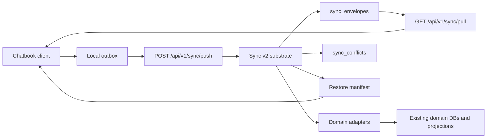

# Chatbook Sync Engine PRD

Date: 2026-05-10
Owner: Codex collaboration session
Status: Approved product/design direction, pending implementation planning
Backlog: TASK-208

## Summary

Build a unified Sync v2 engine for `tldw_server` clients, with
`tldw_chatbook` as the first production client. The engine should let Chatbook
remain a standalone local application while also supporting two server-backed
modes:

1. Local-first sync, where Chatbook works offline and synchronizes selected
   state, status, library records, and content with a tldw server account.
2. Server-front-end mode, where Chatbook acts as a thin UI for a server
   instance and does not keep a local synced dataset.

The server should be able to hold enough per-user Chatbook state for a user to
sign in from a new device, preview what is available, and restore all or a
selected subset of their personal research state. The same engine should later
support other clients such as the WebUI, browser extension, CLI, or mobile
companions.

The existing `/api/v1/sync` surface is not currently used by the intended
clients. Sync v2 should repurpose that route family as the canonical unified
sync API and subsume the older media-only sync flow instead of creating a
parallel endpoint family.

## Current Context

The repo already contains pieces that should be reused or migrated rather than
ignored:

- Server media sync endpoints:
  `tldw_Server_API/app/api/v1/endpoints/sync.py`
- Server sync schemas:
  `tldw_Server_API/app/api/v1/schemas/sync_server_models.py`
- Server media sync client and contract notes:
  `tldw_Server_API/app/core/Sync/Sync_Client.py`,
  `tldw_Server_API/app/core/Sync/sync_contract.py`, and
  `tldw_Server_API/app/core/Sync/README.md`
- Server router mount for `/api/v1/sync`:
  `tldw_Server_API/app/api/v1/router_groups/core.py`
- Server per-user notes/chat database with sync-oriented columns and
  `sync_log` triggers:
  `tldw_Server_API/app/core/DB_Management/ChaChaNotes_DB.py`
- Server media database sync logging helpers:
  `tldw_Server_API/app/core/DB_Management/media_db/runtime/sync_utility_ops.py`
- Existing Chatbook-side sync scaffolding in the sibling checkout:
  `/Users/macbook-dev/Documents/GitHub/tldw_chatbook/Sync_Interop/server_sync_service.py`,
  `/Users/macbook-dev/Documents/GitHub/tldw_chatbook/Sync_Interop/sync_scope_service.py`,
  `/Users/macbook-dev/Documents/GitHub/tldw_chatbook/Sync_Interop/sync_state_repository.py`,
  and `/Users/macbook-dev/Documents/GitHub/tldw_chatbook/tldw_api/sync_schemas.py`
- Existing Chatbook note file sync:
  `/Users/macbook-dev/Documents/GitHub/tldw_chatbook/Notes/sync_engine.py`

The current server sync design is media-only and based on `sync_log` deltas,
client IDs, entity versions, filtered echo suppression, and last-write-wins
conflict handling. That is a useful migration input, but it is not sufficient
for Chatbook state portability, encrypted private content, selective restore, or
domain-specific merge behavior.

## Problem Statement

Chatbook can operate as a strong local application, but users need continuity
across devices and deployments:

- A user should be able to work offline in Chatbook, then sync back to a tldw
  server account when connectivity returns.
- A user should be able to sign in on a new device, see what personal datasets
  are available, and restore selected notes, conversations, workspace records,
  source references, and source cache content.
- A user should be able to use a new device as a thin UI to the server without
  syncing local copies at all.
- The server needs a unified storage and protocol model so future clients do
  not each invent their own sync path.
- Private user content must not become plain server-readable data merely
  because it is syncable.

The current Chatbooks import/export product remains useful for batch packages,
archives, and explicit sharing. Sync v2 is a different product surface:
continuous or periodic client state continuity, restore, and multi-device
operation.

## Goals

- Provide one canonical client sync protocol under `/api/v1/sync`.
- Support Chatbook as the first local-first synced client.
- Keep Chatbook usable in three modes: standalone local, local-first synced, and
  server-front-end.
- Store enough server-side per-user state for new-device restore and selective
  hydration.
- Reuse existing domain databases and sync-log knowledge through adapters.
- Encrypt private user content client-side in V1 before it leaves Chatbook.
- Preserve future compatibility with workspace-scoped shared datasets.
- Provide conflict detection and reviewable conflict records instead of silent
  destructive merges.
- Subsume the current media sync design as a compatibility domain inside the
  new engine.

## Non-Goals

- No CRDT-first rich text or fully collaborative live editing in V1.
- No real-time multi-user shared workspace collaboration in V1.
- No full large-binary media replication in V1; large binaries stay referenced
  or are handled by a later attachment/storage tranche.
- No embedding/vector replication in V1, except metadata that allows clients to
  know derived embeddings exist and can be rebuilt or fetched later.
- No server-side decryption of local-first private datasets.
- No guarantee that lost client keys can be recovered unless the user has set
  up the recovery bundle flow.
- No attempt to preserve ephemeral UI chrome such as scroll position or opened
  panes as a first V1 requirement.

## Product Modes

### Standalone Local App

Chatbook continues to work without a server account. All primary data remains
local. Sync metadata may exist locally as dormant state, but no server
registration or remote writes are required.

### Local-First Synced App

Chatbook owns a local dataset and can read/write offline. It pushes encrypted
entity envelopes and server-readable routing metadata to a tldw server account.
It pulls remote envelopes, decrypts them locally, applies safe merges, and
records conflicts for user review.

This is the V1 target mode.

### Server-Front-End Mode

Chatbook acts as a UI to the server instance. Data is read and written directly
through server APIs and the local device does not maintain a durable synced
dataset. This mode uses the server's normal trust model and is not equivalent to
client-side encrypted local-first sync.

## Target Users And Use Cases

| User | Use Case |
| --- | --- |
| Solo researcher | Use Chatbook offline on a laptop, then sync notes, chats, and source cache back to a home server. |
| Multi-device user | Sign in on a new machine and restore selected workspaces, conversations, notes, and source records. |
| Privacy-sensitive self-hoster | Keep private content encrypted on the server while preserving device continuity. |
| Server-first user | Use Chatbook as a remote TUI/front-end to an always-on tldw server with no local sync. |
| Future team workspace user | Sync shared workspace references through workspace-scoped datasets with separate access and key rules. |

## V1 Scope

V1 should optimize for the working research loop:

- Notes, including titles, bodies, tags, status, soft-delete state, and update
  metadata.
- Conversations and messages, including thread metadata and append-only message
  history.
- Workspace records, source references, and source membership.
- Source cache records for extracted text, transcripts, summaries, and small
  attachments where size allows.
- Media/library identity metadata sufficient to bridge existing media sync into
  the new domain model.
- Sync status, cursors, conflict records, restore manifests, and device
  registration state.

V1 should treat large media binaries, derived embeddings, and heavyweight model
artifacts as references or rebuildable derivatives unless a future attachment
milestone explicitly opts them in.

## Key Concepts

- Sync account: the authenticated tldw user account that owns or can access
  datasets.
- Device: a registered client installation with a stable device ID, name,
  capabilities, and last-seen metadata.
- Dataset: a syncable collection of records. Datasets may be personal or
  workspace-scoped.
- Domain: a logical data area such as notes, chat, workspaces, source cache, or
  media.
- Envelope: the protocol unit exchanged between client and server. It contains
  routing metadata, entity identity, operation, version/vector metadata, hashes,
  and encrypted or clear payload sections depending on dataset policy.
- Domain adapter: code that maps between envelopes and existing domain storage.
- Restore manifest: metadata-only inventory of datasets and syncable counts
  used before a new device downloads data.
- Conflict record: durable server and client metadata describing an unresolved
  conflict and the envelope versions involved.

## Architecture

Sync v2 should be a generic substrate with domain adapters, not a second
hard-coded media sync implementation.

Recommended server layering:

1. API layer under `tldw_Server_API/app/api/v1/endpoints/sync.py`.
2. Pydantic request/response schemas under
   `tldw_Server_API/app/api/v1/schemas/`.
3. Core sync substrate under `tldw_Server_API/app/core/Sync/`.
4. Domain adapters close to existing DB/service abstractions.
5. Compatibility adapter that maps existing media sync semantics into Sync v2.

The sync substrate owns protocol invariants, cursors, idempotency, conflict
records, and key records. Domain adapters own entity-specific validation,
projection, merge hints, tombstones, and dependency handling.

## Server Data Model

The exact database split can be decided during implementation, but the logical
tables should be:

### `sync_devices`

Registered client installations.

Required fields:

- `device_id`
- `user_id`
- `display_name`
- `client_type`
- `client_version`
- `capabilities_json`
- `registered_at`
- `last_seen_at`
- `revoked_at`

### `sync_datasets`

Personal or workspace-scoped sync datasets.

Required fields:

- `dataset_id`
- `owner_user_id`
- `workspace_id`
- `scope_type`
- `encryption_policy`
- `domain_set_json`
- `created_at`
- `updated_at`
- `archived_at`

`scope_type` starts with `personal` and `workspace`. V1 implementation should
focus on `personal` while keeping the schema compatible with workspace-scoped
datasets.

### `sync_domain_state`

Per-domain high-water marks, schema versions, and adapter state.

Required fields:

- `dataset_id`
- `domain`
- `adapter_version`
- `server_sequence`
- `last_compacted_sequence`
- `state_json`

### `sync_envelopes`

Append-only received and server-generated sync records.

Required fields:

- `server_sequence`
- `dataset_id`
- `domain`
- `entity_id`
- `stable_key`
- `operation`
- `client_envelope_id`
- `device_id`
- `client_timestamp`
- `server_timestamp`
- `base_version`
- `entity_version`
- `dependency_json`
- `routing_metadata_json`
- `payload_ciphertext`
- `payload_clear_json`
- `payload_hash`
- `payload_size_bytes`
- `adapter_version`
- `status`

For private local-first datasets, human-readable content should be in
`payload_ciphertext`. `payload_clear_json` is limited to routing and status
metadata that the server needs to enforce protocol behavior.

### `sync_device_cursors`

Per-device pull state.

Required fields:

- `dataset_id`
- `device_id`
- `domain`
- `last_pulled_sequence`
- `updated_at`

### `sync_conflicts`

Durable unresolved conflict inventory.

Required fields:

- `conflict_id`
- `dataset_id`
- `domain`
- `entity_id`
- `conflict_type`
- `base_envelope_id`
- `local_envelope_id`
- `remote_envelope_id`
- `server_sequence`
- `metadata_json`
- `status`
- `resolved_by_envelope_id`
- `created_at`
- `resolved_at`

### `sync_key_records`

Encrypted key metadata and recovery material.

Required fields:

- `key_record_id`
- `dataset_id`
- `user_id`
- `device_id`
- `key_purpose`
- `wrapped_key_blob`
- `kdf_metadata_json`
- `created_at`
- `revoked_at`

The server stores wrapped key material only. It must not store plaintext dataset
keys for local-first encrypted datasets.

### Restore Manifest

The restore manifest can be a generated view or a persisted cache.

It should include:

- datasets available to the authenticated user
- dataset scope, domains, approximate counts, byte estimates, and last update
- device list and last-seen metadata
- unresolved conflict counts
- attachment availability and size classes
- encryption/key recovery status

For private encrypted datasets, the restore manifest is metadata-only. Human
labels are either absent or available only after client-side decryption.

## Domain Adapter Rules

### Notes

Notes metadata can be safely merged for tags, archive status, and non-content
flags when updates do not conflict. Title and body edits are private content and
should be encrypted for local-first private datasets. Concurrent title/body
updates become manual conflicts unless the client submits a resolved replacement
envelope.

### Chat Threads And Messages

Chat messages are append-only by stable message ID and timestamp. Independent
messages from different devices merge automatically. Message content is
encrypted for private local-first datasets. If two envelopes claim the same
message ID with different hashes, record a conflict and preserve both versions.

### Workspaces And Source References

Workspace source membership merges by stable source ID. Set-like operations
such as add/remove source references can be merged when dependency checks pass.
Ordered field conflicts, rename conflicts, and delete-vs-update cases become
manual conflicts.

### Source Cache

Source cache entries use source ID plus content hash. Non-conflicting cache
versions can coexist. Extracted text, transcripts, summaries, and small
attachments are encrypted private content for personal datasets. Large binaries
are out of V1 sync scope and should remain references with clear availability
metadata.

### Media Compatibility

Media sync becomes one Sync v2 domain. Existing media `sync_log` semantics can
be used as migration input, but the public client contract should shift to
envelopes, stable dataset cursors, and domain adapter results.

## API Requirements

All endpoints are under `/api/v1/sync`.

### `GET /api/v1/sync/capabilities`

Returns server-supported protocol version, domains, max batch sizes, attachment
limits, encryption policy support, and compatibility flags.

### `POST /api/v1/sync/devices/register`

Registers or refreshes a device. Returns `device_id`, server capabilities, and
required key/dataset setup actions.

### `POST /api/v1/sync/datasets/enroll`

Creates or joins a personal or workspace-scoped dataset. Returns dataset
metadata, policy, and initial cursor state.

### `GET /api/v1/sync/restore-manifest`

Returns metadata-only restore inventory for the authenticated user. Supports
domain filters and dataset filters.

### `POST /api/v1/sync/push`

Accepts a batch of client envelopes. Requirements:

- idempotent by `client_envelope_id`
- authenticated and device-aware
- validates dataset access and adapter versions
- returns per-envelope `accepted`, `rejected`, or `conflict` outcomes
- never logs decrypted private content
- advances server sequence only after durable write

### `GET /api/v1/sync/pull`

Returns envelopes after a stable server sequence cursor. Requirements:

- supports dataset and domain filters
- excludes or marks same-device echoes based on client preference
- returns the next cursor and whether more pages are available
- preserves deterministic ordering by server sequence

### `GET /api/v1/sync/conflicts`

Lists unresolved and recently resolved conflicts visible to the authenticated
user. Private payloads stay encrypted; clients decrypt local/remote versions for
review.

### `POST /api/v1/sync/conflicts/{id}/resolve`

Submits a resolution envelope or a resolution action. Resolution should create a
new envelope rather than mutating historical conflicting envelopes.

### `POST /api/v1/sync/attachments`

Uploads small sync attachments or encrypted chunks where allowed by server
policy. Large media binary replication is deferred.

### `POST /api/v1/sync/keys/recovery-bundle`

Stores or updates client-generated encrypted recovery material. The server
stores the wrapped bundle but cannot decrypt private dataset keys.

## Client Requirements For Chatbook

Chatbook should add a sync profile and local outbox/inbox around existing local
storage:

- Profile mode: `local_only`, `local_first_sync`, or `server_frontend`.
- Device registration and capability negotiation.
- Dataset enrollment and recovery-bundle setup.
- Local outbox with idempotent envelope IDs.
- Pull cursor persistence per dataset/domain.
- Domain adapters for notes, conversations/messages, workspaces/source refs,
  source cache, and media compatibility.
- Conflict inbox with user-visible review and resolution flow.
- Selective restore UI/API that can hydrate chosen datasets/domains.
- Clear mode switching rules so a user does not accidentally mix thin-client
  server state and encrypted local-first datasets.

Existing Chatbook `Sync_Interop` scaffolding should be treated as a starting
point. Existing note file sync should remain local file synchronization and not
be confused with server sync, though it may share conflict-review UI concepts.

## Privacy, Encryption, And Keys

V1 privacy requirement:

- Private user content leaves Chatbook only after client-side encryption.
- Encrypted fields include note titles and bodies, chat message content,
  extracted source text, transcripts, summaries, small attachments, and other
  user-private human-authored or source-derived content.
- Server-readable metadata is limited to routing, authorization, sync status,
  entity identity, dependency checks, hashes, sizes, domain, operation, cursor,
  and coarse timestamps.
- Long-term target: for user-private datasets, encrypt everything except the
  routing metadata strictly required for sync.

Key management:

- V1 uses client-held dataset keys.
- V1 supports a client-generated recovery bundle stored by the server as
  wrapped key material.
- If a user loses all devices and recovery material, encrypted local-first
  datasets may not be recoverable.
- A later milestone can add server-assisted encrypted key escrow where the
  server stores wrapped keys it still cannot read.

Trust-model distinction:

- Local-first sync is designed so the server cannot read private content.
- Server-front-end mode uses ordinary server APIs and therefore relies on the
  server's deployment trust boundary.
- Shared workspace datasets require separate workspace key and permission rules
  and should not be treated as identical to private personal datasets.

## Conflict Policy

V1 should allow soft multi-device writes but favor explicit conflict recording
over aggressive merges.

Auto-merge cases:

- Append-only chat messages with unique stable IDs.
- Workspace source references by stable source ID when dependency checks pass.
- Set-like metadata such as tags when operations commute.
- Source cache versions with different content hashes.

Manual conflict cases:

- Concurrent note title/body edits.
- Same message ID with different encrypted payload hashes.
- Delete-vs-update for notes, threads, workspaces, or source references.
- Ordered-list or ordering-sensitive workspace conflicts.
- Unknown or unsupported adapter versions.
- Missing dependencies that cannot be repaired by pulling more envelopes.

Conflict resolution should preserve both versions until a user or client submits
a resolution envelope. Historical conflicting envelopes remain immutable.

## Status And Restore Semantics

The server should preserve practical Chatbook continuity, not just raw content:

- Ingestion/source-processing status where it affects what the user can do.
- Library/source availability and cache completeness.
- Workspace membership and source selection.
- Conversation and note soft-delete/archive state.
- Sync health, last seen device, pending conflict counts, and partial restore
  state.

Purely transient UI state is out of V1 unless a future adapter makes it
explicitly syncable.

## Rollout Milestones

### Milestone 1: PRD And Protocol Design

- Approve this PRD.
- Write implementation plan with server/client work packages.
- Decide exact schema names, migration strategy, and compatibility behavior for
  existing `/api/v1/sync/send` and `/api/v1/sync/get`.

### Milestone 2: Server Substrate

- Add Sync v2 schemas and core substrate.
- Add device registration, dataset enrollment, push, pull, restore manifest,
  conflict, and key-record endpoints.
- Preserve or migrate current media sync tests.

### Milestone 3: Chatbook Substrate

- Add Chatbook sync profile, device registration, local outbox/inbox, cursors,
  encryption hooks, and capability negotiation.
- Keep `local_only` behavior unchanged.

### Milestone 4: V1 Domain Adapters

- Implement notes, chat messages, workspace source refs, source cache, and media
  compatibility adapters.
- Add domain-specific merge/conflict tests.

### Milestone 5: End-To-End Restore

- New Chatbook device can sign in, view restore manifest, select domains, pull
  encrypted content, decrypt locally, and resume work.
- Server-front-end mode is explicitly selectable and does not create a local
  sync dataset.

### Milestone 6: Hardening

- Add quotas, retention, compaction, observability, admin diagnostics, and
  migration docs.
- Add security review for key handling and logs.

## Success Metrics

- A new Chatbook installation can restore selected synced notes, conversations,
  workspaces, and source cache records from a server account.
- A local-only Chatbook installation can continue to operate without server
  configuration.
- A server-front-end Chatbook session can run without creating a durable local
  dataset.
- Replayed duplicate pushes are idempotent.
- Pull cursors are stable across restarts.
- Private content does not appear in server logs, restore manifests, or clear
  sync payload fields.
- Conflict records are created for risky concurrent edits and can be resolved by
  submitting a new envelope.

## Open Questions

- Should `/api/v1/sync/send` and `/api/v1/sync/get` be removed, kept as legacy
  compatibility wrappers, or replaced by version-negotiated Sync v2 behavior?
- Which exact metadata fields are acceptable in clear text for private
  datasets? This needs a security review before implementation.
- Should note titles be encrypted by default even if that makes restore
  manifests less human-readable before unlock? This PRD recommends yes.
- What is the first acceptable size cap for encrypted source-cache attachments?
- How should shared workspace encryption keys be distributed and revoked?
- Should sync envelopes live in each user's existing per-user DB, a new per-user
  sync DB, or a central AuthNZ-adjacent sync DB? The answer affects restore
  queries and multi-device listing performance.
- How should server-front-end mode expose offline limitations in Chatbook
  without confusing it with local-first sync?

## Implementation Notes For Future Planning

- Use existing DB abstractions and service boundaries; avoid raw SQL outside
  the appropriate database management layer.
- Treat the current media sync implementation as migration evidence, not as the
  final protocol shape.
- Avoid adding CRDT machinery until the product has proven that manual conflicts
  are insufficient.
- Keep private-content encryption testable with fixtures that assert clear
  payloads and logs do not contain known plaintext.
- Backward compatibility for current `/api/v1/sync` callers should be decided
  explicitly during implementation planning even if no known client uses it
  today.
