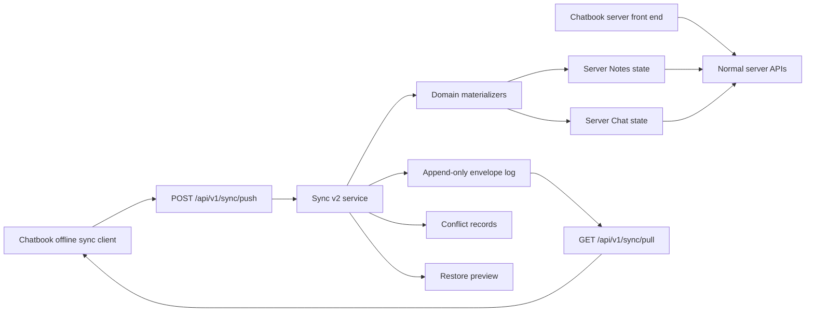

# Chatbook Sync v2 Roadmap PRD

Date: 2026-05-23
Owner: Codex collaboration session
Status: Approved design direction; spec review passed 2026-05-23; pending implementation planning
Backlog: TASK-490
Supersedes: `Docs/superpowers/specs/2026-05-10-chatbook-sync-engine-prd-design.md`

## Summary

Build Sync v2 as the canonical `tldw_server` synchronization and restore
substrate for `tldw_chatbook` clients that opt into server connectivity.
Chatbook remains a standalone local application first, but can also connect to a
server either as a thin front end or as an offline-capable sync client.

Sync v2 replaces the current `/api/v1/sync` contract in place. There are no
known v1 sync clients to preserve, so the old media-log-shaped `/send` and
`/get` contract can be removed or rewritten instead of wrapped for
compatibility. Media sync is later subsumed as a Sync v2 domain rather than
kept as a separate public protocol.

The selected architecture is an append-only Sync v2 envelope log plus
materialized server projections. Accepted envelopes are retained for restore,
audit, replay, and repair. Accepted Notes and Chat changes are also applied to
the user's normal server-side state so Chatbook can be used as a dumb front end
to a server account without maintaining a local synced dataset.

Milestone 1 is intentionally narrow: manual reliable sync for the authenticated
user's personal dataset, covering Notes and Chat from the start. Later
milestones add binary/blob transfer, background sync, workspace datasets, media
and library coverage, stricter encryption modes, retention/garbage collection,
and operational hardening.

## Product Modes

Chatbook must support three valid operating modes:

1. `local_only`: Chatbook is a fully standalone local application. It never
   talks to `tldw_server`, does not require login, and does not depend on server
   schemas or remote sync metadata.
2. `server_frontend`: Chatbook acts as a UI to a `tldw_server` user account.
   It stores little or nothing locally and uses the server's normal API and
   trust boundary.
3. `offline_sync`: Chatbook owns a local profile, can work offline, and syncs
   selected state to and from `tldw_server` for backup, restore, and
   multi-device continuity.

Sync v2 applies only to `server_frontend` and `offline_sync`. It must not make
`local_only` dependent on server configuration, remote auth, or a sync account.
Switching between modes must be explicit. A local-only profile should not be
silently enrolled into server sync, and a server-front-end session should not
silently create a durable local synced dataset.

## Goals

- Replace `/api/v1/sync` with a profile-aware Sync v2 protocol.
- Use `tldw_chatbook` as the first production client while keeping the protocol
  suitable for future WebUI, browser extension, CLI, and mobile clients.
- Support both server-connected modes from the start: dumb server front end and
  offline-capable client sync.
- Keep Chatbook's standalone local-only mode untouched.
- Store enough per-user server state to restore a clean or non-empty Chatbook
  profile on another device.
- Persist accepted changes in an append-only envelope log and materialize them
  into normal server Notes and Chat storage.
- Make conflicts explicit and reviewable instead of silently destructive.
- Encrypt user-private personal data at rest on the server in M1 using the
  server's trusted/self-hosted auth-unlocked model.
- Reserve a path toward passphrase/device-key unlock and client-only encrypted
  fields or datasets in later milestones.

## Non-Goals

- No dependency on `tldw_server` for Chatbook local-only operation.
- No background or scheduled sync in M1.
- No workspace-scoped datasets in M1.
- No binary/blob transfer in M1. Attachments sync as metadata/references only.
- No CRDT-first collaborative editing in M1.
- No field-level merge UI for Notes or conversation metadata in M1.
- No client-only opaque encryption requirement in M1.
- No retention or garbage collection implementation in M1, though metadata must
  support later retention and per-device acknowledgment.

## Milestone Roadmap

### Milestone 1: Manual Reliable Personal Sync

M1 is the first implementation milestone and covers:

- Authenticated user's personal dataset only.
- Notes from the start.
- Chat conversation/session metadata from the start.
- Chat messages from the start.
- Soft-delete/tombstone envelopes for Notes, conversation metadata, and Chat
  messages.
- Attachment metadata/references, with missing blob warnings during restore.
- Profile-level `Sync now` and `Restore` surface, with per-domain status details.
- Explicit device/profile bootstrap for server-connected modes.
- Restore into either a clean profile or an existing non-empty profile.
- Whole-object conflict review for Notes and conversation metadata.
- Append-only non-duplicate Chat message merge by stable message ID.
- Server-unlocked encryption for user-private personal data on
  trusted/self-hosted deployments.
- Append-only server envelope log plus materialized server Notes/Chat state.
- Replay/repair path for rebuilding projections from accepted envelopes.

M1 excludes workspace datasets, background sync, blob transfer, media/library
domain coverage, client-only encryption, and retention/GC.

### Milestone 2: Restore Completeness And Blobs

M2 adds the completeness needed after M1 proves the protocol:

- Attachment/blob transfer with resumable or chunked upload/download.
- Quota-aware blob policy and per-content size limits.
- Attachment checksums and availability status.
- More selective restore controls.
- Key recovery hardening for server-unlocked datasets.
- Larger batch handling and better resume behavior.

### Milestone 3: Polished Multi-Device Sync

M3 moves from manual reliable sync to polished multi-device operation:

- Scheduled/background sync.
- Workspace-scoped datasets and permission/key rules.
- Media, library, source, cache, and derived-content domains.
- Richer conflict review and resolution UX.
- Optional passphrase/device-key unlock.
- Optional client-only encrypted fields or datasets.
- Device authorization and revocation.
- Key rotation.
- Retention, compaction, and sync-log garbage collection.
- Operational observability, metrics, audit trails, and admin diagnostics.

## Current Context

The repository already has a registered `/api/v1/sync` route and media-oriented
sync code:

- `tldw_Server_API/app/api/v1/endpoints/sync.py`
- `tldw_Server_API/app/api/v1/schemas/sync_server_models.py`
- `tldw_Server_API/app/core/Sync/Sync_Client.py`
- `tldw_Server_API/app/core/Sync/sync_contract.py`
- `tldw_Server_API/app/core/Sync/README.md`
- `tldw_Server_API/app/api/v1/router_groups/core.py`

The current contract accepts only media-shaped send entities for `/sync/send`
and returns media sync log rows from `/sync/get`. This is useful
implementation history, but it should not constrain the new Notes/Chat
protocol. Because there are no active v1 clients, Sync v2 should replace the
contract in place.

The older May 10 Chatbook sync PRD is superseded by this document. The major
changes are:

- M1 is personal Notes/Chat only, not broad workspace/source/media coverage.
- M1 uses server-unlocked encryption, not mandatory client-side opaque payloads.
- The server stores both append-only envelopes and materialized projections.
- Attachments are metadata/references only in M1.
- Existing `/api/v1/sync` can be replaced in place without v1 compatibility.

## Architecture

Sync v2 should be a generic envelope substrate with domain materializers.

Core server components:

- Sync API: authenticated profile, push, pull, restore preview, conflict
  resolution, and status endpoints.
- Sync Envelope Log: append-only per-user/per-dataset record of accepted
  client and server changes.
- Materializers: domain adapters that validate and apply accepted envelopes
  into normal server Notes and Chat storage.
- Conflict Service: detects whole-object conflicts for Notes and conversation
  metadata, plus stable-ID Chat message dedupe/conflicts.
- Restore Service: previews available server state and applies selected data
  into server projections when needed. For offline Chatbook restore, it returns
  restore plans and envelopes for the client to apply locally.
- Key/Encryption Boundary: M1 uses normal authenticated server use to unlock
  user-private data; later milestones add stricter modes.

The append-only envelope log is the restore, audit, replay, and repair source
of truth. The materialized Notes/Chat tables are the live server projection used
by the WebUI/API and Chatbook server-front-end mode.

Projection writes should be transactional with envelope acceptance where the
database boundary allows it. If a projection apply fails after an envelope is
durably accepted, the envelope must record apply status and the system must
support replay/repair.

## API Contract

All endpoints live under `/api/v1/sync`.

### `GET /api/v1/sync/profile`

Returns active profile/dataset summary without creating durable sync state:

- server protocol version
- server capabilities
- active dataset id
- supported domains
- last server cursor
- encryption mode
- device registration/status
- per-domain status, pending counts, conflicts, and last apply result

### `POST /api/v1/sync/profile/bootstrap`

Idempotently bootstraps server-connected Chatbook use for the authenticated
user. This endpoint registers or refreshes the current device/profile identity,
creates the default personal dataset if it does not already exist, returns the
initial cursor state, and declares whether the client is entering
`server_frontend` or `offline_sync` mode.

M1 should prefer this explicit write endpoint over hidden side effects in
`GET /sync/profile`. The response must include stable identifiers the client
uses in later `push`, `pull`, and `restore/preview` requests.

### `POST /api/v1/sync/push`

Accepts ordered envelopes from one device/profile. Requirements:

- authenticate and scope to the current user
- validate dataset/device access
- validate envelope schema and domain support
- enforce idempotency by device id plus client sequence and/or envelope id
- append accepted envelopes
- materialize accepted envelopes into server Notes/Chat state
- return accepted cursors, rejected envelopes, conflicts, and apply errors

### `GET /api/v1/sync/pull`

Returns envelopes after a cursor for selected domains. Requirements:

- deterministic order by server cursor
- optional domain filters
- echo suppression for the requesting device by default
- ability to include same-device echoes for repair/debug paths
- pagination and "more available" indicator

### `POST /api/v1/sync/restore/preview`

Accepts a client inventory and returns:

- available datasets/domains
- counts and latest cursors
- safe applies
- conflicts against local objects
- tombstones that affect local state
- missing attachment blobs
- encryption/key status

Clean profile restore uses the same endpoint with an empty inventory.

### `POST /api/v1/sync/conflicts/resolve`

Records explicit user conflict decisions. Resolution should create new
envelopes or resolution records rather than mutating historical envelopes.

Supported M1 actions:

- keep local
- use server
- duplicate/rename where the domain supports it
- skip

## Envelope Contract

Envelope shape is versioned and domain-neutral. M1 should include:

- `envelope_id`
- `dataset_id`
- `device_id`
- `client_sequence`
- `base_server_cursor`
- `base_object_revision`
- `base_object_hash`
- `server_cursor`
- `domain`
- `operation`
- `object_id`
- `parent_id`
- `schema_version`
- `payload`
- `payload_hash`
- `object_revision`
- `created_at_client`
- `received_at_server`
- `deleted` or `tombstone`
- `encryption_metadata`

M1 domains:

- `notes.note`: upsert and tombstone, whole-object conflicts.
- `chat.conversation`: upsert metadata and tombstone, whole-object conflicts.
- `chat.message`: append and tombstone, dedupe by stable message id.
- `attachment.ref`: metadata/reference only, no binary transfer until M2.

The schema should reserve fields for later retention, compaction, device
acknowledgments, key policy, and blob availability.

`base_server_cursor`, `base_object_revision`, and `base_object_hash` are required
for whole-object domains such as `notes.note` and `chat.conversation`. They
describe the server state the client had observed when the local edit was made.
Append-only `chat.message` creates may omit object-base fields when the message
ID is new, but tombstones and edits must include base-state metadata.

The server assigns `server_cursor` and canonical `object_revision` values when
it accepts an envelope. Clients must not rely on wall-clock timestamps for
conflict detection.

## Conflict Policy

M1 conflict handling is conservative and explicit.

Notes and conversation metadata use whole-object conflicts. If the server has a
post-base accepted envelope for the same object and the incoming base revision
or hash does not match the current server projection, sync pauses that object
and returns conflict details. Implementations must use cursor/revision/hash
metadata for this check, not client wall-clock timestamps.

Chat messages are append-only by stable message ID. Duplicate message IDs are
ignored idempotently when payload hashes match. Distinct messages are merged in
timestamp/order sequence. If the same message ID has different payload hashes,
the server must preserve both versions and create a conflict.

Tombstones are first-class envelopes. A deleted note, conversation, or message
must not reappear on another device unless the user explicitly restores it or
resolves in favor of a live object.

Attachment refs sync as metadata. Restore preview must flag missing blobs
instead of presenting the restored profile as complete.

## Restore Behavior

M1 supports restore into clean and non-empty Chatbook profiles.

The client sends a local inventory to `/sync/restore/preview`. The server returns
a restore plan and the envelope ranges needed to apply it locally:

- objects safe to apply
- object conflicts
- tombstones that should delete or hide local objects
- missing attachments or blob refs
- domain-specific warnings

The user then chooses item-level actions for whole-object conflicts. Clean
profile restore is the same path with an empty inventory.

Restore must preserve usability of Chat threads, so Chat sync includes minimal
conversation/session metadata with messages. Message-only restore is not
sufficient.

The server does not directly write into an offline Chatbook local database.
Chatbook applies the returned restore plan and envelopes to its local profile.
For `server_frontend` mode, the server's materialized projections are already
the live state and no client-side restore apply is needed.

## Security And Encryption

M1 assumes trusted/self-hosted server operation. User-private personal data is
protected at rest on the server, and normal authenticated server access is
enough to unlock and use it. This is required for Chatbook server-front-end mode
to work immediately after sync materializes server state.

M1 security posture:

- authenticated and user-scoped access
- personal datasets only
- server-unlocked encryption for user-private personal data
- both accepted envelope payload storage and materialized Notes/Chat projections
  are inside the M1 at-rest encryption boundary
- no client-only opaque payload requirement
- no plaintext secret logging
- no cross-user access to datasets, envelopes, conflicts, or restore previews

M1 may satisfy server-unlocked encryption through an implementation-selected
server-side mechanism such as encrypted per-user database files, an encrypted
storage volume with documented deployment requirements, or server-managed
field/table encryption. The implementation plan must choose one explicit
mechanism before schema work begins. Sync v2 cannot claim M1 encryption if
envelopes are encrypted but materialized Notes/Chat projections remain outside
the same at-rest protection boundary.

Later milestones add stricter modes:

- passphrase or device-key unlock
- client-only encrypted fields or datasets
- key recovery hardening
- device authorization and revocation
- key rotation
- workspace-specific key and permission rules

## Data Lifecycle

M1 lifecycle rules:

- envelopes are append-only
- tombstones are retained
- accepted envelopes record apply status
- projection failures are visible in status responses
- replay/repair can rebuild materialized Notes/Chat projections from envelopes
- GC is not implemented

The envelope schema must include enough metadata for later retention,
compaction, per-device acknowledgment, and safe garbage collection.

## M1 Backlog Breakdown

After this PRD is approved and reviewed, M1 should split into Backlog child
tasks:

1. Resolve implementation-planning gates: Sync v2 table location,
   profile/device identity, explicit at-rest encryption primitive, and the
   bootstrap contract.
2. Server schema/repository for datasets, devices, envelope log, cursors,
   conflict records, base-state metadata, and apply status.
3. Sync v2 API schemas and endpoints replacing existing `/api/v1/sync`,
   including explicit profile bootstrap.
4. Notes materializer with upsert, tombstone, conflict detection, and replay
   tests.
5. Chat materializer with conversation metadata, message append/dedupe,
   tombstones, and replay tests.
6. Restore preview and conflict resolution flows for clean and non-empty
   profiles.
7. Profile-level status/readiness response with per-domain details for Chatbook
   UI.
8. Chatbook client integration in its own repo/worktree: outbox capture, manual
   `Sync now` and `Restore`, status details, and conflict review.
9. M1 end-to-end verification: two devices plus server, new-device restore,
   non-empty restore, offline edits, conflicts, tombstones, and auth-scoped
   isolation.

M2 and M3 should remain roadmap epics until M1 lands.

## Verification Strategy

M1 verification should include:

- API contract tests for profile, push, pull, restore preview, and conflict
  resolution.
- Repository tests for envelope idempotency, cursor ordering, device scoping,
  base-state conflict detection, and conflict records.
- Notes materializer unit and integration tests.
- Chat materializer unit and integration tests.
- Replay/repair tests that rebuild projections from envelopes.
- Duplicate-envelope and duplicate-message idempotency tests.
- Tombstone tests that prevent deleted content from being resurrected.
- Restore tests for clean profiles and non-empty profiles.
- Missing-blob restore preview tests for attachment refs.
- Cross-user access tests for datasets, envelopes, restore previews, and
  conflicts.
- At-rest encryption boundary tests or deployment checks proving both envelopes
  and materialized Notes/Chat projections are covered by the selected M1
  mechanism.
- Bandit on touched production code.

Manual Chatbook UX verification belongs to the Chatbook-side milestone after
server contracts stabilize.

## Success Criteria

M1 is successful when:

- Chatbook local-only mode still works without server configuration.
- A user can manually sync Notes and Chat from one Chatbook profile to the
  server.
- The server stores accepted envelopes and materializes synced Notes/Chat into
  normal server state.
- A second Chatbook profile can restore usable Notes and Chat threads from the
  server.
- Restore into a non-empty profile detects and surfaces conflicts.
- Whole-object Notes/conversation conflicts require explicit resolution.
- Chat messages append and dedupe by stable message ID.
- Tombstones sync and prevent deleted content from being resurrected.
- Attachment metadata syncs and missing blobs are reported clearly.
- Cross-user access is blocked.

## Open Questions For Implementation Planning

- Exact database location for Sync v2 tables: per-user sync DB, per-user
  ChaChaNotes DB, or central AuthNZ-adjacent DB.
- Exact mapping between server Notes/Chat storage APIs and materializers.
- Exact envelope schema field names and indexes.
- Exact profile/device identity model for Chatbook.
- Whether conflict records are stored only server-side in M1 or also mirrored to
  Chatbook local state.
- Which server at-rest encryption primitives should be used for M1.
- What minimal Chatbook UI is acceptable for conflict review in M1.
