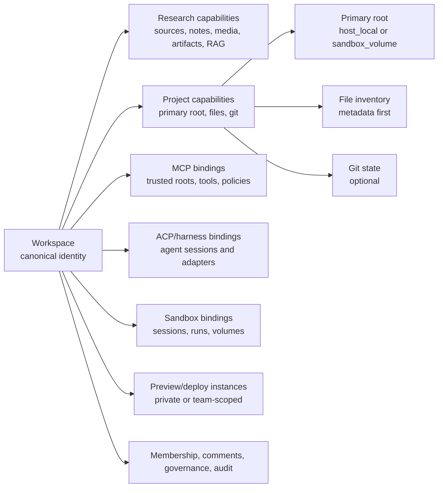

# Canonical Workspace Core and Project Workspace Model Design

## Status

Draft for TASK-2232.

## Purpose

tldw_server needs one Workspace model that can grow from a research-only notebook into an agentic project environment. The current codebase already has Research Workspace content APIs, MCP Hub Shared Workspaces, MCP Workspace Sets, ACP session workspace metadata, and Sandbox workspace lineage. Those pieces are useful, but they should not define separate product identities.

This design defines Workspace as the canonical product object. Research Workspace and Project Workspace become profiles or capability states of that object.

## Product Direction

A user should be able to begin with research: sources, media, notes, citations, grounded chat, summaries, and generated artifacts. Later, without migrating to a different product object, the user should be able to attach a project root, manage native files, use Git, run agent harnesses, execute in a sandbox, preview hosted work, and collaborate with a team.

This is the desired progression:

1. Create a research-only Workspace.
2. Add sources, notes, media, chats, citations, and work products.
3. Upgrade the same Workspace into a Project Workspace by attaching a primary root.
4. Use that root as a host-local folder or a sandbox-managed volume.
5. Track native files and Git state.
6. Explicitly choose what file content is indexed into research/RAG.
7. Pass a single runtime context envelope to MCP, ACP/harnesses, and Sandbox.
8. Use sandbox execution to build and test applications.
9. Expose private or team-scoped previews and deployment-like instances.
10. Add team membership, comments, governance, and audit around the same Workspace identity.

External product references that inform this direction, accessed on June 3, 2026:

- GitHub Copilot app: agent-native desktop experience around project work, local/cloud execution, review, and developer workflows. <https://github.blog/news-insights/product-news/github-copilot-app-the-agent-native-desktop-experience/>
- Claude Artifacts: generated artifacts that can be iterated, viewed, shared, and used as interactive outputs. <https://claude.com/blog/claude-powered-artifacts>
- Codex Sites: saved and deployed app previews with workspace-linked access modes. <https://developers.openai.com/codex/sites>

## Core Decision

`workspace_id` is the canonical identity for all workspace-related features.

MCP Shared Workspaces, ACP workspace metadata, Sandbox workspace fields, and future agent harness fields must reference the canonical `workspace_id`. They may persist their own operational records, but they do not own a separate Workspace identity.

## Definitions

### Workspace

The canonical product object.

Owns:

- identity
- owner scope
- membership
- high-level lifecycle
- capability state
- activity and commentary
- governance posture
- content collections
- runtime bindings

### Research Workspace

A Workspace with `workspace_profile: research`.

It has research capabilities enabled and does not have project intent. A Project Workspace with a missing or detached root is still a Project Workspace until the user explicitly downgrades it.

Owns or references:

- sources
- media items
- notes
- citations
- grounded chat
- generated work products
- migration/import state
- source ingestion and indexing status

### Project Workspace

A Workspace with `workspace_profile: project`.

It has all Research Workspace capabilities plus project intent, root lifecycle state, and agentic runtime bindings. A healthy Project Workspace normally has one primary project root, but its root may temporarily be missing, detached, failed, archived, or not yet configured.

Owns or references:

- one primary root
- file tree metadata
- optional Git state
- sandbox volume/session/run bindings
- MCP trusted-root and tool-policy bindings
- ACP or adapter-harness runtime bindings
- preview and deploy instance records
- team collaboration and comments over project activity

Project Workspace is not a different top-level object. It is a Workspace whose persisted `workspace_profile` indicates `project`, with capability projections exposing the current root, Git, file, MCP, ACP/harness, and Sandbox states.

### Primary Root

The main filesystem root for a Project Workspace.

First-class backend types:

- `host_local`: an existing folder on the tldw_server host.
- `sandbox_volume`: a persistent sandbox-backed project volume.

`git_clone` is an action, not a root backend type. A clone action creates or populates either a `host_local` or `sandbox_volume` root.

### Secondary Roots

Out of scope for the first Project Workspace implementation. Future secondary roots should be represented as attachments or policy members, not peer primary roots. MCP Workspace Sets can still group trusted roots for tool policy, but the Project Workspace user experience starts with one primary root.

### Git Capability

Git is optional state on the primary root.

Git states:

- `absent`
- `initialized`
- `linked_remote`
- `clean`
- `dirty`
- `ahead`
- `behind`
- `diverged`
- `conflicted`
- `unknown`

A plain folder is valid. Git setup can happen later.

### File Inventory

File inventory tracks file metadata, not necessarily file content.

Tracked by default:

- path
- directory/file type
- size
- modified time
- hash when practical
- language or MIME type
- Git status when available
- ignore-policy status
- indexing eligibility

Content indexing is explicit.

### Workspace Runtime Context

The canonical envelope passed to ACP, MCP, Sandbox, and future harness adapters.

It must be stable enough that a new agent harness can consume it without inventing a new Workspace model.

## Conceptual Model



## Canonical Workspace Fields

These fields should be common across Research and Project Workspaces:

- `workspace_id`
- `workspace_profile`: `research` or `project`
- `workspace_kind`: response/display alias for `workspace_profile`, not a separate source of truth
- `display_name`
- `description`
- `owner_scope_type`: `user`, `team`, `org`, `global`
- `owner_scope_id`
- `created_by`
- `created_at`
- `updated_at`
- `archived`
- `deleted`
- `version`
- `capability_summary`
- `allowed_actions`

`workspace_profile` should be persisted because the user's product intent matters independently of the current health of attached capabilities. Capability states should be computed from bindings and operational modules.

Important profile and state rules:

- A new Workspace starts with `workspace_profile: research` unless the creation request explicitly creates a Project Workspace.
- Attaching the first primary root upgrades the same Workspace to `workspace_profile: project`.
- Project root health is represented separately as `project_root_state`: `not_configured`, `attached`, `missing`, `detached`, `failed`, or `archived`.
- Detaching or losing the root must not silently downgrade the Workspace to research. It should remain a Project Workspace with a root problem until the user explicitly downgrades it.
- `workspace_kind` may appear in older responses or UI adapters as a compatibility/display label, but new persistence and internal logic should use `workspace_profile`.

## Project Root Binding

The first Project Workspace slice should add a primary-root binding.

Conceptual fields:

- `root_id`
- `workspace_id`
- `is_primary`
- `backend`: `host_local` or `sandbox_volume`
- `absolute_root`: for host-local roots, redacted where needed
- `sandbox_volume_id`: for sandbox-managed roots
- `display_name`
- `root_state`
- `created_by`
- `created_at`
- `updated_at`
- `git_state`
- `file_inventory_state`
- `indexing_state`
- `sandbox_mount_state`
- `mcp_trust_state`

Rules:

- Exactly one primary root per Project Workspace in the first implementation.
- A research-only Workspace may have zero roots.
- Attaching the first primary root upgrades the Workspace to project capability state.
- Removing, detaching, or losing the primary root marks `project_root_state` as `missing`, `detached`, `archived`, or `failed`. It does not downgrade the Workspace automatically.
- Downgrading a Project Workspace back to a Research Workspace must be an explicit user/admin action that records audit history and handles remaining root, file, Git, Sandbox, MCP, and harness bindings deliberately.
- Root paths must be validated through allowlists, sandbox volume ownership, and symlink controls before use.

## Root Binding Ownership Boundary

Workspace Core owns the primary-root binding and the user-visible root state.

Operational ownership should stay narrow:

- Workspace Core owns `workspace_id`, `workspace_profile`, root binding identity, root state, capability projection, allowed actions, and the runtime context envelope.
- Sandbox owns sandbox volume creation, mounting, sessions, runs, network policy, preview processes, and runtime failures.
- MCP owns trusted-root policy, path scopes, tool permissions, and approval requirements.
- Jobs owns user-visible long-running progress for file scans, extraction, chunking, indexing, and status projections.
- ACP and harness adapters own agent sessions, adapter diagnostics, and run lineage.

The logical owner of primary-root records is Workspace Core. The preferred physical persistence target is a new Workspace DB/table set. If an early implementation stages records in an existing DB for migration convenience, all callers should still access them through Workspace Core APIs so the storage decision remains reversible.

## File Tracking and Indexing

Project Workspaces should track native files by default but should not index all contents automatically.

Default tracking:

- scan file tree metadata
- honor `.gitignore`
- honor workspace ignore policy
- exclude obvious secrets and generated directories
- detect likely source, docs, assets, and build artifacts

Default indexing:

- no automatic full-content indexing
- source/RAG context only includes files selected, attached, or allowed by explicit indexing policy

Indexing modes:

- `selected_files`
- `docs_and_source_policy`
- `all_allowed_by_policy`

Agents can use MCP/sandbox policy to inspect files when allowed, but grounded research answers should cite only indexed or explicitly attached file content.

Non-trivial file inventory and indexing work should use Jobs rather than request-thread execution.

File inventory should expose:

- `file_inventory_state`: `not_started`, `queued`, `scanning`, `current`, `partial`, `stale`, `failed`, or `disabled`
- `last_scan_job_id`
- `last_scan_started_at`
- `last_scan_completed_at`
- bounded counts for discovered, ignored, indexed-eligible, indexed, failed, and skipped files
- the active ignore-policy fingerprint
- the root snapshot token or fingerprint used for incremental scans

Scanning rules:

- Small metadata previews may be synchronous, but any root-wide or recursive scan should be job-backed.
- Incremental scans should be keyed by `root_id` and snapshot token/fingerprint when available.
- Filesystem watchers, if added, should debounce changes and enqueue scan jobs rather than directly mutating the UI projection.
- `.gitignore`, workspace ignore policy, generated-directory rules, and secret exclusion must run before content indexing.
- Symlink traversal should be disabled by default and only enabled through explicit allowlists.
- Partial success is valid: the UI should show available metadata and the bounded failure summary without implying that all files were scanned.

## MCP Alignment

MCP Hub Shared Workspaces should become trusted-root bindings for canonical Workspaces.

Current MCP concepts should map as follows:

- Shared Workspace: trusted filesystem root for a canonical `workspace_id`.
- Workspace Set: policy grouping of one or more canonical Workspace ids.
- Path Scope: enforcement layer over trusted root and runtime CWD.
- Policy Assignment Workspace: policy membership keyed by canonical `workspace_id`.

MCP should not define a separate product Workspace. It should answer:

- which tools are available for this Workspace
- which roots are trusted for this Workspace
- which paths are in scope
- which policies govern tool use
- which approvals are required

### MCP Terminology Guardrails

The existing MCP Hub "Shared Workspaces" term refers to trusted filesystem roots and tool policy administration. In new canonical Workspace documentation, API schemas, and UI copy, prefer "MCP trusted root binding" or "MCP tool scope" when referring to that subsystem.

This avoids confusing two different ideas:

- Product sharing or team Workspaces: membership, access, comments, governance, and collaboration around a canonical `workspace_id`.
- MCP Shared Workspaces: trusted filesystem roots and path/tool policy used by MCP.

Existing MCP route names and historical docs can keep their established term until migrated, but new Workspace Core APIs should not create another product-level "shared workspace" concept.

## Workspace Sets, Groups, and Runtime Lineage

Avoid adding a free-form Workspace group concept unless the product needs it.

For runtime lineage:

- MCP Workspace Sets can group canonical Workspace ids for policy.
- Future team Workspaces can group canonical Workspace ids through owner scope, membership, and governance records.
- ACP, harness adapters, and Sandbox may persist a runtime lineage field derived from a Workspace Set, team scope, or policy snapshot.
- New APIs should prefer `workspace_id` plus resolved policy/scope context over accepting arbitrary `workspace_group_id` input.

If compatibility requires `workspace_group_id`, it should be treated as runtime or policy lineage, not as a separate product identity.

## ACP and Harness Alignment

ACP sessions and generic harness adapters should receive the same Workspace runtime context.

ACP and harnesses should persist:

- `workspace_id`
- runtime group or scope lineage when relevant
- `scope_snapshot_id`
- `sandbox_session_id`
- `sandbox_run_id`
- adapter identity
- policy snapshot metadata
- bounded diagnostics

They should not create independent Workspace identity records.

The runtime envelope must support ACP and non-ACP harnesses. Codex can be the first adapter, but the model must support future Claude Code, OSS harnesses, and partial-ACP adapters.

## Sandbox Alignment

Sandbox uses Workspace identity for tenancy, quotas, lifecycle, and access to project volumes.

Sandbox should answer:

- which persistent project volume is bound to the Workspace
- which sessions and runs are active
- which preview endpoints exist
- which users or teams can access those endpoints
- which filesystem paths are mounted
- which network policy applies

Sandbox should not own Workspace identity.

## Sandbox Volume Lifecycle

Sandbox-managed project roots must be first-class from the first Project Workspace slice that creates roots.

Sandbox volumes should be created through Sandbox APIs with a Workspace-bound wrapper. The wrapper validates Workspace identity, ownership, root cardinality, and allowed actions before delegating runtime work to Sandbox.

User-visible volume states should include:

- `not_configured`
- `creating`
- `ready`
- `mounting`
- `mounted`
- `snapshotting`
- `archived`
- `detached`
- `delete_pending`
- `deleted`
- `failed`
- `orphaned`

Required lifecycle actions:

- create sandbox project volume
- attach existing Workspace-bound volume
- mount for session/run
- unmount
- snapshot or export
- archive
- delete
- recover or adopt orphaned volumes

Safety rules:

- A sandbox volume cannot be deleted while active sessions, runs, preview instances, or pending jobs depend on it.
- Deleting or archiving a volume should mark the Project Workspace root state first, then perform runtime cleanup asynchronously.
- Orphan detection should be possible after crashes or interrupted migrations.
- Quotas, retention, backup/export availability, and failure diagnostics should be reported through Workspace capability state, but enforced by Sandbox.

## Runtime Context Envelope

Every agentic harness should receive a bounded envelope shaped like this:

```json
{
  "workspace_id": "workspace-123",
  "workspace_profile": "project",
  "workspace_kind": "project",
  "resolution": {
    "status": "complete",
    "warnings": []
  },
  "owner_scope": {
    "type": "user",
    "id": 1
  },
  "workspace_group": {
    "source": "workspace_set",
    "id": null
  },
  "access": {
    "role": "owner",
    "allowed_actions": {
      "read_files": true,
      "write_files": true,
      "run_sandbox": true,
      "use_mcp_tools": true,
      "create_preview": true
    }
  },
  "project_root": {
    "root_id": "root-1",
    "backend": "sandbox_volume",
    "display_name": "Website build",
    "path_hint": "[redacted-or-relative]",
    "git_state": "dirty",
    "file_inventory_state": "current",
    "indexing_state": "partial"
  },
  "research": {
    "source_summary": {
      "total": 12,
      "queryable": 9,
      "processing": 1,
      "failed": 0
    }
  },
  "mcp": {
    "state": "available",
    "workspace_set_ids": [],
    "tool_profile_ids": [],
    "policy_assignment_ids": []
  },
  "sandbox": {
    "state": "available",
    "runtime": "docker",
    "volume_id": "volume-123",
    "active_session_id": "sandbox-session-1"
  },
  "agents": {
    "state": "available",
    "harnesses": ["codex"]
  },
  "policy": {
    "scope_snapshot_id": "scope-abc",
    "policy_snapshot_version": "v1",
    "policy_snapshot_fingerprint": "sha256..."
  }
}
```

Sensitive fields must be redacted or replaced with bounded identifiers. Local absolute paths should not appear in user-visible diagnostics unless the endpoint is explicitly privileged and intended for local admins.

## Context Resolver Failure Semantics

The Workspace context resolver should fail closed for permissions and execution, but degrade gracefully for display-only metadata.

Fail closed when resolution is incomplete for:

- allowed actions
- write access
- root access
- MCP tool access
- sandbox execution
- preview access
- agent or harness launch
- file content indexing

Degrade for:

- display labels
- non-sensitive counts
- last-known timestamps
- high-level availability badges

Runtime context responses should include:

- `resolution.status`: `complete`, `partial`, or `failed`
- subsystem reason codes
- stale flags for cached projections
- bounded warnings that avoid secrets and local absolute paths

Agent harnesses should not start if a required root, policy scope, Sandbox binding, or permission projection cannot be resolved. A launched run should use an immutable `scope_snapshot_id` so a mid-run policy or membership change can be audited and handled deliberately rather than silently changing the run contract.

## Preview and Deploy Trajectory

Project Workspaces should eventually support private and team-scoped hosted previews.

First-class future concepts:

- `preview_instance_id`
- `workspace_id`
- `sandbox_session_id`
- `sandbox_run_id`
- `origin_url`
- `access_mode`: `owner_private`, `workspace_members`, `team`, `public_link`
- `status`: `starting`, `running`, `stopped`, `failed`
- `created_by`
- `expires_at`
- `comments_enabled`

The first design should leave room for this without requiring a full deploy platform immediately.

`public_link` is future-only and should require a separate risk review. First-slice previews should default to `owner_private` or `workspace_members`.

## Preview Access Defaults

Preview and deploy-like instances should be treated as authenticated Workspace resources, not anonymous web servers.

Defaults:

- owner-private preview for single-user/local setups
- workspace-member preview for team-capable setups
- no implicit public exposure
- reverse proxy or preview gateway enforces Workspace session/user auth
- preview access and lifecycle changes are audited
- CSRF, origin, and network exposure rules are explicit before team sharing ships

The UI should show preview readiness only when Sandbox runtime, access policy, and active project root state all resolve successfully.

## Team Governance Trajectory

Workspace should be ready to move from single-user local ownership to team-based workspaces.

Future membership fields:

- `workspace_id`
- `principal_type`: `user`, `team`, `org`, `service_account`
- `principal_id`
- `role`: `owner`, `admin`, `editor`, `agent_operator`, `viewer`, `commenter`
- `created_by`
- `created_at`

Future activity and comments:

- workspace activity events
- source comments
- file comments
- artifact comments
- preview comments
- agent run comments
- review decisions

Governance should apply to tools, file access, sandbox execution, preview access, and deployment actions.

## API Direction

The existing `/api/v1/workspaces` family should remain canonical.

Potential new or extended endpoints:

- `GET /api/v1/workspaces/{workspace_id}/context`
- `GET /api/v1/workspaces/{workspace_id}/capabilities`
- `GET /api/v1/workspaces/{workspace_id}/roots`
- `POST /api/v1/workspaces/{workspace_id}/roots/primary`
- `PATCH /api/v1/workspaces/{workspace_id}/roots/{root_id}`
- `GET /api/v1/workspaces/{workspace_id}/files`
- `POST /api/v1/workspaces/{workspace_id}/files/indexing-policy`
- `GET /api/v1/workspaces/{workspace_id}/runtime`
- `GET /api/v1/workspaces/{workspace_id}/activity`

MCP, ACP, Sandbox, and future harness APIs should accept or resolve `workspace_id` through the canonical Workspace context service.

## Backend Module Direction

Introduce a core Workspace module that provides identity and context resolution across existing stores.

Suggested module:

- `tldw_Server_API/app/core/Workspaces/models.py`
- `tldw_Server_API/app/core/Workspaces/context.py`
- `tldw_Server_API/app/core/Workspaces/bindings.py`
- `tldw_Server_API/app/core/Workspaces/capabilities.py`

Responsibilities:

- normalize Workspace identity
- resolve persisted Workspace profile
- resolve computed capability states
- resolve primary root binding
- resolve file inventory state
- resolve MCP binding state
- resolve ACP/harness state
- resolve sandbox binding state
- resolve Workspace Set, owner scope, and runtime lineage
- build runtime context envelopes
- build capability projections
- centralize reason codes

The module should compose existing persistence layers instead of forcing an immediate physical database merge.

## Existing Module Mapping

| Existing surface | Future role |
| --- | --- |
| `/api/v1/workspaces` | Canonical Workspace API family |
| `workspace_schemas.py` | Canonical Workspace API schema home, expanded carefully |
| `core/Workspaces/status_projection.py` | Keep source readiness, split capability projection into shared module later |
| MCP Shared Workspaces | MCP trusted-root binding and admin registry; existing name is compatibility terminology |
| MCP Workspace Sets | Policy grouping of canonical Workspace ids |
| MCP Path Scopes | Path enforcement for primary root and trusted roots |
| ACP sessions | Runtime lineage and agent session diagnostics |
| ACP adapter registry | Harness capability provider, not workspace identity |
| Sandbox sessions/runs | Runtime execution and volume lineage |
| Research Workspace UI | Main shell, with project capability mode when `workspace_profile` is `project` |
| Chat/Document workspaces | Specialized entry points or modes that should feed canonical Workspace state |
| Prototype Workspace | Separate experimental surface until deliberately migrated |

## Migration Strategy

Do not hard-cut existing MCP/ACP/Sandbox records.

Recommended sequence:

1. Add canonical context resolver and type contracts.
2. Extend capabilities API to include root/file/git/runtime states.
3. Teach MCP trusted-root bindings, including existing MCP Shared Workspace records, to optionally link to canonical Workspace ids.
4. Add primary root binding with `host_local` and `sandbox_volume`.
5. Add file inventory metadata scanning.
6. Add explicit file indexing policy.
7. Update ACP/harness session creation to resolve the runtime envelope from Workspace core.
8. Update Sandbox project volume/session creation to bind through Workspace core.
9. Add UI affordance to upgrade a research Workspace into a Project Workspace.
10. Add activity/commentary and preview access in later team-oriented slices.

## Implementation Slices

The first implementation should start with a narrow contract slice:

- add core Workspace model types and reason codes
- add read-only context resolver over existing Workspace, MCP, ACP, and Sandbox data
- extend capabilities response with Project Workspace fields in fail-closed states
- add schema for primary root binding
- add persisted `workspace_profile` and explicit `project_root_state`
- add tests proving research-only workspaces remain valid
- add tests proving Project Workspace context can represent both `host_local` and `sandbox_volume`
- keep MCP Shared Workspace records as bindings
- keep ACP/Sandbox lineage as runtime records

The first Project Workspace root-creation slice should support both `host_local` and `sandbox_volume` primary roots. Root creation may be separate from the read-only contract slice, but it must not ship as host-local-only if it is presented as the first Project Workspace slice.

Subsequent slices should add:

- file inventory scanning
- explicit indexing policy
- harness runtime-envelope consumption
- preview instances
- team comments and governance workflows

## Security and Privacy Requirements

- Never index all project files by default.
- Honor `.gitignore` and workspace ignore policy before file content indexing.
- Exclude secrets and generated directories by default.
- Redact local absolute paths from non-admin diagnostics.
- Validate host-local roots against allowlists.
- Validate sandbox volumes against owner and workspace binding.
- Treat MCP tools as governed capabilities, not implicit file access.
- Treat sandbox preview URLs as access-controlled resources.
- Preserve audit trails for root attach/detach, indexing policy changes, agent runs, sandbox runs, and preview access changes.

## UX Requirements

The user should not need to understand MCP, ACP, or Sandbox to create a Workspace.

The UI should present:

- "Research Workspace" when `workspace_profile` is `research`.
- "Project Workspace" when `workspace_profile` is `project`.
- A root health banner or panel only when a Project Workspace root is missing, detached, failed, archived, or not yet configured.
- A clear upgrade path: Attach folder, Create sandbox project volume, Clone repository.
- A file tree that is visible before content indexing.
- Explicit indexing controls.
- Git status only when Git is present.
- Agent and sandbox readiness as capabilities with remediation actions.
- Preview/deploy actions only when sandbox/runtime prerequisites are ready.

## Non-Goals

- No forced migration of existing Research Workspace data.
- No removal of ChatWorkspace or DocumentWorkspace routes in this design.
- No multiple peer roots in the first Project Workspace implementation.
- No automatic full-file RAG indexing.
- No public deployment platform in the first implementation slice.
- No immediate physical database consolidation across MCP, ACP, Sandbox, and Workspace stores.

## Resolved Decisions and Open Implementation Questions

These decisions are now part of the product model:

1. Persist `workspace_profile`; compute operational capability states from bindings.
2. Store primary root records in a new Workspace DB/table set, exposed only through Workspace Core.
3. Create sandbox volumes through Sandbox APIs using a Workspace-bound wrapper.

These should be answered during implementation planning:

1. How much file metadata can be scanned synchronously before requiring Jobs.
2. Which role names are needed before team Workspaces ship.
3. Which scan/indexing thresholds should become configuration versus hard safety defaults.
4. Which existing MCP Shared Workspace UI labels are renamed immediately versus left as compatibility labels.

## Design Principles

- One Workspace identity.
- Capabilities attach over time.
- Operational modules keep their specialized storage.
- Runtime modules consume a shared context envelope.
- Research stays useful without project roots.
- Project roots stay useful without Git.
- File metadata is safe by default.
- File content indexing is explicit.
- Team governance is designed in, but not overbuilt early.
