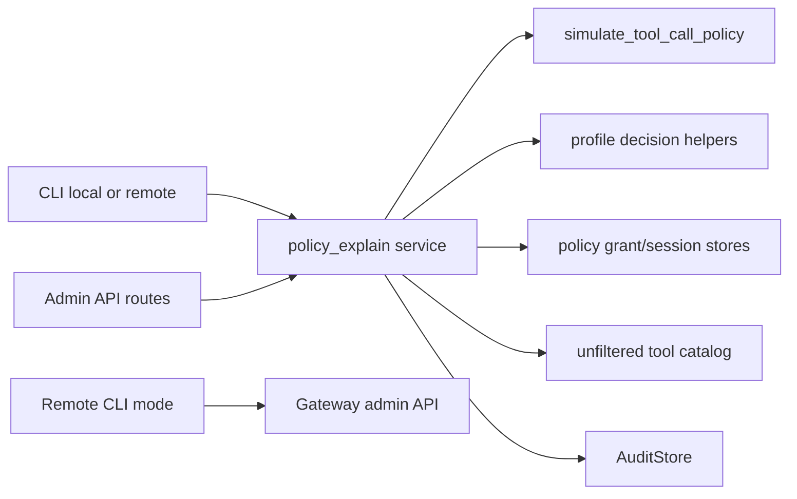

# MCP Effective Permission Explain And Preview Design

Date: 2026-06-16
Status: Draft for spec review
Owner: Codex brainstorming session
Backlog: TASK-2368

## Summary

Add a read-only policy explanation surface for the standalone MCP gateway so operators can answer two questions before exposing tools to models:

1. Why would this specific profile, tool, and argument set be denied, require approval, or be allowed?
2. Which tools would a profile see by default, including tools hidden by policy and tools recommended but not installed?

The first implementation should provide an admin API and CLI, backed by a shared `mcp_unified.gateway.policy_explain` service. The service should reuse the existing policy simulation, decision, session grant, and discovery primitives instead of creating a second enforcement engine.

The output is for operators and automation, not for model context by default. It must be redacted, audit every request, support runtime-effective and static-policy-only views, and degrade explicitly when a complete tool catalog or runtime state cannot be resolved.

## User-Approved Decisions

- First surface: admin API plus CLI.
- Explain scope: both a single attempted tool call and profile-wide preview.
- Profile-wide preview depth for V1: tool visibility only.
- Runtime mode: runtime-effective by default, with optional static-policy-only mode.
- CLI modes: local config/store mode and remote running-gateway admin API mode.
- Authorization boundary: dedicated permission for policy explanation, separate from mutation admin.
- Audit behavior: always audit policy explanation and preview requests.
- Denied tools in profile preview: included by default because this is an admin/operator surface.
- Architecture approach: shared `policy_explain` service used by API and CLI.

## Goals

- Provide a reliable answer for effective permission decisions without changing runtime enforcement semantics.
- Make profile debugging practical by showing matched rule sources, normalized subjects, transient grant participation, install state, runtime availability, and final decision.
- Keep the policy core executable and flat, while leaving room for authored hierarchical policies to compile into effective grants later.
- Allow tldw_server and standalone gateway deployments to delegate policy explanation without granting full admin mutation rights.
- Preserve compatibility with the existing `simulate-policy` CLI command.
- Avoid leaking file contents, raw arguments, secrets, absolute host paths, or sensitive URL parts through responses or audit events.
- Make degraded and partial answers explicit enough for CI, operators, and UI surfaces to reason about.

## Non-Goals

- Do not implement model-facing MCP tools for permission explanation in the first slice.
- Do not add a web UI in the first slice.
- Do not replace runtime policy enforcement, permission rules, session grants, approval leases, or hook enforcement.
- Do not add hierarchical policy authoring in this slice.
- Do not add shell alias parsing in this slice.
- Do not expose raw tool arguments, raw shell commands, file contents, diffs, credential values, or host-absolute paths.
- Do not require semantic search for preview or ranking.

## Current Repo Foundation

The current MCP unified module already has most of the policy primitives needed for an explain surface:

- `mcp_unified.gateway.policy_simulation.simulate_tool_call_policy` provides read-only simulation for a candidate tool call.
- `mcp_unified.profiles.decisions.PolicyDecisionOutcome` defines `deny`, `ask`, and `allow`.
- `mcp_unified.profiles.decisions.explain_profile_tool_decision` explains static profile tool policy decisions.
- `mcp_unified.profiles.subjects.extract_permission_rule_subjects` extracts policy subjects from tool arguments.
- `mcp_unified.profiles.effective_policy.build_effective_policy_result` builds effective profile policy state.
- Existing gateway storage bundles can include an `AuditStore`.
- Existing gateway CLI has local profile storage and remote gateway admin client patterns.
- Existing tool discovery surfaces filter denied or hidden tools for model-facing use.
- Existing standalone admin auth validates API keys but does not yet expose an identity or permission result to route handlers.
- Several existing gateway managers treat audit as best-effort. This feature must use a stricter audit path because the user-approved contract requires every explain or preview request to be audited.

The important design consequence is that admin preview cannot rely only on model-facing `list_profile_tools` output. That API intentionally hides denied tools, while this feature must explain both visible and denied tools. A complete admin preview needs an unfiltered tool catalog input. When that catalog is unavailable, the preview must return a degraded response rather than pretending the filtered model-facing catalog is complete.

## Design Review Hardening Incorporated

The design includes the following hardening points from review:

- Explicit outcome precedence: `deny` wins over `ask`, and `ask` wins over `allow`.
- Separate permission modes are represented by the effective policy state rather than by new explain-only semantics.
- Path subjects are normalized and redacted before response or audit.
- Symlink, path grant, hook, sandbox, and shell parsing enforcement are outside this slice, but explain output must leave room to display those decision contributors once implemented.
- Hook decisions, when present in future runtime traces, must not bypass explicit deny rules.
- Dedicated tools remain preferred over shell escape hatches.
- MCP server and tool wildcard subjects should be explainable using existing profile subject forms.
- The response contract must answer why a tool, path, domain, or other subject is allowed or denied, including rule source, hook result when applicable, and final decision.

## Proposed Architecture

Add a shared read-only service module:

```text
mcp_unified/gateway/policy_explain.py
```

The service owns response model assembly, redaction, degraded-state reporting, and audit event emission. It delegates policy decisions to existing policy primitives.



The service should be dependency-injected with:

- Profile store or resolved profile.
- Optional policy grant store.
- Optional approval/session grant resolver.
- Optional unfiltered tool catalog provider.
- Optional runtime status provider.
- Required audit store for API mode and local CLI V1.
- Strict audit helper that returns success or raises a public policy-explain error.
- Actor/request metadata.

The service should not execute tools, mutate profile state, install packages, or make network calls other than through explicitly provided runtime/admin clients.

The implementation should add a public unfiltered catalog provider for admin use instead of calling private discovery helpers such as `_visible_entries`. Model-facing discovery should remain filtered.

## Service Contract

V1 service operations:

```python
async def explain_tool_call(request: PolicyExplainRequest) -> PolicyExplainResponse:
    raise NotImplementedError

async def preview_profile_tools(request: ProfileToolPreviewRequest) -> ProfileToolPreviewResponse:
    raise NotImplementedError
```

### `PolicyExplainRequest`

Required fields:

- `profile_id`
- `tool_name`

Optional fields:

- `arguments`: accepted only for transient subject extraction.
- `capability`: optional capability override when the caller already knows it.
- `session_id`: used for runtime-effective session grants.
- `mode`: `runtime_effective` by default or `static_policy_only`.
- `include_degraded_details`: defaults to true for admin surfaces.

Argument handling:

- Request argument payloads should have a conservative byte-size cap.
- Oversized argument payloads should fail before policy evaluation with a structured validation error.
- Raw arguments should be discarded immediately after subject extraction.

### `ProfileToolPreviewRequest`

Required fields:

- `profile_id`

Optional fields:

- `mode`: `runtime_effective` by default or `static_policy_only`.
- `session_id`
- `category`
- `include_recommendations`: defaults to true.
- `include_denied`: defaults to true.
- `limit`: defaults to 200.
- `cursor`

Hard cap:

- `limit` must be capped by configuration, with a recommended V1 hard cap of 1000.

## Admin API Surface

Add admin API endpoints under the existing gateway admin router:

```http
POST /policy/explain
POST /profiles/{profile_id}/tool-preview
```

The concrete mount path follows the existing gateway router prefix. The endpoint names should avoid implying mutation. The preview endpoint uses `POST` even though it is read-only because request bodies are safer for `session_id`, filters, and future policy subjects than query strings that are commonly logged.

### `POST /policy/explain`

Request body:

```json
{
  "profile_id": "backend-engineer",
  "tool_name": "fs.patch",
  "arguments": {
    "path": "src/app.py"
  },
  "session_id": "optional-session",
  "mode": "runtime_effective"
}
```

Response:

```json
{
  "ok": true,
  "mode": "runtime_effective",
  "evaluated_at": "2026-06-16T20:00:00Z",
  "profile_id": "backend-engineer",
  "tool_name": "fs.patch",
  "final_outcome": "allow",
  "visibility": "visible",
  "reason_code": "allowed_by_profile_rule",
  "subjects": [
    {
      "kind": "path",
      "value": "src/app.py",
      "redaction_state": "sanitized",
      "decision": "allow",
      "matched_rules": [
        {
          "source": "profile.path_grant",
          "outcome": "allow",
          "pattern": "src/**"
        }
      ]
    }
  ],
  "installation_status": "installed",
  "runtime_availability": "available",
  "transient_grants_evaluated": true,
  "degraded": false,
  "degraded_reasons": [],
  "skipped_contributors": [],
  "redacted": true,
  "truncated": false
}
```

### `POST /profiles/{profile_id}/tool-preview`

Path parameters:

- `profile_id`

Request body:

- `mode`
- `session_id`
- `category`
- `include_recommendations`
- `include_denied`
- `limit`
- `cursor`

The path `profile_id` is canonical. If a future body schema also accepts `profile_id`, a conflicting value must fail validation instead of silently selecting one.

Response:

```json
{
  "ok": true,
  "mode": "runtime_effective",
  "evaluated_at": "2026-06-16T20:00:00Z",
  "profile_id": "backend-engineer",
  "summary": {
    "visible": 42,
    "hidden": 8,
    "deferred": 3,
    "allow": 38,
    "ask": 4,
    "deny": 8,
    "not_installed": 3
  },
  "tools": [
    {
      "tool_name": "fs.patch",
      "display_name": "Patch file",
      "category": "filesystem",
      "outcome": "allow",
      "visibility": "visible",
      "reason_code": "allowed_by_profile_rule",
      "installation_status": "installed",
      "runtime_availability": "available"
    },
    {
      "tool_name": "shell.exec",
      "display_name": "Shell",
      "category": "process",
      "outcome": "deny",
      "visibility": "hidden",
      "reason_code": "denied_by_profile_rule",
      "installation_status": "installed",
      "runtime_availability": "available"
    },
    {
      "tool_name": "mcp__chrome-devtools__navigate",
      "display_name": "Chrome DevTools navigate",
      "category": "browser",
      "outcome": "ask",
      "visibility": "deferred",
      "reason_code": "recommended_not_installed",
      "installation_status": "not_installed",
      "runtime_availability": "unknown"
    }
  ],
  "degraded": false,
  "degraded_reasons": [],
  "skipped_contributors": [],
  "redacted": true,
  "truncated": false,
  "next_cursor": null
}
```

## CLI Surface

Add CLI commands that call the same service in local mode and call the admin API in remote mode:

```bash
mcp-unified explain-policy --profile backend-engineer --tool fs.patch --args-json '{"path":"src/app.py"}'
mcp-unified preview-profile-tools --profile backend-engineer --include-denied
```

Remote mode:

```bash
mcp-unified explain-policy \
  --gateway-url http://127.0.0.1:8000 \
  --admin-key "$MCP_GATEWAY_ADMIN_KEY" \
  --profile backend-engineer \
  --tool fs.patch \
  --args-json '{"path":"src/app.py"}'
```

CLI requirements:

- JSON output is the only required V1 format.
- Remote mode should extend `RemoteGatewayAdminClient`.
- Local mode should reuse the same storage bundle loading patterns as existing gateway CLI commands.
- `--static-policy-only` maps to `mode=static_policy_only`.
- `--session-id` enables runtime-effective transient grant checks where configured.
- `--args-json` is acceptable for low-sensitivity examples, but the CLI should also support `--args-json-file` and `--args-stdin` so sensitive arguments do not have to appear in shell history or process listings.
- Existing `simulate-policy` remains unchanged for backwards compatibility.

## Authorization Model

Add a dedicated permission seam for admin policy explanation:

```text
mcp.policy.explain
```

Standalone default:

- If admin auth is enabled and the provided admin credential is valid, grant `mcp.policy.explain` unless a custom permission checker is configured.
- If admin auth is disabled, the default standalone identity is an explicit local admin identity so audit records still have a stable actor source.

tldw_server integration:

- The host should be able to map `mcp.policy.explain` to its AuthNZ/RBAC model without granting broader profile, credential, install, or runtime mutation permissions.

Recommended implementation shape:

```python
class GatewayAdminIdentity(BaseModel):
    actor_id: str
    permissions: frozenset[str] = frozenset()
    source: str = "gateway_admin_auth"

class GatewayAdminPermissionChecker(Protocol):
    async def require_permission(
        self,
        identity: GatewayAdminIdentity,
        permission: str,
        *,
        resource: str | None = None,
    ) -> None:
        raise NotImplementedError
```

Policy explanation routes should require both:

- Successful gateway admin authentication.
- `mcp.policy.explain`.

This seam should not relax existing mutation admin authorization. It exists so hosted deployments can delegate read-only permission debugging to operators without granting full mutation power.

The current `gateway_admin_auth_dependencies` shape returns route dependencies that only validate credentials. The implementation should add an identity-producing dependency or request-state adapter for policy-explain routes, while preserving the current auth error payloads and `create_gateway_router` exception handling.

## Audit Model

Policy explanation and preview requests must always be audited.

Use the existing `AuditStore` and `AuditEvent` model rather than adding a separate audit writer.

Do not reuse best-effort audit helpers that swallow append failures. Policy explanation must use a strict append helper because audit failure is a hard failure for this surface.

Event types:

- `policy.explain.requested`
- `policy.preview_tools.requested`

Required audit fields:

- `actor_id`: admin identity if known, otherwise a stable local CLI actor marker.
- `profile_id`
- `target_type`: `tool` for single explain, `profile` for preview.
- `target_id`: tool name or profile id.
- `payload`: redacted metadata only.
- `created_at`: store through existing audit store behavior.

Allowed payload fields:

- request mode.
- session id hash or presence marker, not raw session id if considered sensitive by host policy.
- requested tool name.
- normalized subject kinds and redacted values.
- final outcome.
- reason code.
- degraded flag and degraded reason codes.
- result counts for preview.
- truncation flag.

Disallowed audit payload fields:

- raw arguments.
- file contents.
- diffs.
- credential values.
- environment variables.
- raw shell commands.
- absolute host paths.
- URL query strings or fragments.
- request bodies from remote MCP tools.

Fail-closed behavior:

- Admin API requests fail with a structured `audit_store_unavailable` error if no audit store is configured.
- Local CLI V1 also fails with `audit_store_unavailable` when no audit store can be resolved.
- Failed audit writes prevent returning a successful response with policy details.
- No unsafe unaudited override is included in V1.

## Decision Semantics

The service must report the final decision using existing policy precedence:

```text
deny > ask > allow
```

Runtime-effective mode includes:

- Static profile tool grants and deny rules.
- Permission rules and extracted subjects from supplied arguments.
- Session-scoped TTL path grants.
- Active approval leases for ask subjects, if currently represented by the runtime.
- Install status where available.
- Runtime availability where available.

Static-policy-only mode includes:

- Static profile tool grants and deny rules.
- Static permission rules.
- Extracted subjects from supplied arguments.

Static-policy-only mode excludes:

- Session-scoped TTL grants.
- Runtime approval leases.
- Live upstream process availability.

The response must state which contributors were skipped in static mode.

Static-policy-only mode is not inherently degraded. It should set `degraded=false` when the static answer is complete and include a `skipped_contributors` list to make the intentionally omitted runtime contributors explicit.

Missing tool behavior:

- A single-call explain request for an unknown tool should still return an explanation with `installation_status=not_installed` or `unknown`, depending on catalog data.
- The policy decision should be reported separately from installation state so operators can see whether a tool would be allowed if installed.

## Response Contract

All response models should include:

- `ok`
- `mode`
- `evaluated_at`
- `profile_id`
- `degraded`
- `degraded_reasons`
- `skipped_contributors`
- `redacted`
- `truncated`

Single-call responses should include:

- `tool_name`
- `final_outcome`
- `visibility`
- `reason_code`
- `subjects`
- `installation_status`
- `runtime_availability`
- `transient_grants_evaluated`
- `matched_rules`
- `approval_context`, when applicable and safe.

Profile preview responses should include:

- `summary`
- `tools`
- `next_cursor`

Tool preview entries should include:

- `tool_name`
- `display_name`, when safe and known.
- `category`, when known.
- `outcome`
- `visibility`
- `reason_code`
- `installation_status`
- `runtime_availability`
- `recommendation_source`, when the row comes from recommendation metadata.

Allowed enum values:

```text
mode: runtime_effective | static_policy_only
outcome: deny | ask | allow
visibility: visible | hidden | deferred
installation_status: installed | not_installed | unknown
runtime_availability: available | unavailable | unknown | not_applicable
redaction_state: raw_safe | sanitized | redacted | omitted
```

Recommended reason codes:

```text
allowed_by_profile_rule
allowed_by_session_grant
allowed_by_approval_lease
ask_by_profile_rule
ask_by_permission_rule
denied_by_profile_rule
denied_by_permission_rule
denied_by_hook
denied_by_missing_grant
hidden_by_policy
recommended_not_installed
tool_not_found
catalog_unavailable
filtered_catalog_only
argument_required
arguments_too_large
runtime_state_unavailable
audit_store_unavailable
```

Reason codes should remain stable because they will be used by tests, dashboards, CI policy checks, and future UI affordances.

Error responses should use the same stable envelope across API and CLI:

```json
{
  "ok": false,
  "reason_code": "audit_store_unavailable",
  "message": "Policy explanation requires an audit store.",
  "details": {
    "profile_id": "backend-engineer"
  }
}
```

Error details must follow the same redaction rules as successful responses.

## Profile Tool Preview Semantics

Profile-wide preview is an admin/operator view. It should include denied and hidden tools by default, with a flag to suppress them for compact output.

Tool rows should be assembled from:

- Installed internal tools.
- Installed external MCP tools.
- Profile recommendation catalog entries.
- Category metadata where available.

Ordering:

1. Installed tools before not-installed recommendations.
2. Category filter applied before text filtering if text filtering is later added.
3. Stable lexical sort by category and tool name for deterministic CLI output.

Completeness rules:

- If an unfiltered installed-tool catalog is available, preview can be complete.
- If only the model-facing filtered discovery surface is available, preview is degraded with `catalog_unavailable` or `filtered_catalog_only`.
- Degraded preview must not claim denied count accuracy.

V1 should not evaluate every possible path, URL, or argument-sensitive rule for profile-wide preview. Argument-sensitive tools should be marked as `deferred` when a final answer requires call arguments.

## Degraded State Handling

Degraded responses are allowed only when the answer is still useful and safely bounded.

Examples:

- Runtime status provider unavailable.
- External MCP server state unavailable.
- Installed tool catalog unavailable for profile-wide preview.
- Recommendation catalog unavailable.
- Arguments omitted for an argument-sensitive rule.

Each degraded response must include:

- `degraded=true`
- machine-readable `degraded_reasons`
- safe human-readable detail if available.

Hard failures:

- Profile not found.
- Invalid JSON arguments.
- Argument payload over the configured byte-size cap.
- Unauthorized or missing `mcp.policy.explain`.
- Missing audit store.
- Limit above hard cap after normalization.

## Security And Redaction Rules

Raw arguments are toxic. The service may accept arguments for subject extraction, but must not persist them or echo them.

Redaction requirements:

- Host-absolute paths are normalized to workspace-relative or policy-subject paths where possible.
- Paths outside known workspaces are redacted to a stable marker.
- URL query strings and fragments are removed.
- Shell command strings are never returned in V1.
- Credential, token, cookie, key, password, and secret-like fields are replaced with redaction markers.
- File content, diffs, receipts, and hashes are not included.
- Environment variable values are not included.
- Subject entries should use `redaction_state` rather than a boolean flag so callers can distinguish safe raw values, sanitized values, redacted values, and omitted values.

Audit events must follow the same redaction contract as responses.

The explain surface should not become a side channel for enumerating host filesystem paths or credentials. Operators can see tool names and policy subjects, but not sensitive values.

## Testing Strategy

Unit tests:

- `deny > ask > allow` precedence is preserved.
- Static-policy-only mode skips transient grants and reports skipped contributors.
- Runtime-effective mode includes session-scoped grants when configured.
- Argument-sensitive path subjects are extracted, normalized, and redacted.
- Raw arguments are not present in responses or audit payloads.
- Unknown tool responses distinguish policy decision from installation state.
- Profile preview includes denied tools by default.
- Profile preview marks argument-sensitive rows as `deferred`.
- Degraded catalog state does not report denied counts as complete.
- Limit normalization and hard-cap errors are deterministic.

FastAPI route tests:

- Admin auth failure returns intended auth payload.
- Authenticated identity without `mcp.policy.explain` is denied.
- Successful explain request writes `policy.explain.requested`.
- Successful preview request writes `policy.preview_tools.requested`.
- Missing audit store fails closed.
- Audit append exceptions fail closed and do not return successful policy details.
- Preview accepts body parameters without requiring sensitive session data in query strings.
- Preview rejects conflicting path/body profile ids if body profile ids are later supported.

CLI tests:

- Local `explain-policy` prints JSON.
- Local `preview-profile-tools` prints JSON with denied rows by default.
- Remote mode calls `RemoteGatewayAdminClient`.
- `--static-policy-only` maps to the correct mode.
- `--args-json-file` and `--args-stdin` avoid requiring sensitive argument values on the command line.
- Invalid `--args-json` fails without audit content leakage.
- Existing `simulate-policy` command remains compatible.

Regression tests:

- A denied and hidden tool does not appear in model-facing discovery but does appear in admin preview.
- A recommendation for a not-installed external MCP tool appears with `installation_status=not_installed`.
- A redacted path outside the workspace does not expose an absolute path in response or audit.
- Admin preview uses a public unfiltered catalog provider and does not depend on private model-facing discovery internals.

## Rollout

Recommended implementation slices:

1. Add response models and shared `policy_explain` service with unit tests.
2. Add admin API endpoints, dedicated permission seam, and audit behavior.
3. Add local and remote CLI commands.
4. Add documentation examples after the contracts stabilize.

Each slice should preserve existing gateway behavior and keep `simulate-policy` intact.

## Open Questions And Deferred Work

- MCP/model-facing permission explanation tools can be considered later, but should be separately gated because they expose policy structure to models.
- A web admin UI can consume the same API after the API and CLI contracts are stable.
- Hierarchical policy authoring should compile into the flat executable grants used by this service.
- Shell alias parsing and shell wrapper explanation should be handled in the shell alias work item, then surfaced through this explanation contract.
- Hook, sandbox, file-lock, and temporary grant contributors should be displayed once their runtime decision metadata is available.
