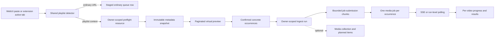

# YouTube Playlist Per-Item Ingest Design

**Date:** 2026-07-12

**Status:** Approved in brainstorming; pending written-spec review

**Backlog:** TASK-12109

**Scope:** Shared WebUI/browser-extension Quick Ingest plus the backend contracts required to expose every playlist item throughout ingestion

## Summary

When a user adds a YouTube playlist URL, the WebUI can currently represent it as one queue row and one ingest job even though video processing later expands the URL into many videos. The frontend therefore reports the lifecycle of the original playlist URL rather than the videos actually being processed.

The target behavior is fail-closed and per-item:

1. Every playlist-shaped URL is inspected by the server before it can enter the queue.
2. The complete, ordered playlist is shown to the user.
3. Every selected video becomes one concrete queue occurrence and one media ingest job.
4. WebUI and extension show the same per-video queue, progress, cancellation, recovery, and result states.
5. Large playlists remain bounded, virtualized, resumable, and honest about server limits.

The frontend must not parse YouTube playlists. The server owns URL classification, metadata extraction, duplicate lookup, snapshot consistency, and job execution.

## Current-State Evidence

The repository already contains most of the product skeleton, but the ordinary URL-add path can bypass it:

- `apps/packages/ui/src/components/Common/QuickIngest/AddContentStep.tsx` detects playlist candidates and offers `PlaylistPreflightPanel`, but `handleAddUrls` still converts every input line directly into one `WizardQueueItem`.
- The extension active-tab action in `apps/packages/ui/src/components/Sidepanel/Chat/ControlRow.tsx` seeds the shared playlist preflight flow, so extension capture is safer than ordinary WebUI paste.
- `apps/packages/ui/src/components/Common/QuickIngest/PlaylistPreflightPanel.tsx` already renders metadata returned by the server, but preview is optional and the panel eagerly renders a short list.
- `tldw_Server_API/app/api/v1/endpoints/media/ingest_jobs.py` creates one job per submitted URL. A playlist URL is therefore initially treated as one item.
- `tldw_Server_API/app/core/Ingestion_Media_Processing/Video/Video_DL_Ingestion_Lib.py` expands YouTube playlists inside video processing.
- `tldw_Server_API/app/services/media_ingest_jobs_worker.py` then projects only `results[0]` into the job result, losing the remaining child-result identities at the Jobs boundary.
- The WebUI direct path in `apps/packages/ui/src/services/tldw/quick-ingest-batch.ts` submits and waits on URL entries sequentially. The extension background path submits entries before polling, so the two clients also differ in scale behavior.
- `apps/packages/ui/src/store/quick-ingest-session.ts` persists Quick Ingest state in `sessionStorage`, whose quota is unsuitable for large playlists and whose failures are currently silent.

The earlier bulk conference workflow established a useful metadata-only preflight and durable collection model. This design tightens the active playlist path and addresses the remaining identity, scale, and recovery gaps without creating a separate playlist product.

## Product Decisions

| Decision | Required behavior |
|---|---|
| Expansion timing | Expand before confirmation; never after the UI has committed to one playlist row. |
| Failure policy | Block playlist ingestion when inspection is unavailable or incomplete. Do not offer an opaque fallback. |
| Large playlists | Load the complete playlist through a bounded server snapshot and paginated client reads. Never silently truncate. |
| Row presentation | Show playlist position and video title first; show channel, duration, availability, duplicate state, and progress second. Keep the concrete URL in row details. |
| Client parity | WebUI paste, extension active-tab import, Add, and Enter use the same shared controller and state model. |
| Execution identity | One selected playlist occurrence maps to one queue row and one media ingest job. |
| Collections | A media collection is optional. Run tracking cannot depend on collection creation. |

## Goals

- Make every selected video visible before submission and throughout its ingest lifecycle.
- Preserve stable mapping among preflight occurrence, queue row, planned collection item when present, job, media result, and retry attempt.
- Support multiple playlists and ordinary URLs in the same staged Quick Ingest session.
- Keep large playlist rendering and network behavior bounded.
- Recover accepted work after WebUI reload or extension service-worker restart.
- Give users truthful statuses for inspection, submission, processing, cancellation, and recovery.
- Preserve the documented multi-result playlist behavior of the no-database `/process-videos` endpoint.

## Non-Goals

- Parsing YouTube pages or playlist APIs in the frontend.
- Creating a general workflow engine or replacing the existing media Jobs system.
- Guaranteeing access to private, deleted, region-blocked, or authentication-gated videos.
- Claiming that all playlist sizes are safe. The server retains an administrator-configurable hard ceiling.
- Automatically loading third-party thumbnails for every row.
- Requiring a media collection for ordinary playlist ingestion.

## Target Architecture

The new contracts are deliberately narrow:

- an asynchronous, temporary playlist-preflight resource;
- a small owner-scoped playlist ingest run manifest;
- structured occurrence-aware submission fields and results on the existing media Jobs endpoint;
- one shared client controller and normalized status transport.

The existing Jobs worker remains responsible for processing each concrete video URL.

## Playlist Detection and Mandatory Inspection

The shared client classifies every submitted line before mutating the queue.

A URL is a playlist candidate when it is a trusted YouTube/youtu.be host and contains a non-empty `list` parameter. This includes `/playlist`, `/watch?...&list=...`, and youtu.be URLs with playlist context. Lookalike and suffix-appended hosts are ordinary web URLs.

Rules:

- Add and Enter invoke playlist inspection instead of `handleAddUrls` for candidates.
- The extension active-tab action invokes exactly the same shared controller.
- The original input remains visible until inspection succeeds or the user removes it.
- Ordinary URLs may appear as staged rows while playlist inspection runs, but Configure, Quick Process, and Start Processing remain disabled while any candidate is unresolved.
- Multiple playlist candidates may inspect concurrently only up to a small client-side bound; the backend applies its own global/per-owner capacity limits.
- No client path may convert a candidate directly into an opaque `WizardQueueItem`.

## Preflight Resource Contract

The current synchronous endpoint remains available as a compatibility surface during rollout. The version-2 client uses an asynchronous resource contract advertised by `mediaPlaylistIngestContractVersion >= 2`.

Suggested routes:

- `POST /api/v1/media/playlist-preflights`
- `GET /api/v1/media/playlist-preflights/{preflight_id}`
- `GET /api/v1/media/playlist-preflights/{preflight_id}/items?cursor=...&limit=...`
- `DELETE /api/v1/media/playlist-preflights/{preflight_id}`

`POST` validates the playlist URL, creates an owner-scoped resource, starts bounded extraction, and returns promptly with HTTP 202. It does not create media, collections, runs, or media ingest jobs.

The resource state is one of:

- `pending`
- `ready`
- `blocked`
- `cancelled`
- `expired`

The summary exposes:

- `preflight_id`
- `status`
- `source_url`
- `source_kind`
- `playlist_id`
- `playlist_title`
- `total_count`, when trustworthy
- `loaded_count`
- `ingestible_count`
- `unavailable_count`
- `duplicate_count`
- `expires_at`
- typed warnings or error code

The item endpoint returns an immutable ordered page plus an opaque `next_cursor`. A cursor is bound to owner, preflight ID, and snapshot version. Tampered, cross-owner, expired, or mismatched cursors fail safely.

### Extraction and capacity

- Extraction runs outside the API event loop in a bounded, terminable process so timeout or cancellation can reclaim capacity.
- The extractor requests at most `configured_limit + 1` entries. Seeing the extra entry produces `playlist_too_large`; it must not first materialize an unbounded playlist.
- If YouTube provides a trustworthy total, the UI may show it. Otherwise the oversized error says the playlist contains more than the configured limit rather than inventing an exact count.
- Successful snapshots are stored in an owner-scoped TTL/LRU cache or equivalent temporary store and are immutable.
- Server restart may expire temporary preflights. That is a recoverable state, not data loss, because no ingest has begun.
- Deleting a preflight terminates or marks extraction cancelled, releases temporary artifacts, and makes future item reads unavailable.

### Preflight item fields

Each item includes:

- `ordinal`
- `occurrence_index_for_source`
- `source_url`, when ingestible
- `normalized_source_id`
- `source_kind`
- `title`
- `channel_or_uploader`
- `duration_seconds`
- `published_at`
- `thumbnail_url`
- `availability`
- `duplicate_status`
- `duplicate_of_occurrence_id`, when applicable
- `selected_by_default`

Unavailable entries remain visible but cannot be selected. A response is `ready` only when the snapshot is complete. An interrupted extraction with unknown missing entries is `blocked`, not partial-ready.

## Identity and Duplicate Semantics

Identity must distinguish an occurrence from its underlying video:

- **Occurrence ID:** stable identity for one row in one preflight/run. It is derived from the opaque preflight identity plus playlist ordinal/occurrence and is used for queue, job, progress, cancellation, and result mapping.
- **Normalized source ID:** canonical video identity, such as a YouTube video ID, used for duplicate detection.

The same video may appear more than once in one playlist or across several staged playlists. Those occurrences remain independently visible while sharing a dedupe identity.

Duplicate evaluation occurs across:

1. repeated items in one snapshot;
2. all playlists and ordinary concrete URLs staged in the current Quick Ingest session;
3. the authenticated user's existing Media DB records through an owner-scoped bulk lookup.

If the library lookup cannot establish existing state, the status is `unknown`, not `new`.

Default selection keeps the first new occurrence and deselects later duplicates. Existing duplicate policies remain explicit: skip, include existing, update metadata only, or overwrite. Overwrite is never selected implicitly.

Refresh reconciliation uses normalized source ID plus occurrence index among repeats. Unambiguous selection is retained. Ambiguous additions, removals, or reordering are disclosed before confirmation.

## Ingest Run Contract

Confirmation creates a lightweight owner-scoped run before any job submission. The run is not a replacement for Jobs; it is a manifest that preserves the relationship between selected occurrences and the job batches that execute them.

Suggested routes:

- `POST /api/v1/media/ingest/runs`
- `GET /api/v1/media/ingest/runs/{run_id}`
- `POST /api/v1/media/ingest/runs/{run_id}/cancel`
- `POST /api/v1/media/ingest/runs/{run_id}/retry`

Run creation receives the preflight identity or identities, selected occurrence IDs, normalized processing options, and optional collection metadata. The server copies the selected concrete URLs and compact display metadata into the run so later preflight expiry cannot affect ingestion.

The run stores:

- owner and `run_id`
- playlist summaries
- occurrence IDs, normalized source IDs, concrete URLs, compact display metadata, and selection
- optional collection and planned-item IDs
- submission chunk states and batch IDs
- job-to-occurrence and job-to-planned-item mappings
- attempt number and endpoint-derived idempotency identity
- per-occurrence and aggregate states
- retention timestamps

A collection is optional. When requested, collection plus planned-item creation is one transactional bulk operation. Failure leaves the run unsubmitted and does not create a partial collection.

Run retention outlives active jobs and remains long enough for reload, extension restart, retry, and result inspection. Cleanup removes only run metadata; it never deletes referenced media or collections.

## Job Submission and Idempotency

Selected concrete URLs are submitted to the existing `/api/v1/media/ingest/jobs` endpoint in bounded chunks. The initial implementation should use a configurable chunk size with a conservative default rather than one request per video or one unbounded request.

Each submitted occurrence carries:

- `run_id`
- `occurrence_id`
- optional planned collection item ID
- attempt number
- a client attempt token used only as input to endpoint-derived idempotency

The endpoint derives the actual Jobs idempotency key from authenticated owner, run, occurrence, and attempt. Raw client keys are never trusted as globally scoped Jobs keys.

The submit response returns a structured record for every occurrence:

- `occurrence_id`
- `accepted` or `rejected`
- `job_id`, when accepted
- `batch_id`
- safe error code and message, when rejected
- `retryable`
- attempt reference

String-only error lists are insufficient because they cannot safely map failures back to repeated URLs.

Global failures stop later chunks: authentication/authorization, quota, worker unavailability, shutdown/draining, invalid run ownership, and rate limiting. Rate-limited clients honor `Retry-After`. Isolated invalid, unavailable, or duplicate entries do not stop unrelated occurrences.

Ambiguous network failure retries the same occurrence attempt. Jobs idempotency returns the original job rather than creating another. A deliberate processing retry uses a new attempt number after reconciling whether the prior attempt already created media.

## Worker Boundary

The media Jobs endpoint enforces the one-occurrence/one-job invariant. An opaque playlist candidate submitted directly to that endpoint fails with HTTP 422 and `playlist_preflight_required`.

The worker receives one concrete video URL and returns one media result. It must not expand a playlist within a media ingest job.

The no-database `/process-videos` endpoint may continue accepting a playlist and returning multiple results because its response already represents a processing batch and does not require one job or one planned-item identity.

## Shared Frontend UX

### Inspection

Pasting a playlist changes the primary action to **Inspect playlist**. Extension active-tab import begins the same inspection automatically because the extension action itself is explicit.

The preflight card shows:

- inspecting progress, such as `Loaded 100 of 742`;
- playlist title and availability summary;
- a virtualized ordered item list;
- title and playlist position as primary text;
- channel, duration, availability, and duplicate state as secondary text;
- Select all, Select none, Select new, and per-row controls;
- typed blocking guidance, retry, cancel, and refresh.

`Add N videos` remains disabled until the snapshot is complete and every selected occurrence has a concrete URL.

An expired snapshot can be restarted. Selection reconciliation is shown only after explicit refresh or expiry recovery; immutable snapshots do not continuously claim the source changed.

### Queue

Confirmation converts selected occurrences into ordinary `WizardQueueItem` records. The queue uses flat per-video rows with a lightweight playlist heading rather than a collapsible parent that hides active work.

Each row preserves:

- occurrence ID and normalized source ID
- title
- playlist ID/title and ordinal
- channel/uploader and duration
- concrete URL
- duplicate state and chosen policy
- optional planned collection item

The title/ordinal is primary. The URL and optional thumbnail appear only in details. Thumbnails are not eagerly loaded; explicit loading uses no-referrer behavior and failure is cosmetic.

### Processing

The first state is **Preparing N videos** while run/collection records and jobs are created. Rows do not claim to be processing before job acceptance.

Normalized occurrence states include:

- `staged`
- `preparing`
- `submit_pending`
- `queued`
- `running`
- `cancellation_requested`
- `completed`
- `skipped_existing`
- `submit_failed`
- `processing_failed`
- `cancelled`
- `status_unavailable`

Known backend progress and messages are displayed. The UI must not fabricate precise Analyze or Store stages when the server supplied only generic processing evidence.

Preflight, queue, processing, and result lists are virtualized and offer useful filters for large runs. Virtual rows preserve keyboard navigation, stable focus, `aria-setsize`, `aria-posinset`, and live summary announcements.

### Cancellation

- Before submission, cancelling a row removes it from unsent chunks.
- After job acceptance, cancelling a row invokes the actual job-cancel endpoint.
- The row remains `cancellation_requested` until the server reports a terminal state.
- If completion wins the race, the final state is completed.
- Cancelling the whole run stops unsent chunks and requests cancellation for all accepted jobs.

### Results and retry

Terminal result groups are Completed, Skipped existing, Not submitted, Failed during processing, and Cancelled.

`status_unavailable` is not terminal. It retains Check again and Reconnect actions and becomes interrupted only when the user abandons recovery or the server proves the job record is no longer recoverable.

Retry first reconciles by normalized source/media identity and optional planned item because a failed job may have created media before failing later. Only eligible occurrences receive a new attempt.

## Persistence and Runtime Recovery

Large Quick Ingest sessions move from silent `sessionStorage` persistence to compact IndexedDB records shared by the common UI package. The WebUI and extension keep separate origin-local databases; the design does not assume cross-origin storage.

Persisted state includes compact display metadata, occurrence/run/job mappings, selections, and terminal summaries. It excludes thumbnail bytes and other bulky artifacts.

Requirements:

- migrate the current session-storage record safely;
- make migration interruption recoverable;
- surface quota or write failure instead of silently losing resume guarantees;
- retain active/interrupted runs and recent terminal results for a bounded period;
- clean expired preflight state and stale terminal runs;
- coordinate multiple tabs so one run is not submitted twice.

Status transport is normalized but platform-aware:

- WebUI prefers run-scoped SSE and falls back to paginated run polling.
- Extension treats polling/reattachment as first-class because a service worker may be suspended; SSE is opportunistic.
- Reopening either UI rehydrates the local run record, asks the server for the owner-scoped run/job snapshot, and reconciles by occurrence ID.

Temporary status-fetch failure produces `status_unavailable`, not failure.

## Error Model

Stable public preflight errors include:

- `invalid_playlist_url`
- `playlist_not_found`
- `playlist_private_or_auth_required`
- `playlist_metadata_unavailable`
- `playlist_too_large`
- `preflight_busy`
- `preflight_timeout`
- `preflight_expired`
- `preflight_cancelled`
- `preflight_incomplete`
- `server_unreachable`

Submission/run errors distinguish authentication, authorization, quota, rate limit, worker unavailable, server draining, invalid ownership, structured per-occurrence rejection, and terminal processing failure.

The UI preserves the source input and gives typed retry/troubleshooting guidance. It never exposes raw yt-dlp output. Unknown provider failures use a generic safe public message with sanitized operator diagnostics.

## Security and Privacy

- Validate trusted YouTube host boundaries; reject lookalike domains.
- Bind preflights, cursors, runs, and jobs to the authenticated owner.
- Derive Jobs idempotency keys with owner scope.
- Redact complete playlist URLs and query secrets in logs and metrics.
- Never persist browser cookies or credentials in preflight/run records.
- Never return another owner's existence through cursor, run, batch, or idempotency behavior.
- Apply existing rate, billing, storage, and worker-readiness controls before accepting work.
- Record counts and typed outcome categories in metrics, not complete source URLs.

## Compatibility and Capability Signaling

The server advertises `mediaPlaylistIngestContractVersion` and granular readiness for asynchronous preflight resources, run tracking, media Jobs, worker availability, and event streaming.

Version-2 clients require the new preflight/run contract for playlist candidates. Older clients that submit a playlist directly to Jobs receive a structured 422 with actionable preflight guidance. The existing synchronous preflight may remain during a deprecation window, but it is not the version-2 path.

The `/process-videos` playlist contract remains separate and covered by compatibility tests.

## Verification Strategy

### Fast PR gate

- Backend unit tests for classification, snapshot state, capacity, pagination, duplicate lookup, error sanitization, Jobs rejection, run transitions, and owner-derived idempotency.
- Hypothesis property/state-machine tests for pagination completeness, occurrence uniqueness, chunk coverage, idempotent ambiguous retry, cancellation/completion races, and terminal-count invariants.
- Shared Vitest tests for mandatory inspection, mixed input blocking, metadata persistence, duplicate selection, filters, virtualization, cancellation dispatch, and transport normalization.
- TypeScript checks and Bandit on touched backend scope.

### Integration gate

- Temporary real Jobs database and worker with only expensive media processing replaced by a deterministic fake.
- Preflight process timeout, cancellation, crash, shutdown, capacity release, and orphan cleanup.
- Owner isolation across preflight, cursors, runs, jobs, optional collections, and idempotency.
- Structured partial acceptance, global chunk-stop behavior, retry reconciliation, run-level list/cancel, and optional transactional collection planning.
- IndexedDB migration, interrupted migration, quota failure, cleanup, retention, multi-tab coordination, and runtime recreation.

### Browser gate

- One complete WebUI journey using the existing 34-item conference fixture: paste, inspect, select, queue, submit, progress, reload/reattach, and results.
- One extension journey: active-tab handoff into the same inspection state, background runtime recreation, polling reattachment, and completion.

Large 500-item behavior is verified below full E2E through bounded mounted-row counts, bounded chunk requests, run-level status retrieval, and the absence of per-item polling fan-out. The configured-limit-plus-one case is a backend contract test.

### External and benchmark checks

Required CI uses deterministic sanitized yt-dlp-shaped fixtures. An optional/nightly external test may verify current YouTube compatibility. Non-blocking benchmarks may track extraction and rendering timings, but normal PR gates assert structural bounds rather than flaky wall-clock thresholds.

Accessibility checks combine axe with explicit tests for virtual-list position metadata, keyboard selection, focus recovery, filter announcements, and live-region deduplication.

## Acceptance Criteria

- No WebUI or extension entry path can queue a YouTube playlist as one opaque item.
- A complete ordered preview appears before confirmation, or ingestion remains blocked with typed guidance.
- Every selected occurrence becomes one concrete queue row and at most one accepted job per attempt.
- Queue, processing, cancellation, recovery, and results preserve occurrence identity and title-first presentation.
- WebUI and extension expose the same normalized states and outcomes.
- Large playlists use bounded extraction, virtualized rendering, chunked submission, and run-level status retrieval.
- Reload, extension runtime restart, partial submission, ambiguous retry, and cancellation do not lose or duplicate accepted work.
- Owner isolation, safe idempotency, redacted diagnostics, and configurable limits are verified.
- `/process-videos` retains its documented multi-result playlist behavior while Jobs ingestion fails clearly when preflight is bypassed.
