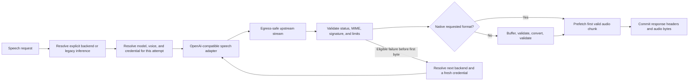

# OpenRouter and Generic TTS Gateway Design

**Status:** Approved for implementation planning

**Date:** 2026-07-15

**Backlog:** TASK-12116

## Goal

Add first-class OpenRouter text-to-speech support while establishing a small,
config-first mechanism for multiple named OpenAI-compatible speech gateways.
Clients explicitly select a backend when the server advertises support, while
existing requests and older servers retain the current model/provider inference
path.

The design supports:

- The built-in `openrouter` TTS backend.
- Administrator-defined backends such as `gateway:company-proxy`.
- OpenAI-compatible speech synthesis with real response streaming.
- Model discovery plus authoritative configuration overlays.
- Administrator-controlled upstream URLs and credentials.
- Optional per-user API keys without user-controlled endpoint URLs.
- Explicit, per-backend, pre-audio fallback policy.
- Buffered conversion when the upstream cannot produce the requested format.
- Per-gateway allowlists for provider-specific request fields.
- Backend-aware discovery, persistence, caching, jobs, and WebUI controls.

## Non-Goals

- A general-purpose arbitrary HTTP connector framework.
- User-configurable gateway URLs, paths, headers, or discovery rules.
- A configurable JSONPath/JMESPath discovery parser.
- Voice scraping or undocumented provider probes.
- Transparent retry of billable synthesis requests.
- Format conversion after any response byte has been sent.
- A new browser-direct OpenRouter provider in the WebUI.
- Hot-reloading gateway definitions in the first release.
- Per-backend WebUI preference history or pricing estimation in the first
  release.

## External Contract

OpenRouter exposes an OpenAI-compatible speech endpoint at
`POST /api/v1/audio/speech` and returns audio bytes. Its documented model
catalog can be filtered for speech-output models through the models endpoint.
OpenRouter voices remain model-specific, so configuration, rather than scraping,
is the authoritative source for voice catalogs and capability details.

References:

- [OpenRouter text-to-speech guide](https://openrouter.ai/docs/guides/overview/multimodal/tts)
- [OpenRouter speech API reference](https://openrouter.ai/docs/api/api-reference/speech/create-audio-speech)
- [OpenRouter model discovery](https://openrouter.ai/docs/guides/overview/models)

## Existing Architecture and Constraints

- `ProviderRegistryBase` already accepts string provider names. The TTS-specific
  wrapper and factory are enum-oriented, but a repository-wide registry rewrite
  is unnecessary.
- The existing OpenAI adapter hard-codes OpenAI models, voices, and formats. It
  should not be cloned for each gateway.
- `OpenAISpeechRequest.voice` currently has a default. Backend defaults therefore
  need Pydantic's fields-set information to distinguish an omitted voice from a
  caller explicitly sending that same value.
- `TTSRequest.__post_init__` currently lowercases model names. Gateway model IDs
  may be case-sensitive; only lookup copies may be normalized.
- The speech endpoint prefetches the first chunk before constructing its
  `StreamingResponse`. This provides the correct boundary for pre-byte fallback
  and response-header selection.
- The central HTTP client already performs egress and redirect validation. The
  gateway adapter must reuse it.
- The current TTS service can append fallback output after a partial stream. The
  new path must never combine audio from different attempts.

## Architecture

### Canonical backend identities

The built-in backend is `openrouter`. Each named gateway is registered using the
canonical identity `gateway:<slug>`, where `<slug>` matches:

```text
[a-z0-9][a-z0-9-]{0,62}
```

One normalizer is shared by configuration loading, registry lookup, BYOK
credential lookup, persistence, logs, and metrics. Display labels are separate
from identities. Duplicate identities, reserved-name collisions, and identity
changes caused by normalization fail configuration validation.

Existing enum-backed providers continue to work. The TTS registry wrapper and
factory are relaxed only where they currently require `TTSProvider`; the shared
registry base remains unchanged.

### Config normalization

The built-in `providers.openrouter` entry and entries under `gateways` are
normalized at startup into one immutable internal `GatewaySpec`. Each enabled
spec creates a separate adapter instance and therefore has independent health,
concurrency, circuit-breaker, discovery-cache, and fallback state.

The implementation uses one concrete `OpenAICompatibleSpeechAdapter` driven by
`GatewaySpec`. OpenRouter-specific behavior is a small built-in branch for
documented headers, speech-model discovery filtering, and supported provider
options. There is no adapter-profile inheritance hierarchy.

### Request flow



Every fallback attempt receives a new request object and separately resolved
credential. The service never mutates and restores the original request and
never reuses the source backend's key for a fallback target.

## Configuration Contract

Gateway definitions live in the existing TTS provider YAML. The following is an
illustrative excerpt; model IDs and voices remain administrator choices rather
than application constants.

```yaml
providers:
  openrouter:
    enabled: false
    display_name: OpenRouter
    base_url: https://openrouter.ai/api/v1/
    speech_path: audio/speech
    api_key: ${OPENROUTER_API_KEY}
    allow_user_api_key: true
    default_model: ${OPENROUTER_TTS_MODEL}
    default_voice: ${OPENROUTER_TTS_VOICE}

    discovery:
      enabled: true
      models_path: models
      query:
        output_modalities: speech
      ttl_seconds: 600
      stale_ttl_seconds: 3600
      timeout_seconds: 5

    capability_defaults:
      formats: [mp3, pcm]
      max_input_characters: 12000
      max_response_bytes: 26214400
      pcm:
        sample_rate: 24000
        channels: 1
        sample_width_bits: 16

    conversion:
      enabled: false
      source_format: mp3
      target_formats: [wav]
      max_input_bytes: 26214400
      max_output_bytes: 52428800
      timeout_seconds: 30

gateways:
  company-proxy:
    enabled: true
    display_name: Company Speech Proxy
    base_url: https://speech.example.com/v1/
    speech_path: audio/speech
    api_key: ${COMPANY_TTS_KEY}
    allow_user_api_key: true
    default_model: Vendor/Expressive-TTS
    default_voice: narrator

    discovery:
      enabled: true
      models_path: models
      query: {}
      ttl_seconds: 600
      stale_ttl_seconds: 3600
      timeout_seconds: 5

    allowed_models:
      - Vendor/Expressive-TTS

    capability_defaults:
      formats: [mp3, pcm]
      max_input_characters: 12000
      max_response_bytes: 26214400
      pcm:
        sample_rate: 24000
        channels: 1
        sample_width_bits: 16

    conversion:
      enabled: true
      source_format: mp3
      target_formats: [wav]
      max_input_bytes: 26214400
      max_output_bytes: 52428800
      timeout_seconds: 30

    model_overrides:
      Vendor/Expressive-TTS:
        default_voice: narrator
        voices: [narrator, guide]
        formats: [mp3, pcm]

    allowed_request_options:
      - /provider/options/vendor/style

    fallback:
      on: [timeout, upstream_5xx, rate_limited]
      max_attempts: 2
      targets:
        - backend: openrouter
          model: ${OPENROUTER_TTS_MODEL}
          voice: ${OPENROUTER_TTS_VOICE}
```

### URL and path rules

- `base_url` is an absolute administrator-controlled HTTPS URL. HTTP may be
  allowed only by the repository's existing explicit local/private deployment
  policy.
- `speech_path` and `models_path` are strictly relative paths without a leading
  slash, scheme, authority, query string, fragment, backslash, or traversal
  segment.
- URL joining cannot replace the configured base authority or base path.
- The existing egress policy is evaluated for every request and every redirect.
  Redirects may be disabled; if followed, each hop must pass the same checks.
- Users can provide only credentials and allowlisted request options. They can
  never provide or override URLs, paths, headers, or authentication schemes.

### Startup validation

All definitions are schema-validated. Enabled gateways additionally require a
usable base URL, speech path, default model, default voice, capability defaults,
and at least one possible credential source. Startup fails for invalid enabled
definitions, identity collisions, forbidden paths, malformed JSON Pointers,
unknown fallback targets, fallback cycles, disallowed default models, or an
attempt bound smaller than the configured path requires.

Configuration is restart-based in the first release. No background hot-reload
or registry mutation mechanism is added.

The built-in OpenRouter backend may send the documented `HTTP-Referer` and
`X-Title` attribution headers from existing administrator-owned application URL
and name settings. They are optional, validated, and never accepted from a TTS
request or BYOK record.

### Discovery and overlays

Discovery accepts only the standard OpenAI-compatible shape:

```json
{"data": [{"id": "Vendor/Expressive-TTS"}]}
```

The merge order is:

1. Read discovered model IDs while preserving exact spelling and case.
2. Apply `allowed_models`, when present, as authorization rather than merely a
   UI filter.
3. Add explicitly configured `default_model` and `model_overrides` entries when
   they pass the allowlist.
4. Apply gateway capability defaults to all remaining models.
5. Apply per-model overrides last.

Discovery is advisory and partial. It does not authorize a model, prove speech
support, or provide a reliable voice catalog. A configured default and configured
model overlays remain usable when discovery is unavailable.

Voice lists, formats, input limits, and PCM metadata come from configuration.
When a voice list is absent, clients may use a free-form voice field while the
backend still applies its configured default for an omitted voice.

Discovery results use a bounded LRU cache partitioned by effective credential
scope. Cache keys never contain raw credentials. Fresh entries use
`ttl_seconds`; a discovery error may use a cached entry only through
`stale_ttl_seconds`. After the stale window, discovery metadata is unavailable,
but explicitly configured models remain available.

### Provider-specific request options

The speech request gains an optional `gateway_options` object. JSON Pointer
entries in `allowed_request_options` are evaluated relative to that object and
name allowed leaf values. Only the allowlisted leaves are copied into the
upstream request body.

Common fields such as `model`, `input`, `voice`, `response_format`, `speed`, and
`language` are reserved and can never be overwritten through gateway options.
The object has conservative depth, leaf-count, string-length, and serialized
byte limits. Arrays and objects must also respect those limits. Unknown,
parent-only, or partially matching pointers are rejected rather than dropped.

This permits documented OpenRouter `provider` options or vendor extensions
without accepting arbitrary upstream payloads.

### Fallback policy

Fallback is disabled unless the source backend declares a policy. The policy
contains a bounded ordered target list, a total-attempt limit, and explicit error
categories. Supported configuration categories are stable internal codes such
as:

- `timeout`
- `network_error`
- `upstream_5xx`
- `rate_limited`
- `quota_exceeded`
- `authentication_failed`
- `model_not_found`
- `invalid_audio`

Unknown internal exceptions are never fallback-eligible. Local conversion
failure, response-size exhaustion, and any failure after the first audio byte
are terminal. There is no same-backend synthesis retry. This avoids accidental
double billing while still letting administrators explicitly choose a
cross-backend availability policy.

Fallback graphs are acyclic and have a hard upper bound of four total attempts,
including the initial backend.
Each target specifies its model; voice may be omitted only when the target has a
configured default. Backend discovery reports that fallback is possible and the
possible target backend identities. A request may set `allow_fallback: false`,
but cannot enable a fallback disabled by configuration.

## API Contract

### Speech request

`POST /api/v1/audio/speech` gains these optional extensions:

```json
{
  "backend": "gateway:company-proxy",
  "model": "Vendor/Expressive-TTS",
  "voice": "narrator",
  "input": "Hello",
  "response_format": "mp3",
  "allow_fallback": true,
  "gateway_options": {
    "provider": {
      "options": {
        "vendor": {
          "style": "warm"
        }
      }
    }
  }
}
```

`backend` may alternatively be supplied as `X-TLDW-TTS-Backend` for SDKs that
cannot add the body extension. Supplying both with different normalized values
returns a structured 400 error. The body value and header value are otherwise
equivalent.

When `backend` is absent, current model/provider inference remains the
compatibility path. When it is present, it always wins over inference. Unknown
backend identities return a structured validation error; disabled or currently
uncredentialed backends return a service-unavailable error without exposing
credential details.

Model and voice casing are preserved exactly. Backend and capability lookups may
use separate normalized copies. Request fields-set information determines
whether backend/model voice defaults should apply; an explicitly supplied value
is never mistaken for an omitted one.

### Discovery endpoints

Existing shapes remain compatible:

- `GET /api/v1/audio/providers` retains `providers`, `voices`, and `timestamp`.
  Dynamic backend entries and optional capability fields are additive.
- The response advertises `supports_explicit_backend: true` when the server
  supports `backend`, `allow_fallback`, and backend-scoped discovery.
- `GET /api/v1/audio/tts/providers/{provider}/model-info` includes discovery
  freshness/source metadata, configured capability information,
  `voice_catalog_available`, and fallback transparency.
- `GET /api/v1/audio/voices/catalog` retains its current response shape and adds
  optional backend and model filters. It is not wrapped in a new envelope.

Catalog endpoints remain authenticated and subject to normal authorization and
rate limits. They do not disclose credentials, credential sources, endpoint
URLs, private headers, or raw upstream errors.

### Error and response behavior

The service continues using the existing public TTS error envelope. New stable
error codes distinguish invalid backend selection, disabled backend, missing
credential, rejected gateway option, discovery unavailable, invalid upstream
audio, response too large, and conversion failure. Raw upstream response bodies
remain internal.

An internal pre-yield response callback on the central streaming client exposes
successful response status and selected headers to the adapter without buffering
the response. The adapter uses it to validate `Content-Type` and capture a
provider generation ID before any bytes are yielded. It does not introduce a
parallel transport or replace streaming with the buffered HTTP helper.

Once the successful attempt is known, the response includes
`X-TLDW-TTS-Backend` with the actual producing backend and
`X-TLDW-TTS-Fallback-Used` with `true` or `false`. These headers are selected
before response commitment and contain only canonical backend metadata.

## Credential Model

Gateway endpoint authority is exclusively administrative. Credential resolution
for every attempt follows this order:

1. If `allow_user_api_key` is true and the authenticated user has a stored key
   for the canonical backend, use that key.
2. Otherwise use the administrator-configured key.
3. If neither exists, mark that backend unavailable for the request.

The built-in `openrouter` backend reuses an existing user OpenRouter BYOK record
so users do not need duplicate credentials for LLM and TTS access. TTS-specific
validation state must not overwrite or downgrade general OpenRouter credential
state. Named gateways use their `gateway:<slug>` identity.

Credential creation never accepts a gateway base URL, including through generic
credential metadata fields. Dynamic TTS credentials are checked using a
non-billable discovery request when one is configured. If no safe check exists,
the key is stored as `stored-unverified`; synthesis is never used as a credential
probe. The public states are `verified`, `stored-unverified`, and `rejected`.

If an administrator removes a gateway, its stored user credentials remain
visible enough for their owner to delete, but they cannot be used. This avoids
undeletable orphaned secrets.

## Runtime and Audio Safety

### Streaming boundary

Fallback and error replacement are legal only before the first audio byte is
committed to the client. The speech endpoint's existing first-chunk prefetch is
the commit boundary.

After the first byte:

- An upstream failure terminates the stream and records a partial response.
- No fallback backend is called.
- No error payload is appended to the audio body.
- No audio from a second provider is concatenated.

Before the first byte, a failed attempt is discarded and may advance to the next
configured fallback target. Buffered attempts are likewise discarded in full
before fallback.

### Audio validation

The adapter validates:

- Successful upstream status before yielding.
- MIME type using an explicit alias map.
- Container or codec signatures when the format has a reliable signature.
- PCM metadata against configured sample rate, channels, and sample width.
- `Content-Length`, when present, and an enforced streaming byte counter.

`application/octet-stream` is accepted only through an explicit gateway
capability and still requires configured/signature validation. A response that
exceeds `max_response_bytes` is terminated. If bytes were already sent, no
fallback occurs.

### Buffered conversion

When the requested format is not natively supported but an administrator-enabled
conversion route exists, the service:

1. Requests a configured native source format.
2. Buffers the entire response under input and duration limits.
3. Validates the source audio.
4. Converts with the existing audio tooling under a wall-clock timeout and
   output-size limit.
5. Validates the converted result.
6. Starts the client response only after all steps succeed.

The converted bytes may then be emitted in chunks, but conversion itself is
never incremental. Local conversion failure is terminal and does not trigger
cross-backend fallback. Native streaming remains the preferred path.

### Circuit breakers

Only gateway-availability signals affect a shared backend circuit: network
errors, connect/read timeouts, and upstream 5xx responses. Authentication,
quota, rate-limit, missing-model, request-validation, invalid-audio, and local
conversion failures do not trip the shared circuit because they may be specific
to one user, model, or request.

## WebUI Integration

OpenRouter and named gateways appear as backends inside the existing `tldw
Server` TTS provider. They do not become browser-direct top-level providers.

The frontend enables backend selection only after the server advertises
`supports_explicit_backend`. Against older servers it keeps the existing provider
and model inference behavior and does not send the new fields.

The selection sequence is backend-scoped:

1. Load authenticated backend discovery.
2. Select or restore a backend.
3. Load that backend's model information.
4. Select an exact-cased model.
5. Load or derive voices for that backend and model.

Backend/model requests use backend-scoped query keys and cancel or ignore stale
results when selection changes. Switching backend atomically resets incompatible
model and voice selections to the new backend defaults. Remembering independent
per-backend selection history is deferred.

The requested and actual producing backends become part of persisted TTS
metadata,
including playground presets, chat playback, document reading, audiobook jobs,
and history metadata. A representative primary-success cache key contains:

```text
tldw + backend + model + voice + format + speed + language
```

To prevent an implicit route change, a result produced by cross-backend fallback
does not populate the primary backend's reusable audio cache in the first
release. It still records both requested and actual backend identities.

New queued jobs resolve and store the requested backend, model, voice, and
fallback permission before enqueueing so later configuration changes cannot
silently reroute their primary attempt. Job results additionally store the
actual producing backend and model after fallback, if any. Legacy records
without a backend continue through legacy inference.

The WebUI shows gateway `display_name`, supports free-form voice entry when no
catalog exists, discloses configured fallback targets, and provides an advanced
control to disable fallback for a request. Admin-configured endpoint URLs and
credential-source details are never displayed to ordinary users. Pricing UI is
deferred because discovered models do not provide stable, comparable speech
pricing metadata.

## Security and Privacy

- Reuse the central egress-safe HTTP client; do not create an adapter-local
  `httpx` client or weaken redirect checks.
- Validate base URLs and relative paths at startup and again through normal
  egress policy at request time.
- Reject user-controlled endpoint, header, auth-scheme, and reserved-body-field
  overrides.
- Bound request text, provider options, discovery responses, audio responses,
  buffered conversion input/output, and conversion execution time.
- Never log API keys, authorization headers, full request options, synthesis
  text, raw upstream bodies, or user-identifying discovery-cache keys.
- Treat cross-backend fallback as a privacy-relevant routing action. Advertise
  possible targets and honor `allow_fallback: false`.
- Resolve credentials independently for every fallback target and never expose
  whether a failure used an administrator or user credential.
- Sanitize provider generation identifiers before storing them as internal
  diagnostics.
- Keep catalog and credential operations authenticated and rate-limited.

## Observability

Structured internal events cover backend selection, discovery source/freshness,
attempt number, sanitized failure category, circuit state, fallback transition,
conversion use, completion, and partial-stream termination.

Metrics use bounded labels such as canonical configured backend, outcome,
failure category, fallback-used, and conversion-used. They do not label by raw
model, voice, user, URL, request option, or generation ID. Administrator startup
logs summarize enabled gateway identities and validation state without printing
URLs or credential availability sources.

## Testing Strategy

### Unit and property-based tests

- Gateway identity normalization and collision rejection.
- Absolute base URL and strict relative-path validation.
- Config normalization, discovery/overlay precedence, exact model casing, and
  gateway capability defaults.
- JSON Pointer leaf allowlists, reserved-field protection, and payload bounds.
- Fallback graph cycle detection, attempt bounds, error eligibility, and fresh
  per-attempt request/credential resolution.
- Discovery TTL/stale-TTL behavior, credential-scope partitioning, and bounded
  LRU eviction.
- BYOK endpoint immutability, existing OpenRouter credential reuse, named gateway
  identities, and orphaned-key deletion.
- Property-based invariants for gateway slugs, relative paths, fallback graphs,
  and bounded option payloads.

### Adapter and API integration tests

Use a reusable mock OpenAI-compatible speech server rather than a paid external
service. Cover:

- OpenRouter and at least two named gateway configurations.
- Request-body mapping, bearer auth, documented OpenRouter headers, and
  allowlisted provider options.
- Model discovery success, partial overlays, stale results, malformed payloads,
  timeouts, and credential-scoped caches.
- Body/header backend selection, conflicts, unknown/disabled/uncredentialed
  backends, and legacy inference.
- Upstream 401/402/404/429/5xx errors and sanitized public mappings.
- MIME aliases, signatures, opt-in octet-stream, PCM metadata, content length,
  and streaming byte limits.
- Fallback before the first byte and terminal failure after it.
- Proof that output from separate attempts is never concatenated.
- Native streaming and first-chunk prefetch behavior.
- Buffered conversion success, malformed input, timeout, input/output limits,
  and proof that no client bytes escape before success.
- `allow_fallback: false` and configured fallback transparency.

### WebUI tests

- Capability negotiation against new and old server responses.
- Backend-scoped query keys and stale selection cancellation.
- Atomic backend/model/voice default reset.
- Exact model casing and free-form voice behavior.
- Backend propagation through all TTS clients and cache keys.
- Deterministic queued-job and persisted-preset identity.
- Fallback disclosure/control and orphaned credential deletion.

Real OpenRouter tests are optional, marked as external, require explicit
environment variables, and stay outside normal CI to avoid cost and flakiness.

## Compatibility and Migration

- `backend`, `allow_fallback`, and `gateway_options` are optional extensions.
- Existing API response keys and voice-catalog envelopes remain intact.
- Existing requests, settings, and records without backend identity retain
  legacy inference.
- OpenRouter is disabled by default and requires administrator-supplied model and
  voice defaults before enabling.
- Existing OpenRouter BYOK records are reused; no duplicate-key migration is
  required.
- Typed persisted records gain a nullable backend field where necessary. JSON
  records simply begin writing the field for new data.
- Existing provider configuration is never automatically rewritten into gateway
  definitions.
- No new runtime dependency is required; the adapter and buffered conversion use
  existing HTTP and audio facilities.

## Rollout

1. Add configuration parsing, normalized specs, registry relaxation, the shared
   adapter, and mock-upstream coverage with all new gateways disabled.
2. Add explicit API selection, credential resolution, discovery, fallback, and
   capability advertisement.
3. Propagate backend identity through server-side TTS consumers, persistence,
   cache keys, and queued jobs.
4. Enable the capability-negotiated WebUI backend controls.
5. Publish administrator configuration, security, troubleshooting, and optional
   OpenRouter smoke-test documentation.

Each stage remains deployable with OpenRouter and named gateways disabled. An
operator can canary a single backend through configuration without changing
legacy TTS routing.

## Risks and Mitigations

- **Double billing:** synthesis is not transparently retried; fallback is
  administrator-configured, bounded, disclosed, and user-disableable.
- **Mixed or corrupt audio:** fallback ends at the first-byte boundary and every
  response is validated before commitment where possible.
- **SSRF or credential redirection:** users never control endpoint authority and
  all requests reuse central egress enforcement.
- **Discovery overclaiming capability:** discovery is advisory; configuration is
  authoritative for voices, formats, limits, PCM metadata, and authorization.
- **Tenant data leakage:** discovery caches are credential-scope partitioned and
  catalog endpoints stay authenticated.
- **High-cardinality telemetry:** raw model, voice, user, and option values are
  excluded from metrics.
- **Stale frontend selection:** queries and persisted identities are backend
  scoped, and incompatible selections reset atomically.
- **Conversion resource exhaustion:** conversion is buffered, explicitly
  enabled, size/time bounded, and performed before response commitment.
- **Configuration complexity:** use one adapter and one normalized spec, accept
  only standard discovery, and defer hot reload, arbitrary parsers, pricing, and
  per-backend preference history.

## Acceptance Criteria

The implementation is complete when:

- An administrator can enable OpenRouter and multiple named gateways solely
  through TTS configuration.
- A negotiated client can explicitly select each backend without breaking legacy
  clients or response shapes.
- Model discovery and configuration overlays produce backend-scoped, exact-cased
  catalogs with safe stale-cache behavior.
- Administrator keys and optional user keys resolve independently for every
  attempt without exposing or accepting user-controlled URLs.
- Provider-specific fields reach an upstream only through that gateway's bounded
  JSON Pointer allowlist.
- Native audio streams through the central egress-safe transport, while
  non-native conversion remains fully buffered.
- Fallback occurs only for configured categories before the first byte and never
  concatenates attempts.
- Every server-side and WebUI TTS consumer persists or caches the effective
  backend identity.
- Unit, property-based, integration, WebUI, security, and touched-scope Bandit
  checks pass without new findings.

## Deferred Work

- Gateway hot reload.
- Arbitrary discovery response parsers.
- Automatic or scraped voice discovery.
- User-defined endpoints or authentication schemes.
- Per-backend preference history.
- Provider pricing comparison.
- Incremental/transcoding streaming conversion.
- Automatic same-backend synthesis retry.
