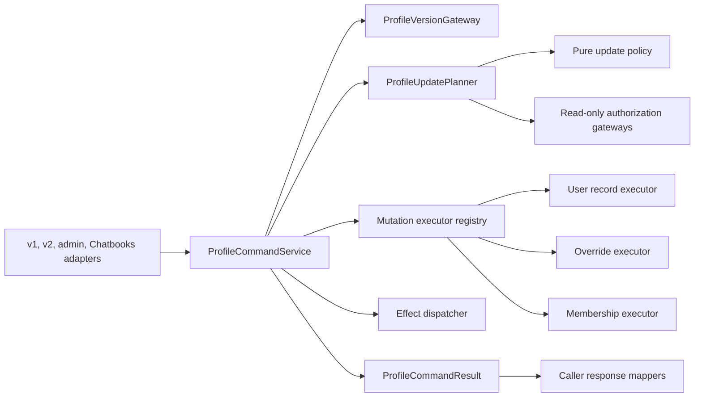

# UserProfiles Stage 2 Single-Update Pipeline Design

**Status:** Draft, approved in discussion and awaiting review of this written specification
**Task:** TASK-13000
**Related work:** PR #2529; historical UserProfiles contract-refactor tasks TASK-12016.1 through TASK-12016.11
**Date:** 2026-07-20

## Problem

The first UserProfiles refactor introduced useful internal seams without changing
public behavior, but the single-update path is still transitional:

- `UpdatePlan` exists but does not drive execution.
- `ProfileUpdatePlanner` delegates to
  `UserProfileUpdateService.apply_updates(..., dry_run=True)`.
- `ProfileCommandService` then invokes the same service again with
  `dry_run=False`, repeating catalog lookup, authorization, parsing, and
  validation.
- Callers open or receive a transaction and pass `db_conn` into the command
  service, so transaction ownership is not at the command boundary.
- Membership helpers can open independent database work outside the caller's
  transaction.
- `ProfileEffectDispatcher` is a logging skeleton and does not represent the
  limiter and cache side effects currently embedded in update execution.
- `ProfileContractMode` reaches the command even though compatibility is a
  response-mapping concern.

This structure makes it difficult to reason about atomicity, race handling,
effect failure, and exact caller compatibility. It also preserves the original
large update service as both validator and executor.

Stage 2 replaces only the single-update pipeline. The bulk update path remains
on `UserProfileUpdateService`, which becomes a bulk-only compatibility facade.

## Goals

1. Plan a single update once and execute that exact immutable plan.
2. Make the command service own the transaction for its normal public API.
3. Keep database mutations in one transaction, including membership writes.
4. Separate catalog policy, authorization, storage execution, external effects,
   and transport response mapping.
5. Preserve the observable behavior of the v1 self, v2 self, admin, and
   Chatbooks callers, subject only to the documented all-or-nothing rollback
   correction for mixed runtime failures.
6. Preserve request order and duplicate keys in planning, execution, and
   compatibility results.
7. Make failure precedence, cancellation, logging, and metrics explicit.
8. Leave the bulk API and its externally visible behavior unchanged.

## Non-goals

- Migrating or redesigning bulk updates.
- Decomposing the read/query service.
- Adding routes or removing legacy endpoints.
- Changing audit ownership or audit event schemas.
- Changing public request or response schemas.
- Changing UserProfiles storage schemas.
- Adding a durable outbox, distributed transaction, or compensation framework.
- Redesigning AuthNZ organization and team membership architecture.
- Making the composite profile version globally linearizable across writers that
  do not participate in the Stage 2 locking protocol.

Minimal transaction-aware membership repository methods are in scope because
single-update database atomicity cannot be achieved without them.

## Decision

Use a typed plan with a small set of storage-bound executors.

The rejected alternatives are:

- Splitting the existing service into similarly large validator and executor
  classes. This would retain key dispatch and effect coupling in two monoliths.
- Creating one strategy object per catalog key. The current key set does not
  justify that class count, registration burden, or discovery overhead.

The selected design groups operations by stable storage behavior: user record,
personal override, and membership. Effects are typed separately because their
failure and commit semantics differ from database mutation semantics.

## Architecture

Dependency direction is toward contracts and narrow gateways. Adapters know the
command service and their mapper. The command service knows planning, version,
execution, effects, and transaction interfaces. Core planning and execution do
not import FastAPI, endpoint schemas, audit emitters, or Chatbooks exceptions.

### `contracts.py`

Define frozen, discriminated dataclasses for:

- `ProfileUpdateCommand`
- `PlanAccepted` and `PlanRejected`
- typed database mutations
- typed required and best-effort effects
- per-key rejection details
- transport-neutral command outcomes

The command contains actor and target IDs, ordered update pairs, normalized role
inputs, dry-run state, optional expected version, and optional active scope IDs.
It does not contain `ProfileContractMode` or a database connection.

The plan does not embed the raw command. It carries only normalized data needed
for execution:

- ordered mutation objects;
- ordered effect objects;
- ordered accepted keys;
- ordered rejections;
- immutable execution context identifiers.

Suggested mutation variants are:

- `UserFieldMutation`
- `TouchUserVersionMutation`
- `OverrideUpsertMutation`
- `OverrideDeleteMutation`
- `OrgRoleMutation`
- `TeamRoleMutation`
- `TeamMembershipMutation`

Suggested effect variants are:

- `SetLoginLockState`
- `SetEvaluationLimits`
- `InvalidateStorageQuotaCache`

Payload classes use explicit fields rather than open string operations and
untyped mappings. Sensitive or user-supplied fields use `repr=False`. Frozen
containers are used recursively so an accepted plan cannot be modified before
execution.

`accepted_keys` and `applied_keys` are distinct:

- accepted means planning approved the key;
- applied means a non-dry-run transaction executed its mutation successfully.

This distinction prevents dry-run semantics from contaminating the domain
model. A compatibility mapper may expose accepted keys as legacy `applied`
keys where the existing contract requires it.

### `update_policy.py`

Extract pure operations from `UserProfileUpdateService`:

- catalog indexing and lookup;
- role normalization and implied admin roles;
- editable-by checks;
- scalar validation and normalization;
- email normalization;
- membership payload parsing;
- deterministic rejection classification.

The module performs no database, limiter, cache, logging, or clock access.

Both the Stage 2 planner and the bulk compatibility facade use this policy.
Parity tests lock the bulk facade to current behavior. Sharing policy does not
authorize changing bulk ordering, partial-success behavior, result shape, or
transaction ownership.

### `planner.py`

`ProfileUpdatePlanner` receives the catalog policy and narrow read-only
gateways. It:

1. normalizes roles;
2. loads membership context only when a membership key is present;
3. walks update pairs in request order without deduplicating;
4. authorizes each catalog entry and active scope;
5. validates and normalizes each payload once;
6. emits typed mutations and mutation-coupled effects;
7. returns `PlanAccepted` or `PlanRejected`.

The planner performs no writes and dispatches no effects. It does not call or
import `UserProfileUpdateService`.

Planning remains all-or-nothing for the single-update command: any rejection
prevents execution. `PlanRejected` still carries ordered accepted keys and all
ordered rejection details needed to reproduce legacy diagnostics.

Membership context is a frozen, minimum-data snapshot. It contains only IDs and
roles required for authorization and target resolution. It must not contain
full user, organization, or team records.

### `executor.py`

Use one registry keyed by mutation type. Registration is validated when
`ProfileCommandService` is constructed and again against the concrete plan
before a transaction opens.

Executors are storage-bound:

- `UserRecordMutationExecutor` updates whitelisted user columns and the user
  version anchor.
- `OverrideMutationExecutor` upserts or deletes personal overrides through
  `UserProfileOverridesRepo`.
- `MembershipMutationExecutor` updates organization/team membership through a
  transaction-aware gateway.

Executors receive the service-owned connection. They do not repeat catalog
validation, role authorization, or general payload parsing. They may recheck
only volatile execution preconditions identified by the plan, such as whether
a membership still exists, whether the actor still has access to its
organization or team, or whether an owner-removal rule still permits the
action. These checks use the transaction connection.

The membership gateway adds connection-aware forms of the minimum operations
used here. Those forms must execute all reads and writes on the supplied
connection and must not obtain another pool connection.

Every non-empty accepted apply plan ends with exactly one
`TouchUserVersionMutation`. Within the Stage 2 path, that mutation sets a
timestamp strictly later than the locked version even on SQLite, whose ordinary
`CURRENT_TIMESTAMP` precision can otherwise permit equal consecutive
versions. An accepted empty plan preserves the current version.

### `effects.py`

The dispatcher owns mutation-coupled effects only. Caller audit remains outside
the plan and outside the transaction.

Effects have explicit policy:

- required effects run before commit; failure rolls back database mutations;
- best-effort effects run only after commit is confirmed.

Handlers use idempotent state-setting operations. For example, set locked or
unlocked state and set a complete evaluation limit configuration; do not encode
effects as non-idempotent increments or toggles.

Where an external API requires a complete configuration, the typed effect
carries the validated field change and the handler reads current external
state, merges that change, and performs one complete set operation. Sequential
effects therefore preserve request order without requiring the planner to
perform external writes or embed unrelated configuration in the plan.

The dispatcher uses a typed handler registry. Missing or duplicate handlers are
configuration errors detected at construction or preflight, before database
mutation begins.

Best-effort timeouts are enforced inside the effect gateway. The dispatcher may
catch ordinary handler exceptions, emit a sanitized failure metric/log, and
continue. It must never catch or suppress cancellation or another
`BaseException`.

### `command_service.py`

The normal `apply(command)` API owns transaction creation and commit. It
coordinates version checks, planning, execution, and effects but contains no
key-specific policy.

The service returns a transport-neutral `ProfileCommandResult`. It does not
return HTTP status codes, FastAPI responses, or endpoint-specific detail text.

Construction dependencies are injectable:

- transaction factory;
- profile version gateway;
- planner;
- mutation executor registry;
- effect dispatcher;
- metrics sink.

Production defaults are assembled in one composition root. Unit tests use
fakes at these narrow boundaries.

### `response_mappers.py`

Caller mappers translate domain outcomes into exact existing behavior.
`ProfileContractMode` is removed from commands and plans because the caller,
not the core, selects the contract.

Separate mapping entry points are provided for:

- legacy v1 self update;
- clean v2 self update;
- admin single update;
- Chatbooks account restore.

The v1 and admin mappers may share a private legacy envelope helper, but the
public entry points remain separate so future contract changes cannot silently
couple them. Mappers are pure and return adapter-facing data rather than
FastAPI responses or Chatbooks exceptions. The Chatbooks adapter converts its
mapped failure decision into the existing `ValidationError`.

## Transaction and Data Flow

### Dry run

1. The adapter performs its existing authentication and caller-level request
   checks.
2. If an expected version is present, the command service reads the current
   composite profile version. A mismatch returns immediately. This stale-first
   check preserves current error precedence over payload rejection.
3. The planner returns `PlanAccepted` or `PlanRejected`.
4. A rejected plan is mapped without opening a write transaction.
5. For an accepted dry run, the service reads the profile version after
   successful planning when no expected version supplied the earlier value.
6. The domain result contains `accepted_keys`, no `applied_keys`, and the
   observed profile version.
7. No mutation, required effect, best-effort effect, or command-owned audit
   occurs.

### Apply

1. Perform the same optional stale-first version precheck.
2. Build one immutable accepted plan.
3. Validate executor and effect handler coverage for the plan.
4. Open a service-owned write transaction.
5. Serialize on the target user:
   - PostgreSQL locks the user row with `SELECT ... FOR UPDATE`.
   - SQLite begins through a write-serializing transaction mode.
6. Recompute the expected profile version through transaction-aware reads and
   reject a conflict before mutation if it no longer matches.
7. Revalidate only volatile preconditions using the same connection.
8. Execute database mutations in plan order, including duplicate keys.
9. Run required idempotent external state-setting effects in plan order.
10. Advance and read the resulting profile version through the same connection.
11. Exit the transaction and confirm commit.
12. Run best-effort effects in plan order.
13. Return the domain result to the caller mapper.
14. The caller emits its existing audit event after receiving success.

If transaction exit or commit raises, post-commit effects do not run and no
success result is returned.

### Composite version limitation

The current profile version is the maximum timestamp across the user record,
personal overrides, and inherited organization/team override state. The user
row lock serializes Stage 2 single-update commands, and every Stage 2 mutation
advances that row's version anchor.

This does not by itself serialize a concurrent bulk or organization/team
override writer that does not lock the same user row. Stage 2 preserves the
existing composite version definition and improves single-command consistency,
but global linearizability requires a later shared writer protocol or dedicated
version column. That broader migration is out of scope and must remain a
documented residual risk.

### Temporary connection bridge

Caller migration may use a temporary `apply_with_connection()` bridge only
when the caller explicitly owns the surrounding transaction and can observe
its successful exit. The bridge delegates to the same planning and
in-transaction execution core; it is not a second implementation.

The bridge returns an opaque prepared result containing deferred best-effort
effect descriptors. The caller must:

1. await the bridge inside its transaction;
2. exit the transaction successfully;
3. call `complete_after_commit(prepared)`;
4. map the resulting domain result.

The bridge is forbidden with FastAPI yield-dependency transactions because the
endpoint returns before dependency teardown confirms commit. Those callers move
directly to `apply(command)`. Chatbooks may use the bridge briefly because it
owns an explicit `async with` transaction. The bridge and prepared-result type
are removed after the last caller migrates.

## Cross-system Atomicity

The transaction covers database state only. A limiter or other external system
cannot participate in the SQLite/PostgreSQL transaction.

A required external effect can succeed and a later effect or database commit
can fail. A retry is made safer by idempotent set semantics, but Stage 2 cannot
promise atomicity across those systems. Durable outbox delivery, compensation,
or reconciliation is a separate design.

This limitation is preferable to silently treating required failures as
success, but it must be visible in module documentation and operational
metrics.

## Errors and Failure Precedence

The domain result uses stable outcome and error codes, not status codes.
Expected outcomes include:

- success;
- dry-run accepted;
- plan rejected;
- version conflict;
- required effect failed;
- execution failed.

A rolled-back failure always has empty `applied_keys`. The core never labels
attempted or rolled-back mutations as applied.

Known planner and execution failures become sanitized domain failures after any
open transaction rolls back. Unexpected repository or gateway failures become
a sanitized internal exception with chained cause for server logs. Raw
exception text is never copied into a result.

Precedence is:

1. initial expected-version mismatch;
2. deterministic planner rejection;
3. inner transaction version conflict;
4. volatile-precondition, execution, or required-effect failure.

Within planner rejection, the existing classification order remains stable and
is table-tested. Rejection details preserve request order even when the
top-level class uses taxonomy precedence.

Cancellation propagates through planning, transaction rollback, required
effects, and best-effort effects. Cleanup may use `finally`, but no broad
`Exception` or `BaseException` handler may convert cancellation into a
domain error.

## Compatibility Matrix

| Caller | Success mapping | Failure mapping | Audit ownership |
| --- | --- | --- | --- |
| v1 self | Existing `UserProfileUpdateResponse`; dry-run accepted keys may populate legacy `applied` | Existing JSON error envelope and status mapping | Endpoint, successful non-dry-run only, current suppression behavior |
| v2 self | Existing `profile_version` plus `applied` shape | Existing `HTTPException.detail` object and status mapping | Endpoint, successful non-dry-run only, current suppression behavior |
| admin single | Existing legacy response and separate audit metadata tuple | Existing legacy JSON error envelope | Admin endpoint/service after successful mapping, including current dry-run event choice |
| Chatbooks restore | Existing restored counts after successful non-dry-run | Existing generic `ValidationError` behavior without payload disclosure | Chatbooks workflow |

Top-level update mappings remain:

| Domain condition | v1 self and admin | v2 self | Chatbooks |
| --- | --- | --- | --- |
| Unknown or unsupported key | 400, `profile_update_unknown_key` | Same status/code in the existing nested detail object | Generic restore validation failure |
| Forbidden key or scope | 403, `profile_update_forbidden` | Same status/code in the existing nested detail object | Generic restore validation failure |
| Target, organization, or team not found during planning | 404, `profile_update_not_found` | Same status/code in the existing nested detail object | Generic restore validation failure |
| Expected version mismatch | 409, `profile_version_mismatch` | Same status/code in the existing nested detail object | Generic restore validation failure |
| Invalid value or membership payload | 422, `profile_update_invalid` | Same status/code in the existing nested detail object | Generic restore validation failure |
| Known per-key failure deferred to execution | Existing 200 legacy envelope with the failed key in `skipped` and empty `applied` after rollback | Existing 200 shape with no `skipped` field and empty `applied` after rollback | Generic restore validation failure |
| Unexpected gateway or commit failure | Existing sanitized 500 path | Existing sanitized 500 path | Existing generic restore failure |

The rollback of a known execution or required-effect failure intentionally
corrects partial persistence without changing its public status or envelope.
For a mixed request where the legacy implementation would commit and report
other keys despite one runtime failure, Stage 2 instead rolls back all keys and
returns an empty `applied` list. This is the sole required response-value
compatibility exception because preserving the old list would falsely report
rolled-back mutations as applied. Metrics distinguish this rollback from a
committed success.

Characterization tests, rather than assumptions, define edge behavior for empty
updates, duplicate keys, accepted keys on dry run, skipped details, target
existence checks, and audit counts. Public OpenAPI schemas and serialized
response bodies must not drift.

The Chatbooks adapter preserves email-first ordering followed by sorted override
keys. It no longer opens an outer transaction after migration to the normal
command API.

## Privacy and Observability

Plans, results, logs, and metrics must not expose:

- submitted values;
- email addresses or usernames;
- membership-context payloads;
- raw exception messages;
- credentials or secrets;
- absolute filesystem paths.

Logs may include stable operation type, sanitized error code, backend, and
non-sensitive correlation context already allowed by project policy.

Metrics use low-cardinality labels only. Required counters include:

- planner rejection by stable code;
- version conflict;
- required effect failure by effect type;
- transaction rollback;
- commit failure;
- post-commit best-effort failure by effect type.

User IDs, keys with unbounded cardinality, values, and payload-derived strings
are forbidden metric labels.

## Migration Plan

1. Characterize all four callers, including duplicate ordering, failure
   precedence, audit behavior, dry-run versions, and runtime failures.
2. Add typed contracts and pure policy without changing routing.
3. Make the bulk facade consume the shared pure policy under parity tests.
4. Implement the independent planner and remove its dependency on the bulk
   facade.
5. Add transaction-aware version, override, and membership gateways plus the
   storage-bound executors.
6. Implement typed effect handlers and registry validation.
7. Implement the transaction-owning command service and, only where safe, the
   temporary deferred-effect connection bridge.
8. Migrate v1 self, v2 self, admin single, and Chatbooks one at a time, keeping
   focused tests green after each migration.
9. Remove `db_conn`, `ProfileContractMode`, the connection bridge, and the
   prepared-result type from the single-update API.
10. Add import-boundary enforcement and complete final verification.

There is no runtime feature flag and no parallel production implementation.
Each transitional adapter delegates to the same core, and transitional code is
deleted before Stage 2 completes.

At completion, no single-update caller or single-update core module imports or
invokes `UserProfileUpdateService`.

## Test Strategy

### Characterization and mapping

- Parameterize the compatibility matrix across v1, v2, admin, and Chatbooks.
- Capture exact status, body shape, detail nesting, key ordering, and dry-run
  semantics.
- Verify audit emission, suppression, event type, and counts without moving
  audit into core.
- Cover mixed accepted/rejected input and duplicate keys.

### Pure policy

- Table-test every catalog type, boundary, role class, and membership payload.
- Compare shared-policy outcomes with the legacy bulk facade.
- Use property tests for role normalization, immutable order preservation,
  duplicate preservation, numeric boundaries, and deterministic error
  precedence.
- Do not use database-backed Hypothesis tests.

### Planner and executor

- Prove the planner has no write or effect calls.
- Prove one normalized payload is used by execution without revalidation.
- Prove every mutation and effect type has exactly one handler.
- Verify all membership operations use the supplied connection.
- Verify mutations execute in request order and roll back as one unit.
- Verify the user version anchor advances monotonically.

### Transactions and concurrency

- Use events and barriers, never sleeps, to pause between stale precheck, row
  lock, inner recheck, mutation, required effect, and commit.
- Prove a competing Stage 2 update causes the inner expected-version conflict.
- Prove no post-commit effect runs after rollback or commit failure.
- Prove cancellation propagates and the transaction closes.
- Run equivalent SQLite and PostgreSQL suites.

PostgreSQL CI is a merge gate even when a local shared fixture reports
PostgreSQL unavailable and skips.

### Effects

- Required handler failure produces rollback and a sanitized domain code.
- Repeated required state-setting effects are idempotent.
- Best-effort failures after commit do not alter success.
- Gateway timeouts are bounded.
- `asyncio.CancelledError` is not swallowed.
- The temporary bridge cannot dispatch deferred effects before commit
  confirmation.

### Structural and security gates

- Use AST/import-boundary tests to forbid FastAPI imports in domain modules and
  `UserProfileUpdateService` imports in the single-update path.
- Avoid brittle source-text grep as the enforcement mechanism.
- Run focused and integration suites, compile checks, Bandit on touched
  production paths, dependency checks, and `git diff --check`.
- Compare generated OpenAPI and exact response fixtures for public drift.
- Scan logs and metric labels in failure tests for submitted values and raw
  exception text.

## Completion Criteria

- All four callers use the transaction-owning command API.
- The temporary connection bridge and prepared-result contract are removed.
- No single-update code depends on `UserProfileUpdateService`.
- Bulk behavior remains characterized and unchanged.
- Planner output is typed, frozen, ordered, and executed without duplicate
  policy validation.
- Membership writes use the command transaction.
- Required and best-effort effects follow their documented timing.
- Caller-specific responses and audits match current behavior except for the
  documented applied-list correction after an all-or-nothing runtime rollback.
- Focused SQLite and PostgreSQL suites pass, with PostgreSQL enforced in CI.
- Compile, Bandit, dependency, whitespace, import-boundary, and OpenAPI gates
  pass.
- Cross-system atomicity and composite-version limitations are documented.
