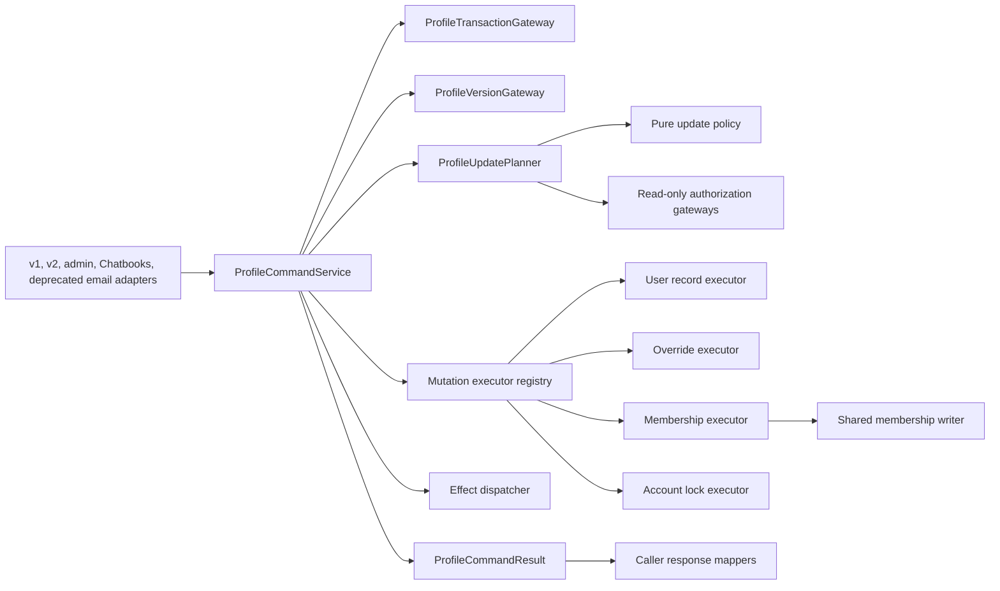

# UserProfiles Stage 2 Single-Update Pipeline Design

**Status:** Approved; Work Package 1 complete, Work Package 2 next
**Task:** TASK-13000
**Related work:** PR #2529; historical UserProfiles contract-refactor tasks TASK-12016.1 through TASK-12016.11
**Date:** 2026-07-20; revised 2026-08-08

## Problem

The first UserProfiles refactor introduced useful internal seams without changing
public behavior, but the single-update path is still transitional:

- `UpdatePlan` exists but does not drive execution.
- `ProfileUpdatePlanner` delegates to
  `UserProfileUpdateService.apply_updates(..., dry_run=True)`.
- `ProfileCommandService` then invokes the same service again with
  `dry_run=False`, repeating catalog lookup, authorization, parsing, and
  validation.
- Callers open or receive a transaction and pass `db_conn` into the command
  service, so transaction ownership is not at the command boundary.
- Membership helpers can open independent database work outside the caller's
  transaction.
- `ProfileEffectDispatcher` is a logging skeleton and does not represent the
  limiter and cache side effects currently embedded in update execution.
- `ProfileContractMode` reaches the command even though compatibility is a
  response-mapping concern.
- SQLite's `update_users_timestamp` trigger rewrites `users.updated_at` with
  second precision after every user-row update, so that column cannot support
  an exact one-touch profile-version protocol.

This structure makes it difficult to reason about atomicity, race handling,
effect failure, and exact caller compatibility. It also preserves the original
large update service as both validator and executor.

Stage 2 replaces the single-update pipeline and the default-enabled deprecated
`PUT /api/v1/users/me` email writer. The bulk update path remains on
`UserProfileUpdateService`, which becomes a bulk-only compatibility facade.
The AuthNZ membership writers used by both paths adopt one shared lock and
version-anchor protocol so Stage 2 cannot race a direct membership write.

## Goals

1. Plan a single update once and execute that exact immutable plan.
2. Make the command service own the transaction for its normal public API.
3. Keep database mutations in one transaction, including membership writes.
4. Separate catalog policy, authorization, storage execution, external effects,
   and transport response mapping.
5. Preserve the observable behavior of the v1 self, v2 self, admin, Chatbooks,
   and deprecated email callers, subject to the documented correction that a
   rolled-back command is an error rather than an HTTP 200 success.
6. Preserve request order and duplicate keys in planning, execution, and
   compatibility results.
7. Make failure precedence, cancellation, logging, and metrics explicit.
8. Leave the bulk API and its externally visible behavior unchanged.
9. Serialize Stage 2 membership changes with existing direct membership writers
   and advance the affected user's profile-version anchor in the same
   transaction.
10. Replace `users.updated_at` as the profile-version anchor with a dedicated,
    explicitly written `users.profile_version` value.

## Non-goals

- Migrating or redesigning bulk updates.
- Decomposing the read/query service.
- Adding routes or removing legacy endpoints.
- Changing audit ownership or audit event schemas.
- Changing public request or response schemas.
- Adding a durable outbox, distributed transaction, or compensation framework.
- Redesigning AuthNZ organization and team membership schemas or public APIs.
- Making the composite profile version globally linearizable across writers that
  do not participate in the Stage 2 locking protocol.

Minimal transaction-aware membership methods and migration of existing direct
organization/team membership writers to the shared lock and version protocol
are in scope. Writer categories outside that protocol, such as bulk user-field
updates and organization/team override administration, remain a documented
linearizability limit.

Two narrow storage migrations are in scope: `users.profile_version` in AuthNZ
and monotonic `reserved_generation`/`applied_generation` fields in the
evaluations limiter database. No profile override table or public schema
changes.

## Decision

Use a typed plan with a small set of storage-bound executors.

The rejected alternatives are:

- Splitting the existing service into similarly large validator and executor
  classes. This would retain key dispatch and effect coupling in two monoliths.
- Creating one strategy object per catalog key. The current key set does not
  justify that class count, registration burden, or discovery overhead.

The selected design groups operations by stable storage behavior: user record,
personal override, and membership. Effects are typed separately because their
failure and commit semantics differ from database mutation semantics. A
dedicated profile-version column isolates optimistic concurrency from generic
`users.updated_at` triggers and unrelated account maintenance.

## Architecture



Dependency direction is toward contracts and narrow gateways. Adapters know the
command service and their mapper. The command service knows planning, version,
execution, effects, and transaction interfaces. Core planning and execution do
not import FastAPI, endpoint schemas, audit emitters, or Chatbooks exceptions.

### `contracts.py`

Define frozen, discriminated dataclasses for:

- `ProfileUpdateCommand`
- `PlanAccepted` and `PlanRejected`
- typed database mutations
- typed required and best-effort effects
- per-key rejection details
- transport-neutral command outcomes

The command contains actor and target IDs, ordered update pairs, normalized role
inputs, dry-run state, optional expected version, and optional active scope IDs.
It does not contain `ProfileContractMode` or a database connection.

The plan does not embed the raw command. It carries only normalized data needed
for execution:

- ordered mutation objects;
- ordered effect objects;
- ordered accepted keys;
- ordered rejections;
- immutable execution context identifiers.

Suggested mutation variants are:

- `UserFieldMutation`
- `TouchUserVersionMutation`
- `AccountLockStateMutation`
- `OverrideUpsertMutation`
- `OverrideDeleteMutation`
- `OrgRoleMutation`
- `TeamRoleMutation`
- `TeamMembershipMutation`

Suggested effect variants are:

- `SetEvaluationLimits`
- `InvalidateStorageQuotaCache`

Payload classes use explicit fields rather than open string operations and
untyped mappings. Sensitive or user-supplied fields use `repr=False`. Frozen
containers are used recursively so an accepted plan cannot be modified before
execution.

`accepted_keys` and `applied_keys` are distinct:

- accepted means planning approved the key;
- applied means the command committed that key successfully.

This distinction prevents dry-run semantics from contaminating the domain
model and prevents attempted or rolled-back mutations from being reported as
applied. A compatibility mapper may expose accepted keys as legacy `applied`
keys where the existing dry-run contract requires it.

### `update_policy.py`

Extract pure operations from `UserProfileUpdateService`:

- catalog indexing and lookup;
- role normalization and implied admin roles;
- editable-by checks;
- scalar validation and normalization;
- email normalization;
- membership payload parsing;
- deterministic rejection classification.

The module performs no database, limiter, cache, logging, or clock access.

Both the Stage 2 planner and the bulk compatibility facade use this policy.
Parity tests lock the bulk facade to current behavior. Sharing policy does not
authorize changing bulk ordering, partial-success behavior, result shape, or
transaction ownership.

### `planner.py`

`ProfileUpdatePlanner` receives the catalog policy and narrow read-only
gateways. It:

1. accepts the command service's immutable operation timestamp and resolved
   lockout configuration as input rather than reading a clock or configuration
   singleton;
2. normalizes roles;
3. loads membership context only when a membership key is present;
4. walks update pairs in request order without deduplicating;
5. authorizes each catalog entry and active scope;
6. validates and normalizes each payload once;
7. emits typed mutations and mutation-coupled effects;
8. returns `PlanAccepted` or `PlanRejected`.

The planner performs no writes and dispatches no effects. It does not call or
import `UserProfileUpdateService`.

Planning remains all-or-nothing for the single-update command: any rejection
prevents execution. `PlanRejected` still carries ordered accepted keys and all
ordered rejection details needed to reproduce legacy diagnostics.

Membership context is a frozen, minimum-data snapshot. It contains only IDs and
roles required for authorization and target resolution. It must not contain
full user, organization, or team records. Authorization gateway failure is a
sanitized command failure, never an empty-membership fallback or permissive
authorization result.

### `executor.py`

Use one registry keyed by mutation type. Registration is validated when
`ProfileCommandService` is constructed and again against the concrete plan
before a transaction opens.

Executors are storage-bound:

- `UserRecordMutationExecutor` updates whitelisted user columns and the user
  profile-version anchor.
- `OverrideMutationExecutor` upserts or deletes personal overrides through
  `UserProfileOverridesRepo`.
- `MembershipMutationExecutor` updates organization/team membership through a
  shared transaction-aware writer.
- `AccountLockMutationExecutor` sets login lock state in the AuthNZ
  `failed_attempts` and `account_lockouts` tables through the supplied
  connection.

Executors receive the service-owned connection. They do not repeat catalog
validation, role authorization, or general payload parsing. They may recheck
only volatile execution preconditions identified by the plan, such as whether
a membership still exists, whether the actor still has access to its
organization or team, or whether an owner-removal rule still permits the
action. These checks use the transaction connection.

The account-lock mutation is a database mutation, not an external effect. The
planner binds a stable `locked_until` value from the command's operation time
and configured lock duration. The executor resolves the login identifier on
the supplied connection and uses true set semantics: lock writes the exact
threshold and expiry represented by the mutation; unlock resets or removes both
records. It never calls `RateLimiter.record_failed_attempt()`, increments an
attempt counter, extends an expiry on repeated execution, or opens another
transaction.

The membership writer adds connection-aware forms of the minimum operations
used here. Those forms execute all reads and writes on the supplied connection
and never obtain another pool connection. Existing direct add, remove, and
role-update writers for organization and team membership delegate to this same
core instead of retaining independent count-then-write logic.

Executors translate expected backend races, such as a unique-email constraint,
into typed sanitized execution failures. The command service immediately wraps
those failures in its private rollback signal while still inside the
transaction; raw `ValueError`, timeout, or backend exceptions are never used as
rollback control flow.

Every non-empty accepted apply plan contains exactly one final
`TouchUserVersionMutation`. It is a marker; after computing the version floor,
the command service passes one exact `touch_value` to its executor. No earlier
executor may touch `users.profile_version`, and the command service does not
perform a second advance. SQLite's existing `users.updated_at` trigger may still
update operational metadata, but `updated_at` is no longer a version component.
An accepted empty plan preserves the current profile version.

### Profile-version storage

Fresh SQLite and PostgreSQL schemas add `users.profile_version` with the same
timestamp representation used by the backend: canonical UTC RFC 3339 text with
six fractional digits on SQLite and `TIMESTAMPTZ` on PostgreSQL. The upgrade
migration:

1. adds the column;
2. backfills every row from normalized `users.updated_at`;
3. verifies no null or unparsable values remain; and
4. blocks route readiness if verification fails.

The SQLite `update_users_timestamp` trigger remains responsible only for
legacy `updated_at` metadata and cannot overwrite `profile_version`. The
version gateway reads `profile_version`, not `updated_at`. Existing databases
see no initial version jump because the migration preserves the normalized old
value.

All SQLite AuthNZ owners use the same cycle-free schema helper for this anchor.
Migration 091 performs the rebuild inside its migration transaction;
`UserDatabase_v2` runs the owning remediation against its pooled raw connection
before installing the serving write guard; and file-backed `DatabasePool`
startup validates the migrated result before yielding a serving connection.
The canonical default is
`STRFTIME('%Y-%m-%dT%H:%M:%f000Z', 'now')`. A valid canonical table takes a
validate-only fast path. A legacy nullable or defaultless column is rebuilt
atomically, preserving column order, custom constraints, indexes, triggers,
foreign keys, and `sqlite_sequence`; null values are derived from valid
`updated_at` values while existing canonical anchors are unchanged. Missing or
invalid `updated_at` fails closed only when it is required to derive a missing
or null anchor; canonical anchors have no continuing dependency on that legacy
metadata. Malformed/noncanonical anchors, an unexpected rebuild table, or an
incomplete schema also fails closed. The owning remediation requires no caller
transaction, restores the connection's original foreign-key mode, and rolls
back all schema/data changes on ordinary failures and control-flow base
exceptions. Cleanup failures preserve the primary exception, mark the pooled
connection invalid, and force the owner to retire it before reuse.

A connection-aware `VersionedUserWriteGateway` owns direct writes to AuthNZ
`users` columns exposed by profile identity/quota state. The initial inventory
includes UUID, username, email, role/superuser state, active/verified state,
`two_factor_enabled`, last login, and storage quota/usage. It covers current
writers in authentication/verification, MFA enable/disable, admin user
management and provisioning, storage quota maintenance, registration, AuthNZ
user repositories, the deprecated endpoint, the bulk facade, and Stage 2.
Every AuthNZ user insert initializes `profile_version`; every mutation of an
inventoried field locks the user, captures pre- and post-mutation candidates,
and advances the anchor in the same transaction. Secret-only fields such as
password hashes, TOTP secrets, and backup codes do not advance the profile
version unless the same statement also changes an inventoried field.

Production writers delegate to this gateway or to a caller-owned mode that
performs one final touch. A structural SQL/AST test rejects inventoried AuthNZ
`users` INSERT/UPDATE statements outside approved gateways and creator paths.
It distinguishes unrelated per-user content databases named `users` and allows
offline migrations only while the application is not serving traffic.

Task 5 also enforces this ownership at managed AuthNZ database boundaries.
Whole-program SQL inference was rejected after the review prototype found
1,256 unresolved dynamic SQL sinks across unrelated domains; annotating those
sinks would have widened Task 5 and made a static marker an authorization
mechanism. Instead, caller-side async and sync AuthNZ connection guards classify
the actual concrete SQL with a bounded parser cache before database I/O. Raw
profile-visible or unknown-column `users` writes fail closed. Only the
`VersionedUserWriteGateway` can mint a private, exact-type, one-shot capability
bound to the SQL, backend, operation, columns, and managed connection identity.
The capability survives the existing adapters and is consumed at the final
guard. The structural scanner remains a bounded inventory for statically
resolvable writes; unresolved query parameters are covered by runtime guard
tests rather than whole-program analysis.

This runtime guarantee is intentionally scoped to serving AuthNZ connections
opened by `DatabasePool`, its FastAPI adapter, `UsersDB`, or `UserDatabase_v2`.
Offline migrations use their existing narrow maintenance phase; unrelated
content databases and independently opened same-process connections are not in
scope. Code that can introspect or monkeypatch private runtime objects, and
external database principals that connect without the managed AuthNZ openers,
are also outside this firewall's threat model; deployments must restrict direct
database credentials and stored-object DDL accordingly. Managed serving
connections reject creation or replacement of functions, procedures, triggers,
and rules because their executable bodies can conceal protected writes. Table
and index creation remains available, but every `users` creation is protected.
The exact `CREATE TABLE IF NOT EXISTS main.users` or `public.users` bootstrap
shape, including the required anchor columns, executes only with a private
one-shot connection capability; raw canonical DDL, CTAS, incomplete schemas,
temporary relations, unqualified relations, alternate-schema relations, and
rename-to-`users` operations fail closed. SQLite readiness also rejects
temporary `users` or rebuild relations and audits triggers in both the serving
and temporary catalogs before any remediation. All managed
`DROP` and `TRUNCATE` statements fail closed, regardless of target, because
destructive DDL has no serving-path use. `ALTER TABLE users` is limited to
adding non-anchor columns or strengthening non-anchor constraints, column
defaults, or nullability;
`profile_version` alterations require the same private connection-bound
capability as anchor DML. Other destructive or shape-changing alterations fail
closed. The SQLite bootstrap has one
frozen stored-write exception:
`update_users_timestamp` performs only `UPDATE users SET updated_at = ...`, and
`updated_at` is explicitly raw-safe and excluded from profile-version
semantics. The structural boundary test freezes that exact trigger definition
and fails on additional users-writing triggers. It also freezes that the
PostgreSQL AuthNZ bootstrap defines no function, procedure, or trigger that
writes `users`, because such server-side writes would bypass caller-side
interception.

PostgreSQL updatable views that depend on `public.users` are also rejected:
otherwise an alias could bypass target-name classification while still writing
the protected relation. SQL parsing and tokenization failures always become a
stable fail-closed rejection without returning parser input or driver text.

`profile_version` itself is protected. Direct anchor updates fail closed; the
profile-version gateway mints a private one-shot capability for the exact touch
statement on the managed connection, using the same consume-and-revoke path as
other protected writes.

PostgreSQL anchor ownership is centralized in one async/sync leaf helper over a
caller-owned transaction connection. It addresses only `public.users`, audits
direct triggers plus non-extension routines and rules for indirect users
writes, rejects dynamic-SQL routines and active non-extension event triggers,
and detects insert, update, delete, merge, truncate, and copy paths regardless
of token order. It normalizes legacy naive
`updated_at`/`profile_version` timestamps as UTC,
backfills a missing anchor from normalized `updated_at`, and then enforces a
`TIMESTAMPTZ NOT NULL DEFAULT CURRENT_TIMESTAMP` contract. Existing null anchors
are corruption and fail closed instead of being silently repaired. Direct pool
bootstrap, `UsersDB`, `UserDatabase_v2`, and the advisory-lock migration delegate
to this helper; no call site implements its own anchor semantics. Fresh schema
creation and readiness validation run in one owner transaction before the pool
is marked available. Stored-object audits run before and after remediation.
The helper itself acquires the transaction-scoped advisory lock, so direct and
migration callers cannot accidentally omit serialization. Required core DDL is
expressed as guard-compatible ordinary statements and aborts readiness on its
first error; migration failures are never downgraded to a successful startup.

Managed synchronous wrappers are leases, not durable connection handles. Every
checkout has a unique generation; returning or context-exiting the lease
invalidates all wrappers and cursors derived from it before the raw connection
is returned, and a duplicate return fails closed before pool I/O. The explicit
FastAPI test adapter uses one request-scoped connection and transaction for
both SQLite and PostgreSQL, commits once only after successful dependency
completion, and rolls back on any exceptional exit. Its `commit()`
compatibility method never finalizes the request
transaction. `UsersDB.update_user()` likewise performs its write, post-read,
and final commit on one acquired connection with no nested acquisition or inner
commit. Bootstrap and storage failures expose stable domain messages and do not
include raw database values, paths, or driver details.

Candidate membership and configuration tables are created explicitly in
`main` or `public`, so a nonstandard PostgreSQL search path cannot split
bootstrap writes from the relations used by readiness and version candidates.
Their bootstrap definitions are the complete canonical organization, team,
membership, and override schemas, including primary/foreign keys, roles,
statuses, actors, values, and timestamps. The private `users` bootstrap
capability likewise requires the full identity/auth/version contract, including
primary key, unique and not-null fields, and canonical defaults; a partial table
cannot consume the capability. Pool-owned user, repository, quota, and auth
operations leave commit/rollback to the surrounding transaction owner. Changed
synchronous backend failures log only stable exception metadata and raise
stable domain messages.

Effective `identity.is_locked` is derived from time-sensitive
`failed_attempts`/`account_lockouts`, not the legacy `users.is_locked` column.
An explicit Stage 2 lock/unlock command advances `profile_version` through its
normal final touch. Authentication-driven failures, automatic expiry, and
reset outside profile administration remain live security state outside
optimistic profile-version semantics; clients must not use `profile_version` as
a lockout freshness token.

### Shared membership writer

The writer accepts a `MembershipWriteContext` containing either an
`actor_user_id` or a closed, audited trusted-system reason such as
`registration`, `bootstrap`, or `offline_migration`. Public runtime calls
require an actor. Registration and invite provisioning use `registration`;
offline migrations are exempt from runtime authorization and locking only when
the application is not serving traffic.

All production organization/team membership writers use this protocol:

1. Start an AuthNZ write transaction through the existing caller wrapper, or
   receive an already-owned connection from Stage 2. Direct callers preserve
   their existing result and exception contracts.
2. Derive the complete unique lock set before applying any request-ordered
   mutation.
3. On PostgreSQL, lock all affected user rows in ascending user ID order, all
   organization rows in ascending organization ID order, then all team rows in
   ascending team ID order. A team's organization is always included in the
   organization set. SQLite's `BEGIN IMMEDIATE` provides the corresponding
   database-wide write serialization.
4. Lock actor and target membership rows in ascending
   `(scope_type, scope_id, user_id)` order.
5. For owner-sensitive organization operations, lock current owner membership
   rows in ascending user ID order before checking the last-owner invariant.
6. For actor contexts, re-read authorization on the supplied connection. For
   trusted contexts, validate the closed reason and caller boundary. In both
   cases, re-read target membership existence, scope status, and owner
   invariants.
7. Apply mutations in original request order, including duplicates.
8. Apply the selected anchor-ownership mode.

Anchor ownership is explicit:

- `CALLER_OWNS_ANCHOR` is used by Stage 2 and the bulk profile facade. The
  writer performs no profile-version update and returns affected user IDs plus
  post-mutation version-floor inputs. The caller performs its sole final touch.
- `WRITER_OWNS_ANCHOR` is used by direct membership APIs, ownership transfer,
  registration/invite provisioning, and scope deletion. The wrapper reads each
  affected user's pre-mutation composite version before mutation and writes
  exactly one post-mutation `profile_version` per affected user.

A newly inserted, uncommitted registration user is already exclusively owned
by that transaction and need not be pre-locked before its scope rows. For
organization/team deletion, the wrapper pre-reads the complete discovered lock
set, including affected users, child teams, and membership rows. It acquires
locks in the total order above and recomputes that complete set after the parent
lock. If any discovered set differs, including creation of an empty child team,
it aborts and retries from a fresh transaction with a bounded retry count; it
never acquires an additional lower-order lock in place.

Locking the parent scope row is the serialization point for membership writers
in that scope. The migration inventory includes direct add/remove/role updates,
organization ownership transfer, default-team helpers, registration and invite
provisioning, and organization/team deletion with cascading memberships.
Offline schema/data migrations are the only DML exemption. A structural
repository-boundary test rejects production `org_members` or `team_members`
DML outside the shared writer and maintains an explicit list of parent-delete
paths that must delegate to it.

### `effects.py`

The dispatcher owns mutation-coupled effects only. Caller audit remains outside
the plan and outside the transaction.

Effects have explicit policy:

- required effects run before commit; failure rolls back database mutations;
- best-effort effects run only after commit is confirmed.

Required handlers use idempotent state-setting operations. They set a complete
evaluation limit configuration rather than encoding increments or toggles.

Where an external API requires a complete configuration, the typed effect
carries ordered validated field changes. The handler reads current external
state, folds those changes in request order, and performs one complete set
operation. Duplicate-key last-write behavior is therefore preserved without
exposing intermediate external states or requiring the planner to perform
external writes.

The dispatcher uses a typed handler registry. Missing or duplicate handlers are
configuration errors detected at construction or preflight, before database
mutation begins.

Every required external handler has a bounded timeout because it runs while the
AuthNZ transaction is open. `SetEvaluationLimits` is the only required external
effect in this scope. Its gateway moves the existing blocking evaluations
SQLite work behind a killable subprocess adapter with a finite SQLite busy
timeout and an outer async deadline; it never blocks the event loop. The
process overhead is acceptable because profile limit administration is rare.
A timeout or false result raises a sanitized required-effect failure that
triggers rollback.

Timeout alone cannot cancel a running SQLite worker. The evaluations schema
therefore adds per-user integer `reserved_generation` and
`applied_generation` values. Before launching the complete-state write, the
gateway increments and commits `reserved_generation` in a short, bounded
evaluations transaction.

The complete-state worker updates configuration only while
`reserved_generation` still equals its token. In the same SQLite transaction as
the configuration write, it sets `applied_generation` to that token. A newer
configuration mutation reserves a higher token before applying, so an older
conditional write becomes a no-op and cannot restore stale limits. Consumed
reservations from failed commands are harmless.

On timeout or cancellation, the parent first requests graceful subprocess
termination, then hard-kills and reaps the child at a second fixed deadline.
Process exit closes the SQLite connection and rolls back any uncommitted
reservation/write before the AuthNZ transaction is released. Failure to reap
after hard kill is process-fatal: readiness is removed and the parent exits so
its supervisor terminates the process group. The gateway never returns while a
non-fenced reservation worker can later commit.

Generation reservation and the conditional read-merge-write each use a finite
SQLite busy timeout and sanitized result. All ordered evaluation changes in one
profile command share one reserved token and one complete-state write. This
fencing prevents stale final state but does not make the evaluations write
atomic with AuthNZ commit; that residual remains in the cross-system
limitation.

Every production mutation of `user_rate_limits` configuration participates in
this protocol, including automatic expiry reset, default-row creation, direct
tier upgrade, and the Stage 2 gateway. Tracking/usage inserts are not
configuration writes. A repository-boundary test rejects configuration DML
that does not reserve a token, condition its write, and atomically advance
`applied_generation`.

The subprocess returns the committed `applied_generation` to the parent, and
success is not reported until the parent evicts its local limiter cache entry.
Other server workers use an applied-generation-aware cache: before serving a
cached configuration, they perform a nonblocking read of the row's current
`applied_generation` and use the entry only when values match. Reservation does
not change this value, so a worker that reloads between reservation and apply
caches the old configuration under the old applied value; the atomic apply then
invalidates it. An applied-generation read failure never serves a possibly
stale cached limit. This makes cross-worker tightening visible immediately; the
existing 60-second TTL remains a memory bound, not the correctness mechanism.

Best-effort timeouts are enforced inside the effect gateway. The dispatcher may
catch ordinary handler exceptions, emit a sanitized failure metric/log, and
continue. It must never catch or suppress cancellation or another
`BaseException`. If request cancellation occurs after commit but before or
during storage-cache invalidation, the invalidation may be missed. This is an
accepted bounded best-effort risk because the quota and storage caches expire
after five and ten minutes respectively; no durable delivery is claimed.

### `command_service.py`

The normal `apply(command)` API owns transaction creation and commit. It
coordinates version checks, planning, execution, and effects but contains no
key-specific policy.

The service returns a transport-neutral `ProfileCommandResult`. It does not
return HTTP status codes, FastAPI responses, or endpoint-specific detail text.

Construction dependencies are injectable:

- profile transaction gateway;
- profile version gateway;
- planner;
- mutation executor registry;
- effect dispatcher;
- metrics sink.

Production defaults are assembled in one composition root. Unit tests use
fakes at these narrow boundaries.

The production transaction gateway preserves the current AuthNZ SQLite
transaction-entry retry count and exponential backoff configuration. Exhausted
entry retries and commit-time lock errors become a transport-neutral
`database_busy` failure carrying bounded `retry_after_seconds`; adapters map it
to the existing HTTP 503 detail and `Retry-After` header. The domain service
does not import FastAPI.

PostgreSQL acquisition is also bounded. `DatabasePool.transaction()` accepts a
resolved `AUTHNZ_DB_POOL_ACQUIRE_TIMEOUT_SECONDS` value, defaulting to five
seconds, and passes it to pool acquisition. Timeout or explicit pool exhaustion
maps to the same transport-neutral `database_busy` outcome and existing 503
detail/`Retry-After` metadata; it never waits indefinitely. Direct membership
wrappers use the same bounded pool option. External request cancellation is
re-raised immediately rather than translated to timeout or busy.

The gateway also defines a generic `RollbackSignal` pass-through contract with
`DatabasePool.transaction()`. A private UserProfiles rollback signal carries a
sanitized domain failure. The pool explicitly rolls back and re-raises this
signal unchanged before broad exception translation; it does not log it or
wrap it in `TransactionError`. The command service catches and maps the signal
only after the transaction context has exited. Returning a failure from inside
the transaction body is forbidden because that would commit. Other translated
transaction errors use stable safe text and `raise ... from None` so raw backend
messages do not reappear through framework traceback logging.

PostgreSQL SQLSTATE `40P01` (deadlock) and `40001` (serialization failure) have
a separate sanitized `DatabaseConcurrencyConflict` pass-through before broad
translation. This classification applies whether the backend raises during a
statement or transaction commit. The profile transaction gateway maps it only
after rollback/context exit to `profile_update_concurrency_conflict`; it does
not retry a transaction that may already have completed a required external
effect.

### `response_mappers.py`

Caller mappers translate domain outcomes into exact existing behavior.
`ProfileContractMode` is removed from commands and plans because the caller,
not the core, selects the contract.

Separate mapping entry points are provided for:

- legacy v1 self update;
- clean v2 self update;
- admin single update;
- Chatbooks account restore.
- deprecated `PUT /api/v1/users/me` email update.

The v1 and admin mappers may share a private legacy envelope helper, but the
public entry points remain separate so future contract changes cannot silently
couple them. Mappers are pure and return adapter-facing data rather than
FastAPI responses or Chatbooks exceptions. The Chatbooks adapter converts its
mapped failure decision into the existing `ValidationError`. The deprecated
email adapter preserves its enable/disable gate, deprecation headers, no-update
400, success `DeprecatedUserResponse`, and sanitized failure behavior while
delegating the email mutation and version touch to the command service.

## Transaction and Data Flow

### Dry run

1. The adapter performs its existing authentication and caller-level request
   checks.
2. If an expected version is present, the command service reads the current
   composite profile version through one fail-closed read snapshot. A mismatch
   returns immediately. This stale-first check preserves current error
   precedence over payload rejection.
3. The planner returns `PlanAccepted` or `PlanRejected`.
4. A rejected plan is mapped without opening a write transaction.
5. For an accepted dry run, the service reads the profile version after
   successful planning when no expected version supplied the earlier value.
6. The domain result contains `accepted_keys`, no `applied_keys`, and the
   observed profile version.
7. No mutation, required effect, best-effort effect, or command-owned audit
   occurs.

### Apply

1. Perform the same optional stale-first version precheck.
2. Build one immutable accepted plan.
3. Validate executor/effect handler coverage and derive the complete sorted lock
   set for the plan.
4. Open a service-owned write transaction through the production transaction
   gateway, including configured SQLite entry retries.
5. Serialize on the target user:
   - PostgreSQL locks the user row with `SELECT ... FOR UPDATE`.
   - SQLite uses `BEGIN IMMEDIATE`.
6. Unconditionally read and retain the locked `pre_mutation_version` through
   the fail-closed transaction gateway. If the command supplied an expected
   version, compare it and raise the private rollback signal on mismatch.
7. For membership plans, acquire all remaining organization, team, membership,
   and owner locks from the precomputed set before any request-ordered mutation.
   Then re-read actor authorization, target membership, scope status, and owner
   invariants using the same connection.
8. Execute all non-touch database mutations in plan order, including duplicate
   keys. Account-lock writes use this same connection.
9. Compute the version floor from the pre-mutation composite version and all
   transaction-local profile timestamps visible after those mutations.
10. Bind and execute the plan's sole final `TouchUserVersionMutation`.
11. Run required idempotent external state-setting effects in plan order under
    their bounded timeouts.
12. Read the resulting profile version through the same connection without
    advancing it again.
13. Exit the transaction and confirm commit.
14. Only after commit, construct `applied_keys` from committed accepted keys.
15. Run best-effort effects in plan order.
16. Return the domain result to the caller mapper.
17. The caller emits its existing audit event only after receiving success.

If transaction exit or commit raises, post-commit effects do not run and no
success result or success audit is produced.

### Fail-closed profile version gateway

Schema and table readiness is completed during composition/startup before a
command opens a transaction. Version reads never call `ensure_tables()`.

The gateway provides two operations:

- a stale-first read that acquires one read connection and executes one
  backend-specific aggregate statement;
- an in-transaction read that requires the caller's connection and executes the
  same logical aggregate as one statement.

Each backend query uses CTEs/subqueries to read `users.profile_version`,
membership IDs, personal override timestamps, and inherited organization/team
override timestamps and returns the complete candidate set. The gateway
strictly normalizes every candidate and computes the maximum in Python; it does
not rely on lexicographic comparison of differently formatted SQLite timestamp
text. PostgreSQL remains at `READ COMMITTED`; one statement receives one MVCC
snapshot, avoiding both a hybrid multi-statement version and late
`REPEATABLE READ` serialization failure after an external effect. SQLite
executes the equivalent candidate query as one statement on its read or write
transaction.

Neither operation catches and omits a failed component. Missing user rows
become `profile_update_not_found`; repository, membership, or override read
failures fail the command. There is no fallback to `datetime.now()` when all
components are absent. Connection-aware override and membership query methods
must not acquire from the pool. A PostgreSQL deadlock or serialization error
becomes a sanitized `profile_update_concurrency_conflict` 409 after rollback;
the command does not automatically retry after a required external effect.

### Version-anchor algorithm

Every anchor owner uses the same algorithm. The expected-version check uses the
locked pre-mutation composite version. Immediately before the final touch, the
owner computes a `version_floor` equal to the maximum of:

- that locked pre-mutation composite version;
- the post-mutation candidate set;
- personal override timestamps written or retained in the transaction;
- organization/team override timestamps inherited after any transaction-local
  membership change; and
- any other profile timestamp introduced by an earlier mutation in the plan.

The owner samples one UTC operation timestamp before its work. In Stage 2, the
planner also uses it to bind account-lock expiry. The exact value is:

```text
touch_value = max(clock_now_utc, version_floor + 1 microsecond)
```

`UserRecordMutationExecutor` writes that explicit UTC value to
`users.profile_version` with microsecond precision on both backends; it does not
use `CURRENT_TIMESTAMP`. The final in-transaction version read only observes
the result. Tests require strict
`result_version > pre_mutation_version`, not merely non-decrease.

For `WRITER_OWNS_ANCHOR`, the shared membership or versioned-user writer
captures both pre- and post-mutation candidates and writes this value exactly
once per affected user. Removing membership in a scope with a future-dated
override therefore advances beyond the old inherited version instead of
regressing to wall-clock time. For `CALLER_OWNS_ANCHOR`, the shared writer
returns those candidate inputs and performs no touch.

### Composite version limitation

The profile version is the maximum timestamp across `users.profile_version`,
personal overrides, and inherited organization/team override state. The user
row lock serializes Stage 2 single-update commands, and every Stage 2 mutation
advances the dedicated anchor.

The shared membership writer also locks and advances each affected user's
anchor, so direct organization/team membership changes cannot make inherited
profile state change without a version advance.

The bulk facade performs one explicit profile-version touch when it commits any
profile change, but it does not adopt Stage 2 expected-version locking.
Organization/team override writers continue to contribute their own timestamps
without locking every inheriting user. Stage 2 plus membership writers are
linearizable; concurrent bulk and inherited-override administration remain the
documented all-writer linearizability limit.

There is no `apply_with_connection()` bridge or prepared-result contract.
Chatbooks removes its outer transaction in the same migration that switches to
`apply(command)`. Every caller therefore uses one transaction-owning service
API, and best-effort effects have one commit-confirmation path.

## Cross-system Atomicity

The AuthNZ transaction covers user, override, membership, and account-lock
state. The evaluations limiter database and in-memory storage cache cannot
participate in that transaction.

A required external effect can succeed and a later effect or database commit
can fail. A retry is made safer by idempotent set semantics, but Stage 2 cannot
promise atomicity across those systems. Durable outbox delivery, compensation,
or reconciliation is a separate design.

An evaluations write may complete successfully and AuthNZ commit may then fail.
That is observable cross-system inconsistency, not a successful profile
command. Timeout/cancellation, by contrast, terminates and reaps the subprocess
before releasing AuthNZ, so it cannot produce a late unfenced write.

This limitation is preferable to silently treating required failures as
success, but it must be visible in module documentation and operational
metrics.

## Errors and Failure Precedence

The domain result uses stable outcome and error codes, not status codes.
Expected outcomes include:

- success;
- dry-run accepted;
- plan rejected;
- version conflict;
- concurrency conflict;
- database busy;
- required effect failed;
- execution failed.

A rolled-back failure always has empty `applied_keys`. The core never labels
attempted or rolled-back mutations as applied.

Known transaction-time failures are wrapped in the private
`_ProfileRollback(RollbackSignal)` exception while still inside the transaction.
This includes typed executor failures and required-effect timeout/failure. The
transaction layer rolls back and re-raises it unchanged, and the command
converts it to a sanitized domain failure only after context exit. Unexpected
repository or gateway failures roll back and become a sanitized internal
exception without a raw chained cause. Raw exception text is never copied into
a result or ordinary log.

Precedence is:

1. initial expected-version mismatch;
2. deterministic planner rejection;
3. inner transaction version conflict;
4. volatile-precondition, execution, or required-effect failure;
5. transaction exit or commit failure.

Within planner rejection, the existing classification order remains stable and
is table-tested. Rejection details preserve request order even when the
top-level class uses taxonomy precedence.

Cancellation propagates through planning, transaction rollback, required
effects, and best-effort effects. Cleanup may use `finally`, but no broad
`Exception` or `BaseException` handler may convert cancellation into a
domain error. Cancellation after commit can prevent best-effort invalidation
and caller audit, but cannot relabel or roll back the committed command.

## Compatibility Matrix

| Caller | Success mapping | Failure mapping | Audit ownership |
| --- | --- | --- | --- |
| v1 self | Existing `UserProfileUpdateResponse`; dry-run accepted keys may populate legacy `applied` | Existing JSON error envelope and status mapping | Endpoint, successful non-dry-run only, current suppression behavior |
| v2 self | Existing `profile_version` plus `applied` shape | Existing `HTTPException.detail` object and status mapping | Endpoint, successful non-dry-run only, current suppression behavior |
| admin single | Existing legacy response and separate audit metadata tuple | Existing legacy JSON error envelope | Admin endpoint/service after successful mapping, including current dry-run event choice |
| Chatbooks restore | Existing restored counts after successful non-dry-run | Existing generic `ValidationError` behavior without payload disclosure | Chatbooks workflow |
| Deprecated email | Existing `DeprecatedUserResponse`, warning, successor, and deprecation headers | Existing 410 disabled, 400 no update, 404 missing user, validation behavior, and sanitized 500 fallback | None; preserve current behavior |

Top-level update mappings remain:

| Domain condition | v1 self and admin | v2 self | Chatbooks |
| --- | --- | --- | --- |
| Unknown or unsupported key | 400, `profile_update_unknown_key` | Same status/code in the existing nested detail object | Generic restore validation failure |
| Forbidden key or scope, including transaction-time authorization loss | 403, `profile_update_forbidden` | Same status/code in the existing nested detail object | Generic restore validation failure |
| Target, organization, team, or membership not found | 404, `profile_update_not_found` | Same status/code in the existing nested detail object | Generic restore validation failure |
| Expected version mismatch | 409, `profile_version_mismatch` | Same status/code in the existing nested detail object | Generic restore validation failure |
| PostgreSQL deadlock or serialization conflict | 409, `profile_update_concurrency_conflict` | Same status/code in the existing nested detail object | Generic restore validation failure |
| Invalid value, unique-value conflict, or owner invariant | 422, `profile_update_invalid` with sanitized per-key detail | Same status/code in the existing nested detail object | Generic restore validation failure |
| Required evaluations effect failed or timed out | 503, `profile_update_dependency_unavailable` | Same status/code in the existing nested detail object | Generic restore validation failure |
| AuthNZ database busy | Existing 503 detail and `Retry-After` header | Existing 503 detail and `Retry-After` header | Existing generic restore failure |
| Unexpected gateway or commit failure | Existing sanitized 500 path | Existing sanitized 500 path | Existing generic restore failure |

The deprecated email mapper submits only `identity.email`, performs the existing
no-change check before the command, and does not receive a transaction
dependency or issue SQL directly. Its exact adapter matrix is:

| Deprecated email condition | HTTP result | Headers |
| --- | --- | --- |
| Endpoint disabled | 410 body `{"warning":"deprecated_endpoint","successor":"/api/v1/users/me/profile"}` | No deprecation headers |
| Request email is malformed | Existing FastAPI request-validation 422 | No deprecation headers |
| Email omitted or unchanged | 400 detail `No updates provided` | No deprecation headers |
| Success | Existing 200 `DeprecatedUserResponse` with normalized email, warning, and successor | Existing deprecation headers |
| Target disappears before or during the transaction | 404 detail `User not found` | No deprecation headers |
| Duplicate email or other sanitized execution/commit failure | 500 detail `Failed to update profile` | No deprecation headers |
| AuthNZ SQLite busy or PostgreSQL pool-acquire timeout/exhaustion | 503 detail `Authentication database is busy. Please retry shortly.` | Existing `Retry-After`; no deprecation headers |

Pre-command authentication, active-user, and verified-user failures remain
owned by their existing dependencies and fixtures. The deprecated mapper
intentionally maps core unique-value and concurrency failures back to its
generic 500 contract rather than exposing the richer v1 profile taxonomy.

Any transaction rollback is a top-level failure. It has empty `applied_keys`,
never maps to HTTP 200, and never emits a success audit. This intentionally
corrects the legacy behavior that could report a known runtime failure in a
successful envelope and commit unrelated keys. The change is broader than an
applied-list correction: callers now receive the stable 403, 404, 422, 503, or
500 failure appropriate to the rollback cause.

Characterization tests, rather than assumptions, define edge behavior for empty
updates, duplicate keys, accepted keys on dry run, skipped details, target
existence checks, deprecated email behavior, and audit counts. Public OpenAPI
schemas and serialized response bodies must not drift except for the explicit
non-200 rollback correction above.

The Chatbooks adapter preserves email-first ordering followed by sorted override
keys and removes its outer transaction when it migrates to the normal command
API.

## Privacy and Observability

Plans, results, logs, and metrics must not expose:

- submitted values;
- email addresses or usernames;
- membership-context payloads;
- raw exception messages;
- credentials or secrets;
- absolute filesystem paths.

Logs may include stable operation type, sanitized error code, backend, and
non-sensitive correlation context already allowed by project policy.

This guarantee applies below the command service as well as at the mapper:

- `DatabasePool.transaction()` must not interpolate `str(exc)` into its log or
  `TransactionError`; it logs a safe operation code, backend, and exception
  class only and translates with `raise ... from None`.
- The generic `RollbackSignal` is passed through without logging.
- `DatabaseConcurrencyConflict` is classified by SQLSTATE and passed through
  without raw backend text.
- New connection-aware profile override, version, lockout, and membership
  methods do not catch-and-log backend exceptions. They return stable domain
  states or let the sanitized transaction boundary translate the failure.
- Existing repository entry points migrated to the shared membership writer
  use the same safe logging helper instead of raw exception interpolation.
- The evaluations gateway and storage invalidation handler emit only stable
  effect codes and effect types.
- Unexpected backend exceptions are translated to a sanitized internal error
  `from None` before they can reach framework exception logging.

No Stage 2 path may rely on current lower-layer log statements that include raw
database messages. Failure tests capture all emitted logs for a submitted email,
username, synthetic secret, and database path and assert none appears.

Metrics use low-cardinality labels only. Required counters include:

- planner rejection by stable code;
- version conflict;
- database concurrency conflict;
- required effect failure by effect type;
- transaction rollback by stable domain code;
- database busy;
- commit failure;
- post-commit best-effort failure by effect type.

User IDs, keys with unbounded cardinality, values, and payload-derived strings
are forbidden metric labels.

## Delivery Decomposition

Stage 2 is one architecture but not one oversized patch. The implementation
plan must create separate Backlog tasks and review checkpoints for:

1. **Storage and transaction foundations:** schema migrations, version query,
   versioned-user writer inventory, rollback signal, sanitized transaction
   errors, and bounded acquisition.
2. **Membership writer protocol:** total lock sets, anchor ownership modes,
   complete production-writer migration, and backend concurrency tests.
3. **Typed pipeline and effects:** policy, planner, executors, command service,
   evaluation fencing plus migration of all configuration writers, and
   post-commit cache handling.
4. **Adapter migration:** v1, v2, admin, Chatbooks, deprecated email, and bulk
   anchor participation, each moved with focused compatibility tests.
5. **Removal and gates:** delete transitional single-update dependencies and run
   cross-backend, OpenAPI, privacy, Bandit, and import/repository-boundary gates.

Each checkpoint must be independently reviewable and keep existing production
callers on one implementation. Infrastructure may land unused before an adapter
moves, but two active single-update pipelines must not coexist behind a runtime
flag.

## Migration Plan

1. Characterize all five callers, including duplicate ordering, failure
   precedence, audit behavior, dry-run versions, deprecated email behavior, and
   runtime failures. Inventory every production membership DML and cascading
   scope-delete path, including ownership transfer, registration/invites, and
   default-team helpers, before changing internals.
2. Add typed contracts and pure policy without changing routing.
3. Make the bulk facade consume the shared pure policy under parity tests.
4. Implement the independent planner and remove its dependency on the bulk
   facade.
5. Add and backfill `users.profile_version` on both AuthNZ backends, update
   fresh schemas, make startup fail closed on migration verification, and
   migrate the complete profile-visible AuthNZ user creator/writer inventory to
   `VersionedUserWriteGateway`.
6. Add the generic rollback-signal pass-through, sanitized transaction errors,
   bounded PostgreSQL acquisition, and the transaction gateway that preserves
   SQLite retry and 503 metadata.
7. Add the single-statement fail-closed version gateway plus connection-aware
   override and account-lock gateways. Move table readiness to composition
   startup.
8. Implement the shared membership writer with total lock-set ordering,
   explicit anchor ownership, and actor/trusted-system context. Migrate the
   complete production writer inventory, not only public add/remove/role
   methods.
9. Make the bulk facade perform one explicit `profile_version` touch for any
   committed profile change while preserving its response, ordering,
   partial-success, dry-run, and transaction contracts.
10. Implement storage-bound executors, the exact Stage 2 one-touch algorithm,
    and registry validation.
11. Add/backfill evaluations `reserved_generation` and `applied_generation`,
    route every configuration writer through reservation plus atomic
    conditional apply, and implement killable bounded required effects plus
    best-effort handlers.
12. Implement the transaction-owning command service and rollback-to-domain
    mapping.
13. Migrate v1 self, v2 self, admin single, Chatbooks, and deprecated email one
    at a time. Chatbooks removes its outer transaction, and the deprecated
    endpoint removes `Depends(get_db_transaction)`.
14. Remove `db_conn` and `ProfileContractMode` from the single-update API, add
    import/repository-boundary enforcement, and complete final verification.

There is no runtime feature flag and no parallel production implementation.
Each transitional adapter delegates to the same core, and transitional code is
deleted before Stage 2 completes.

At completion, no single-update caller, deprecated email writer, or
single-update core module imports or invokes `UserProfileUpdateService` or
issues direct profile-update SQL.

## Test Strategy

### Characterization and mapping

- Parameterize the compatibility matrix across v1, v2, admin, Chatbooks, and
  deprecated email.
- Capture exact status, body shape, detail nesting, key ordering, and dry-run
  semantics.
- Verify audit emission, suppression, event type, and counts without moving
  audit into core.
- Cover mixed accepted/rejected input and duplicate keys.
- Verify every rolled-back domain failure is non-200, has empty
  `applied_keys`, and emits no success audit.
- Verify the deprecated endpoint retains its 410 gate, headers, 400 no-update
  path, success body, validation behavior, duplicate-email 500,
  target-disappearance 404, commit-failure 500, and database-busy
  503/`Retry-After` without a transaction dependency.

### Pure policy

- Table-test every catalog type, boundary, role class, and membership payload.
- Compare shared-policy outcomes with the legacy bulk facade.
- Use property tests for role normalization, immutable order preservation,
  duplicate preservation, numeric boundaries, and deterministic error
  precedence.
- Do not use database-backed Hypothesis tests.

### Planner and executor

- Prove the planner has no write or effect calls.
- Prove one normalized payload is used by execution without revalidation.
- Prove every mutation and effect type has exactly one handler.
- Verify account lock/unlock uses the supplied AuthNZ connection, has exact set
  semantics, and neither increments nor extends state on repeated execution.
- Verify all membership operations use the supplied connection and shared lock
  protocol.
- Verify mutations execute in request order and roll back as one unit.
- Verify a non-empty plan has exactly one final touch and a dry run or empty
  plan has none.
- Verify back-to-back and same-clock updates produce a strictly greater user
  version on both backends.
- Verify an inherited override timestamp later than the command clock is
  exceeded by exactly the bound version-floor algorithm.
- Verify the AuthNZ migration backfills `profile_version` from `updated_at`,
  fails closed on invalid rows, and preserves the old external version at the
  migration boundary.
- Verify SQLite's `update_users_timestamp` trigger cannot change the explicit
  `profile_version` or exact microsecond `touch_value`.
- Verify bulk keeps its characterized contract and performs one explicit anchor
  touch only when at least one profile change commits.
- Inventory every AuthNZ creator and writer of profile-visible `users` fields;
  verify inserts initialize `profile_version` and authentication, MFA
  enable/disable, admin, provisioning, quota, repository, bulk, deprecated, and
  Stage 2 mutations advance it in the same transaction.
- Verify explicit Stage 2 lock/unlock advances the version while
  authentication-driven lockout/expiry remains live state outside the version
  contract.

### Transactions and concurrency

- Use events and barriers, never sleeps, to pause between stale precheck, row
  lock, inner recheck, mutation, required effect, and commit.
- Prove a competing Stage 2 update causes the inner expected-version conflict.
- Race Stage 2 against each existing direct organization/team membership writer
  and prove deterministic lock ordering, authorization revalidation, no
  last-owner violation, and a strict affected-user version advance.
- On PostgreSQL, assert parent-scope and membership row locks are acquired in
  the documented order. On SQLite, assert writers serialize through
  `BEGIN IMMEDIATE`.
- Submit two multi-scope plans listing the same organizations/teams in opposite
  request order and prove both pre-lock the identical sorted set without
  deadlock while preserving mutation order.
- Verify `CALLER_OWNS_ANCHOR` never touches and Stage 2 touches once; verify
  `WRITER_OWNS_ANCHOR` touches each affected user once for direct role changes,
  ownership transfer, registration/invite provisioning, and cascading scope
  deletion.
- Remove a direct membership that supplied a future-dated inherited override
  and prove writer-owned mode advances strictly beyond the pre-mutation
  composite version.
- Change the discovered scope-delete lock set between preflight and parent lock,
  including membership expansion and creation of an empty child team, and
  verify bounded whole-transaction restart rather than an out-of-order lock.
- Inject each known in-transaction failure and prove `RollbackSignal` exits the
  transaction unchanged, rolls back, and is mapped only after context exit.
- Inject PostgreSQL SQLSTATE `40P01` and `40001` during statements and commit;
  prove typed pass-through survives rollback and maps to the sanitized 409
  before adapters run.
- Prove version-component read failures fail closed and every transaction-time
  version read uses the supplied connection.
- Race a writer between logical version components and prove each backend's
  single aggregate statement returns a complete old or complete new snapshot,
  never a hybrid.
- Prove SQLite entry contention retains configured retries/backoff and maps
  exhaustion to the exact 503 detail and `Retry-After` metadata.
- Saturate the PostgreSQL pool and prove acquisition stops at the configured
  deadline, maps to the same 503 metadata, leaks no connection, and does not
  swallow caller cancellation.
- Prove no post-commit effect runs after rollback or commit failure.
- Prove cancellation propagates and the transaction closes.
- Run equivalent SQLite and PostgreSQL suites.

PostgreSQL CI is a merge gate even when a local shared fixture reports
PostgreSQL unavailable and skips.

### Effects

- Required handler failure produces rollback and a sanitized domain code.
- Repeated required state-setting effects are idempotent.
- Best-effort failures after commit do not alter success.
- Evaluation gateway work does not block the event loop, uses finite SQLite
  busy and async timeouts, and maps timeout to the required-effect 503.
- Verify reservation is monotonic and all ordered changes in one command use
  one reserved token plus one fenced complete-state write that atomically
  advances `applied_generation`.
- Make a subprocess ignore graceful termination and prove hard-kill/reap rolls
  back its SQLite transaction before AuthNZ releases; unit-test the
  process-fatal readiness/exit branch when reaping cannot be confirmed.
- Attempt an old reserved token after a newer direct/expiry configuration
  mutation and prove the old conditional write is a no-op.
- Verify default creation, automatic expiry reset, direct tier upgrade, and
  Stage 2 all reserve tokens and atomically advance the applied value.
- After a child-process update, read immediately through two independent
  limiter/cache instances and prove parent eviction plus applied-generation
  validation prevents either from serving the old 60-second cached
  configuration.
- Pause one cache reload between reservation and apply; prove it records the old
  applied value and is invalidated by the atomic configuration/apply-generation
  commit.
- Cancellation after commit may skip cache invalidation; verify cached quota
  state recovers through the existing five- and ten-minute TTLs.
- `asyncio.CancelledError` is not swallowed.

### Structural and security gates

- Use AST/import-boundary tests to forbid FastAPI imports in domain modules and
  `UserProfileUpdateService` imports in the single-update path.
- Forbid `apply_with_connection`, prepared-result contracts, and direct profile
  update SQL in all five migrated adapters.
- Reject production `org_members`/`team_members` DML outside the shared writer;
  verify every explicit parent-delete exemption delegates to the writer and
  only offline migration files bypass runtime locking.
- Reject inventoried profile-visible AuthNZ `users` writes outside
  `VersionedUserWriteGateway` or an approved caller-owned final-touch path,
  while excluding unrelated content databases with their own `users` tables.
- Reject `user_rate_limits` configuration DML that does not reserve a token and
  atomically advance `applied_generation`; tracking and usage-only tables remain
  exempt.
- Avoid brittle source-text grep as the enforcement mechanism.
- Run focused and integration suites, compile checks, Bandit on touched
  production paths, dependency checks, and `git diff --check`.
- Compare generated OpenAPI and exact response fixtures for public drift.
- Scan lower-layer through adapter logs and metric labels for submitted values,
  raw exception text, and absolute paths under unique-email, database-busy,
  membership, effect-timeout, and commit failures.

## Completion Criteria

- All five callers use the transaction-owning command API.
- There is no connection bridge or prepared-result contract.
- No single-update code depends on `UserProfileUpdateService`.
- Bulk behavior remains characterized and unchanged.
- Planner output is typed, frozen, ordered, and executed without duplicate
  policy validation.
- Account-lock and membership writes use the command transaction.
- Every production organization/team membership writer, ownership transfer,
  provisioning path, and cascading scope delete uses the shared total-order
  lock and version-anchor protocol.
- Version reads fail closed on one supplied connection, and every non-empty
  command performs one strict final `profile_version` touch.
- Both AuthNZ backends backfill and persist the dedicated profile-version
  anchor without interference from SQLite's `updated_at` trigger.
- Every AuthNZ creator/writer of profile-visible user fields initializes or
  advances the dedicated anchor in the same transaction.
- The bulk facade advances the dedicated anchor without public contract drift.
- Required and best-effort effects follow their documented timing, timeout, and
  cancellation behavior.
- Every evaluations configuration writer participates in
  reserved/applied-generation fencing, and timeout/cancellation cannot leave a
  late reservation or write.
- Parent and cross-worker evaluations caches validate committed
  `applied_generation` before success can be followed by a stale limit read.
- SQLite lock entry and PostgreSQL pool acquisition are bounded and retain the
  documented 503/`Retry-After` behavior.
- Caller-specific responses and audits match current behavior except for the
  documented correction that every all-or-nothing rollback is a non-200
  failure with no success audit.
- The deprecated email endpoint preserves its public contract and no longer
  writes profile state directly.
- Stage 2 lower layers do not log raw exception text or sensitive values.
- Focused SQLite and PostgreSQL suites pass, with PostgreSQL enforced in CI.
- Compile, Bandit, dependency, whitespace, import-boundary, and OpenAPI gates
  pass.
- Cross-system atomicity and composite-version limitations are documented.
