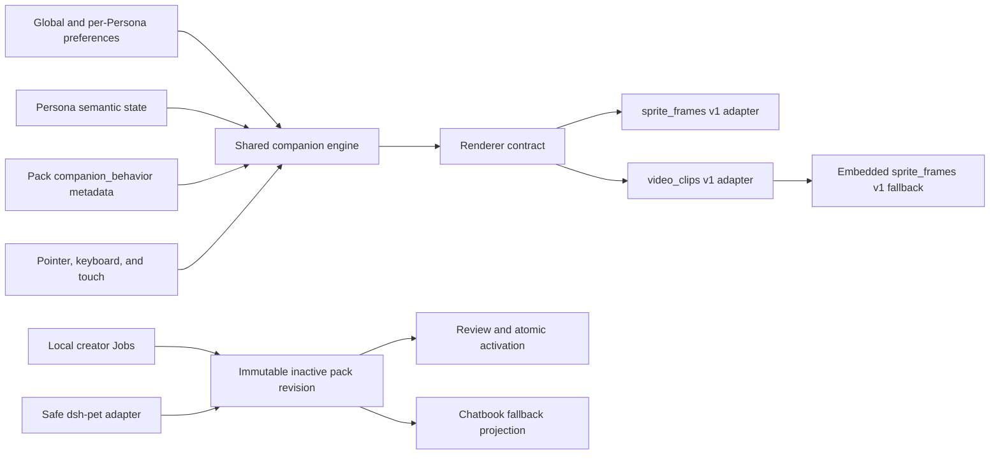

# Persona Ambient Companion and Transparent-Video Visual Packs

**Status:** Approved design; pending human review of this document

**Date:** 2026-08-23

**Backlog:** TASK-12122

**Scope:** Design only; no implementation is part of this task

## Summary

This design evolves the existing Persona Buddy into a calm, renderer-neutral web companion and adds a review-first workflow for transparent-video visual packs. Delivery is deliberately split:

1. **Stage 1 — ambient behavior:** ship idle-only Off, Expressive, and Roaming modes over the existing raster Buddy.
2. **Stage 2 — transparent video:** add a native `video_clips` renderer, local creation and conversion Jobs, a safe dsh-pet adapter, and fallback-compatible Chatbook export.

The shared companion engine owns semantic state, timing, interaction, accessibility, position, and safety. Renderer adapters only display the state selected by the engine. No runtime model or LLM call is allowed.

Every video pack must include a reviewed `sprite_frames` v1 fallback. The fallback is visible first and remains the authoritative recovery path for unsupported browsers, missing alpha, decode or playback failure, and reduced-motion mode.

## Product Decisions

| Area | Decision |
| --- | --- |
| Surfaces | Web app only. Expressive may also run in the side panel; Roaming is restricted to the full web app. |
| Focus | One focused Buddy remains visible. Other live Persona sessions are represented by existing badges/status. |
| Ambient scope | Ambient actions run only while the Persona is idle. They never compete with listening, thinking, speaking, tool activity, approval, error, or offline states. |
| Modes | `Off`, `Expressive`, and `Roaming`. |
| Default feel | Calm companion: subtle continuous idle, with a larger idle reaction approximately every 30–90 seconds, no immediate repeats, and no hidden-tab progression. |
| Movement | Grounded horizontal roaming only; no free-flight or arbitrary two-dimensional wandering. |
| Runtime intelligence | Deterministic, seeded scheduling and declared pack metadata only. No model calls. |
| Configuration | Engine safety defaults, then pack suggestions, then the effective user mode. A global default may be overridden per Persona. |
| Video | VP9-alpha WebM is preferred, silent, muted, inline, and without native controls. |
| Fallback | A reviewed still or sprite fallback is mandatory. Static fallback is encoded as a one-frame `sprite_frames` animation. |
| Creation | Guided local conversion with automatic proposals, before/after review, and a small set of controls. |
| Source retention | Delete source and temporary intermediates after successful publication by default; offer an explicit retain-source option. |
| Licensing | Technical validation only. Licensing review and enforcement are outside this workflow. |
| External compatibility | Native server packs retain native video. Chatbook export contains only the compatible raster fallback in the current `.tldw-persona-vpack` format. |

## Goals

- Make the existing Buddy feel alive without interrupting the user or changing Persona semantics.
- Preserve one shared behavior model across raster and video renderers.
- Add transparent video without making it a reliability or accessibility dependency.
- Keep pack import declarative, bounded, review-first, and non-executable.
- Reuse existing visual-pack storage, archive, preview, activation, Buddy position, and Jobs foundations.
- Provide a practical migration path from dsh-pet assets without adopting its runtime wholesale.
- Keep server-native video packs useful to the current Chatbook through a faithful fallback projection.

## Non-goals

- Runtime LLM, model, inference-service, or arbitrary network calls.
- Native mobile, desktop, or Chatbook video rendering.
- More than one visible Buddy at a time.
- Persona dialogue generation, autonomous messaging, or proactive task initiation.
- Ambient behavior during non-idle Persona states.
- Audio in pet clips.
- Arbitrary executable packs, package installation, script execution, or remote asset loading.
- A licensing attestation or rights-management workflow.
- Marketplace, discovery, community publishing, or pack monetization.
- Full emulation of dsh-pet positioning, multiple-pet behavior, or perpetual animation chaining.
- Implementation code in this design task.

## Existing Foundations and Compatibility Constraints

The implementation should extend the current Persona Visual and Persona Buddy paths rather than create a parallel subsystem:

- The archive envelope remains `tldw.persona_visual_pack.v1`.
- Existing raster packs use the strict `sprite_frames` renderer manifest version 1.
- Archive asset rows own paths, media metadata, and checksums.
- Visual-pack import is already review-first and activation is separate.
- The Buddy already has focused-Persona behavior, position persistence, viewport clamping, visual-state selection, and accessibility-related UI.
- `persona_buddies.overlay_preferences_json` already holds per-Persona Buddy overlay preferences.
- Jobs provide the appropriate user-visible execution, retry, cancellation, and status model for conversion.

The current Chatbook importer accepts only its strict `sprite_frames` v1 schema and retains only supported sprite content. Unknown renderer fields are not a forward-compatible extension point. Consequently:

- companion behavior metadata must live at the **pack level**, beside—not inside—the renderer manifest;
- the server must not put new fields into the embedded Chatbook fallback manifest;
- compatibility export must create a self-contained current-format raster archive, not a mixed video archive.

## Architecture



### Component ownership

The shared companion engine owns:

- semantic Persona state and precedence;
- idle eligibility;
- ambient scheduling, cooldowns, repeat avoidance, and safety clamps;
- input interpretation and accessible controls;
- facing, grounded movement intent, Buddy position, and viewport clamping;
- visibility, focus, reduced-motion, and control-panel suspension;
- renderer generation tokens and stale-result rejection;
- selection of the requested visual state and fallback policy.

Renderer adapters own only:

- resolving a requested state to declared assets;
- loading, decoding, and presenting frames or clips;
- reporting readiness, completion, stalls, and failures;
- renderer-local resource cleanup.

The video renderer must never own Buddy coordinates or decide which semantic state should play next.

## Runtime Behavior

### Modes and effective preference

Store the global Buddy behavior level in a dedicated user-owned Buddy preference record. Do not reuse Personalization, because it may be disabled and has unrelated semantics. Store an optional per-Persona `ambient_mode` override in `persona_buddies.overlay_preferences_json`.

Effective mode resolution is:

1. per-Persona `ambient_mode`, when present;
2. global `ambient_mode`, when present;
3. safe default: `Expressive` with calm engine settings.

`Roaming` is coerced to `Expressive` outside the full web app. Reduced motion is an independent accessibility constraint, not another ambient mode.

Per-Persona updates must use a targeted, version-checked JSON patch so changing `ambient_mode` cannot overwrite existing accessory, eye, or other overlay preferences. Stale writes return a conflict and preserve the newer document.

### Mode semantics

- **Off:** no ambient variants or roaming. The Buddy still represents active Persona state and supports controls and direct interaction.
- **Expressive:** continuous subtle idle rendering plus occasional non-moving idle reactions. Larger reactions are scheduled approximately every 30–90 seconds, subject to engine clamps and eligibility.
- **Roaming:** Expressive behavior plus occasional grounded horizontal movement within the current Buddy surface.

Pack weights are relative suggestions; they do not need to sum to 100. The engine rejects non-finite, negative, or otherwise invalid values and supplies safe defaults when suggestions are absent.

### State precedence

Only one semantic visual intent wins at a time:

1. approval, error, or offline;
2. active Persona state: listening, thinking, speaking, or tool activity;
3. direct interaction when the Persona is otherwise idle;
4. ambient action;
5. base idle.

Controls remain accessible in every state. Dragging may reposition the Buddy without replacing a higher-priority semantic state.

Each state producer receives a source-scoped lease. It may release only its own lease, and leases expire defensively. This prevents a stale completion event from clearing a newer state owned by another source.

### Idle eligibility and suspension

Ambient scheduling is paused when any of the following is true:

- the current semantic state is not idle;
- the tab is hidden;
- Buddy controls are open;
- keyboard focus is within the Buddy or its controls;
- a drag is in progress;
- reduced motion disables the requested ambient operation;
- the current surface does not permit the selected mode.

Hidden time does not accumulate into an immediate reaction. On visibility restoration, the engine first resumes the current semantic Persona state. If that state is idle, it starts a fresh ambient interval.

### Calm scheduler

Use a deterministic pseudo-random scheduler with an injectable seed and clock. The engine owns interval bounds, maximum action duration, repeat suppression, movement distance bounds, and cooldown clamps. Packs may suggest relative weights and cooldowns but cannot weaken those safeguards.

Avoid selecting the immediately previous larger action when another eligible action exists. If no declared action is eligible, remain in base idle without error.

### Generation-fenced intent

Every scheduled action, asset load, media callback, timeout, and asynchronous completion is bound to an immutable generation containing at least:

- focused Persona identity;
- active pack identity and revision;
- resolved preferences and mode;
- surface and viewport generation;
- current semantic-state lease generation.

Any result whose generation is no longer current is ignored and cleaned up. A Persona switch, pack activation, preference change, viewport invalidation, or higher-priority state change advances the generation.

## Interaction and Accessibility

### Adaptive controls

| Input | Result |
| --- | --- |
| Pointer click | React, when idle and no competing gesture wins. |
| Pointer double-click | Open Buddy controls. |
| Pointer drag | Reposition the Buddy using the existing position store and viewport clamp. |
| Keyboard Enter | Open Buddy controls. |
| Keyboard Space | React, when idle. |
| Touch tap | React, when idle. |
| Touch/focus surface button | A small, persistent controls button opens Buddy controls. |

A concise first-use hint explains the available gestures and is dismissible. Pet-only resting chrome is preferred; text appears only for approval, error, or offline states.

Single-click reaction is deferred for the platform double-click window. A recognized double-click or drag cancels the pending single-click. Drag begins only after a movement threshold, uses pointer capture, and does not also emit a click reaction.

Ambient and roaming pause while controls are open or the Buddy has actionable focus. Keyboard interaction must not depend on hover, and all controls require accessible names and visible focus indication.

### Reduced motion

When `prefers-reduced-motion` is active, immediately present a deterministic still frame from the required fallback:

- do not load or play video;
- do not crossfade;
- do not roam;
- do not animate the sprite fallback;
- retain semantic state changes by selecting the declared still for each state.

If a state shares the same one-frame fallback asset as other states, the behavior remains valid. The review UI should warn about limited visual differentiation without rejecting a technically complete pack.

## Pack and Manifest Contracts

### Archive envelope and dispatch

Keep the current archive envelope version. Renderer validation and preview dispatch must key on the pair `(renderer_type, manifest_version)`. Replace assumptions such as “manifest version other than 1 is unsupported” with renderer-specific dispatch.

Asset collection and archive path remapping must traverse:

- native video clip references;
- preview or poster references when present;
- the complete nested raster fallback manifest.

Archive asset rows remain the single checksum inventory. Do not duplicate checksums inside either renderer or behavior metadata.

### Native `video_clips` manifest version 1

The native renderer manifest declares state-to-animation resolution and playback properties. The following is directional, not a final Pydantic spelling:

```json
{
  "renderer_type": "video_clips",
  "manifest_version": 1,
  "states": {
    "idle": { "animation_id": "idle.primary" },
    "ambient.look": { "animation_id": "idle.look" },
    "reaction.click": { "animation_id": "react.click" }
  },
  "animations": {
    "idle.primary": {
      "asset_id": "video-idle",
      "loop": true,
      "mirror_safe": true,
      "alignment": { "baseline": 0.92 }
    },
    "idle.look": {
      "asset_id": "video-look",
      "loop": false,
      "mirror_safe": true,
      "alignment": { "baseline": 0.92 }
    },
    "react.click": {
      "asset_id": "video-click",
      "loop": false,
      "mirror_safe": false,
      "alignment": { "baseline": 0.92 }
    }
  },
  "fallback_manifest": {
    "renderer_type": "sprite_frames",
    "manifest_version": 1,
    "states": {
      "idle": { "animation_id": "fallback.still" },
      "wake_armed": { "animation_id": "fallback.still" },
      "listening": { "animation_id": "fallback.still" },
      "thinking": { "animation_id": "fallback.still" },
      "speaking": { "animation_id": "fallback.still" },
      "tool_running": { "animation_id": "fallback.still" },
      "approval_needed": { "animation_id": "fallback.still" },
      "error": { "animation_id": "fallback.still" },
      "offline": { "animation_id": "fallback.still" }
    },
    "animations": {
      "fallback.still": {
        "frame_rate": 1,
        "frames": [{ "asset_id": "raster-fallback" }]
      }
    }
  }
}
```

The embedded `fallback_manifest` must validate as the exact current `sprite_frames` v1 schema. It must resolve all nine built-in Persona visual states. Multiple states may resolve to the same animation, and a still is represented as a one-frame sprite animation.

Optional custom ambient and reaction states may be absent from the fallback. The engine filters out any action that cannot resolve through the active renderer or its fallback.

Clips must declare whether mirroring is safe. Absence means mirroring is prohibited. Video has no audio track after conversion and is presented muted and inline.

### Pack-level `companion_behavior`

Behavior suggestions belong in pack metadata beside `visual_manifest`, so the existing strict sprite renderer schema stays unchanged. A conceptual structure is:

```json
{
  "companion_behavior": {
    "schema_version": 1,
    "entries": [
      {
        "state": "ambient.look",
        "trigger": "ambient",
        "category": "idle_variant",
        "suggested_weight": 3,
        "suggested_cooldown_ms": 45000
      },
      {
        "state": "ambient.walk",
        "trigger": "ambient",
        "category": "move",
        "suggested_weight": 1,
        "movement": { "direction": "horizontal" }
      },
      {
        "state": "reaction.click",
        "trigger": "click",
        "category": "reaction"
      }
    ]
  }
}
```

Entries reference built-in or custom state IDs already declared by the visual pack; they do not establish a second action registry. The engine owns cadence, duration, displacement, repeat policy, and all safety clamps.

Behavior metadata participates in pack fingerprints, duplication, native import/export, stale-review detection, and runtime generations.

### Minimum viable pack

Activation requires:

- at least one valid transparent idle animation;
- a complete reviewed raster fallback for the nine built-in Persona states;
- native pack and renderer metadata;
- successful bounded media validation.

Click reactions, walking, turning, drag reactions, and additional ambient actions are enhancements, not minimum requirements.

## Video Renderer

### Fallback-first transition

For every semantic transition:

1. Render the matching fallback immediately.
2. Resolve and load the candidate clip without hiding the fallback.
3. Verify the generation is still current.
4. Call `play()` and handle its returned promise.
5. Wait for a real presented frame, preferring `requestVideoFrameCallback`; use a guarded `loadeddata`/`playing` fallback where unavailable.
6. Recheck the generation, then swap the video into view.

At most two video elements are retained during a transition. Release the stale source promptly after the new source is visible. Position and mirroring transforms apply to the outer Buddy container, never to separate renderer-owned coordinates.

### Capability and alpha validation

Codec capability checks alone are insufficient. The browser session must perform a small known-alpha playback probe before enabling transparent video. This addresses browser/platform combinations that claim WebM support but composite alpha incorrectly.

If the session probe fails, disable the video renderer for that browser session and use raster fallbacks. Reduced motion bypasses the probe because video is not loaded.

### Failure scope

| Failure | Scope and response |
| --- | --- |
| Codec or alpha incompatibility | Disable video rendering for the browser session; use fallback for every pack. |
| Corrupt or invalid clip | Disable that clip for the active pack revision; continue with fallback. |
| Stall or rejected `play()` | Retry the clip once; then use fallback for that action. |
| Stale load or callback | Ignore and release resources without changing visible state. |
| Missing optional state | Filter the action from selection; do not surface a runtime error. |

Diagnostics should identify the renderer, pack revision, state, and failure class without exposing local paths or retained source contents.

### Roaming

Roaming moves the existing outer Buddy container along the x-axis only. Displacement is clamped to the current viewport and expressed using normalized Buddy-width units so imported packs do not dictate pixels. Resize and surface changes reclamp immediately.

Turning changes facing only after the current declared turn clip completes successfully. If no turn clip exists or it fails, the engine may change facing only when mirroring is declared safe; otherwise it preserves the current facing.

## Local Creation and Conversion Workflow

### User flow

1. Upload a green-screen or already-transparent clip into private staging.
2. Run bounded media inspection.
3. Generate deterministic automatic proposals from border sampling: key color, tolerance, spill suppression, crop, scale, and baseline alignment.
4. Show before/after previews and expose only those controls.
5. Let the user choose or confirm fallback state coverage.
6. Submit final conversion as a user-visible Job.
7. Validate the video, fallback, state mapping, dimensions, duration, and size.
8. Save an immutable inactive draft and review record.
9. Activate explicitly in a separate atomic operation.

No model is involved in detection, mapping, conversion, or review.

### Preview and final conversion

Preview requests are cancellable and generation-fenced so stale previews cannot replace newer settings. The final Jobs worker:

- addresses staged input by server storage identity plus checksum, never by a client-supplied filesystem path;
- uses fixed subprocess argument arrays with no interpolated shell;
- enforces file, frame, duration, pixel, CPU, memory, wall-clock, and output-size bounds;
- strips audio;
- removes the selected background and suppresses spill;
- normalizes crop, canvas, scale, and baseline;
- encodes VP9-alpha WebM;
- generates or normalizes the required raster fallback;
- decodes and probes produced assets before publication.

Final-conversion idempotency includes source checksum, normalized controls, fallback selection, and converter version. A retry must either return the same durable result or safely resume without publishing a duplicate mutable revision.

### Data lifecycle

Sources and intermediates remain private. After immutable pack publication and durable Job completion are both recorded:

- delete the green-screen source and temporary intermediates by default;
- retain accepted WebM, fallback assets, manifests, and review records;
- retain the source only when the user explicitly selected retain-source.

Interrupted or failed work retains staging temporarily for diagnosis or retry, then expires by policy. Cleanup must never run merely because conversion succeeded in memory; durable publication is the boundary.

### Review and activation

The review surface presents:

- video playback and alpha result;
- fallback rendering for all built-in states;
- proposed state/action mapping;
- normalization, duration, dimensions, and size;
- warnings for shared stills or unavailable optional actions;
- whether the source will be retained.

Saving creates an inactive immutable pack revision. Activation validates the expected revision and review fingerprint, then changes the active binding atomically. An active revision is never mutated. Any edit forks a new inactive draft.

## dsh-pet Adapter

### Safe ingestion

Accept ZIP and npm TGZ inputs by signature and reuse the existing bounded safe-archive boundary. The adapter never invokes npm, installs a package, loads JavaScript, executes scripts, or follows remote references.

Reject:

- path traversal, absolute paths, symlinks, hard links, devices, and duplicate normalized paths;
- nested archives and remote asset URLs;
- ambiguous configuration files;
- entries, expanded size, compression ratio, media dimensions, duration, or frame counts beyond configured limits.

Locate configuration and assets either at archive root or beneath the conventional `package/` prefix. Parse JSONC with a comment-aware parser; do not strip comments with regular expressions.

### Mapping

The adapter proposes all entries from dsh-pet plural pools:

| dsh-pet concept | Native proposal |
| --- | --- |
| `idle` pool | base `idle`, with additional entries such as `ambient.idle.*` |
| `turn` pool | `ambient.turn.*` |
| `move` pool | `ambient.move.*` with normalized horizontal motion |
| click pool | `reaction.click.*` |
| drag pool | `reaction.drag.*` |
| weighted categories | companion behavior categories and relative weights |
| `noMirror` | mirroring prohibited |

Move lead and tail values are interpreted as ratios of the declared clip duration and clamped by the engine. Imported positions and pet multiplicity are ignored. The first pet size is only a review-time normalization hint, never a runtime layout command.

Unicode display labels are stored separately from native state IDs. IDs use a sanitized label plus a stable short digest to prevent normalization collisions.

Weights remain relative and need not total 100. Invalid numeric values are rejected rather than silently coerced.

An existing clip may pass through only when inspection proves VP9 alpha, no audio, acceptable resource bounds, and valid baseline/canvas characteristics. Otherwise it enters the normal local conversion workflow. Even pass-through video must produce and receive review for a raster fallback.

Before creating an inactive draft, show the proposed mapping, clamps, normalization, and ignored fields. Native calm scheduling replaces dsh-pet's continuous animation chain.

## Chatbook-Compatible Export

The server's native video pack remains unchanged. Compatibility export creates a separate self-contained `.tldw-persona-vpack` containing only the embedded `sprite_frames` v1 fallback.

The export must:

- project the exact current Chatbook-compatible manifest schema;
- convert static choices to one-frame sprite animations;
- include only raster assets reachable from the projected manifest;
- rewrite paths and asset declarations consistently;
- emit exact asset checksums through the normal archive inventory;
- contain no video, remote references, dependencies, or unused files;
- validate the projected manifest independently before offering download.

The server export review lists video-only states and actions that were omitted. Do not assume the current Chatbook UI will retain or display that warning.

Include the native pack fingerprint in the server archive envelope and export record for traceability. Do not depend on Chatbook persisting it; the current importer retains only supported sprite content. Use a fallback-edition title while preserving Persona identity.

A golden compatibility archive and exact schema assertions belong in the server tests. A real consumer import test belongs in a follow-up change to the Chatbook repository. Until that lands, record a manual import check for release qualification rather than copy the Chatbook validator or introduce cross-repository network CI.

## Persistence, Activation, and Migration

Stage 1 includes a prerequisite hardening of current visual-pack lifecycle rules:

- active pack revisions are immutable;
- edits always fork a new inactive revision;
- review records bind to a complete pack fingerprint, including companion behavior;
- activation accepts an expected revision/fingerprint and updates the Persona binding atomically;
- stale reviews and activation races fail with a conflict;
- duplication, native export, and native import preserve behavior metadata;
- deleting an inactive revision cannot invalidate the active binding.

Existing raster packs require no migration of their strict renderer manifests. Packs without `companion_behavior` use engine defaults. Existing users without Buddy preference rows receive the calm Expressive default; applications may create the row lazily on first change.

## API Direction

Exact route names should follow existing Persona Visual and Jobs conventions. The feature needs these operations, not a parallel service family:

- read and update global Buddy preferences;
- version-checked update of the per-Persona ambient override;
- inspect and preview staged media;
- submit, cancel, retry, and inspect final conversion Jobs;
- review an inactive revision;
- activate an expected immutable revision atomically;
- import dsh-pet input through proposed mapping and review;
- export a native pack or Chatbook-compatible fallback projection.

All write routes use existing AuthNZ ownership checks, upload limits, rate limits, and consistent error responses.

## Security and Privacy

- Treat every archive and media file as hostile input.
- Reuse the existing safe ZIP/TAR extraction boundary rather than create an adapter-specific extractor.
- Never execute imported content or package lifecycle hooks.
- Reject local-path, URI, and remote-resource escape attempts.
- Keep staging, source, intermediate, draft, and review records user-owned.
- Resolve worker inputs from server-side storage IDs and checksums.
- Apply subprocess timeouts, cancellation, resource limits, and fixed argument vectors.
- Sanitize user-visible labels independently from stable internal IDs.
- Do not log API credentials, client paths, source frame contents, or sensitive archive metadata.
- Rate-limit preview generation and final conversion separately.
- Add an explicit dependency-boundary test that the companion engine cannot import LLM clients, call model endpoints, or perform arbitrary network access.

Licensing remains entirely outside the Persona Visual workflow. The UI should not imply that technical acceptance establishes ownership or usage rights.

## Errors, Diagnostics, and Observability

User-facing errors should distinguish unsupported browser capability, invalid media, unsafe archive, incomplete fallback, stale review, conversion failure, and activation conflict. Each error should state the recovery action without exposing internal paths.

Structured diagnostics should include user-safe identifiers for Job, pack, revision, renderer, state, and failure class. Useful counters include:

- fallback-first successes and video swaps;
- session-level video capability disablement;
- per-clip decode, stall, and play rejection;
- ambient actions selected, skipped, or preempted;
- stale generations discarded;
- preview cancellation and final conversion retry;
- source cleanup, retained-source, and expiry outcomes.

No analytics or telemetry is sent outside the self-hosted server.

## Testing and Verification

### Backend and contract tests

- Renderer dispatch by `(renderer_type, manifest_version)`.
- Exact strict validation of nested `sprite_frames` v1 fallback.
- Resolution of all nine built-in states, including valid shared one-frame fallback.
- Behavior metadata validation, fingerprint participation, import/export, and stale-review detection.
- Immutable active revisions, fork-on-edit, and expected-revision atomic activation.
- Global/per-Persona preference resolution and stale JSON patch conflict.
- Safe archive cases: traversal, links, duplicate paths, ambiguity, nested archives, bombs, oversized media, and remote references.
- JSONC comments, Unicode labels, digest collision prevention, plural pools, invalid weights, and ignored dsh fields.
- Jobs cancellation, retry, idempotency, publication boundary, default cleanup, retain-source, and expiry.
- Golden Chatbook fallback archive with exact schema and reachable-assets-only assertions.
- Dependency-boundary test preventing model-client and arbitrary-network coupling.

Use deterministic media fixtures and mock subprocess/probe results for most tests. Run a small real ffmpeg decode/conversion fixture where the project environment supports it.

### Engine and frontend tests

- Seeded scheduling, cooldown clamps, repeat avoidance, and empty eligible sets.
- State precedence, source-scoped lease release/expiry, and generation invalidation.
- Fake-clock hidden-tab pause and fresh idle interval on resume.
- Mode and surface coercion, controls/focus/drag suspension, and resize reclamping.
- Deferred click versus double-click, drag threshold, pointer capture, keyboard, and touch behavior.
- Reduced-motion deterministic still with no video, animation, crossfade, or roaming.
- Raster and video adapters passing the same renderer contract tests.
- Playwright coverage for focus, grounded roaming, fallback-first display, Persona switch, and playback failure.

Use one real transparent-video Chromium smoke test. Keep WebKit alpha/fallback behavior as a mocked contract test because platform media support is too variable for a stable required CI gate.

### Completion checks for implementation stages

- Relevant backend unit and integration tests.
- Frontend lint, type checks, component tests, and focused Playwright flows.
- Bandit on touched backend paths.
- Archive and media fixture size kept small and deterministic.
- Manual current-Chatbook import check until consumer-owned automation lands.

## Delivery Stages

### Stage 1 — Ambient Behavior

**Goal:** Ship the renderer-neutral idle companion over the existing raster renderer.

1. Harden pack immutability, behavior metadata, activation, and Buddy preferences.
2. Add the shared ambient engine, state leases, seeded scheduler, precedence, and generation fencing.
3. Add adaptive interaction, accessibility behavior, first-use hint, and grounded roaming.

**Success criteria:** Off, Expressive, and Roaming work with current raster packs; no ambient action runs outside idle; one focused Buddy remains; preferences and surface coercion are deterministic; reduced motion is still; the engine has no model or arbitrary-network dependency.

### Stage 2 — Transparent Video Creation and Import

**Goal:** Add reliable native video packs while keeping raster fallback universal.

4. Add the `video_clips` v1 contract, fallback-first adapter, alpha probe, and scoped failures.
5. Add staged analysis, preview, final conversion Jobs, review, publication, and cleanup.
6. Add the dsh-pet adapter and Chatbook fallback projection.

**Success criteria:** A user can create or import a reviewed inactive video pack, activate an immutable revision, see correct fallback behavior across failure and reduced-motion paths, safely map supported dsh-pet assets, and export a current-format raster pack that Chatbook can import.

Each numbered item is a reviewable implementation unit. Stage 1 can ship without Stage 2. Stage 2 must not weaken the Stage 1 engine or make video required for the Buddy.

## Risks and Mitigations

| Risk | Mitigation |
| --- | --- |
| Browser claims WebM support but renders alpha incorrectly | Known-alpha session probe plus fallback-first presentation. |
| Media events arrive after Persona, pack, or state changes | Generation fence every callback, promise, timer, and load. |
| Ambient behavior becomes distracting | Idle-only eligibility, calm defaults, explicit modes, cooldown/repeat clamps, and focus/control suspension. |
| Packs bypass engine safety through metadata | Treat pack values as bounded suggestions; engine retains all authority. |
| Import archives execute or escape | Signature detection, bounded safe extraction, declarative parsing, no package install or code execution. |
| Cleanup destroys recoverable work | Delete only after durable publication and durable Job completion; temporary expiry for failed work. |
| Existing raster/Chatbook schema breaks | Keep envelope and sprite v1 exact; put behavior at pack level; project fallback into a separate archive. |
| Active visuals change beneath a user | Immutable revisions, fork-on-edit, fingerprinted review, expected-revision atomic activation. |
| Roaming moves the Buddy out of reach | Existing position store and viewport clamp, horizontal-only normalized motion, immediate resize reclamp. |
| Cross-repository compatibility drifts | Golden server archive plus consumer-owned Chatbook import test follow-up and manual release check meanwhile. |

## Implementation-Planning Checkpoints

Before implementation planning begins, the human reviewer should confirm that this document accurately captures the approved behavior and boundaries. The later plan should resolve exact schema field names, route names, migration mechanics, and file-by-file tasks while preserving these architectural decisions.

Implementation must stop for renewed design review if it would require any of the following:

- broadening the archive envelope version;
- putting behavior fields into strict `sprite_frames` v1;
- allowing video-only activation without raster fallback;
- allowing ambient behavior outside idle;
- adding runtime model calls, external asset fetching, or executable packs;
- making active pack revisions mutable;
- changing Chatbook rather than exporting its current compatible format.

## References

- [dsh-pet repository](https://github.com/PC2005-cloud/dsh-pet)
- [dsh-pet design](https://github.com/PC2005-cloud/dsh-pet/blob/main/DESIGN.md)
- [dsh-pet sample configuration](https://raw.githubusercontent.com/PC2005-cloud/dsh-pet/main/dsh-pet/assets/config.jsonc)
- [MDN: `requestVideoFrameCallback`](https://developer.mozilla.org/en-US/docs/Web/API/HTMLVideoElement/requestVideoFrameCallback)
- [MDN: `HTMLMediaElement.play()`](https://developer.mozilla.org/en-US/docs/Web/API/HTMLMediaElement/play)
- [WebKit bug 275908: VP9 alpha playback](https://bugs.webkit.org/show_bug.cgi?id=275908)
- `Docs/Product/Persona_Expressive_Avatar_Runtime_PRD.md`
- `Docs/Code_Documentation/Persona_Visual_Packs.md`
- `Docs/Reviews/PERSONA_BUDDY_CURRENT_STATE_AUDIT_2026_05_10.md`
- `Docs/superpowers/specs/2026-05-20-persona-buddy-interaction-prd-design.md`
- Sibling Chatbook decision 074 and 2026-08-20 Actor Pack/Persona Buddy design, reviewed from `tldw_chatbook` `origin/dev`.

## Approval Record

The architecture and staged scope were approved through terminal-only brainstorming on 2026-08-23. This document is the consolidated handoff for human review before invoking implementation planning.
