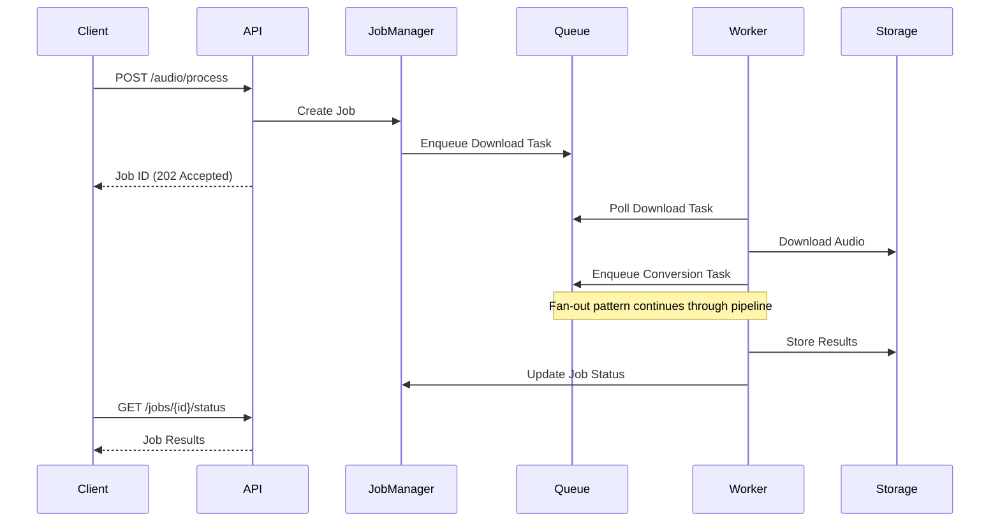

# Audio Processing Pipeline Fan-Out Design

## Executive Summary

This document outlines the design for refactoring the current synchronous audio processing pipeline into a scalable, distributed fan-out architecture. The new design will enable horizontal scaling, prevent resource exhaustion, and improve overall system throughput while maintaining reliability and fault tolerance.

## Table of Contents

1. [Current State Analysis](#current-state-analysis)
2. [Design Goals](#design-goals)
3. [Proposed Architecture](#proposed-architecture)
4. [Component Design](#component-design)
5. [Implementation Phases](#implementation-phases)
6. [Migration Strategy](#migration-strategy)
7. [Monitoring and Operations](#monitoring-and-operations)
8. [Risk Assessment](#risk-assessment)

## Current State Analysis

### Current Pipeline Flow

```
[Audio Input] → [Download] → [Convert] → [Transcribe] → [Chunk] → [Analyze] → [Store]
     ↓             ↓            ↓            ↓            ↓          ↓          ↓
Single Thread  Blocking     Blocking     Blocking     Blocking   Blocking   Blocking
```

### Key Issues

1. **Sequential Processing**: Each step must complete before the next begins
2. **Resource Blocking**: CPU/GPU intensive operations block I/O operations
3. **No Horizontal Scaling**: Cannot distribute load across multiple workers
4. **Memory Pressure**: Large files processed in memory without streaming
5. **Single Point of Failure**: Any step failure fails the entire pipeline

## Design Goals

### Primary Goals

1. **Scalability**: Support processing 100+ concurrent audio files
2. **Resource Efficiency**: Optimal CPU/GPU utilization with pooled resources
3. **Fault Tolerance**: Automatic retry and graceful degradation
4. **Observability**: Real-time metrics and monitoring
5. **Maintainability**: Clear separation of concerns and modular design

### Non-Goals

1. Real-time streaming transcription (separate pipeline)
2. Video processing (handled by separate pipeline)
3. Backward compatibility with synchronous API (new endpoints)

## Proposed Architecture

### High-Level Design

```
┌─────────────────────────────────────────────────────────────────────┐
│                            API Gateway                               │
│                    (FastAPI with async handlers)                     │
└────────────────────────────┬───────────────────────────────────────┘
                             │
                    ┌────────▼────────┐
                    │   Job Manager   │
                    │  (Orchestrator) │
                    └────────┬────────┘
                             │
┌────────────────────────────┼────────────────────────────────────────┐
│                     Message Broker Layer                             │
│                    (Redis Streams/RabbitMQ)                          │
├─────────┬──────────┬───────┴────────┬──────────┬──────────┬────────┤
│Download │Conversion│ Transcription  │ Chunking │ Analysis │Result  │
│ Queue   │  Queue   │     Queue      │  Queue   │  Queue   │ Queue  │
└─────┬───┴────┬─────┴───────┬────────┴────┬─────┴────┬─────┴───┬────┘
      │        │             │             │          │         │
┌─────▼───┐┌───▼─────┐┌──────▼──────┐┌────▼────┐┌────▼────┐┌───▼────┐
│Download ││Convert  ││Transcription││Chunking ││Analysis ││Result  │
│Workers  ││Workers  ││  Workers    ││Workers  ││Workers  ││Workers │
│Pool(10) ││Pool(20) ││  Pool(5)    ││Pool(15) ││Pool(10) ││Pool(5) │
└─────────┘└─────────┘└─────────────┘└─────────┘└─────────┘└────────┘
```

### Component Interaction Flow



## Component Design

### 1. Job Manager

**Responsibilities:**
- Job lifecycle management
- Pipeline orchestration
- State tracking
- Error handling coordination

**Implementation:**
```python
class JobManager:
    def __init__(self, redis_client, db_session):
        self.redis = redis_client
        self.db = db_session
        self.job_states = {}
    
    async def create_job(self, audio_input: AudioInput) -> str:
        job_id = str(uuid.uuid4())
        job = Job(
            id=job_id,
            status=JobStatus.PENDING,
            input=audio_input,
            created_at=datetime.utcnow()
        )
        await self.save_job(job)
        await self.enqueue_download(job)
        return job_id
    
    async def update_job_status(self, job_id: str, status: JobStatus, metadata: dict = None):
        # Update job state with distributed lock
        async with self.redis.lock(f"job:{job_id}:lock"):
            job = await self.get_job(job_id)
            job.status = status
            if metadata:
                job.metadata.update(metadata)
            await self.save_job(job)
```

### 2. Worker Base Class

**Shared Worker Implementation:**
```python
class BaseWorker(ABC):
    def __init__(self, queue_name: str, redis_client, config: WorkerConfig):
        self.queue_name = queue_name
        self.redis = redis_client
        self.config = config
        self.metrics = MetricsCollector()
        
    async def start(self):
        while True:
            try:
                task = await self.poll_task()
                if task:
                    await self.process_task(task)
            except Exception as e:
                await self.handle_error(e)
    
    @abstractmethod
    async def process_task(self, task: Task):
        pass
    
    async def poll_task(self) -> Optional[Task]:
        # Use Redis BLPOP for efficient polling
        result = await self.redis.blpop(self.queue_name, timeout=5)
        if result:
            return Task.from_json(result[1])
        return None
```

### 3. Download Worker

**Concurrent Download with Resource Limits:**
```python
class DownloadWorker(BaseWorker):
    def __init__(self, *args, **kwargs):
        super().__init__("download_queue", *args, **kwargs)
        self.session = aiohttp.ClientSession(
            connector=aiohttp.TCPConnector(limit=100, limit_per_host=10)
        )
        self.semaphore = asyncio.Semaphore(5)  # Max 5 concurrent downloads
    
    async def process_task(self, task: DownloadTask):
        async with self.semaphore:
            try:
                file_path = await self.download_with_retry(
                    task.url, 
                    task.target_dir,
                    max_retries=3
                )
                
                # Enqueue next stage
                conversion_task = ConversionTask(
                    job_id=task.job_id,
                    file_path=file_path,
                    target_format="wav"
                )
                await self.redis.rpush("conversion_queue", conversion_task.to_json())
                
            except DownloadError as e:
                await self.handle_download_failure(task, e)
```

### 4. Transcription Worker Pool

**GPU-Aware Worker with Model Sharing:**
```python
class TranscriptionWorkerPool:
    def __init__(self, num_workers: int, gpu_devices: List[int]):
        self.workers = []
        self.model_cache = ModelCache()
        
        # Distribute workers across GPUs
        for i in range(num_workers):
            gpu_id = gpu_devices[i % len(gpu_devices)]
            worker = TranscriptionWorker(
                gpu_id=gpu_id,
                model_cache=self.model_cache
            )
            self.workers.append(worker)
    
    async def start_all(self):
        tasks = [worker.start() for worker in self.workers]
        await asyncio.gather(*tasks)

class TranscriptionWorker(BaseWorker):
    def __init__(self, gpu_id: int, model_cache: ModelCache, *args, **kwargs):
        super().__init__("transcription_queue", *args, **kwargs)
        self.gpu_id = gpu_id
        self.model_cache = model_cache
        
    async def process_task(self, task: TranscriptionTask):
        # Get or load model with caching
        model = await self.model_cache.get_model(
            task.model_name,
            device=f"cuda:{self.gpu_id}"
        )
        
        # Process with resource monitoring
        with GPUMemoryMonitor(self.gpu_id) as monitor:
            result = await self.transcribe_audio(
                task.file_path,
                model,
                language=task.language
            )
            
        # Stream results for large files
        if result.is_large:
            await self.stream_results(task.job_id, result)
        else:
            await self.enqueue_chunking(task.job_id, result)
```

### 5. Circuit Breaker Pattern

**Fault Tolerance Implementation:**
```python
class CircuitBreaker:
    def __init__(self, failure_threshold: int = 5, recovery_timeout: int = 60):
        self.failure_threshold = failure_threshold
        self.recovery_timeout = recovery_timeout
        self.failure_count = 0
        self.last_failure_time = None
        self.state = CircuitState.CLOSED
        
    async def call(self, func, *args, **kwargs):
        if self.state == CircuitState.OPEN:
            if self._should_attempt_reset():
                self.state = CircuitState.HALF_OPEN
            else:
                raise CircuitOpenError("Circuit breaker is OPEN")
        
        try:
            result = await func(*args, **kwargs)
            self._on_success()
            return result
        except Exception as e:
            self._on_failure()
            raise

class APIWorker(BaseWorker):
    def __init__(self, *args, **kwargs):
        super().__init__(*args, **kwargs)
        self.circuit_breakers = {
            "openai": CircuitBreaker(),
            "anthropic": CircuitBreaker(),
            "google": CircuitBreaker()
        }
```

### 6. Message Queue Design

**Redis Streams Configuration:**
```python
QUEUE_CONFIG = {
    "download_queue": {
        "max_length": 10000,
        "consumer_group": "download_workers",
        "block_time": 5000,  # 5 seconds
        "claim_time": 300000,  # 5 minutes
    },
    "transcription_queue": {
        "max_length": 1000,
        "consumer_group": "transcription_workers",
        "block_time": 5000,
        "claim_time": 1800000,  # 30 minutes for long transcriptions
    },
    # ... other queues
}

class QueueManager:
    def __init__(self, redis_client):
        self.redis = redis_client
        self._initialize_streams()
    
    async def _initialize_streams(self):
        for queue_name, config in QUEUE_CONFIG.items():
            try:
                await self.redis.xgroup_create(
                    queue_name,
                    config["consumer_group"],
                    id="0"
                )
            except ResponseError:
                # Group already exists
                pass
```

### 7. Resource Pooling

**Connection and Model Pooling:**
```python
class ResourcePool:
    def __init__(self):
        self.ffmpeg_semaphore = asyncio.Semaphore(20)  # Max 20 ffmpeg processes
        self.api_rate_limiters = {
            "openai": RateLimiter(calls=50, period=60),  # 50 calls/minute
            "anthropic": RateLimiter(calls=100, period=60),
        }
        self.db_pool = create_async_engine(
            DATABASE_URL,
            pool_size=20,
            max_overflow=10
        )

class ModelCache:
    def __init__(self, max_models: int = 5):
        self.models = {}
        self.lru = OrderedDict()
        self.max_models = max_models
        self.lock = asyncio.Lock()
    
    async def get_model(self, model_name: str, device: str):
        async with self.lock:
            key = f"{model_name}:{device}"
            if key in self.models:
                self.lru.move_to_end(key)
                return self.models[key]
            
            # Evict LRU model if at capacity
            if len(self.models) >= self.max_models:
                oldest = next(iter(self.lru))
                del self.models[oldest]
                del self.lru[oldest]
            
            # Load new model
            model = await self._load_model(model_name, device)
            self.models[key] = model
            self.lru[key] = True
            return model
```

## Implementation Phases

### Phase 1: Infrastructure Setup (Week 1-2)
- [ ] Set up Redis/RabbitMQ infrastructure
- [ ] Implement base worker classes
- [ ] Create job management system
- [ ] Set up monitoring and logging

### Phase 2: Worker Implementation (Week 3-4)
- [ ] Implement download workers
- [ ] Implement conversion workers
- [ ] Implement transcription workers
- [ ] Implement analysis workers

### Phase 3: Integration (Week 5-6)
- [ ] API endpoint updates
- [ ] Database schema updates
- [ ] Integration testing
- [ ] Performance testing

### Phase 4: Migration (Week 7-8)
- [ ] Gradual rollout strategy
- [ ] Data migration scripts
- [ ] Rollback procedures
- [ ] Production monitoring

## Migration Strategy

### 1. Parallel Running
```python
class HybridProcessor:
    def __init__(self, use_new_pipeline: bool = False):
        self.use_new_pipeline = use_new_pipeline
        self.old_processor = LegacyAudioProcessor()
        self.new_processor = FanOutAudioProcessor()
    
    async def process(self, audio_input: AudioInput):
        if self.use_new_pipeline or self._should_use_new_pipeline(audio_input):
            return await self.new_processor.process(audio_input)
        return await self.old_processor.process(audio_input)
    
    def _should_use_new_pipeline(self, audio_input: AudioInput) -> bool:
        # Gradual rollout logic
        return random.random() < ROLLOUT_PERCENTAGE
```

### 2. Feature Flags
```python
FEATURE_FLAGS = {
    "use_fan_out_download": True,
    "use_fan_out_transcription": False,
    "use_fan_out_analysis": False,
    "enable_circuit_breakers": True,
    "enable_distributed_tracing": True,
}
```

### 3. Rollback Plan
- Keep old pipeline code for 30 days
- Database compatible with both pipelines
- Quick switch via feature flags
- Automated rollback on error threshold

## Monitoring and Operations

### 1. Key Metrics

**System Metrics:**
- Queue depth per stage
- Worker CPU/Memory usage
- GPU utilization
- Network I/O

**Business Metrics:**
- Jobs processed per minute
- Average processing time per stage
- Error rate by type
- API response times

### 2. Alerting Rules

```yaml
alerts:
  - name: QueueDepthHigh
    condition: queue_depth > 1000
    duration: 5m
    severity: warning
    
  - name: WorkerErrorRateHigh
    condition: error_rate > 0.05
    duration: 10m
    severity: critical
    
  - name: GPUMemoryExhausted
    condition: gpu_memory_used > 0.95
    duration: 2m
    severity: critical
```

### 3. Dashboard Design

```
┌─────────────────────────────────────────────────────────┐
│                  Audio Pipeline Dashboard                │
├─────────────────────┬───────────────────────────────────┤
│ Total Jobs: 1,234   │ Queue Depths:                     │
│ Processing: 89      │ ▓▓▓▓▓░░░░░ Download (23)         │
│ Completed: 1,145    │ ▓▓▓▓▓▓▓░░░ Convert (45)          │
│ Failed: 12          │ ▓▓░░░░░░░░ Transcribe (5)        │
├─────────────────────┴───────────────────────────────────┤
│ Worker Status:                                          │
│ ● ● ● ● ● ○ ○ ○ ○ ○  Download Workers (5/10)          │
│ ● ● ● ● ● ● ● ● ● ●  Conversion Workers (10/10)       │
│ ● ● ● ○ ○            Transcription Workers (3/5)       │
├─────────────────────────────────────────────────────────┤
│ Processing Time (p95):                                  │
│ Download: 2.3s | Convert: 1.1s | Transcribe: 45s       │
└─────────────────────────────────────────────────────────┘
```

## Risk Assessment

### Technical Risks

1. **Message Queue Failure**
   - *Mitigation*: Redis Sentinel for HA
   - *Mitigation*: Local queue fallback

2. **Worker Memory Leaks**
   - *Mitigation*: Worker recycling every N jobs
   - *Mitigation*: Memory monitoring and alerts

3. **Model Loading Overhead**
   - *Mitigation*: Shared model cache
   - *Mitigation*: Model preloading on startup

### Operational Risks

1. **Increased Complexity**
   - *Mitigation*: Comprehensive logging
   - *Mitigation*: Distributed tracing
   - *Mitigation*: Runbook documentation

2. **Debugging Difficulties**
   - *Mitigation*: Correlation IDs
   - *Mitigation*: Event sourcing for job history

## Appendix

### A. Technology Choices

- **Message Queue**: Redis Streams (simple, fast, good enough for our scale)
- **Alternative**: RabbitMQ (if we need more advanced routing)
- **Monitoring**: Prometheus + Grafana
- **Tracing**: OpenTelemetry + Jaeger

### B. Configuration Examples

```yaml
# worker-config.yaml
workers:
  download:
    count: 10
    max_concurrent: 5
    timeout: 300
    retry_max: 3
    retry_delay: [1, 5, 10]
    
  transcription:
    count: 5
    gpu_devices: [0, 1]
    model_cache_size: 3
    max_file_size_mb: 1000
    timeout: 1800
```

### C. Development Setup

```bash
# Start development environment
docker-compose up -d redis postgres

# Start workers
python -m workers.download --config config/dev.yaml
python -m workers.transcription --config config/dev.yaml --gpu 0

# Monitor queues
redis-cli xinfo stream download_queue
```

### D. Production Deployment

```yaml
# kubernetes/audio-workers.yaml
apiVersion: apps/v1
kind: Deployment
metadata:
  name: audio-download-workers
spec:
  replicas: 10
  template:
    spec:
      containers:
      - name: worker
        image: tldw/audio-worker:latest
        args: ["download"]
        resources:
          requests:
            memory: "512Mi"
            cpu: "500m"
          limits:
            memory: "1Gi"
            cpu: "1000m"
```